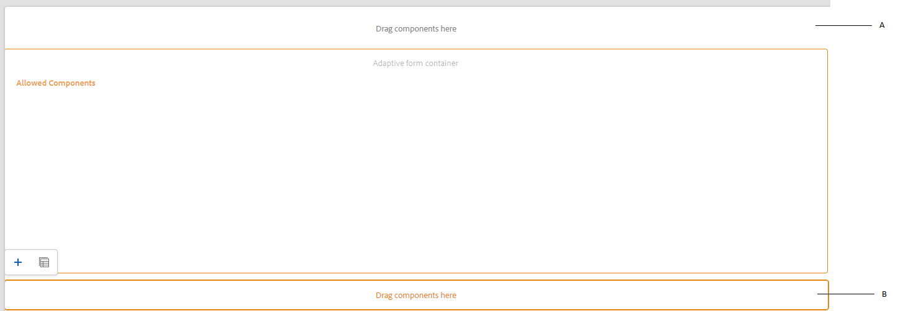
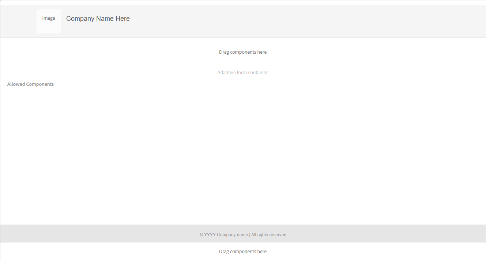

# Create an Adaptive Form template {#adaptive-form-templates}

>[!NOTE]
>
> Adobe recommends using the modern and extensible data capture [Core Components](https://experienceleague.adobe.com/docs/experience-manager-core-components/using/adaptive-forms/introduction.html) for [creating new Adaptive Forms](/help/forms/creating-adaptive-form-core-components.md) or [adding Adaptive Forms to AEM Sites pages](/help/forms/create-or-add-an-adaptive-form-to-aem-sites-page.md). These components represent a significant advancement in Adaptive Forms creation, ensuring impressive user experiences. This article describes older approach to author Adaptive Forms using foundation components.

| Version | Article link |
| -------- | ---------------------------- |
| AEM 6.5  |    [Click here](https://experienceleague.adobe.com/docs/experience-manager-65/forms/adaptive-forms-advanced-authoring/template-editor.html)                  |
| AEM as a Cloud Service     | This article        |

When you author a form, you add fields and components to define form structure, content, and actions in the editor. You add fields and components in the `guideRootPanel` of the form container. With Template Editor, you can create a template that contains basic structure and initial content that authors can use to create forms.

For example, you want all form authors to have certain text boxes, navigation buttons, and a submit button in an enrollment form. You can create a template with the components that authors can use to create a form that is consistent with other enrollment forms. When authors use the template to create an Adaptive Form, the new form inherits the structure and components you have specified in the template. Template Editor lets you:

* Add header and footer components of a form in the structure layer.
* Provide the initial content for the form.
* Specify a theme, Submit Actions.

You can download and install [!DNL AEM Forms] reference content package from [Software Distribution](https://experience.adobe.com/#/downloads/content/software-distribution/en/aemcloud.html) portal to import reference themes and templates to your environment.

## Working with templates {#working-with-templates}

You can access template editor from the Tools menu by navigating to **[!UICONTROL Adobe Experience Manager]** &gt; **[!UICONTROL Tools]** &gt; **[!UICONTROL General]** &gt; **[!UICONTROL Templates]**. Here, the templates are organized in folders enabled for editable templates.

Experience Manager provides a global folder to organize templates. However, it is not enabled by default. You can request your Administrator to enable the global folder or create a folder for templates. For more information on how to create folders, see [Template Folders](https://experienceleague.adobe.com/docs/experience-manager-cloud-service/sites/authoring/features/templates.html#editing-templates-template-authors).

### Creating a template {#create-template}

After you have created a folder, open the folder and perform the following steps to create a template:

1. Select **[!UICONTROL Create]** inside the folder you have created.
1. In the Pick a Template Type section, select **[!UICONTROL Adaptive Form template]** and select **[!UICONTROL Next]**.

1. In the Template Details section, provide a Template Title and select **[!UICONTROL Create]**.
   You can also provide a description.

1. Select **[!UICONTROL Done]** to return to the console, or select **[!UICONTROL Open]** to open the template in the editor.

### Template editor UI {#template-editor-ui}

When you open a template for editing, you can see the following AEM Editor components:

* **Page toolbar**
  Contains the following options:

    * **Toggle Side Panel**: Lets you show or hide the sidebar.
    * **Page Information**: Lets you specify information such as the publish/unpublish time, thumbnails, client-side libraries, page policy, and page design client-side library.
   <!-- * **Emulator**: Lets you simulate and customize the look for different devices.-->
    * **Mode selector:** Lets you change the mode.You can choose **[!UICONTROL Structure]** mode, **[!UICONTROL Initial Content]**, **[!UICONTROL Layout Control]** mode. Structure mode lets you add and customize the header and footer. Initial Content mode lets you customize the form content.
    * **Preview:** Lets you preview how the template looks when you publish it. You can use Layer Selector and Preview to toggle editing and preview modes.
* **Sidebar:** Provides the Content, Properties, Assets, and Components browsers.
* **Component toolbar:** When you select a component, you see a toolbar that lets you customize the component.
* **Page**: The area where you add content to create the template.

<!-- See [Introduction to authoring Adaptive Forms](introduction-forms-authoring.md) to understand the Touch UI editor. -->

### Editing a template {#editing-a-template}

An Adaptive Form template is created using two layers:

* Structure
* Initial Content

The layer selector is available beside the Preview option in the upper-right corner of the screen.

### Structure {#structure}

When you select the structure layer in the Template Editor, you can see the layout containers above and below the Adaptive Form Container. Authors can use these layout containers for header and footer. You can add, edit, or customize the header and footer. Drag-drop the Adaptive Form Header component in the layout container above the Adaptive Form Container to customize the template header. Drag-drop the Adaptive Form Footer component in the layout container below the Adaptive Form Container to customize the template footer.

Layout containers in the structure layer

**A.** Layout container for Header component **B.** Layout container for Footer component

Drag-drop the Adaptive Form Header component in the layout container above the Adaptive Form Container. After you add the component, you can specify its properties that let you add a logo and provide its title.

Similarly, when you drag-drop the footer component in the layout container below the Adaptive Form Container, you can provide the copyright information and company details.

Header and footer added in the Structure layer

#### Locking/unlocking components in the structure layer {#locking-unlocking-components-in-the-structure-layer}

When you edit the template with structure layer selected, you can unlock the header and footer of the template. If a component is unlocked in the template, form authors can edit the component in the Adaptive Form that uses the template. Locking a component prevents form authors from editing it in the Adaptive Form. Lock option is available in the component toolbar.

For example, you add the header component in the template. When you select the component, you can see a lock option in the component toolbar. Typically, header includes company name and logo, and you do not want form authors to change the logo and header in a template. In an Adaptive Form created using the template with the header component locked, form authors cannot change the logo and company name.

>[!NOTE]
>
>Locking or unlocking image or logo in the header component, individually, is not recommended. You can unlock the header component.

### Initial Content {#initial-content}

When the Initial Content option is selected, the Adaptive Form Container of the template opens like an Adaptive Form for editing. Like authoring an Adaptive Form, you can specify initial settings, such as selecting a theme and Submit Actions.

Form authors use it as a base to create a form. Content flow structure is specified in the Initial Content layer of the template. To switch to editing initial content of the form template, before Preview in the page toolbar, select  **&gt;** **[!UICONTROL Initial Content]**.

In the Initial Content layer, you create the Adaptive Form template that your authors use as a base. Authoring a template is similar to authoring a form, you use options available in the Sidebar. Sidebar provides content, properties, assets, and components browsers.

<!-- See [Sidebar](introduction-forms-authoring.md#sidebar). -->

>[!NOTE]
>
>When you select Store content or StorePDF as the Submit Action, you get an option to specify the Storage path. If you specify path in template, then all forms created from it have the same path. You can specify the correct storage path, or ensure form authors to update it to prevent data from every form getting stored at same location.

#### Creating an Adaptive Form template with tabs and panels {#creating-an-adaptive-form-template-with-tabs-and-panels-nbsp}

For example, you want to create a template with the following tabs:

* General Information
* Professional Information

You have added a logo, provided a title, and added a footer in the structure layer. Lock the header and footer to stop form authors from editing them when they use the template to create forms.

Change the layer from Structure to Initial Content, and start adding content to the form. To create a tabbed structure, add a child Panel in the guideRootPanel of the Adaptive Form container. To add a panel:

* You can add a panel by tapping the **[!UICONTROL +]** button when you select the **[!UICONTROL Drag components here]** option.

* You can drag-drop the panel component from the components browser in the sidebar.
* You can add child panel of the `guideRootPanel` from the component toolbar.

To create the General Information and Professional Information tabs, add two panels in the child panel of the `guideRootPanel`. Select the panels and select  to open the properties in the sidebar. Change the element names as `general-info` and `professional-info`, and titles as General Information and Professional Information respectively. In the sidebar, select content to open the content browser. In the Form Objects tab, select `guideRootPanel`. In the editor, the guideRootPanel is selected. Select  in the component toolbar to open its properties. In the Panel Layout field, select **[!UICONTROL Tabs on Top]** and select **[!UICONTROL Done]**. The tabbed template structure is applied.

#### Adding content in tabs {#adding-content-in-tabs}

After you add panels and structure them as tabs, you can add fields inside the tabs. When you select a tab in the editor, you can see the **[!UICONTROL Drag components here]** option. You can drag-drop components such as text-boxes, list items, and buttons. You can drag-drop components from the components browser in the sidebar.

Each component has properties that enhance data capturing and manipulation. For example, you can enable the **[!UICONTROL Required field]** property of a component. Your authors can specify a message that your customers see when they skip filling a required field. Specify the message in **[!UICONTROL Required Field Message]** property.

In the example template, Name, Phone number, and Date of birth fields are added in the General Information tab. In the Professional Information tab, Currently employed, employment type, Educational qualification fields are added.

After you have added fields, you can add buttons such as Submit and Reset.

### Enabling the template {#enabling-the-template}

When you create a template, it is added as a draft. Enable the template to use it for creating Adaptive Forms. To enable a template:

1. Navigate to **[!UICONTROL Adobe Experience Manager]** &gt; **[!UICONTROL Tools]** &gt; **[!UICONTROL Templates]**, and open the folder in which you have created the template.

1. The template you have created is marked as Draft.
1. Select the template and select **[!UICONTROL Enable]** in the toolbar.
   When you create an Adaptive Form, you can see the template listed when you are asked to choose a template.

## Importing or exporting a template {#importing-or-exporting-a-template}

A form works with its template. When you download an Adaptive Form created using a customized template, the template is not downloaded. When you import the form on a different [!DNL AEM Forms] instance, it is imported without its template. If a form is imported but its template is not available, the form is not rendered. You can package the custom template from `/conf` node in `https://<server>:<port>/crx/packmgr`, and port it in the [!DNL AEM Forms] instance where you want to upload the form. You can also [Create a template using AEM Archeype and deploy it to your Cloud Services instance](https://experienceleague.adobe.com/docs/experience-manager-learn/getting-started-wknd-tutorial-develop/pages-templates.html#prerequisites). 

>[!NOTE]
>
> * You can also configure the [!UICONTROL Document of Record] template directly from the Adaptive Form editor or Adaptive Form template editor. For more information, see [Generate Document of Record for Adaptive Forms](/help/forms/generate-document-of-record-for-non-xfa-based-adaptive-forms.md#document-of-record-support-in-adaptive-form-editor-dor-support-in-adaptiveform).

## Associate a Form Data Model Schema to a template {#associating-form-data-model-schema-in-template}

Authors can associate a [!UICONTROL Form Data Model Schema] to an Adaptive Form template in the template editor. It allows authors to select a schema from the template editor. When you associate a schema to a template and a form author creates a form based on the template, the schema is pre-selected for the form. It helps forms authors regulate the use of schema and saves time for forms author also. To select a form data model schema in template editor:

1. Select **[!UICONTROL Content Browser]** located on the left hand side.
1. Go to the form container **[!UICONTROL Setting]**.
1. Select **[!UICONTROL Data Model]**. 
1. Choose your form data model through **[!UICONTROL Select Form Data Model]** and save the configuration.

## Creating an Adaptive Form using the template {#creating-an-adaptive-form-using-the-template}

After you create and enable a template, it is available in the forms manager when you create an Adaptive Form. To use a template and create an Adaptive Form, see [Creating an Adaptive Form](creating-adaptive-form.md).

<!--
## Change display option of out of the box templates  {#change-display-option-of-out-of-the-box-templates}

You can create custom templates for Adaptive Forms to define basic structure and initial content. [!DNL AEM Forms] also provides a set of out of the box template for Adaptive Forms. You can choose to show or hide the templates.

Perform the following steps to show and hide templates:

1. Log in to [!DNL AEM Forms] author instance and navigate to **[!UICONTROL Tools]** &gt; **[!UICONTROL Operations]** &gt; **[!UICONTROL Web Console]**.

   >[!NOTE]
   >
   >The URL of AEM web console is https://'[server]:[port]'/system/console/configMgr

1. Locate and open the **FormsManager Configuration** settings:

    * To show or hide out of the box Adaptive Forms template, check or uncheck the **Include Out of the box AF and AD Templates** option.
    * To show or hide out of the box Adaptive Form templates that were added in AEM 6.0 Forms or AEM 6.1 Forms releases but are now deprecated, check or uncheck the **Include AEM 6.0 AF Templates** option. If this option is checked, and you want it to take effect, it requires the **Include Out of the box AF and AD Templates** configuration to be enabled.

1. Click **Save**. The display options for the out of the box templates are changed. -->

## Save an Adaptive Form as a template {#saving-adaptive-form-as-template}

You can also save an Adaptive Form as a template for future use. To save a Adaptive Form as a template:

1. Select an Adaptive Form to save it as a template.
1. Click **[!UICONTROL Save as Template]**. A dialog box appears.
1. Specify **[!UICONTROL Title]** (mandatory field), **[!UICONTROL Location]** (mandatory field) and **[!UICONTROL Description]** (optional field) for the template. 
1. Click **[!UICONTROL Create]**.

   

>[!NOTE]
>
>To use the same container policy as of the source Adaptive Form, it is recommended to save the template in the same folder as of the source Adaptive Form. In case, the template is saved in any other folder, than the created template uses a default container policy.

## Recommendations {#recommendations}

* When you modify properties of the form in template editor, do not use the BindReference property.
* If you want to add a breakpoint, create it when you author an Adaptive Form template.
  For more information on breakpoints, see [Responsive Layout](https://experienceleague.adobe.com/docs/experience-manager-cloud-service/sites/authoring/features/responsive-layout.html#authoring).

## See Also {#see-also}

{{see-also}}