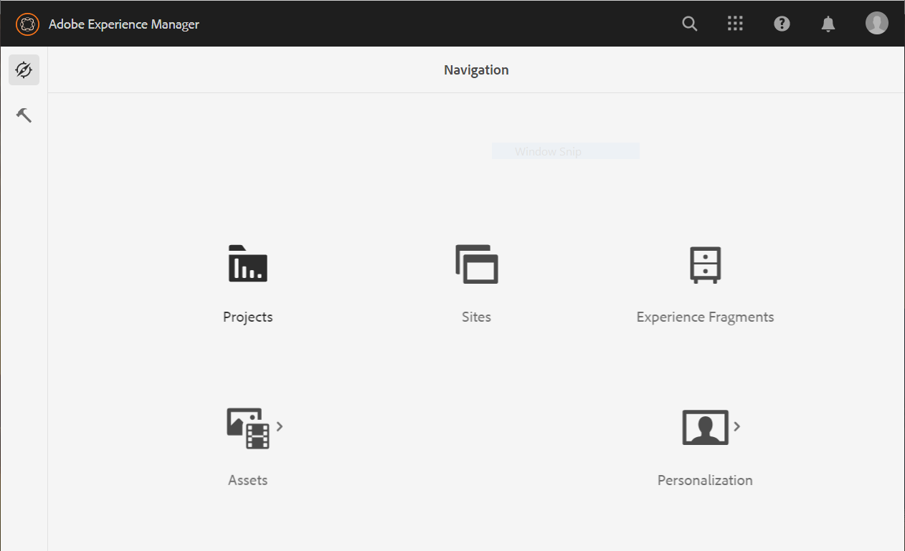

# Configuration {#installation-and-configuration}

You can encounter some of the following issues while configuring a Cloud Service environment:

## Forms option is unavailable

The **[!UICONTROL Forms]** option is not available on the **[!UICONTROL Navigation]** page.

 

 To enable the **[!UICONTROL Forms]** option:

 1. Login to the [Cloud Manager](https://experience.adobe.com/) 
 1. Locate your program and click the  icon. It opens the Edit Program page for your program.
 1. Open the **[!UICONTROL Solutions & Add-ons]** tab. 
 1. Select the **[!UICONTROL Forms]** option and Click **[!UICONTROL Save]**.

    
1. [Create](https://experienceleague.adobe.com/docs/experience-manager-cloud-manager/using/how-to-use/configuring-pipeline.html?lang=en#how-to-use) and [run](https://experienceleague.adobe.com/docs/experience-manager-cloud-manager/using/how-to-use/deploying-code.html) both production and non-production pipelines.

After the pipeline is built and deployed, the **[!UICONTROL Forms]** option on the **[!UICONTROL Navigation]** page.

<!--  
## Environment creation fails {#environment-creation-fails}

Users are unable to create an [!DNL AEM Forms] as a Cloud Service environment. The environment creation fails after running for some time.

A missing profile can lead to environment creation failure. Check that the profile exists in Admin Console. If the profile does not exist, perform the following steps to create the profile:

1. Log in to [Admin Console](https://adminconsole.adobe.com/). Use Adobe ID of administrator provisioned to use Automated Forms Conversion Service to login. Do not any other ID or Federated ID to login.
1. Click the **[!UICONTROL Automated Forms Conversion Service]** option.
1. Click **[!UICONTROL New Profile]** in the Products tab.
1. Specify Name, Display Name, and Description for the profile. Click **[!UICONTROL Done]**. A profile is created.

If the profile exists and issues still persist, contact Adobe Support. -->

## Build pipeline fails {#build-pipeline-fails}

Users are unable to run build pipeline. The pipeline fails after running for some time.  

To resolve the issue, open Cloud Manager, select the **[!UICONTROL Update]** option for your environment, and run the pipeline.
