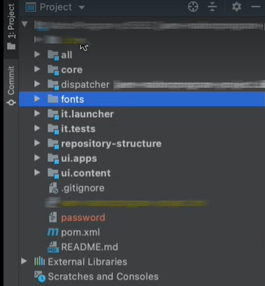

# Use custom fonts

**Cloud Service Communications documentation is in beta**

You can use Forms as a Cloud Service Communications to combine an XDP template, XDP-based PDF document, or Acrobat Form (AcroForm) with XML data to generate PDF documents. You can also use Communications to combine, rearrange, and augment PDF and XDP documents and obtain information about PDF documents. 

Along with previously mentioned operations, you can use fonts included in Cloud Service or custom fonts (organization approved fonts) to render the generated PDF documents. You can use the Cloud Service development project to add custom fonts to your Cloud Service environment.

## Behavior of PDF Documents

You can [embed a font](https://adobedocs.github.io/experience-manager-forms-cloud-service-developer-reference/api/sync/#tag/PDFOutputOptions) to a PDF document. When a font is embedded, the PDF document appears (looks) identical on all platforms. It uses embedded fonts to ensure a consistent look and feel. When a font is not embedded, the font rendering depends on rendering settings of PDF viewer clients like Acrobat or Acrobat Reader. If the font is available on the client machine, the PDF uses specified font, else the PDF is rendered with a default fallback font.

## Add custom fonts to your Forms as a Cloud Service environment {#custom-fonts-cloud-service}

To add custom fonts to your Cloud Service environment:

1. Setup and open the [local development project](setup-local-development-environment.md). You can use any IDE of your choice.
1. At the top-level folder structure of the project, create a folder(module) to save custom fonts and add custom fonts to the folder. For example, fonts/src/main/resources


1. Open pom.xml file of the fonts module of the development project.
1. Add jar plugin to the pom file:
    ``` xml

    <plugin>
        <groupId>org.apache.maven.plugins</groupId>
        <artifactId>maven-jar-plugin</artifactId>
        <version>3.1.2</version>
        <configuration>
            <archive>
                <manifest>
                    <addDefaultEntries/>
                    <addDefaultImplementationEntries/>
                </manifest>
            </archive>
        </configuration>
    </plugin>

    ```


1. Add the `<Font-Archive-Version>` manifest entry the .pom file and set value of version to 1:

    ``` xml

    <plugin>
        <groupId>org.apache.maven.plugins</groupId>
        <artifactId>maven-jar-plugin</artifactId>
        <version>3.1.2</version>
        <configuration>
            <archive>
                <manifest>
                    <addDefaultEntries/>
                    <addDefaultImplementationEntries/>
                </manifest>
                <manifestEntries>
                    <Font-Archive-Version>1</Font-Archive-Version>
                    <Font-Archive-Contents>/</Font-Archive-Contents>
                </manifestEntries> 
            </archive>
        </configuration>
    </plugin>

    ```

1. Add your fonts folder to `<modules>` listed in the pom file. For example:

    ``` xml

    <modules>
        <module>all</module>
        <module>core</module>
        <module>ui.frontend</module>
        <module>ui.apps</module>
        <module>ui.apps.structure</module>
        <module>ui.config</module>
        <module>ui.content</module>
        <module>it.tests</module>
        <module>dispatcher</module>
        <module>dispatcher.ams</module>
        <module>dispatcher.cloud</module>
        <module>ui.tests</module>
        <module>fonts</module>
    </modules>


    ```

    The fonts folder contains all the custom fonts.

1. Check in the updated code and [run the pipeline](/help/implementing/cloud-manager/deploy-code.md) to deploy the fonts to your Cloud Service environment.

1. (Optional) Open the command prompt, navigate to the local project folder, and run the below command. The command packages the fonts in a .jar file along with relevant information. You can use the .jar file to add custom fonts to a Forms Cloud Service local development environment. 

    ``` shell
    mvn clean install
    ```

## Add custom fonts to your local Forms Cloud Service development environment {#custom-fonts-cloud-service-sdk}

1. Start your local development environment.
1. Navigate to `<aem install directory>/crx-quickstart/install` folder.
1. Place the `<jar file contaning custom fonts and relevant deployment code>.jar` to the install folder. If you do not have the .jar file, perform the steps listed in [Add custom fonts to your Forms as a Cloud Service environment](#custom-fonts-cloud-service) section to generate the file. 
1. Run the [docker-based SDK environment](setup-local-development-environment.md#docker-microservices)


   >[!NOTE]
   >
   >Whenever you deploy an updated  custom fonts .jar file to local development environment, re-start the docker-based SDK environment.
