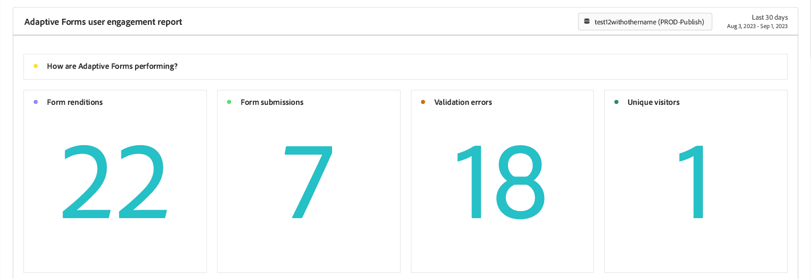
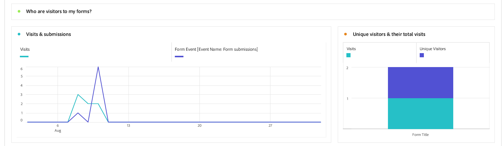
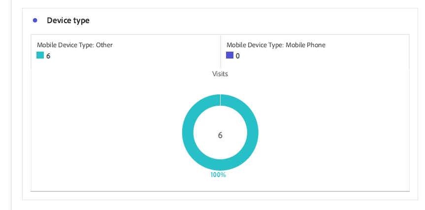
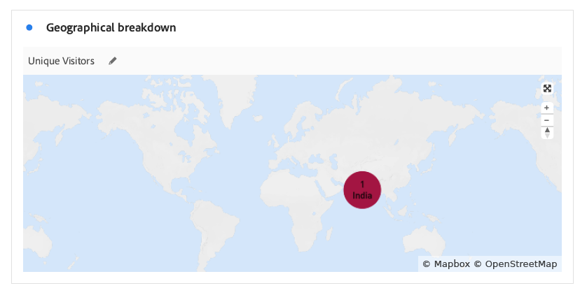
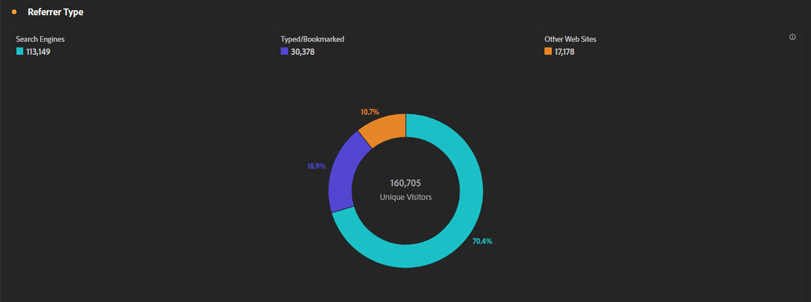
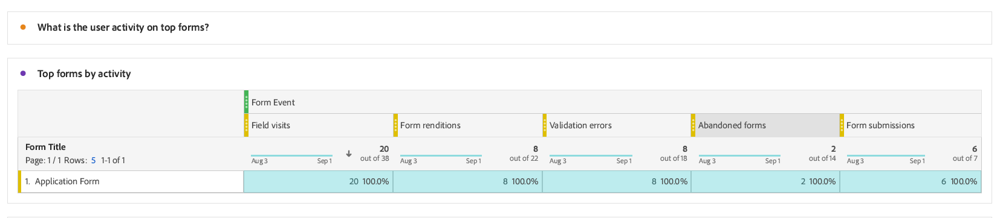
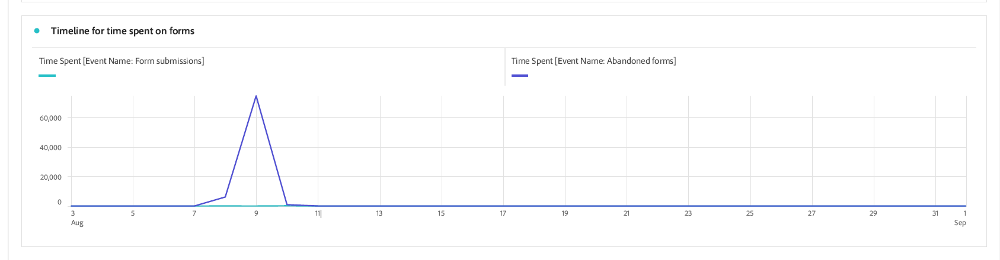
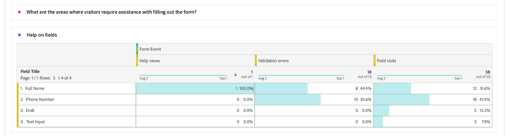
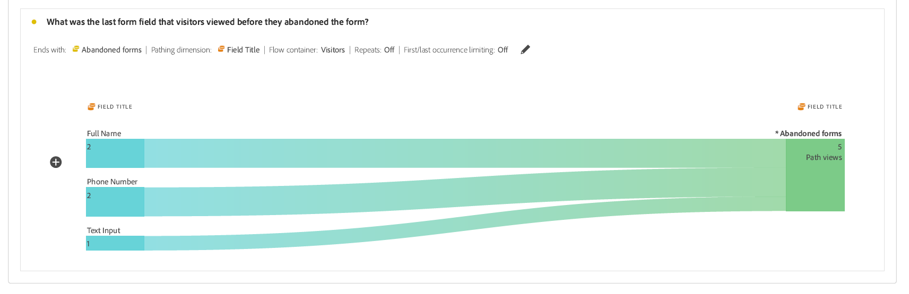

# Viewing and understanding Adaptive Forms analytics reports {#viewing-and-understanding-aem-forms-analytics-reports}

In the rapidly evolving landscape of digital analytics, staying attuned to global trends is imperative for making informed decisions and optimizing digital experiences. To cater to this, Adaptive Forms seamlessly integrate with Adobe Analytics to capture and track performance metrics for your published forms and documents. The objective behind analyzing these metrics is to make data-driven decisions, using metrics and analytics to enhance the usability and effectiveness of the forms.

By capturing and tracking key performance indicators, businesses can identify areas of improvement, optimize user experiences, and ultimately drive better outcomes to create exceptional customer experiences.

## Set up Adobe Analytics to Adaptive Forms {#setup-adobe-analytics-to-aem-forms}

For AEM Forms Analytics report, first you integrate Adobe Analytics to AEM Forms through Experience Cloud Setup Automation. Experience Cloud Setup Automation in Adaptive Forms requires an Adobe Analytics license, Data Collection (Formerly Adobe Launch) to manage tracking scripts, and integration with the Experience Platform Launch API for streamlined data aggregation and insights generation. Visit [Enable Adobe Analytics for an Adaptive Form using Experience Cloud Setup Automation](/help/forms/forms-experience-cloud-setup-automation.md) for a complete setup information.

## View Adaptive Forms Adobe Analytics report {#view-adobe-analytics-report}

1. On your AEM instance, Go to **[Forms]** >> **[Forms and Document]**.
1. Select your **[!UICONTROL Form]**.
1. Upon selection you see Adobe Analytics set up information on the left, Adobe Analytics set up information is available to the Forms activated for Adobe Analytics.

    

1. Click **Adobe Analytics** to view and analyze performance data.

## Understanding Adaptive Forms analytics reports {#understanding-aem-forms-analytics-reports}

Adobe Analytics offers a comprehensive array of Adaptive Forms performance metrics designed to provide valuable insights into form usage. These metrics are:

### **How are Adaptive Forms performing?** {#how-your-adaptive-form-is-performing}

It has the metrics Form renditions, Form submissions, Validation errors, and Unique visitors, which allow you to assess the usage and effectiveness of your forms:

1. **Form renditions** : Form Renditions reveal the number of times the form has been rendered or opened.

1. **Form submissions** : Form submissions indicate how many times users successfully complete and submit your adaptive forms.
    
1. **Validation errors** : This count the number of errors when there is a validation error in one or more of the form fields.

1. **Unique visitors**: Number of times the form is rendered by unique visitors. For more information on unique visitors, see [Unique Visitors, Visits, and customer behavior](https://experienceleague.adobe.com/docs/analytics/components/metrics/visits.html).

    

### **Visitors to your forms** {#visitors-to-your-forms}

It helps you gain valuable insights into visitor activity on your forms with comprehensive analytics based on the metrics Visits and submissions, and Unique visitors and their total visits:

1. **Visits & submissions**: It describes the frequency of visits to your forms in a date range  and the corresponding number of form submissions, for more info on this click [Visits](https://experienceleague.adobe.com/docs/analytics/components/metrics/visits.html).
1. **Unique visitors & their total visits**: Distinguishing between new and returning users is vital. For example, a visitor can come to your site every day for a month, but they still count as a single unique visitor. Visit [Unique visitors](https://experienceleague.adobe.com/docs/analytics/components/metrics/unique-visitors.html) for a detailed information.

    

### **Device type** {#device-type}

Device type helps you to identify the type of device used to access your forms. It categorizes the device type as Mobile Device Type. For example, In this case, it is Mobile Device Type: Other, and Mobile Device Type: Mobile Phone.

### **Geographical breakdown** {#geographical-breakdown}

It shows the location from where the Forms are accessed. It provides region-specific information about form users, for example, you can see that a region speciic information about a form user is India as shown in the image.

### **Top sources of traffic and popular forms** {#top-sources-of-traffic-and-popular-forms}

This helps you to identify the primary source or the link from where your forms are referred. For example, In the given image below you see search instances for your adaptive forms where 18.9% are **Typed/Bookmarked**, 70.49% based on **Search Engines**, and 24% are from **Other Web Sites**. You can define dimension items based on your requirements. Also, you can sort out which are the most visited or popular forms.

### **User activity on top forms** {#user-activity-on-top-forms}

A comprehensive view of user engagement with field visits, form renditions, validation errors, abandoned forms, and form submissions provide insights about the forms which are most active. In the image given below, you see that the Application Form is the most active based on the Form Event metrics.

### **Timeline for time spent on forms** {#timeline-for-time-spent-on-forms}

It is the time users spend on your forms over time, which help you to identify engagement patterns.

### **Areas where visitors require assistance with filling out the form** {#areas-requiring-assistance}

Metrics such as help views, validation errors, and field visits reveal where users need assistance or how we can track errors in fields. For example, In the image below you see that in a form with fields such as **Full Name**, **Phone Number**, **DoB**, **Text Input**. The **Full Name** field have 12 visits, out of 12 visits 8 visits have validation error and 1 clicked help icon for help view on this field. You can see the metrics data for other form fields.

### **The last form field that visitors viewed before they abandoned the form** {#last-form-field-that-visitors-viewed}

It helps you to analyze the form fields where the users have spent time before abandoning the form. For example, In the image given below, out of 5 abandoned forms, 2 left on the field **Full Name**, 2 left on the field **Phone Number**, and 1 left on the Field **Text Input**.

