# Work with Form Data Model (FDM) {#work-with-form-data-model}

<!--and interactive communications-->

| Version | Article link |
| -------- | ---------------------------- |
| AEM 6.5  |    [Click here](https://experienceleague.adobe.com/docs/experience-manager-65/forms/form-data-model/work-with-form-data-model.html)                  |
| AEM as a Cloud Service     | This article        |

The **Form Data Model (FDM) editor** provides an intuitive user interface and integrated tools for creating, editing, and configuring a **form data model (FDM)** in Adobe [!DNL Experience Manager] (AEM) Forms. Using the editor, you add and configure **data model objects**, **properties**, and **services** from associated data sources directly within the form data model (FDM).

## Capabilities of the Form Data Model editor


The Form Data Model editor supports the following key tasks:

* **Add and configure data model objects, properties, and services** from associated data sources into the FDM.
* **Create data model objects and properties without data sources.** You can define these objects first and bind them with respective data model objects and properties later, which decouples design from source configuration.
* **Generate and edit sample data** for data model object properties. This sample data prefills Adaptive Forms during preview, so authors and testers validate form behavior with realistic values before deployment.
* **Test data model objects and services** configured in the FDM to confirm they are properly integrated with the underlying data sources.

## Prerequisites

If you are new to Forms data integration and have not configured a data source or created a form data model (FDM), see the following topics:

* [Experience Manager Forms Data Integration](data-integration.md)
* [Configure data sources](configure-data-sources.md)
* [Create form data model (FDM)](create-form-data-models.md)

Read on for details about the various tasks and configurations you can perform using the Form Data Model editor.

>[!NOTE]
>
>You must be a member of both the **fdm-author** and **forms-user** groups to create and work with a form data model (FDM). Contact your [!DNL Experience Manager] administrator to become a member of these groups.

## Add data model objects and services {#add-data-model-objects-and-services}

If you created a Form Data Model (FDM) with data sources, you can use the Form Data Model editor to add data model objects and services, configure their properties, build associations between data model objects, and test the Form Data Model (FDM) and services. This lets you assemble a complete, functional data model directly from your connected data sources within a single editing environment.

You can add data model objects and services from available data sources in the form data model (FDM). Data model objects you add appear in the Model tab, while services you add appear in the Services tab, keeping the two object types clearly separated for easier configuration and testing.

To add data model objects and services:

1. Log into the [!DNL Experience Manager] author instance, navigate to **[!UICONTROL Forms > Data Integrations]**, and open the Form Data Model (FDM) in which you want to add data model objects.
1. In the Data Sources pane, expand data sources to view available data model objects and services.
1. Select data model objects and services you want to add to the Form Data Model (FDM) and select **[!UICONTROL Add Selected]**. This adds the selected objects and services to the FDM so that you can configure their properties and build associations between them.

   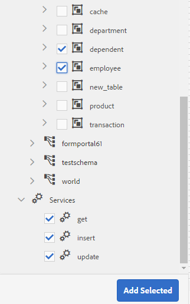

   Selected data model objects and services

   The **[!UICONTROL Model]** tab displays a graphical representation of all data model objects and their properties added to the form data model (FDM). Each data model object is represented by a box in the form data model (FDM), making the structure of your model easy to scan visually.

   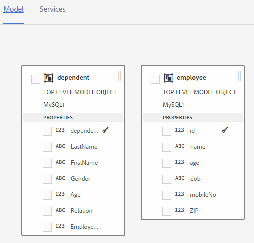

   **[!UICONTROL Model]** tab displays added data model objects

   >[!NOTE]
   >
   >You can hold and drag data model object boxes around to organize them in the content area. All data model objects added in the Form Data Model (FDM) are grayed out in the Data Sources pane, indicating that they have already been added and preventing duplicate entries.

   The **[!UICONTROL Services]** tab lists added services.

   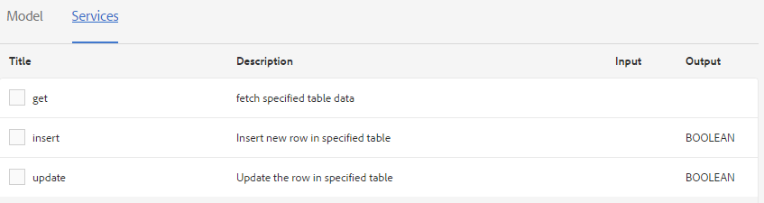

   **[!UICONTROL Services]** tab displays data model services

   >[!NOTE]
   >
   >In addition to data model objects and services, the OData (Open Data Protocol) service metadata document includes navigation properties, which define the association between two data model objects and enable related data to be traversed. For more information, see [Working with navigation properties of OData services](#work-with-navigation-properties-of-odata-services).

1. Select **[!UICONTROL Save]** to save the form model object.

   >[!NOTE]
   >
   >The services you configure in the Services tab of a Form Data Model (FDM) can be invoked directly using Adaptive Form rules, allowing form authors to trigger data operations such as fetching or writing data at runtime. The configured services are available in the Invoke services action of the rule editor. For more information about using these services in Adaptive Form rules, see Invoke Services and Set Value Of rules in [rule editor](rule-editor.md).

## Create data model objects and child properties {#create-data-model-objects-and-child-properties}

A **data model** organizes information into structured, reusable units called **objects**, each of which can contain **child properties** that describe the object's individual attributes. Creating well-defined objects and nesting child properties beneath them is a foundational step in building any data model, because it establishes a clear, hierarchical representation of the information your application will store, validate, and exchange.

### What Are Data Model Objects and Child Properties?

- A **data model object** is a named container that groups related fields into a single logical entity. Objects represent real-world or conceptual items — such as a customer, an order, or a product — and serve as the top-level structure that other elements attach to.
- **Child properties** are the individual fields nested inside an object. Each child property defines one attribute of the parent object, along with characteristics such as its name, data type, and whether the value is required. Nesting properties beneath a parent object keeps related data grouped together, which improves clarity and makes the model easier to maintain.

This parent-child relationship is what gives a data model its hierarchy. The object acts as the parent, and the child properties inherit their context from it, ensuring that each attribute is unambiguously associated with the entity it describes.

### How to Create a Data Model Object

Follow these steps to define a new object in your data model:

1. **Name the object.** Choose a clear, descriptive name that identifies the entity the object represents. Consistent naming makes the model easier to read and reference later.
2. **Define the object as a container.** Establish the object as the top-level element that will hold its associated child properties.
3. **Add child properties.** Attach the individual fields that describe the object's attributes, defining each one in turn.
4. **Assign a data type to each property.** Specify the type of value each child property accepts — such as text, number, or boolean — so the data can be validated correctly.
5. **Set requirement rules.** Indicate which child properties are required and which are optional, ensuring the model enforces the constraints your application depends on.

### Adding Child Properties

When adding child properties to an object, define each property with the following details:

- **Property name** — a unique, descriptive label for the attribute within the parent object.
- **Data type** — the kind of value the property stores, which governs how the value is validated and processed.
- **Required or optional status** — whether the property must always have a value.
- **Nested structure (if applicable)** — a child property can itself be an object with its own child properties, allowing you to model complex, multi-level data. This nesting is what enables data models to represent deeply structured information.

### Practical Applications and Benefits

Structuring a data model with objects and child properties delivers several practical advantages:

- **Consistency** — grouping related fields under a shared object ensures data is stored and interpreted uniformly across the application.
- **Reusability** — well-defined objects can be referenced in multiple places, reducing duplication.
- **Validation** — assigning data types and requirement rules to child properties lets the system automatically catch invalid or incomplete data.
- **Scalability** — because objects support nested child properties, the model can grow to represent increasingly complex relationships without becoming disorganized.

### Best Practices

- Use clear, descriptive names for both objects and their child properties to keep the model self-documenting.
- Group related attributes under the same parent object rather than spreading them across unrelated structures.
- Define data types and requirement rules early, because doing so establishes reliable validation from the outset.
- Keep nesting purposeful — nest child properties only when the additional hierarchy meaningfully reflects the structure of the data.

By carefully defining objects and their child properties, you create a data model that is organized, maintainable, and capable of accurately representing the entities your application works with.

### Create data model objects {#create-data-model-objects}

While you can add data model objects from configured data sources, you can also create data model objects—also called entities—without data sources. A **data model object** is a structured entity within the Form Data Model (FDM) that represents a logical grouping of properties, which can later be bound to data source fields or used independently. This capability is especially useful when you have not yet configured data sources in the Form Data Model (FDM), because it lets you begin designing your data structure before any backend integration is in place.

#### Steps to create a data model object without data sources

To create a data model object without data sources:

1. Log into the [!DNL Experience Manager] author instance, navigate to **[!UICONTROL Forms > Data Integrations]**, and open the Form Data Model (FDM) in which you want to create a data model object or entity.
1. Select **[!UICONTROL Create Entity]**.
1. In the [!UICONTROL Create data Model] dialog, specify a name for the data model object and select **[!UICONTROL Add]**. A data model object is added to the Form Data Model (FDM). The newly added data model object is not bound to a data source and does not have any properties, as shown in the following image. Because it is unbound, this object exists purely as a structural placeholder until you define its properties or connect it to a data source.

   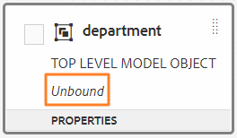

#### Next steps {#next-steps-data-model-object}

After the unbound data model object is created, add child properties to define its structure. These child properties let you specify the fields and attributes the object holds, and they can be bound to data sources later once your data integrations are configured. This ensures the data model object becomes fully functional and ready for use in forms.

### Add child properties {#child-properties}

<!--and interactive communications-->

The Form Data Model (FDM) editor lets you create child properties within a data model object. A newly created child property is not bound to any property in a data source by default. You can later bind the child property to another property in the containing data model object.

To create a child property:

1. In a form data model, select a data model object and select **[!UICONTROL Create Child Property]**. 
1. In the **[!UICONTROL Create Child Property]** dialog, specify a name and data type for the property in the **[!UICONTROL Name]** and **[!UICONTROL Type]** fields, respectively. You can optionally specify a title and description for the property.
1. Enable **Computed** if the property is a **computed property**—a property whose value is evaluated based on a **rule or an expression** rather than entered directly. For more information, see [Edit properties](#properties).
1. If the data model object is bound to a data source, the added child property is automatically bound to the property of the parent data model object with the same name and data type. This automatic binding matches on both name and data type, ensuring the child property stays consistent with its parent without additional manual steps.

   To manually bind a child property with a data model object property, select the browse icon next to the **[!UICONTROL Bind Reference]** field. The **[!UICONTROL Select Object]** dialog lists all properties from the parent data model object. Select a property to bind with and select the tick icon. You can only select a property of the same data type as the child property, because a data-type match is required for a valid binding.

1. Select **[!UICONTROL Done]** to save the child property and select **[!UICONTROL Save]** to save the form data model (FDM). The child property is now added to the data model object.

After you have created data model objects and properties, you can continue to create Adaptive Forms based on the form data model (FDM). Later, when you have data sources available and configured, you can bind the Form Data Model (FDM) with data sources. As a result, the binding is automatically updated in all associated Adaptive Forms, so changes propagate without manual reconfiguration. For more information about creating Adaptive Forms using form data model (FDM), see [Use form data model](using-form-data-model.md).

### Bind data model objects and properties {#bind-data-model-objects-and-properties}

When the data sources you want to integrate with the Form Data Model (FDM) are available, you can add them to the Form Data Model (FDM) as described in [Update data sources](create-form-data-models.md#update). An **unbound data model object or property** is one that exists in the Form Data Model (FDM) but is not yet mapped to a field in a connected data source, so it cannot read or write data until a binding is established. Then, do the following to bind the unbound data model objects and properties:

1. In the form data model, select the unbound data source that you want to bind with a data source.
1. Select **[!UICONTROL Edit Properties]**.
1. In the **[!UICONTROL Edit Properties]** pane, select the browse icon next to the **[!UICONTROL Binding]** field. The browse icon opens the **[!UICONTROL Select Object]** dialog, which lists the data sources added in the form data model (FDM).

   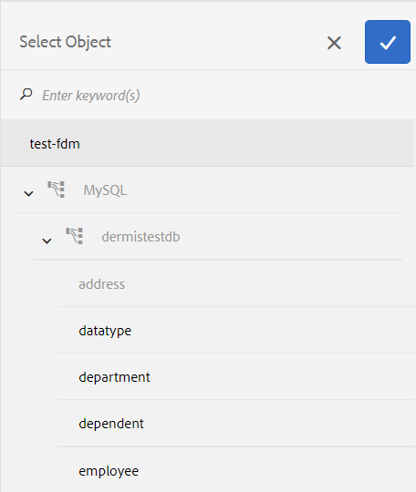

1. Expand the data sources tree and select a data model object to bind with, then select the tick icon.
1. Select **[!UICONTROL Done]** to save the properties, and then select **[!UICONTROL Save]** to save the form data model. The data model object is now bound with a data source. This ensures the object can read from and write to the connected data source at runtime. As a result of saving, the data model object is no longer marked Unbound, confirming that the binding is complete.

   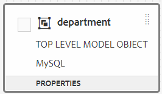

## Configure services {#configure-services}

Configuring read and write services enables a data model object to read and write data within a Form Data Model (FDM). To configure read and write services for a data model object, complete the following steps:

1. Select the check box at the top of a data model object to select it and select **[!UICONTROL Edit Properties]**.

   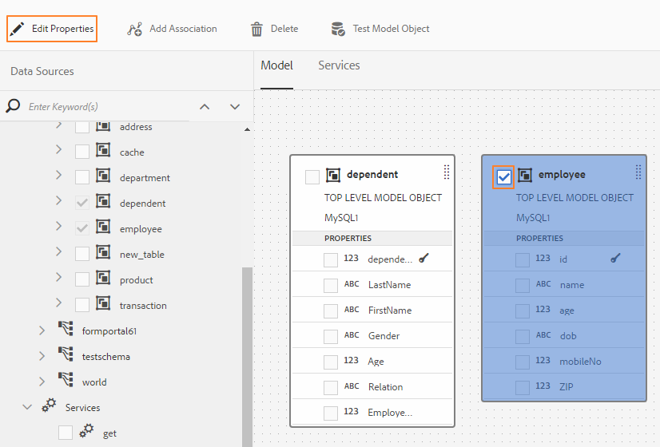

   Edit properties to configure read and write services for a data model object

   The [!UICONTROL Edit Properties] dialog opens.

   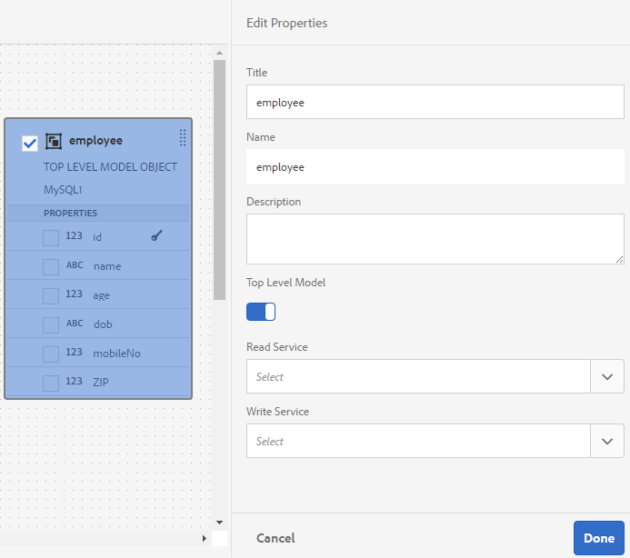

   Edit Properties dialog

   >[!NOTE]
   >
   >In addition to data model objects and services, the OData (Open Data Protocol) service metadata document includes **navigation properties** that define the association between two data model objects. When you add an OData service data source to a Form Data Model(FDM), there is a service available in Form Data Model(FDM) for all navigation properties in a data model object. You can use this service to read the navigation properties of the corresponding data model object. 
   >
   >
   >For more information using the service, see [Working with navigation properties of OData services](#work-with-navigation-properties-of-odata-services).

1. Toggle **[!UICONTROL Top Level Object]** to specify whether the data model object is a top-level model object.

   Data model objects configured in a Form Data Model(FDM) are available for use in the Data Model Objects tab in the Content browser of an Adaptive Form based on the form data model(FDM). When you add an association between two data model objects, the data model object you are associating with is nested under the data model object you are associating from in the **[!UICONTROL Data Model Objects]** tab. If the nested data model is a top-level object, it also appears separately in the **[!UICONTROL Data Model Objects]** tab. As a result, the object appears twice—one entry inside the nested hierarchy and another outside it—which can confuse form authors. To make the associated data model object appear only in the nested hierarchy, disable the **[!UICONTROL Top Level Object]** property. This ensures form authors see a single, unambiguous entry, reducing confusion during form authoring. 

1. Select the **[!UICONTROL Read]** and **[!UICONTROL Write]** services for the selected data model object. The arguments for the selected services then appear for configuration.

   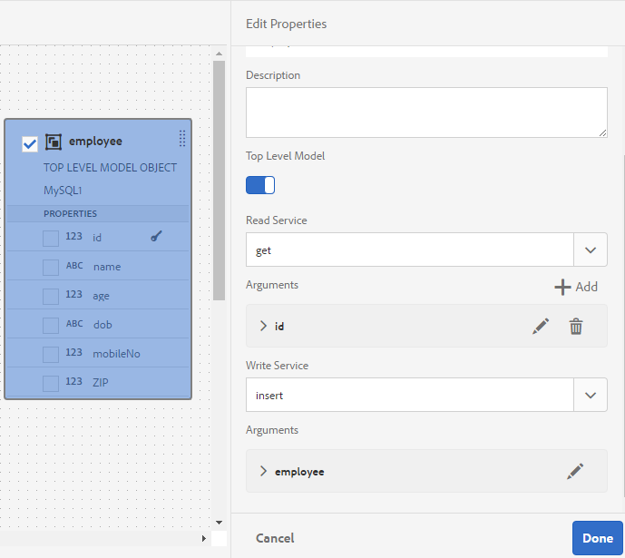

   Read and write services configured for employee data source

1. Select  for the read service argument to [bind the argument to a User Profile Attribute, Request Attribute, or Literal value](#bindargument) and specify the binding value.
1. Select **[!UICONTROL Done]** to save the argument, **[!UICONTROL Done]** to save the properties, and then **[!UICONTROL Save]** to save the form data model(FDM).

### Bind Read service arguments {#bindargument}

Bind a Read service argument to one of three binding types — a **User Profile Attribute**, a **Request Attribute**, or a **Literal value** — based on a binding value. The Read service uses this value as an argument to fetch the details associated with the specified value from the data source. Each binding type determines where the argument value originates: a fixed input, the logged-in user's profile, or the incoming request.

#### Literal value {#literal-value}

Select **[!UICONTROL Literal]** from the **[!UICONTROL Binding To]** drop-down menu and enter a value in the **[!UICONTROL Binding Value]** field. The details associated with the value are retrieved from the data source. Use this option to retrieve details associated with a static value, because a Literal binding supplies a fixed, unchanging input that does not depend on the user or the request.

In this example, the details associated with **4367655678**, as the value for the **`mobilenum`** argument, are retrieved from the data source. The associated details returned when you pass the value for a mobile number argument can include properties such as customer name, customer address, and city.

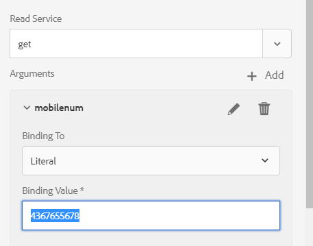 

#### User Profile Attribute {#user-profile-attribute}

Select **[!UICONTROL User Profile Attribute]** from the **[!UICONTROL Binding To]** drop-down menu and enter the attribute name in the **[!UICONTROL Binding Value]** field. The details of the user logged in to the [!DNL Experience Manager] instance are retrieved from the data source based on the attribute name.

The attribute name specified in the **[!UICONTROL Binding Value]** field must include the complete binding path up to the attribute name for the user. Open the following URL to access the user details on CRXDE:

`https://[server-name]:[port]/crx/de/index.jsp#/home/users/`

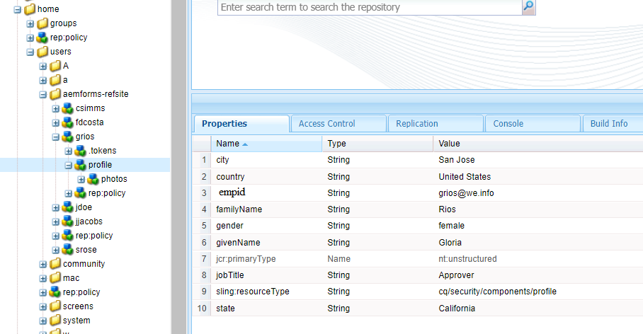

In this example, specify **`profile.empid`** in the **[!UICONTROL Binding Value]** field for the `grios` user.

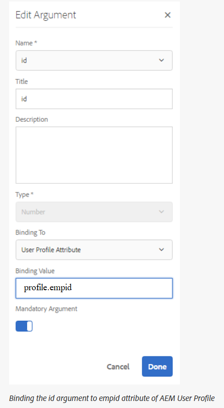

The `id` argument takes the value of the **`empid`** attribute from the user profile and passes it as an argument to the Read service. The Read service then reads and returns the values of the associated properties from the employee data model object for the `empid` associated with the logged-in user.

#### Request Attribute {#request-attribute}

Use the Request Attribute binding to retrieve the associated properties from the data source based on a value supplied in the incoming request.

1. Select **[!UICONTROL Request Attribute]** from the **[!UICONTROL Binding To]** drop-down menu and enter the attribute name in the **[!UICONTROL Binding Value]** field.

1. Create an [overlay](https://experienceleague.adobe.com/docs/experience-manager-cloud-service/implementing/developing/full-stack/overlays.html?lang=en#developing) for the head.jsp. To create the overlay, open CRX DE and copy the `https://<server-name>:<port number>/crx/de/index.jsp#/libs/fd/af/components/page2/afStaticTemplatePage/head.jsp` file to `https://<server-name>:<port number>/crx/de/index.jsp#/apps/fd/af/components/page2/afStaticTemplatePage/head.jsp`

   >[!NOTE]
   >
   > * If you use a static template, overlay the head.jsp at:
   >   `/libs/fd/af/components/page2/afStaticTemplatePage/head.jsp`
   > * If you use an editable template, overlay the aftemplatedpage.jsp at:
   >   `/libs/fd/af/components/page2/aftemplatedpage/aftemplatedpage.jsp`

1. Set [!DNL paramMap] for the request attribute. For example, include the following code in the .jsp file in the apps folder:

   ``` javascript 

   <%Map paraMap = new HashMap();
    paraMap.put("<request_attribute>",request.getParameter("<request_attribute>"));
    request.setAttribute("paramMap",paraMap);

   ```

   For example, use the below code to retrieve the value of petId from the data source:

   ``` javascript

   <%Map paraMap = new HashMap();
   paraMap.put("petId",request.getParameter("petId"));
   request.setAttribute("paramMap",paraMap);%>
   
   ```

As a result, the Read service retrieves the details from the data source based on the attribute name specified in the request.

For example, specifying the attribute as `petid=100` in the request retrieves the properties associated with that attribute value from the data source.

## Add associations {#add-associations}

Associations are typically built between data model objects in a data source, and these associations are preserved when the objects are brought into a form data model (FDM). An association defines the relationship between two data model objects and can be either **one-to-one** or **one-to-many**.

A **one-to-many** association exists when a single record relates to multiple records. For example, an employee can have multiple dependents associated with the employee record. This relationship is referred to as a one-to-many association and is depicted by `1:n` on the line connecting the associated data model objects. A **one-to-one** association exists when a relationship returns exactly one matching record — for example, when an association returns a unique employee name for a given employee ID, it is a one-to-one association.

When you add associated data model objects from a data source to a form data model (FDM), their associations are retained and displayed as connected by arrow lines. You can also add associations between data model objects across disparate data sources within a single form data model (FDM), which lets you combine related data that originates from different back-end systems.

>[!NOTE]
>
>Predefined associations in a Java Database Connectivity (JDBC) data source are not retained in the form data model (FDM), because these relationships are not carried over automatically. You must create them manually.

To add an association:

1. Select the check box at the top of a data model object to select it, then select **[!UICONTROL Add Association]**. The Add Association dialog opens.

   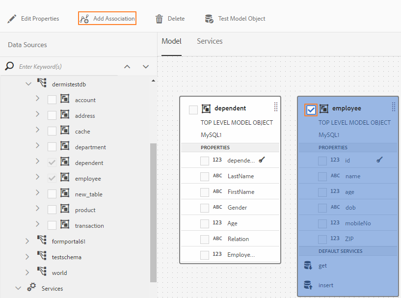

   >[!NOTE]
   >
   >In addition to data model objects and services, an Open Data Protocol (OData) service metadata document includes navigation properties that define the association between two data model objects. You can use these navigation properties when adding associations in a Form Data Model (FDM). For more information, see [Working with navigation properties of OData services](#work-with-navigation-properties-of-odata-services).

   The [!UICONTROL Add Association] dialog opens.

   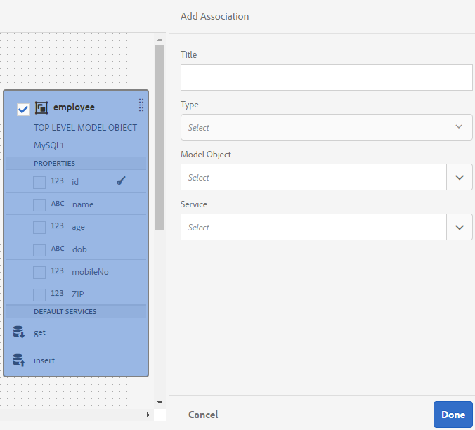

   Add Association dialog

1. In the Add Association pane:

    * Specify a title for the association.
    * Select the association type — **[!UICONTROL One to One]** or **[!UICONTROL One to Many]**.
    * Select the data model object to associate with.
    * Select the read service to read data from the selected model object. The read service argument appears. Edit the argument to change it if necessary, and bind it to the property of the data model object you want to associate.

   In the following example, the default argument for the read service of the Dependents data model object is `dependentid`.

   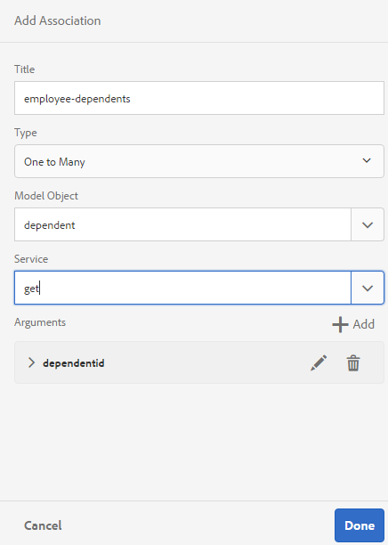

   Default argument for Dependents read service is dependentid

   However, the argument must be a common property shared between the associating data model objects, which in this example is `Employeeid`. Therefore, because the association depends on a matching key, the `Employeeid` argument must be bound to the `id` property of the Employee data model object. This binding enables the system to fetch the associated dependents details from the Dependents data model object.

   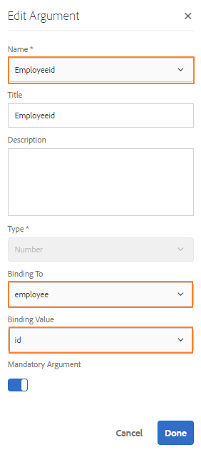

   Updated argument and binding

   Select **[!UICONTROL Done]** to save the argument.

1. Select **[!UICONTROL Done]** to save the association, then select **[!UICONTROL Save]** to save the form data model (FDM).
1. Repeat the steps to create additional associations as required.

>[!NOTE]
>
>The added association appears in the data model object box with the specified title and a line connecting the associated data model objects.
>
>You can edit an association by selecting the checkbox against it and selecting **[!UICONTROL Edit Association]**.

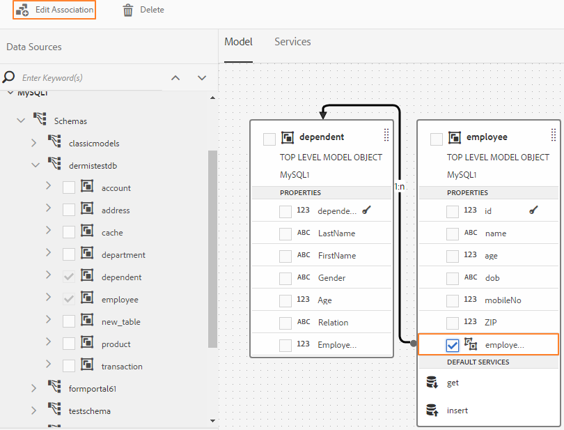 

## Edit properties {#properties}

Editing properties lets you configure how data model objects, their properties, and services behave within the **form data model (FDM)**. Through the **[!UICONTROL Edit Properties]** pane, you define the services, data types, keys, and arguments that determine how the FDM reads, writes, and returns data.

To edit properties:

1. Select the check box next to a data model object, a property, or a service in the **form data model (FDM)**.
1. Select **[!UICONTROL Edit Properties]**. The **[!UICONTROL Edit Properties]** pane for the selected model object, property, or service opens.

    * **[!UICONTROL Data model object]**: Specify the **read and write services** and edit arguments. These services determine how data is retrieved from and persisted to the underlying data source for the object.
    * **[!UICONTROL Property]**: Specify the **type**, **sub-type**, and **format** for the property. You can also designate the selected property as the **primary key** for the data model object, which uniquely identifies each record.
    * **[!UICONTROL Service]**: Specify the input model object, output type, and arguments for the service. For a **Get service**, you can indicate whether it returns an array, ensuring the service correctly handles multiple records.

      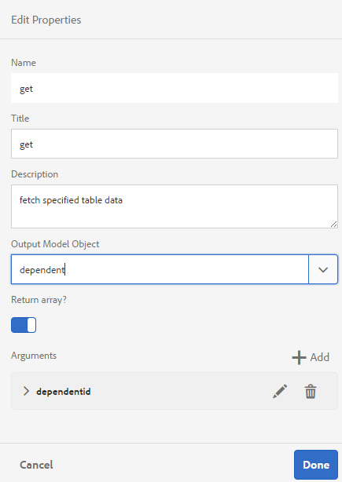

   Edit Properties dialog for a get service

1. Select **[!UICONTROL Done]** to save the property configuration, then select **[!UICONTROL Save]** to save the **form data model (FDM)**. This final save commits all property changes to the FDM.

### Create computed properties {#computed}

A **computed property** derives its value automatically from a rule or an expression. Using a rule, you can set the value of a computed property to a literal string, a number, the result of a mathematical expression, or the value of another property in the **Form Data Model (FDM)**. Because the value is calculated rather than entered manually, computed properties reduce data-entry errors and keep dependent fields consistent as the underlying data changes.

#### Example: Build a FullName computed property

For example, you can create a computed property **FullName** whose value is the result of concatenating the existing **FirstName** and **LastName** properties. To do so, follow these steps:

1. Create a new property with the name `FullName` whose data type is **String**.
2. Enable **[!UICONTROL Computed]** and select **[!UICONTROL Done]** to create the property.

   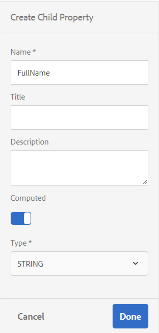

   The **FullName** computed property is created. An icon appears next to the property to indicate that it is a computed property.

   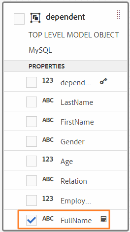

3. Select the **FullName** property, then select **[!UICONTROL Edit Rule]**. The rule editor window opens.
4. In the rule editor window, select **[!UICONTROL Create]**. A **[!UICONTROL Set Value]** rule window opens.

   From the **Select Option** drop-down, select **[!UICONTROL Mathematical Expression]**. The other available options are **[!UICONTROL Form Data Model Object]** and **[!UICONTROL String]**.

5. In the mathematical expression, select **[!UICONTROL FirstName]** as the first object and **[!UICONTROL LastName]** as the second object. Select **[!UICONTROL plus]** as the operator.

   Select **[!UICONTROL Done]**, then select **[!UICONTROL Close]** to close the rule editor window. The completed rule looks similar to the following.

   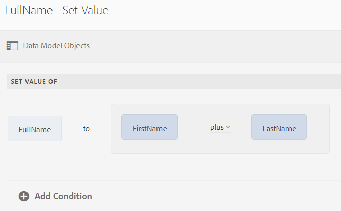

6. On the **Form Data Model (FDM)**, select **[!UICONTROL Save]**. The computed property is configured. This ensures the **FullName** value updates automatically whenever **FirstName** or **LastName** changes, so the concatenated full name always stays synchronized with the source fields.

## Work with navigation properties of OData services {#work-with-navigation-properties-of-odata-services}

**Navigation properties** in OData services define the associations between two data model objects, establishing how one entity relates to and can traverse to another. These properties are defined on an **entity type** or a **complex type**, and they are what allow a client to move from one record to its related records. For example, in the following extract from the metadata file of the sample [TripPin](https://www.odata.org/blog/trippin-new-odata-v4-sample-service/) OData sample services, the **Person** entity contains three navigation properties: **Friends**, **BestFriend**, and **Trips**.

For more information about navigation properties, see the [OData documentation](https://docs.oasis-open.org/odata/odata/v4.0/errata03/os/complete/part3-csdl/odata-v4.0-errata03-os-part3-csdl-complete.html#_Toc453752536).

```xml
<edmx:Edmx xmlns:edmx="https://docs.oasis-open.org/odata/ns/edmx" Version="4.0">
<script/>
<edmx:DataServices>
<Schema xmlns="https://docs.oasis-open.org/odata/ns/edm" Namespace="Microsoft.OData.Service.Sample.TrippinInMemory.Models">
<EntityType Name="Person">
<Key>
<PropertyRef Name="UserName"/>
</Key>
<Property Name="UserName" Type="Edm.String" Nullable="false"/>
<Property Name="FirstName" Type="Edm.String" Nullable="false"/>
<Property Name="LastName" Type="Edm.String"/>
<Property Name="MiddleName" Type="Edm.String"/>
<Property Name="Gender" Type="Microsoft.OData.Service.Sample.TrippinInMemory.Models.PersonGender" Nullable="false"/>
<Property Name="Age" Type="Edm.Int64"/>
<Property Name="Emails" Type="Collection(Edm.String)"/>
<Property Name="AddressInfo" Type="Collection(Microsoft.OData.Service.Sample.TrippinInMemory.Models.Location)"/>
<Property Name="HomeAddress" Type="Microsoft.OData.Service.Sample.TrippinInMemory.Models.Location"/>
<Property Name="FavoriteFeature" Type="Microsoft.OData.Service.Sample.TrippinInMemory.Models.Feature" Nullable="false"/>
<Property Name="Features" Type="Collection(Microsoft.OData.Service.Sample.TrippinInMemory.Models.Feature)" Nullable="false"/>
<NavigationProperty Name="Friends" Type="Collection(Microsoft.OData.Service.Sample.TrippinInMemory.Models.Person)"/>
<NavigationProperty Name="BestFriend" Type="Microsoft.OData.Service.Sample.TrippinInMemory.Models.Person"/>
<NavigationProperty Name="Trips" Type="Collection(Microsoft.OData.Service.Sample.TrippinInMemory.Models.Trip)"/>
</EntityType>
```

### How navigation properties appear in the Form Data Model

When you configure an OData service in a **Form Data Model (FDM)**, all navigation properties in an entity container are automatically made available through a single service in the FDM. This consolidation means you do not need a separate service for each association, because the FDM surfaces them together. In this example of the TripPin OData service, the three navigation properties in the `Person` entity container can all be read using one **`GET LINK`** service in the FDM.

The following highlights the **`GET LINK of Person /People`** service in the FDM, which is a combined service for the three navigation properties—**Friends**, **BestFriend**, and **Trips**—in the `Person` entity of the TripPin OData service.

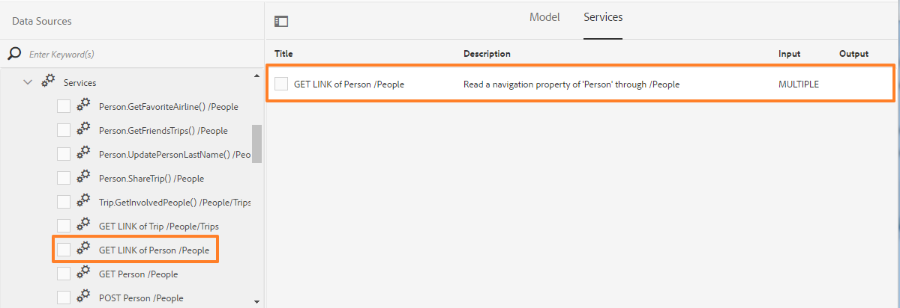

### Configuring the GET LINK service

Once you add the **`GET LINK`** service to the **Services** tab in the FDM, you can edit its properties to choose the output model object and the navigation property to use in the service. For example, the following **`GET LINK of Person /People`** service uses **Trip** as the output model object and **Trips** as the navigation property.

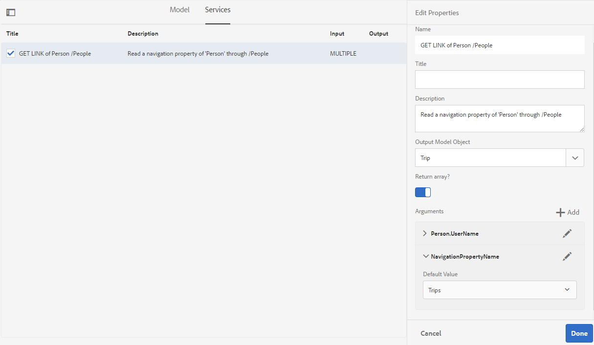

>[!NOTE]
>
>The values available in the **[!UICONTROL Default Value]** field of the **NavigationPropertyName** argument depend on the state of the **[!UICONTROL Return array?]** toggle button. When it is enabled, the field shows navigation properties of **Collection** type.

In this example, you can also choose **Person** as the output model object and set the navigation property argument to **Friends** or **BestFriend**, depending on whether **[!UICONTROL Return array?]** is enabled or disabled.

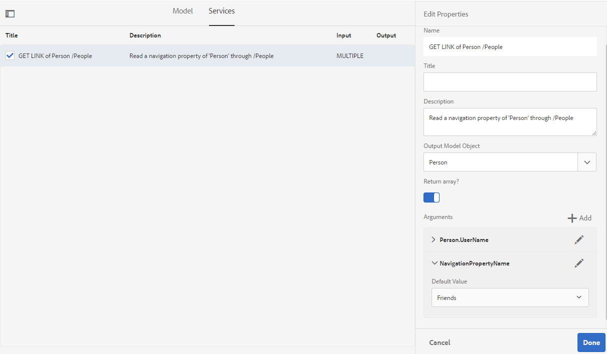

### Using navigation properties in associations

Similarly, you can choose a **`GET LINK`** service and configure its navigation properties when adding associations in the FDM. However, selecting a navigation property is only possible when the **[!UICONTROL Binding To field]** is set to **[!UICONTROL Literal]**; because of this requirement, the navigation property options do not become selectable until that binding is configured correctly.

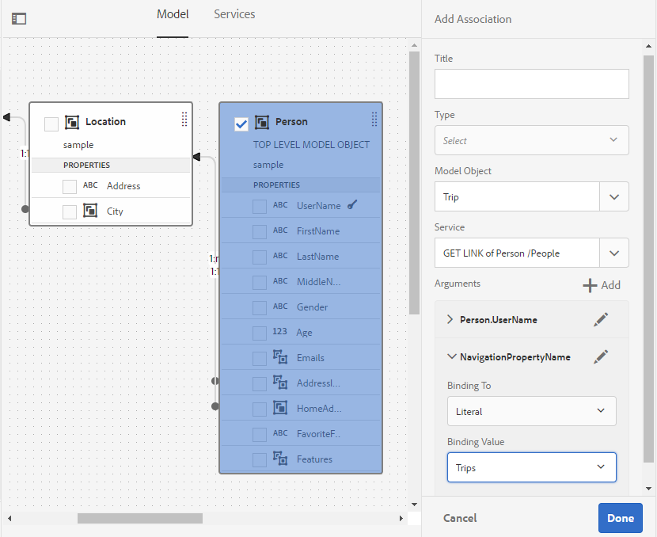 

## Generate and edit sample data {#sample}

The **Form Data Model (FDM) editor** generates **sample data** for all data model object properties in a form data model, including **computed properties**. This sample data consists of a set of random values that comply with the **data type** configured for each property, giving you realistic test values without requiring a live data source connection.

### About sample data

Sample data serves as ready-made test input that lets you preview and validate how a form data model behaves before binding it to production data. Because each generated value respects the configured data type of its property, the sample set reflects the expected structure and format of real records, which helps you verify bindings, computed logic, and form behavior early in development.

You can also edit the generated values and save your changes. Saved data is retained even if you regenerate the sample data, so your manually curated test cases persist across regenerations. This makes it practical to build stable, reusable test scenarios rather than losing edits each time new random values are produced.

### Steps to generate and edit sample data

1. Open a **Form Data Model (FDM)** and select **[!UICONTROL Edit Sample Data]**. The FDM editor generates and displays the sample data in the **Edit Sample Data** window.

   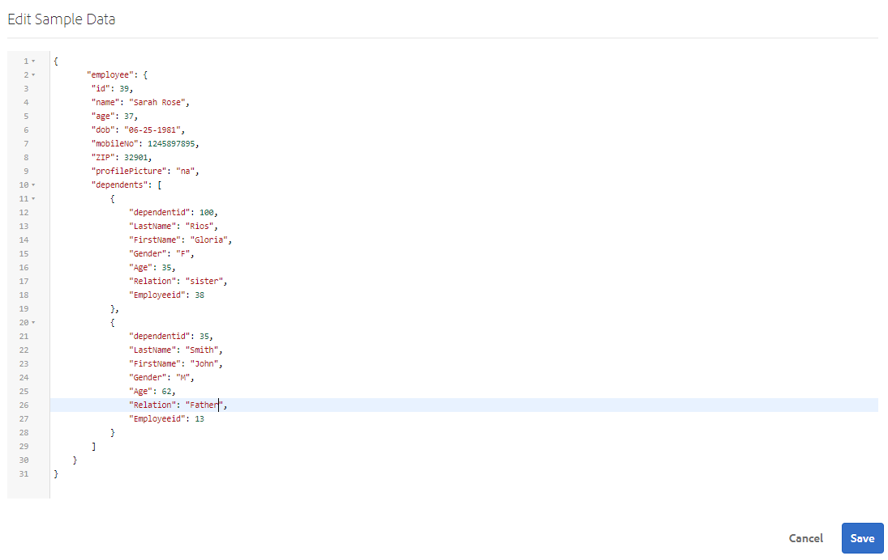

2. In the **[!UICONTROL Edit Sample Data]** window, edit the data as required, and select **[!UICONTROL Save]**. The edited sample data is saved and retained, remaining available even after you regenerate the sample data.

<!--Next, you can use the sample data to prefill and test interactive communications based on the form data model. For more information, see [Use form data model](using-form-data-model.md).-->

## Test data model objects and services {#test-data-model-objects-and-services}

Once your Form Data Model (FDM) is configured, test the configured data model objects and services before deploying the FDM in a live form to confirm they function as expected. Testing before deployment verifies that each object and service returns the correct data, reducing the risk of runtime errors when the form is put into production.

To test data model objects and services:

1. Select a data model object or a service in the Form Data Model (FDM), then select **[!UICONTROL Test Model Object]** or **[!UICONTROL Test Service]**, respectively.

   The **Test Form Data Model** window opens.

   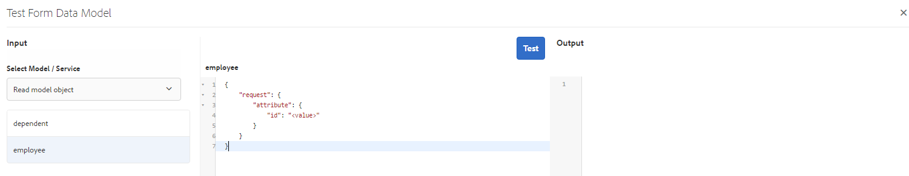

1. In the **[!UICONTROL Test Form Data Model]** window, select the data model object or service to test from the **Input** pane. This identifies the specific object or service you want to validate.

1. Specify an argument value in the test code, then select **[!UICONTROL Test]**. A successful test returns the output in the **Output** pane, confirming that the selected object or service is correctly configured and able to retrieve or process data as intended.

   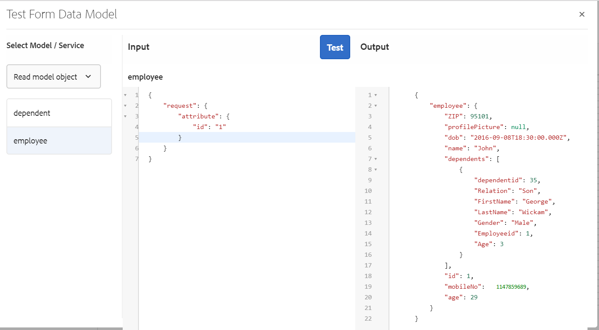

Following the same procedure, you can validate additional data model objects and services in the Form Data Model (FDM) to ensure the entire model performs reliably before use.

## Automated validation of input data {#automated-validation-of-input-data}

The **Form Data Model (FDM)** automatically validates data received as input whenever the **DermisBridge API** is invoked, applying the validation criteria defined within the form data model. This validation is controlled by the **`ValidationOptions`** flag set in the query object used to invoke the API. By default, when no value is set for the `ValidationOptions` flag, the FDM performs **BASIC** validation on the input data.

### ValidationOptions flag levels

The `ValidationOptions` flag accepts any of the following three values, each defining how strictly the FDM validates input:

* **FULL**: The FDM validates the input against **all defined constraints**. Use this level to enforce every data type and business rule constraint before the data is processed.
* **OFF**: The FDM performs **no validation**. Input data passes through without any constraint checks.
* **BASIC**: The FDM validates only the **`required`** and **`nullable`** constraints. This ensures mandatory fields are present and null-handling rules are honored without evaluating the full constraint set.

If no value is set for the `ValidationOptions` flag, the FDM applies **BASIC** validation by default.

### Setting the validation flag

The following example sets the validation flag to **FULL**, enabling validation against all constraints:

```java
operationOptions.setValidationOptions(ValidationOptions.FULL);
```

>[!NOTE]
>
>The value you provide for an attribute in the input data must match the data type defined for that attribute in the metadata document.
>
>Because the data type check is enforced independently of the validation level, if the provided value does not match the defined data type, the **DermisBridge API** returns an exception **regardless of the value of the `ValidationOptions` flag**. When the log level is set to **Debug**, the API logs the corresponding error to the **error.log** file.

### Data type constraints by data source

The **Form Data Model (FDM)** validates input data against a defined list of data type constraints. This list of constraints can vary depending on the underlying **data source**, so the exact constraints enforced during validation are determined by the data source associated with the form data model.

The following table lists the data type constraints applied to input data for each supported data source:

<table>
 <tbody> 
  <tr> 
   <td>Constraints</td> 
   <td>Description</td> 
   <td>Input data source</td> 
  </tr> 
  <tr> 
   <td>required</td> 
   <td>If true, the parameter must be included in the input data.</td> 
   <td>Swagger, WSDL, and database</td> 
  </tr> 
  <tr> 
   <td>nullable</td> 
   <td>If true, the value for the parameter can be set to Null in the input data.</td> 
   <td>WSDL, Odata, and database</td> 
  </tr> 
  <tr> 
   <td>maximum</td> 
   <td>Specifies the upper bound for numeric values. The maximum value specified as the upper bound can also be assigned to the parameter in the input data.</td> 
   <td>Swagger and WSDL</td> 
  </tr> 
  <tr> 
   <td>minimum</td> 
   <td>Specifies the lower bound for numeric values. The minimum value specified as the lower bound can also be assigned to the parameter in the input data.</td> 
   <td>Swagger and WSDL</td> 
  </tr> 
  <tr> 
   <td>exclusiveMaximum</td> 
   <td>Specifies the upper bound for numeric values. The maximum value specified as the upper bound must not be assigned to the parameter in the input data.</td> 
   <td>Swagger and WSDL</td> 
  </tr> 
  <tr> 
   <td>exclusiveMinimum</td> 
   <td>Specifies the lower bound for numeric values. The minimum value specified as the lower bound must not be assigned to the parameter in the input data.</td> 
   <td>Swagger and WSDL</td> 
  </tr> 
  <tr> 
   <td>minLength</td> 
   <td>Specifies the lower bound for the number of characters included in a string. The minimum value specified as the lower bound can also be assigned to the parameter in the input data.</td> 
   <td>Swagger and WSDL</td> 
  </tr> 
  <tr> 
   <td>maxLength</td> 
   <td>Specifies the upper bound for the number of characters included in a string. The maximum value specified as the upper bound can also be assigned to the parameter in the input data.</td> 
   <td>Swagger, WSDL, Odata, and database</td> 
  </tr> 
  <tr> 
   <td>pattern</td> 
   <td>Specifies a fixed sequence of characters. The input string is validated successfully only if the characters conform to specified pattern.</td> 
   <td>Swagger</td> 
  </tr> 
  <tr> 
   <td>minItems</td> 
   <td>Specifies the minimum number of items in an array. The minimum value specified as the lower bound can also be assigned to the parameter in the input data.</td> 
   <td>Swagger and WSDL</td> 
  </tr> 
  <tr> 
   <td>maxItems</td> 
   <td>Specifies the maximum number of items in an array. The maximum value specified as the upper bound can also be assigned to the parameter in the input data.</td> 
   <td>Swagger and WSDL</td> 
  </tr> 
  <tr> 
   <td>uniqueItems</td> 
   <td>If true, all elements of the array must be unique in the input data.</td> 
   <td>Swagger</td> 
  </tr> 
  <tr> 
   <td>enum (string)<br /> <br /> </td> 
   <td>Restricts the value of a parameter in the input data to a fixed set of string values. It must be an array with at least one element, where each element is unique.</td> 
   <td>Swagger, WSDL, and Odata</td> 
  </tr> 
  <tr> 
   <td>enum (number)<br /> <br /> </td> 
   <td>Restricts the value of a parameter in the input data to a fixed set of numeric values. It must be an array with at least one element, where each element is unique.</td> 
   <td>WSDL</td> 
  </tr> 
 </tbody> 
</table>

## Input Data Validation Using Swagger Constraints

Input data passes validation only if **Order Id** is present and its value falls within the range **1–10**. In this example, the input data is validated against the **maximum**, **minimum**, and **required** constraints defined in the **Swagger (OpenAPI)** file. These three constraint types govern the accepted input as follows:

- **required** — the parameter must be supplied; a missing `orderId` fails validation.
- **minimum** — the value must not be less than **1**.
- **maximum** — the value must not exceed **10**.

Because the constraints are declared directly in the API definition, validation is enforced automatically at the schema level before the operation executes. This ensures that only well-formed requests reach the underlying service.

```json
   parameters: [
   {
   name: "orderId",
   in: "path",
   description: "ID of pet that must be fetched",
   required: true,
   type: "integer",
   maximum: 10,
   minimum: 1,
   format: "int64"
   }
   ]
```

## Validation Failure Behavior and Error Logging

The system throws a validation exception when the input data does not meet these criteria. As a result of this failure, and when the log level is set to **Debug**, an error is written to the **error.log** file. This logging behavior helps developers diagnose exactly which constraint was violated, because the log entry identifies the failing parameter, the constraint that was breached, and the offending value.

For example, submitting an `orderId` of **16** exceeds the declared **maximum of 10**, producing the following log entry:

```verilog
21.01.2019 17:26:37.411 *ERROR* com.adobe.aem.dermis.core.validation.JsonSchemaValidator {"errorCode":"AEM-FDM-001-044","errorMessage":"Input validations failed during operation execution.","violations":{"/orderId":["numeric instance is greater than the required maximum (maximum: 10, found: 16)"]}}
```

The error entry captures the error code **AEM-FDM-001-044**, the message `"Input validations failed during operation execution."`, and a `violations` block pinpointing the `/orderId` field, the required maximum of **10**, and the value found (**16**). This structured detail makes it straightforward to identify and correct out-of-range input.

## Next steps {#next-steps}

<!--and interactive communications-->

You have a working **Form Data Model (FDM)** that is now ready for use in Adaptive Forms workflows. A Form Data Model represents the structure and relationships of the data your forms capture and exchange with connected data sources, providing a unified, reusable schema that Adaptive Forms can bind to directly. Because the model abstracts the underlying data services into a single consistent layer, it allows forms to read from and write to those sources without requiring integration logic to be rebuilt for each new form.

With the model in place, you can now apply it across your form-building tasks. Common next steps include:

- **Bind form fields to the model** so that Adaptive Form components map directly to the data attributes defined in the FDM, ensuring consistent data capture and submission.
- **Prefill forms with existing data** retrieved through the model, which improves the user experience by reducing manual data entry.
- **Configure form submission** to write captured data back to the connected data sources through the model, keeping records synchronized.
- **Reuse the model across multiple forms** to maintain consistency and reduce duplicated configuration effort.

Reusing a single Form Data Model across workflows promotes consistency and lowers ongoing maintenance, because updates to the model propagate to every form that depends on it. For detailed guidance on applying the model in your Adaptive Forms, see [Use form data model (FDM)](using-form-data-model.md).
