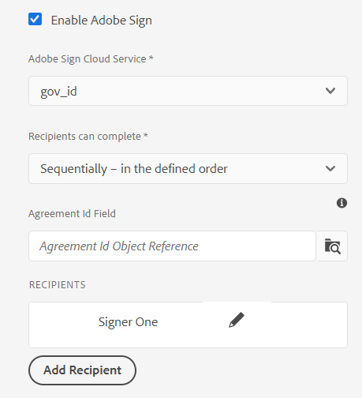
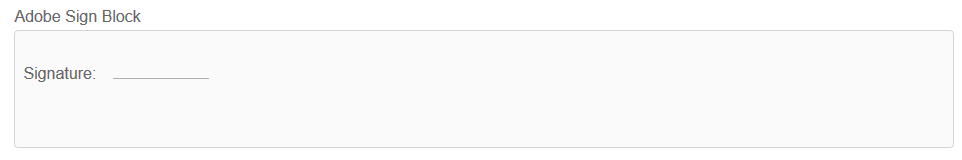
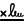
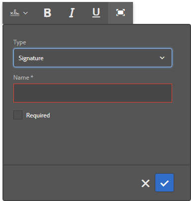
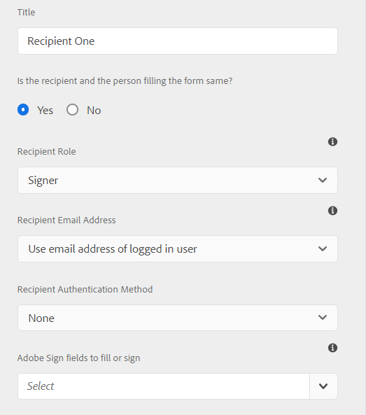
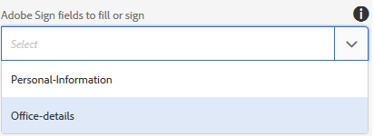

# Use [!DNL Adobe Sign] in an Adaptive Form {#using-adobe-sign-in-an-adaptive-form}

>[!NOTE]
>
> Adobe recommends using the modern and extensible data capture [Core Components](https://experienceleague.adobe.com/docs/experience-manager-core-components/using/adaptive-forms/introduction.html) for [creating new Adaptive Forms](/help/forms/creating-adaptive-form-core-components.md) or [adding Adaptive Forms to AEM Sites pages](/help/forms/create-or-add-an-adaptive-form-to-aem-sites-page.md). These components represent a significant advancement in Adaptive Forms creation, ensuring impressive user experiences. This article describes older approach to author Adaptive Forms using foundation components.


| Version | Article link |
| -------- | ---------------------------- |
| AEM 6.5  |    [Click here](https://experienceleague.adobe.com/docs/experience-manager-65/forms/adaptive-forms-advanced-authoring/working-with-adobe-sign.html)                  |
| AEM as a Cloud Service     | This article         |


[!DNL Adobe Sign] enables e-signature workflows for Adaptive Forms. E-Signatures improve workflows to process documents for legal, sales, payroll, human resource management, and more areas.

In a typical [!DNL Adobe Sign] and Adaptive Forms scenario, a user fills an Adaptive Form to apply for a service that requires signatures of one or more parties. For example, a mortgage and credit-card application requires legal Signatures from all the borrowers and co-applicants. To enable electronic-signature workflows for similar scenarios, you can integrate [!DNL Adobe Sign] with an Adaptive Form. A few more examples are, you can use [!DNL Adobe Sign] to:

* Close deals from any device with fully automated proposal, quote, and contract processes.
* Finish Human Resource processes faster and give your employees the digital experiences.
* Cut contract cycle times and onboard your vendors faster.
* Create digital workflows that automate common processes.

[!DNL Adobe Sign] integration with [!DNL AEM Forms] supports:

* Single and multiple-user signing workflows
* Sequential and simultaneous signing workflows
* Signing forms as an anonymous or logged-in user
* Dynamic signing processes (integration with [!DNL AEM Forms] Workflow)
* Authentication through a knowledge base, phone, social profiles, and Government ID
* Assign roles to each agreement recipients. Adobe Sign for business and enterprise service levels have the option to expand the [roles for agreement recipients](#addsignerstoanadaptiveform).

<!-- * In-form and out-of-form signing experiences -->

## Prerequisites {#prerequisites}

Before using [!DNL Adobe Sign] in an Adaptive Form:

* Ensure that [!DNL AEM Forms] as a Cloud Service is configured to use Adobe Sign. For details, see [Integrate Adobe Sign with [!DNL AEM Forms]](adobe-sign-integration-adaptive-forms.md).
* Keep the list of recipients ready. You require at least an email address for every recipient.

## Configure [!DNL Adobe Sign] for an Adaptive Form {#configure-adobe-sign-for-an-adaptive-form}

To configure [!DNL Adobe Sign] for an Adaptive Form:

1. [Enable [!DNL Adobe Sign] for an Adaptive Form](#enableadobsignforanadaptiveform)
1. [Add [!DNL Adobe Sign] fields to an Adaptive Form](#addadobesignfieldstoanadaptiveform)
1. [Select [!DNL Adobe Sign] Cloud Service for an Adaptive Form](#select-adobe-sign-cloud-service-and-signing-order)

1. [Add [!DNL Adobe Sign] recipient to an Adaptive Form](#addsignerstoanadaptiveform)
1. [Select Submit Action for an Adaptive Form](#selectsubmitactionforanadaptiveform)



### Enable [!DNL Adobe Sign] for an Adaptive Form  {#enableadobesign}

You can enable [!DNL Adobe Sign] for an existing Adaptive Form or create an [!DNL Adobe Sign] enabled Adaptive Form. Choose one of the following:

* [Create an [!DNL Adobe Sign] enabled Adaptive Form](#create-an-adaptive-form-for-adobe-sign)
* [Enable [!DNL Adobe Sign] for an existing Adaptive Form](#editafsign).

#### Create an Adaptive Form for Adobe Sign {#create-an-adaptive-form-for-adobe-sign}

To create a sign-enabled Adaptive Form:

1. Navigate to **[!UICONTROL Adobe Experience Manager]** > **[!UICONTROL Forms]** > **[!UICONTROL Forms & Documents]**.
1. Select **[!UICONTROL Create]** and select **[!UICONTROL Adaptive Form]**. A list of templates appears. Select a template and select **[!UICONTROL Next]**.
1. In the **[!UICONTROL Basic]** tab:

    1. Specify the **[!UICONTROL Name]** and **[!UICONTROL Title]** for the Adaptive Form.

    1. Select the [configuration container](adobe-sign-integration-adaptive-forms.md#configure-adobe-sign-with-aem-forms) created while [integrating [!DNL Adobe Sign] with [!DNL AEM Forms]](adobe-sign-integration-adaptive-forms.md).

      The configuration container contains the [!DNL Adobe Sign] Cloud Services configured for your environment. These services are available for selection in Adaptive Form editor.  

1. In the **[!UICONTROL Form Model]** tab, select one of the following options:

    * If you have a custom form template and require a Document of Record based on the form template, select the **[!UICONTROL Associate form template as the Document of Record template]** option and select a Document of Record template. When you use the option, then the documents sent for signing display only those fields which are based on the associated form template. It does not display all the fields of the Adaptive Form.

    * If you do not have a custom form template, select the **[!UICONTROL Generate Document of Record]** option. When you use the option, the document sent for signing displays all the fields of the Adaptive Form.

1. Select **[!UICONTROL Create.]** A sign-enabled Adaptive Form is created. You can add your [!DNL Adobe Sign] fields to the form and send it for signing.

#### Enable [!DNL Adobe Sign] for an Adaptive Form {#editafsign}

To use [!DNL Adobe Sign] in an existing Adaptive Form:

1. Navigate to **[!UICONTROL Adobe Experience Manager]** > **[!UICONTROL Forms]** > **[!UICONTROL Forms & Documents]**.
1. Select the Adaptive Form and select **[!UICONTROL Properties]**.
1. In the **[!UICONTROL Basic]** tab, select the [configuration container](adobe-sign-integration-adaptive-forms.md#configure-adobe-sign-with-aem-forms) created while integrating [!DNL Adobe Sign] with [!DNL AEM Forms].
1. In the **[!UICONTROL Form Mode]** tab, select one of the following options:

   * If you have a custom form template and require a Document of Record based on the form template, select the **[!UICONTROL Associate form template as the Document of Record template]** option and select a Document of Record template. When you use the option, then the documents sent for signing display only those fields which are based on the associated form template. It does not display all the fields of the Adaptive Form.

   * If you do not have a custom form template, select the **[!UICONTROL Generate Document of Record]** option. When you use the option, the document sent for signing displays all the fields of the Adaptive Form.

1. Select **[!UICONTROL Save & Close]**. The Adaptive Form is enabled for [!DNL Adobe Sign]. Now, you can add your [!DNL Adobe Sign] fields to the form and send it for signing.

### Add [!DNL Adobe Sign] fields to an Adaptive Form {#addadobesignfieldstoanadaptiveform}

[!DNL Adobe Sign] has various fields that can be placed on an Adaptive Form. These fields accept various types of data such as signatures, initials, company, or title and help collect extra information during signing, along with the signatures. You can use the [!DNL Adobe Sign] Block component to place [!DNL Adobe Sign] fields at various locations in an Adaptive Form.

To add fields to an Adaptive Form and customize various options related to these fields:

1. Drag-and-drop **[!UICONTROL Adobe Sign Block]** component from the component browser to the Adaptive Form. The [!DNL Adobe Sign] Block component has all the supported [!DNL Adobe Sign] fields. By default, it adds a **[!UICONTROL Signature]** field to the Adaptive Form.

   

   By default, the [!DNL Adobe Sign] Block is not visible in the published Adaptive Form. It is visible only in the signing documents. You can change the visibility of [!DNL Adobe Sign] Block from the properties of the [!DNL Adobe Sign] Block component.

   >[!NOTE]
   >
   >  * Using [!DNL Adobe Sign] block is not mandatory to use [!DNL Adobe Sign] in an Adaptive Form. If you do not use [!DNL Adobe Sign] block and add fields for the recipients, then the default signature field is displayed at the bottom of the signing documents.
   >  * Use [!DNL Adobe Sign] block only for those Adaptive Forms which automatically generate Document of Record. If you are using a custom XDP for generating Document of Record or a form template based Adaptive Form, [!DNL Adobe Sign] block is not supported.


1. Select the **[!UICONTROL Adobe Sign Block]** component and select the **[!UICONTROL Edit]**  icon. It displays options to add fields and format appearance of a field.

   

   **A.** Select and add [!DNL Adobe Sign] fields. **B.** Expand the [!DNL Adobe Sign] block to full screen view

1. Select the **[!UICONTROL Adobe Sign]** Field  icon. It displays options to select and add [!DNL Adobe Sign] fields.

   Expand the **[!UICONTROL Type]** drop-down field to select an [!DNL Adobe Sign] field and select the Done  icon to add the selected field to [!DNL Adobe Sign] block. The **[!UICONTROL Type]** drop-down field includes Signature, Recipient info, and Data field types. [!DNL Adobe Sign] integration with AEM [!DNL Forms] support fields listed in the [!UICONTROL Type] drop-down box only. For detailed information about [!DNL Adobe Sign] fields, see [Adobe Sign documentation](https://helpx.adobe.com/sign/help/field-types.html).

   

   It is mandatory to provide a unique name for a field. You can also select the required option to mark a field mandatory. In addition to the **[!UICONTROL Name]** and **[!UICONTROL Required]** option, some [!DNL Adobe Sign] field have more options. For example, mask and multi-line. Moreover, specify a unique name for each [!DNL Adobe Sign] field whether the fields reside in same or different [!DNL Adobe Sign] blocks.

   If you select **[!UICONTROL Digital Signature]** from the drop-down list, you can apply digital signatures to the Adaptive Form:

    * Online using cloud signatures to sign with a [digital ID](https://helpx.adobe.com/sign/kb/digital-certificate-providers.html) hosted by a trust service provider.
    * Locally by downloading the document with Adobe Acrobat or Reader using a smart card, USB token, or file-based digital ID.

### Enable [!DNL Adobe Sign] for an Adaptive Form {#enableadobsignforanadaptiveform}

Out of the box, [!DNL Adobe Sign] is not enabled for an Adaptive Form. To enable it:

1. In the Content browser, select **[!UICONTROL Form Container]**, and select the **[!UICONTROL Configure]**  icon. It opens properties browser and displays Adaptive Form container properties.
1. In the properties browser, expand the **[!UICONTROL Electronic Signature]** accordion, and select the **[!UICONTROL Enable Adobe Sign]** option. It enables [!DNL Adobe Sign] for an Adaptive Form.

### Select [!DNL Adobe Sign] Cloud Service and signing order {#select-adobe-sign-cloud-service-and-signing-order}

You can configure multiple [!DNL Adobe Sign] services for an instance of AEM [!DNL Forms]. It is advisable to have a separate set of services for each function (Human Resource, Finance, and more). It makes tracking and reporting of signed documents easier. For example, A bank has multiple departments. You can have a separate configuration for each department for better tracking of the documents.

A document can also have multiple recipients. For example, a credit-card application can have multiple applicants. A bank requires signatures of all the applicants before starting processing application. For multi-recipient scenarios, you can select to sign the document in sequential or simultaneous order.

To select a Cloud Service and order of signing:


1. In the Content browser, select **[!UICONTROL Form Container]**, and select the **[!UICONTROL Configure]**  icon. It opens properties browser and displays Adaptive Form container properties.
1. In the properties browser, expand the **[!UICONTROL Electronic Signature]** accordion, and select the **[!UICONTROL Enable Adobe Sign]** option. It enables [!DNL Adobe Sign] for an Adaptive Form.
1. Select a Cloud Service from the already configured list of [!DNL Adobe Sign] Cloud Services.

   If the **[!UICONTROL Adobe Sign Cloud Service]** list is empty, follow the [Configure [!DNL Adobe Sign] with [!DNL AEM Forms]](adobe-sign-integration-adaptive-forms.md) article to configure the service.

   The drop-down lists the Cloud Services that exist in the `global` folder in Tools > **[!UICONTROL Cloud Services]** > **[!UICONTROL Adobe Sign]**. In addition, the drop-down list also lists the Cloud Services that exist in the folder that you select in the **[!UICONTROL Configuration Container]** field when you create an Adaptive Form.

1. Select the option to configure the submit action using **[!UICONTROL Submit the form]**. You can select either of the two options from the following:
   * **Submit the form (and send the agreement for signing)**: This option submits the form immediately and then send the form for signing to the recipients.
   * **Submit the form (after every recipient completes signing ceremony)**: This option submits Adaptive Forms only after all the signers complete the signing process. You can configure the interval to check the signing status for all the signers. For details, see  [Configure [!DNL Adobe Acrobat Sign] scheduler](/help/forms/adobe-sign-integration-adaptive-forms.md#configure-dnl-adobe-acrobat-sign-scheduler-to-sync-the-signing-status). 

1. Select the signing order from the **[!UICONTROL Recipients can complete]** dialog box. The recipients can sign an Adaptive Form **[!UICONTROL Sequentially]** - one after another recipient, or **[!UICONTROL Simultaneously]** - in any order.

   In sequential order, one recipient receives the Adobe Sign agreement at a time. After the recipient completes the assigned action, the agreement is sent to the next recipient, and so on.

   In simultaneous order, all the recipients receive the Adobe Sign agreement and can act in parallel to each other.

1. Use the Agreement Id Field to associate a bindref to Agreement ID (agreementId). It adds Agreement ID to afBoundData section of submit data for schema-based forms. The Agreement ID is also added to afSubmissionInfo section in the submitted data for all Adobe Sign-enabled forms. You can use the agreement ID for tracking agreement status using custom code (requires custom implementation).

   >[!NOTE]
   >
   > If an Adaptive Form is created using a Form Data Model(FDM), the Agreement ID field becomes visible in the dialog box.

1. [Add recipients to an Adaptive Form](working-with-adobe-sign.md#addsignerstoanadaptiveform) and select the Done  icon to save the changes.

### Add recipients to an Adaptive Form {#addsignerstoanadaptiveform}

You can have one or multiple recipients for an Adobe Sign agreement. When you add a recipient, you can also configure authentication details for the recipient and select if the form filler and recipient are the same person. Perform the following steps to add and provide various details about a recipient:

1. In the Content browser, select **[!UICONTROL Form Container]**, and select the **[!UICONTROL Configure]**  icon. It opens properties browser with Adaptive Form container properties.
1. In the properties browser, expand the **[!UICONTROL Electronic Signature]** accordion, and select the **[!UICONTROL Enable Adobe Sign]** option. It enables [!DNL Adobe Sign] for an Adaptive Form.
1. Select **[!UICONTROL Add Recipient]**. It adds a recipient to the Adaptive Form. You can add multiple recipients to an Adaptive Form. All the recipients receive an Adobe Sign agreement on submission of the adaptive form.
   

1. Click the **[!UICONTROL Edit]**  icon to specify the following information about the recipient:

    * **[!UICONTROL Title]:** Specify a title to uniquely identify a recipient.

    * **[!UICONTROL Is the recipient and the person filling the form same?]:** Select **[!UICONTROL Yes]**, if form filler and first recipient are the same person. <!-- If the option is set to **No,** then do not use the signature step component in the Adaptive Form. If the form contains a Signature Step component, then the field is automatically set to Yes. -->

    * **[!UICONTROL Recipient Role]:** Select the role of a recipient. Adobe Sign for business and enterprise service levels have the option to expand the [roles for agreement recipients](https://helpx.adobe.com/sign/using/set-up-signer-approver-roles.html), beyond just the **Signer**, to better match their workflow requirements. 

    * **[!UICONTROL Recipient Email Address]:** Specify email address of the recipient. Recipient receives the Adobe Sign agreement on the specified email address. You can choose to use an email address provided in a form field, in Experience Manager user profile of the logged-in user, or manually enter an email address. It is a mandatory step. 
    
      >[!NOTE]
      >
      >Ensure that the email address of the first recipient or the only recipient (if there is single recipient) is not identical to [!DNL Adobe Sign] account used to configure AEM Cloud Services.

    * **[!UICONTROL Recipient Authentication Method]:** Specify the method to authenticate a recipient before opening the Adobe Sign agreement. You can choose between phone, knowledge base, social identity-based authentication, and [Government ID](https://helpx.adobe.com/sign/using/adobesign-authentication-government-id.html) for [!DNL Adobe Acrobat Sign]. For [!DNL Adobe Acrobat Sign for Government] you can choose between phone and knowledge-based authentication.

   >[!NOTE]
   >
   >    * By default, the social identity-based authentication provides an option to authenticate using Facebook, Google, and LinkedIn. You can contact [!DNL Adobe Sign] support to enable other social authentication providers.
   >

    * **[!DNL Adobe Sign] fields to fill or sign:** Select [!DNL Adobe Sign] fields for the recipient. An Adaptive Form can have multiple [!DNL Adobe Sign] fields. You can choose to enable specific fields for a recipient. The field displays all the available [!DNL Adobe Sign] Blocks. When you select a block, all the fields of the block are selected. You can use the X icon to deselect a field.

   

   The above image has two example [!DNL Adobe Sign] Blocks: Personal-Information and Office-details

   Select the  icon. The recipient is added.

### Select Submit Action for an Adaptive Form {#selectsubmitactionforanadaptiveform}

After you, add [!DNL Adobe Sign] fields to an Adaptive Form, enable [!DNL Adobe Sign] from form container, select [!DNL Adobe Sign] Cloud Service, and add Adobe Sign agreement recipients, select an appropriate Submit Action for the Adaptive Form. For detailed information about Adaptive Forms Submit Actions, see [Configuring the Submit Action](configuring-submit-actions.md).

 Signing and submitting a form are independent of each other. Adaptive Form submission takes place as soon as an Adobe Sign agreement is created after a user submits a form. [!DNL AEM Forms] as a Cloud Service does not wait for the recipients to sign or complete other actions to submit an Adaptive Form. A form is submitted as soon as a user clicks the Submit button or a Summary step displays the summary of the form.

 Also, an [!DNL Adobe Sign] enabled Adaptive Form embeds the Adobe Sign agreement ID to submit data. You can use the agreement ID for tracking agreement status using custom code (requires custom implementation).
 
 Adobe Sign Agreement ID (agreementId) is included in the submit data of the Adaptive Form. By default, the Agreement ID is present in the `afSubmissionInfo` node of of submitted data.

   ```xml 
   
      <?xml version="1.0" encoding="UTF-8"?>
      <afData>
         <afUnboundData>
            <data>
               <textbox1613455050902>ff</textbox1613455050902>
            </data>
         </afUnboundData>
         <afBoundData>
            <data xmlns:xfa="http://www.xfa.org/schema/xfa-data/1.0/" />
         </afBoundData>
         <afSubmissionInfo>
            <lastFocusItem>guide[0].guide1[0].guideRootPanel[0].textbox1613455050902[0]</lastFocusItem>
            <stateOverrides />
            <signers>
               <signer0>
                  <email />
               </signer0>
            </signers>
            <afPath>/content/dam/formsanddocuments/testsign</afPath>
            <afSubmissionTime>20210311031009</afSubmissionTime>
            <agreementId>xxxxxxxxxxxxxxxxxxxxxxxxxxxxxxxxxxxxxxxxxxxxx</agreementId>
         </afSubmissionInfo>
      </afData>

   ```

 Optionally, you can also associate a bindref to Agreement ID (agreementId). It adds Agreement ID to afBoundData section of submitted data. For example, in the following submitted data, the Agreement ID is bound to `<userName>` node:

```xml 

      <?xml version="1.0" encoding="UTF-8"?>
      <afData>
         <afUnboundData>
            <data />
         </afUnboundData>
         <afBoundData>
            <config xmlns:xfa="http://www.xfa.org/schema/xfa-data/1.0/" xmlns:xsi="http://www.w3.org/2001/XMLSchema-instance">
               <userName>3AAABLblqZhC2MWu7GFauKh45j_t2ih8mAtmbdIcNSl1HgQubhMJfDaDfylyN7NQiYRam_44ISKm45enIOafHqWZrdaxShf9r</userName>
               <dateOfBirth>0001-01-01</dateOfBirth>
            </config>
         </afBoundData>
         <afSubmissionInfo>
            <lastFocusItem>guide[0].guide1[0].guideRootPanel[0].projectDetails[0]</lastFocusItem>
            <stateOverrides />
            <signers>
               <signer0>
                  <email />
               </signer0>
            </signers>
            <afPath>/content/dam/formsanddocuments/testathon2021-1/gaurav/xsd-based</afPath>
            <afSubmissionTime>20210311095211</afSubmissionTime>
            <agreementId>xxxxxxxxxxxxxxxxxxxxxxxxxxxxxxxxxxxxxxxxxxxx</agreementId>
         </afSubmissionInfo>
      </afData>

```

<!-- Remove when forms portal goes live
>[!NOTE]
>
>Data of the Adaptive Form is stored temporarily on Forms Portal. Adobe recommends using [custom storage for Forms Portal](/help/forms/using/configuring-draft-submission-storage.md). It ensures that the PII (personally identifiable information) data is not stored on AEM servers. 
-->

Your form signing experience is ready. You can preview the form to verify the signing experience. On the published form, [!DNL Adobe Sign] Block fields are displayed when a recipient receives the form for signing through an email. When the **[!UICONTROL When Is the recipient and the person filling the form same?]** option is marked yes and condition is met, the user is redirected to Adobe Sign agreement after submissions and user can Sign the document immediately, instead of waiting for agreement to appear on email.

## Configure cloud signatures for an Adaptive Form {#configure-cloud-signatures-for-an-adaptive-form}

Cloud-based digital signatures or remote signatures are a new generation of digital signatures that work across desktop, mobile, and the web — and meet the highest levels of compliance and assurance for recipient authentication. You can sign an Adaptive Form with cloud-based digital signatures.

After [editing Adaptive Form properties for Adobe Sign](working-with-adobe-sign.md#enableadobesign), perform the following steps to add cloud signature field to an Adaptive Form:

1. Drag-and-drop **[!UICONTROL Adobe Sign Block]** component from the component browser to the Adaptive Form. The [!UICONTROL Adobe Sign Block] component has all the supported [!DNL Adobe Sign] fields. By default, it adds a **[!UICONTROL Signature]** field to the Adaptive Form.

   

1. Select the **[!UICONTROL Adobe Sign Block]** component and select the **[!UICONTROL Edit]**  icon. It displays options to add fields and format appearance of a field.

   

   **A.** Select and add [!DNL Adobe Sign] fields. **B.** Expand the [!DNL Adobe Sign] block to full screen view

1. Select the **[!UICONTROL Adobe Sign Field]**  icon. It displays options to select and add [!DNL Adobe Sign] fields.

   Expand the **[!UICONTROL Type]** drop-down field to select **[!UICONTROL Digital Signature]** and select the **[!UICONTROL Done]** icon to add the selected field to [!DNL Adobe Sign] block.

   

   It is mandatory to provide a unique name for a field.

   Apply digital signatures to the Adaptive Form using:

    * Cloud signatures: Sign with a [digital ID](https://helpx.adobe.com/sign/kb/digital-certificate-providers.html) hosted by a trust service provider. 
    * Adobe Acrobat or Reader: Download and open the document with Adobe Acrobat or Reader to sign using a smart card, USB token, or file-based digital ID.

      >[!NOTE]
      >
      > Digital Signature is also applicable to [!DNL Adobe Acrobat Sign for Government] but you cannot apply it using Cloud Signatures.

   After adding the cloud signature field to the Adaptive Form, perform the following steps to complete the configuration process:

    * [Enable Adobe Sign for an Adaptive Form](#enableadobsignforanadaptiveform)
    * [Select Adobe Sign Cloud Service for an Adaptive Form](#selectadobesigncloudserviceforanadaptiveform)
    * [Add recipients to an Adaptive Form](#addsignerstoanadaptiveform)
    * [Select Submit Action for an Adaptive Form](#selectsubmitactionforanadaptiveform)

### Configure the thank you page or summary step component {#configure-the-thank-you-page-or-summary-step-component}

The **[!UICONTROL Summary Step]** component automatically submits the form, populates the information inside the customized Summary page, and displays the summary of the submitted form. The Summary Step component takes up full width available for the form. It is recommended to not have any other component on the section containing the Summary Step component.

## Frequently asked questions {#frequently-asked-questions}

**Q:** You can embed an Adaptive Form in another Adaptive Form. Can the embedded Adaptive Form be [!DNL Adobe Sign] enabled?
**Ans:** No, Experience Manager Forms do not support using an Adaptive Form that embeds an [!DNL Adobe Sign] enabled Adaptive Form for signing

**Q:** When I create an Adaptive Form using the advanced template and open it for editing, an error message "Electronic Signature or recipients are not configured correctly." appears. How to resolve the error message?
**Ans:** Adaptive Form created using the advanced template is configured to use [!DNL Adobe Sign]. To resolve the error, create and select an [!DNL Adobe Sign] cloud configuration and configure an [!DNL Adobe Sign] recipient for the Adaptive Form.

**Q:** Can I use [!DNL Adobe Sign] text tags in a static text component of an Adaptive Form?
**Ans:** Yes, you can use text tags in a text component to add [!DNL Adobe Sign] fields to a Document of Record (Auto-generated Document of Record option only) enabled Adaptive Form. To learn about the procedure and rules to create a text tag, see [Adobe Sign Documentation](https://helpx.adobe.com/sign/using/text-tag.html). Also note, Adaptive Forms have a limited support for text tags. You can use the text tags to create only those fields that [Adobe Sign Block](working-with-adobe-sign.md#configure-cloud-signatures-for-an-adaptive-form) supports.

## Troubleshoot {#troubleshoot}

### [!DNL Adobe Sign] agreement failures {#adobe-sign-agreement-failures}

**Issue**
When [!DNL Adobe Sign] service is configured for an Adaptive Form, the service fails to create an [!DNL Adobe Sign] agreement for the underlying Adaptive Form.

**Resolution**

* Check the [configuration of Adobe Sign Cloud Service](adobe-sign-integration-adaptive-forms.md) used in the Adaptive Form.
* Ensure that the API application on [!DNL Adobe Sign] server used to configure [!DNL Adobe Sign] Cloud Service has required permissions.
* If you are using multiple [!DNL Adobe Sign] Cloud Services, point the **[!UICONTROL oAuth URL]** of all the services to same **[!UICONTROL Adobe Sign Shard]**.

* Use separate email addresses to configure [!DNL Adobe Sign] account and for the first or single recipient. The email address of the first recipient or the only recipient (if there is the single recipient) cannot be identical to [!DNL Adobe Sign] account used to configure AEM Cloud Services.

>[!MORELIKETHIS]
>
>* [Integrate [!DNL Adobe Sign] with [!DNL AEM Forms]](adobe-sign-integration-adaptive-forms.md)
>* [Best practices for using [!DNL Adobe Sign] with Adaptive Forms](https://medium.com/adobetech/using-adobe-sign-to-e-sign-an-adaptive-form-heres-the-best-way-to-do-it-dc3e15f9b684)


## See Also {#see-also}

{{see-also}}