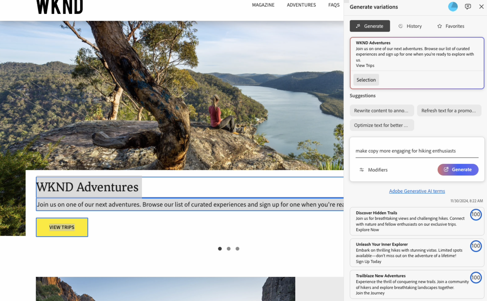
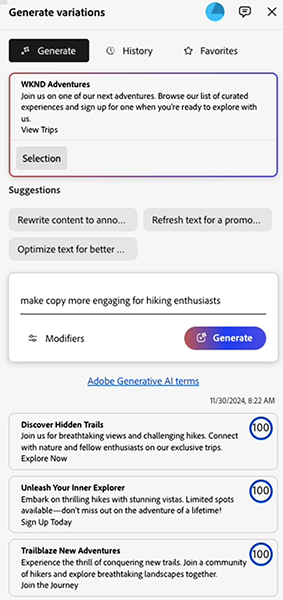
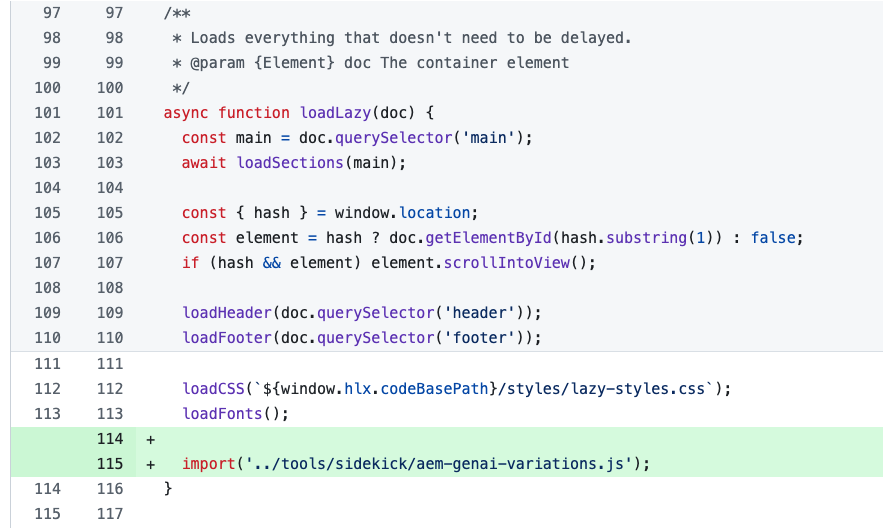

# Generate Variations - Integrated in AEM Editors {#generate-variations-integrated-in-aem-editors}

If you are looking for a way to optimize your digital channels and accelerate content creation, you can use Generate Variations integrated into the AEM editors. 

Generate Variations uses generative Artificial Intelligence (AI) to create content variations based on your input. After creating variations, you can use the content on your website, and also measure their success using the [Experimentation](https://www.aem.live/docs/experimentation) functionality of [Edge Delivery Services](/help/edge/overview.md).

This helps accelerate content velocity by quickly creating on brand content in minutes. This in turn helps improve conversion with new copy variants.

You can [access Generate Variations](#access-generate-variations) from the following editors ([once they have been configured](#access-generate-variations)):

* [within the Sidekick of AEM Edge Delivery Services; for document based authoring](#access-aem-sidekick)
* [within the Universal Editor](#access-aem-universal-editor)
* [within the Content Fragments Editor](#access-aem-content-fragment-editor)

>[!IMPORTANT]
>
>This page uses document based authoring as the base for examples, but the principles apply to the other editors.

>[!NOTE]
>
>In all cases, to use Generate Variations you must ensure that the [access prerequisites](#access-prerequisites) are fulfilled.

You can then:

* [Select the content you want to work with](#select-the-content) - from existing blocks of your content
  * The selected block steers what is shown and the actions available
* [Describe the changes you want](#describe-the-changes-you-want)
* [Generate variations of your content](#generate-copy), then [take further actions if wanted](#take-further-action-on-a-variation)
* [Select and use a variation](#use-a-generated-variation)
* Review your [history](#history)
* View your [favorites](#favorites)

## Legal and Usage Note {#legal-usage-note}

<!--
Generative AI and Generate Variations for AEM are powerful tools – but **you** are responsible for use of the output.

Your inputs to the service should be tied to a context. This context can be your branding materials, website content, data, schemas for such data, templates, or other trusted documents.

You must evaluate the accuracy of any output as appropriate to your use case.

Before using Generate Variations you are recommended to read the [Adobe Experience Cloud Generative AI User Guidelines](https://www.adobe.com/legal/licenses-terms/adobe-dx-gen-ai-user-guidelines.html).
-->

[Usage of Generate Variations](#generative-action-usage) is tied to the consumption of generative actions.

## Overview {#overview}

When you open Generate Variations integrated into an editor, you see the extension as a floating panel that has three tabs.  



* The editor:
  * This shows the content flow in the editor.
  * Here you can select a block of content for use in **Generate variations**.
* **Generate variations**:
  * Is a floating panel with three tabs, that can be relocated as you want
  * [Generate](#get-started-with-generate-variations):
    * Shows the [content you have selected](#select-the-content).
    * Provides sample **Suggestions** for changes.
    * Allows you to [describe the changes you want](#describe-the-changes-you-want).
    * Allows you to [Generate](#generate-copy) new variations.
    * Shows the generated variations. <!--, together with their [brand score](#the-brand-score).-->
    * [Take further actions on a variation](#take-further-action-on-a-variation).
    * [Use a generated variation](#use-a-generated-variation).
  * [History](#history):
    * Shows your recent history of generations.
  * [Favorites](#favorites): 
    * Shows results from previous generations that you have flagged as Favorites.
  * **Adobe Generative AI terms**: Links to [Adobe Experience Cloud Generative AI User Guidelines](https://www.adobe.com/legal/licenses-terms/adobe-dx-gen-ai-user-guidelines.html).

## Get Started with Generate variations {#get-started-with-generate-variations}

The interface guides you through the process of generating content. After opening the interface, the first step is to select the block of content you want to use.

### Select the content {#select-the-content}

From the main content flow of the editor, select the content for which you want to generate variations. This **Selection** will be shown in the **Generate** tab.

### Describe the changes you want {#describe-the-changes-you-want}

To generate variations of the content you need to describe the changes you want. You can either select one of the **Suggestions** given, or provide your own description.

You can also specify **Modifiers** to provide more context:

* **Reference a web page**
  Provide a URL for more context.
* **Upload content brief**
  Update a `.docx` file containing details of the content brief (10MB or less).

### Generate Copy {#generate-copy}

After you have described the changes you want, select **Generate** to see responses from generative AI. 



<!--
### The Brand Score {#the-brand-score}

The brand score shows you how on-brand the generated variation is.
-->

### Take further action on a variation {#take-further-action-on-a-variation}

When you select a single variation, you can use the following actions:

* **Edit**
  * You can edit the text of the generated variation. 
  * Save your changes for later use.
* **Favorite**
  * Flag this variation for future reference. 
  * Once flagged, it will be shown under the [Favorites](#favorites) tab.
* **AI Rationale**
  * For additional transparency, this provides a short description of why generative AI generated that particular variation.

### Use a generated variation {#use-a-generated-variation}

To use the content generated with generative AI, you must copy the content to the clipboard for use elsewhere.

Once copied to the clipboard, you can paste the information elsewhere; for example, when authoring content for your website. You can also run an [experiment](https://www.aem.live/docs/experimentation).

>[!NOTE]
>
>When Generate Variations is accessed from either [the AEM Universal Editor](#access-aem-universal-editor) or [the AEM Content Fragment Editor](#access-aem-content-fragment-editor), then the generated content can also be automatically transferred to the appropriate editor.

## History {#history}

This section provides links to your recent activity. 

After you select **Generate**. a **History** entry is added, showing the selected content. If you select a **History** entry, then **Generate**, it loads the prompt, and returns you to the **Generate** tab for further action.

## Favorites {#favorites}

After reviewing the content you can save selected variations as favorites.

Once saved they are shown under **Favorites**. Favorites are persisted (until you **Unfavorite** them, or clear the browser cache).

* Favorites and variations can be copy/pasted to the clipboard for use in your website content.
* You can **Edit**, **Unfavorite** or show the **AI Rationale** for an entry.
* Once a variation is selected, you can also **Export to CSV**.

## Generative Action Usage {#generative-action-usage}

Usage management depends on the action taken:

* Generate Variations

  One generation of a copy variant is equal to one generative action. As a customer, you have a certain number of generative actions that come with your AEM license. Once the base entitlement is consumed, you have the ability to purchase additional actions.

  >[!NOTE]
  >
  >See [Adobe Experience Manager: Cloud Service | Product Description](https://helpx.adobe.com/legal/product-descriptions/aem-cloud-service.html) for further details about base entitlements, and reach out to your account team if you would like to purchase more generative actions.

## Access Generate Variations {#access-generate-variations}

After fulfilling the prerequisites you can access Generate Variations from AEM as a Cloud Service or the Sidekick of the Edge Delivery Services.

### Access Prerequisites {#access-prerequisites}

To use Generate Variations you must ensure that the prerequisites are fulfilled:

* [Access to Experience Manager as a Cloud Service with Edge Delivery Services](#access-to-aemaacs-with-edge-delivery-services)

#### Access to Experience Manager as a Cloud Service with Edge Delivery Services{#access-to-aemaacs-with-edge-delivery-services}

Users who need access to Generate Variations must be entitled to an Experience Manager as a Cloud Service environment with Edge Delivery Services. 

>[!NOTE]
>
>If your contract for AEM Sites as a Cloud Service does not include Edge Delivery Services, you will need to sign a new contract to get access. 
>
>You should reach out to your Account Team to discuss how you can move to AEM Sites as a Cloud Service with Edge Delivery Services.

To grant access to specific users, assign their user account to the respective product profile. See [Assigning AEM Product Profiles for further details](/help/journey-onboarding/assign-profiles-cloud-manager.md).

### Access from the AEM Sidekick for document based authoring {#access-aem-sidekick}

Access from the AEM Sidekick is used for document based authoring. 

Some configuration is needed before you can access Generate Variations from the Sidekick (of Edge Delivery Services). 

>[!NOTE]
>
>See the document [Installing the AEM Sidekick](https://www.aem.live/docs/sidekick-extension) for how to install and configure the Sidekick.

To use the Generate Variations in the Sidekick (of Edge Delivery Services), include the following configurations in your Edge Delivery Services projects.

1. Enable our app in:

   * `tools/sidekick/config.json` 

   This must be merged into your existing configuration and then deployed.

   For example:

   ```prompt
   {
     "plugins": [
       {
         "id": "aem-genai-variations",
         "titleI18n": {
           "en": "Generate with AI"
         },
         "environments": [
           "preview"
         ],
         "includePaths": [
           "**.docx**"
         ],
         "event": "aem-genai-variations-sidekick"
       }
     ]
   }
   ```

1. Create:

   * `/tools/sidekick/aem-genai-variations.js`

   You must create this file with the following content:

   ```prompt
   (function () {
     let isAEMGenAIVariationsAppLoaded = false;
     function loadAEMGenAIVariationsApp() {
       const script = document.createElement('script');
       script.src = 'https://experience.adobe.com/solutions/aem-sites-genai-aem-genai-variations-mfe/static-assets/resources/sidekick/client.js?source=plugin';
       script.onload = function () {
         isAEMGenAIVariationsAppLoaded = true;
       };
       script.onerror = function () {
         console.error('Error loading AEMGenAIVariationsApp.');
       };
       document.head.appendChild(script);
     }
 
     function handlePluginButtonClick() {
       if (!isAEMGenAIVariationsAppLoaded) {
         loadAEMGenAIVariationsApp();
       }
     }
 
     // The code snippet for the Sidekick V1 extension, https://chromewebstore.google.com/detail/aem-sidekick/ccfggkjabjahcjoljmgmklhpaccedipo?hl=en
     const sidekick = document.querySelector('helix-sidekick');
     if (sidekick) {
       // sidekick already loaded
       sidekick.addEventListener('custom:aem-genai-variations-sidekick', handlePluginButtonClick);
     } else {
       // wait for sidekick to be loaded
       document.addEventListener('sidekick-ready', () => {
         document.querySelector('helix-sidekick')
           .addEventListener('custom:aem-genai-variations-sidekick', handlePluginButtonClick);
       }, { once: true });
     }
 
     // The code snippet for the Sidekick V2 extension, https://chromewebstore.google.com/detail/aem-sidekick/igkmdomcgoebiipaifhmpfjhbjccggml?hl=en
     const sidekickV2 = document.querySelector('aem-sidekick');
     if (sidekickV2) {
       // sidekick already loaded
       sidekickV2.addEventListener('custom:aem-genai-variations-sidekick', handlePluginButtonClick);
     } else {
       // wait for sidekick to be loaded
       document.addEventListener('sidekick-ready', () => {
         document.querySelector('aem-sidekick')
           .addEventListener('custom:aem-genai-variations-sidekick', handlePluginButtonClick);
       }, { once: true });
     }
   }());
   ```

1. Update:

   * `/scripts/scripts.js` 

   This must be updated to include the following statement in the `loadLazy()`function:

   ```prompt
     import('../tools/sidekick/aem-genai-variations.js');
   ```

   This ensures that `/tools/sidekick/aem-genai-variations.js` is loaded as part of the lazy loading process.

   

1. You may then need to ensure that users have [Access to Experience Manager as a Cloud Service with Edge Delivery Services](#access-to-aemaacs-with-edge-delivery-services).

1. You can then access the feature, by selecting **Generate with AI** from the toolbar of the Sidekick:

   

### Access from the AEM Universal Editor {#access-aem-universal-editor}

Access from the [AEM Universal Editor](/help/sites-cloud/authoring/universal-editor/authoring.md) is implemented as an extension. See the [Extension Manager in AEM Experience Manager](https://developer.adobe.com/uix/docs/extension-manager/) for further details.

### Access from the AEM Content Fragment Editor {#access-aem-content-fragment-editor}

Access from the [AEM Content Fragment Editor](/help/sites-cloud/administering/content-fragments/authoring.md#generate-variations-ai) is implemented as an extension. See the [Extension Manager in AEM Experience Manager](https://developer.adobe.com/uix/docs/extension-manager/) for further details.

## Further Information {#further-information}

For further information you can also read:

* [GenAI Generate Variations on GitHub](https://github.com/adobe/aem-genai-assistant#setting-up-aem-genai-assistant)
* [Edge Delivery Services Experimentation](https://www.aem.live/docs/experimentation)

## Release History {#release-history}

For details of the current, and previous, releases see the [Release Notes for Generate Variations](/help/generative-ai/release-notes-generate-variations.md)  
