# Generate Variations {#generate-variations}

If you are looking for a way to optimize your digital channels and accelerate content creation, you can use Generate Variations. Generate Variations uses generative Artificial Intelligence (AI) to create content variations based on prompts; these prompts are either provided by Adobe or created, and managed, by users. After creating variations, you can use the content on your website, and also measure their success using the [Experimentation](https://www.aem.live/docs/experimentation) functionality of [Edge Delivery Services](/help/edge/overview.md).

You can [access Generate Variations](#access-generate-variations) from:

* [within Adobe Experience Manager (AEM) as a Cloud Service](#access-aemaacs)
* [the Sidekick of AEM Edge Delivery Services](#access-aem-sidekick)
* [within the Content Fragments Editor](/help/sites-cloud/administering/content-fragments/authoring.md#generate-variations-ai)

>[!NOTE]
>
>In all cases, to use Generate Variations you must ensure that the [access prerequisites](#access-prerequisites) are fulfilled.

>[!NOTE]
>
>You can also access [Generate Variations integrated into AEM editors](/help/generative-ai/generate-variations-integrated-editor.md).

You can then:

* [Get started](#get-started) using a prompt template that Adobe has created for a specific use case.
* You can [edit an existing prompt](#edit-the-prompt)
* Or [create and use your own prompts](#create-prompt):
  * [Save your prompts](#save-prompt) for future use
  * [Access and use shared prompts](#select-prompt) from across your organization
* Define the [audience](#audiences) segments to use in the prompt when [generating personalized audience-specific content](#generate-copy).
* Preview the output alongside the prompt, before making amendments and refining the results if necessary.
* Use [Adobe Express to generate images](#generate-image) based on the copy variations; this uses the Generative AI capabilities of Firefly.
* Select content that you want to use on your website, or in an experiment.

## Legal and Usage Note {#legal-usage-note}

Generative AI and Generate Variations for AEM are powerful tools – but **you** are responsible for use of the output.

Your inputs to the service should be tied to a context. This context can be your branding materials, website content, data, schemas for such data, templates, or other trusted documents.

You must evaluate the accuracy of any output as appropriate to your use case.

Before using Generate Variations you are required to Agree to the [Adobe Generative AI User Guidelines](https://www.adobe.com/legal/licenses-terms/adobe-dx-gen-ai-user-guidelines.html).

[Usage of Generate Variations](#generative-action-usage) is tied to the consumption of generative actions.

## Overview {#overview}

When you open Generate Variations (and expand the left panel) you see:

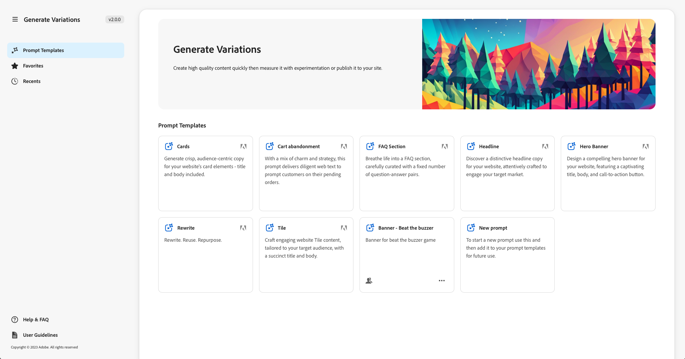

* Right panel
  * This is dependent on the selection that you make in the left navigation.
  * By default, **Prompt Templates** are shown.
* Left Navigation
  * To the left of **Generate Variations**, there is the option (sandwich menu) to expand, or hide the left navigation panel.
  * **Prompt Templates**:
    * Shows links to the various Prompts; these can include prompts:
      * Provided by Adobe to help you generate content; flagged with the Adobe icon.
      * Created by yourself.
      * Created within your IMS organization; flagged with an icon showing multiple heads.
    * Includes the [New prompt](#create-prompt) link for creating your own prompt.
    * You can **Delete** prompts created by yourself, or within your IMS organization. This is done using the menu accessed with the ellipse on the appropriate card.
  * [Favorites](#favorites): Shows results from previous generations that you have flagged as Favorites.
  * [Recents](#recents): Provides links to prompts, and their inputs, that you have used recently.
  * **Help & FAQ**: Links to documentation, including FAQs.
  * **User Guidelines**: Links to the legal guidelines.

## Get Started {#get-started}

The interface guides you through the process of generating content. After opening the interface, the first step is to select the prompt you want to use.

### Select Prompt {#select-prompt}

From the main panel, you can select:

* a Prompt Template supplied by Adobe to start generating content, 
* the [New prompt](#create-prompt) to create your own prompt,
* a template that you have created for your use only,
* a template that you, or someone in your organization, has created.

To differentiate:

* The Adobe-provided prompts are flagged with the Adobe icon
* Prompts available throughout your IMS organization are flagged with a multiple head icon.
* Your private prompts are not specifically flagged.

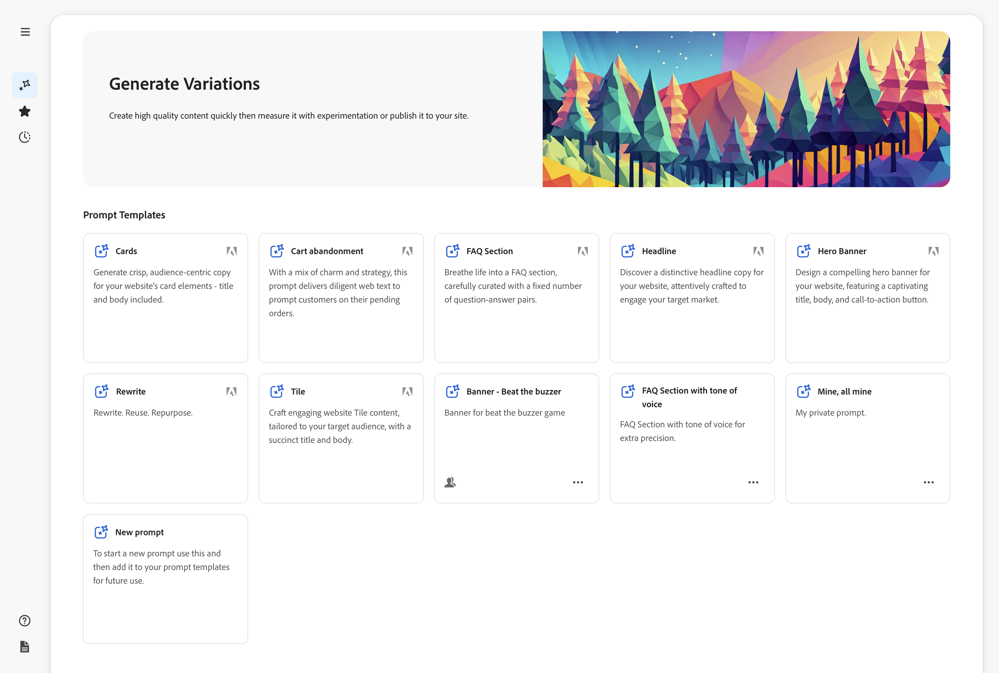

### Provide Inputs {#provide-inputs}

Each prompt needs you to supply certain information so that it is able to get appropriate content back from generative AI.

The input fields guide you through what information is needed. To help, certain fields have default values that you can use, or modify as needed, and descriptions explaining the requirements.

There are several key input fields that are common to multiple prompts (certain fields are not always available):

* **Count of**/**Number of**
  * You can select how many content variations you want to be created in one generation.
  * Depending on the prompt, this might have one of various labels; for example Count, Number of Variations, Number of Ideas, and others.
* **Audience Source**/**Target Audience**
  * Helps to generate personalized content to a specific audience.
  * Adobe provides default audiences; or you can specify additional audiences; see [Audiences](#audiences).
* **Additional Context**
  * Insert relevant content to help Generative AI craft a better response based on the input. For example, if you are creating a web banner for a particular page or product you may want to include information about the page / product.
* **Temperature**
  Use to modify the temperature of Adobe Generative AI:
  * A higher temperature strays from the prompt and leads to more variation, randomness, and creativity.
  * A lower temperature is more deterministic and stays closer to what is in the prompt.
  * As default, the temperature is set to 1. You can experiment with different temperatures if the generated results are not to your liking.
* **Edit Prompt**
  * The underlying [prompt can be edited](#edit-the-prompt) to refine the generated results.

### Generate Copy {#generate-copy}

After you fill out the input fields, and/or modify the prompt, you are ready to generate content and review the responses.

Select **Generate** to see responses generated by generative AI. The generated content variations are shown under the prompt that generated them. 

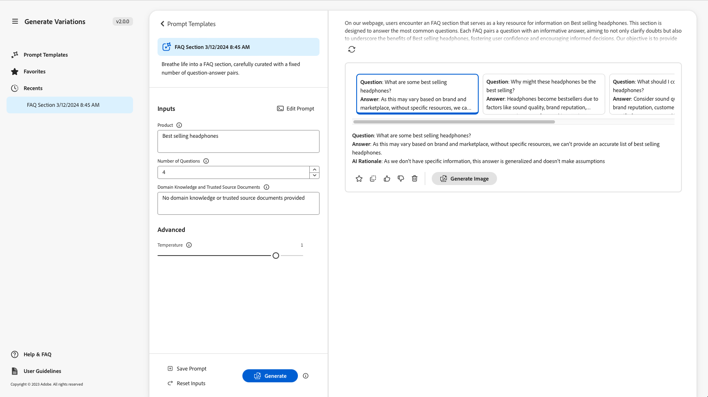

>[!NOTE]
>
>Most Adobe prompt templates include an **AI Rationale** in the variation response. This provides transparency as to why generative AI generated that particular variation.

When you select a single variation, the following actions are available:

* **Favorite**
  * Flag as a **Favorite** for future use (will show in [Favorites](#favorites)).
* Thumbs Up/Thumbs Down
  * Use the thumbs up / down indicators to notify Adobe of the quality of responses.
* **Copy**
  * Copy to the clipboard for use when authoring content on your website, or in an [Experiment](https://www.aem.live/docs/experimentation).
* **Remove**

If you need to refine the inputs or prompt, you can make adjustments and select **Generate** again to get a set of new responses. The new prompt and response are shown below the initial prompt and response; you can scroll up and down to view the various sets of content.

Above each set of variations is the prompt that created them, along with a **Re-use** option. If you ever need to re-run a prompt with its inputs, select **Re-use** to reload them in **Inputs**.

### Generate Image {#generate-image}

After you have generated text variations, you can generate images in Adobe Express using the Generative AI capabilities of Firefly.

>[!NOTE]
>
>**Generate Image** is only available if you have an Adobe Express entitlement as part of your IMS organization, and access granted to you in the Admin Console.

Select a variation, followed by **Generate Image**, to directly open **Text to Image** in [Adobe Express](https://www.adobe.com/express/). The prompt is pre-populated based on your variant selection, and images are automatically generated according to that prompt.

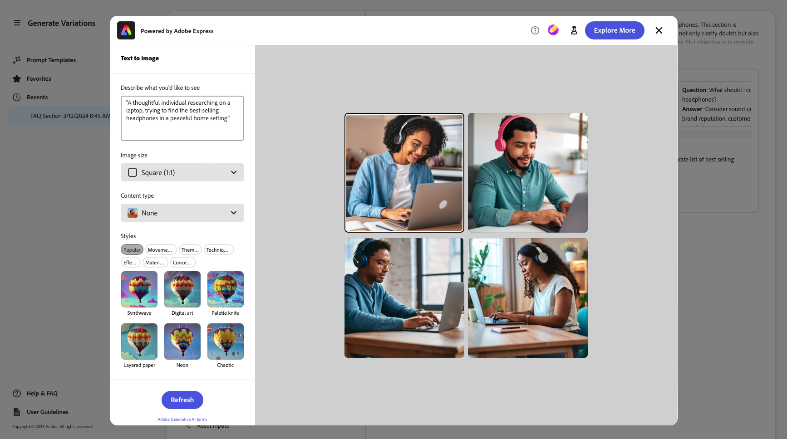

You can make further changes:

* [write your own prompt in Adobe Express](https://helpx.adobe.com/firefly/using/tips-and-tricks.html) by describing what you would like to see,
* adjust the **Text to image** options,
* then **Refresh** the generated images.

You can also use **Explore More** for further possibilities.

When complete, select the desired image and **Save** to close Adobe Express. The image is returned, and saved with the variation.


Here you can mouse-over the image to show action items for:

* **Copy**: [copy the image to the clipboard for use elsewhere](#use-content)
* **Edit**: open Adobe Express so that you can make changes to the image
* **Download**: download the image to your local machine
* **Delete**: remove the image from the variation

>[!NOTE]
>
>[Content credentials](https://helpx.adobe.com/creative-cloud/help/content-credentials.html) are not persisted when used in document-based authoring.

### Use Content {#use-content}

To use the content generated with generative AI, you must copy the content to the clipboard for use elsewhere.

This is done using the copy icons:

* For text: Use the copy icon visible on the variations panel
* For the image: mouse-over the image to see the copy icon

Once copied to the clipboard, you can paste the information for use when authoring content for your website. You can also run an [experiment](https://www.aem.live/docs/experimentation).

## Favorites {#favorites}

After reviewing the content you can save selected variations as favorites.

Once saved they are shown under **Favorites** in the left navigation. Favorites are persisted (until you **Delete** them, or clear the browser cache).

* Favorites and variations can be copy/pasted to the clipboard for use in your website content.
* Favorites can be **Removed**.

## Recents {#recents}

This section provides links to your recent activity. A **Recent** entry is added after you select **Generate**. It has the name of the prompt and a timestamp. If you select a link, it loads the prompt, populates the input fields as appropriate, and shows generated variations.

## Edit the Prompt {#edit-the-prompt}

The underlying prompt can be edited. You may want to do this:

* If the generated results that you are getting need further refinement
* You want to modify and [save the prompt](#save-prompt) for future use

Select **Edit Prompt**:

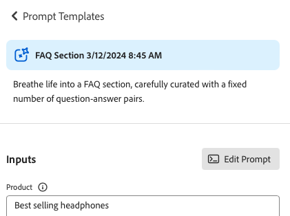

This opens the prompt editor, where you can make your changes:

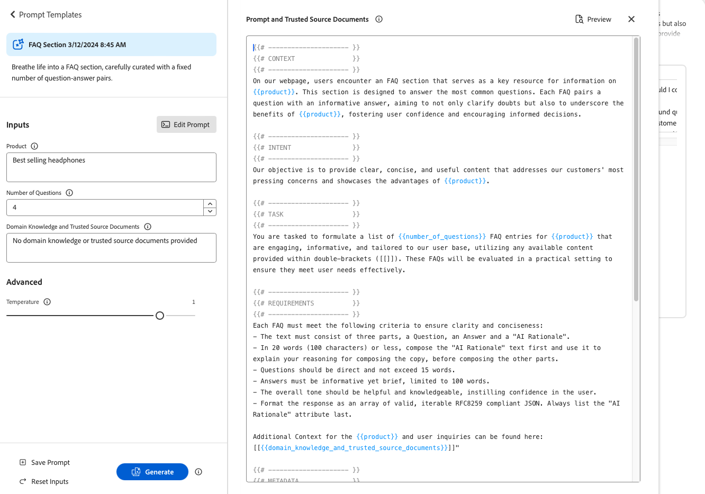

### Add Prompt Inputs {#add-prompt-inputs}

When creating or editing a prompt, you may want to add input fields. Input fields act as variables in the prompt and give the flexibility to use the same prompt in various scenarios. They allow users to define specific elements of the prompt, without having to write the entire prompt.

* A field is defined with double curly brackets `{{ }}` enclosing a placeholder name.
  For example, `{{tone_of_voice}}`.
  
  >[!NOTE]
  >
  >Spaces are not allowed between the double curly brackets.

* It is also defined under `METADATA`, with the following parameters:
  * `label`
  * `description`
  * `default`
  * `type`

#### Example: Add new text field - Tone of Voice {#example-add-new-text-field-tone-of-voice}

To add a new text field titled **Tone of Voice**, use the following syntax in your prompt:

```prompt
{{@tone_of_voice, 
  label="Tone of voice",
  description="Indicate the desired tone of voice",
  default="optimistic, smart, engaging, human, and creative",
  type=text
}}
```

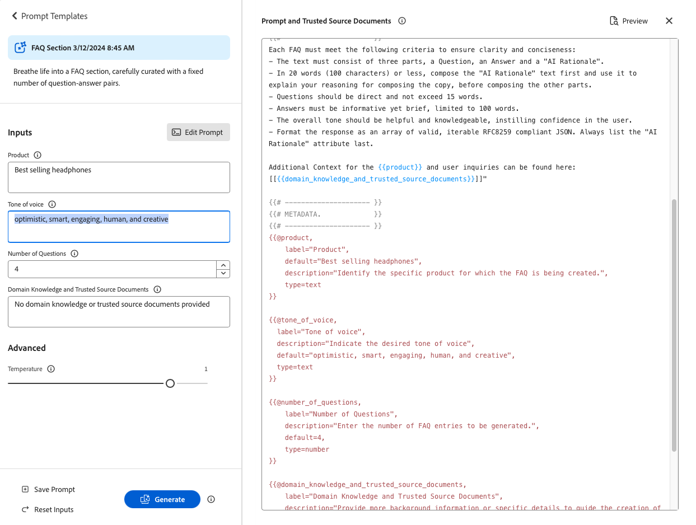

<!--
#### Example: Add new dropdown field - Page Type {#example-add-new-dropdown-field-page-type}

To create an input field Page Type providing a dropdown selection:

1. Create a spreadsheet named `pagetype.xls` in the top-level directory of your folder structure.
1. Edit the spreadsheet:

   1. Create two columns: **Key** and **Value**.
   1. In the **Key** column, enter labels that will appear in the dropdown.
   1. In the **Value** column, describe the key value so the generative AI has context.

1. In your prompt, refer to the title of the spreadsheet along with the appropriate type. 

   ```prompt
   {{@page_type, 
     label="Page Type",
     description="Describes the type of page",
     spreadsheet=pagetype
   }}
   ```
-->

## Create a prompt {#create-prompt}

When you select **New prompt** from **Prompt Templates**, a new panel will allow you to input a new prompt. You can then specify these, together with the **Temperature**, to **Generate** content.

See [Save Prompt](#save-prompt) for details of saving the prompt for future.

See [Add prompt inputs](#add-prompt-inputs) for details about adding your own prompt inputs.

If you would like to preserve formatting both in the UI, and when copied and pasted into the document based authoring flow, include the following in the prompt:

<!-- CHECK - are the double-quotes needed? -->

* `"Format the response as an array of valid, iterable RFC8259 compliant JSON"`

The following image shows the advantages of doing so:

* in the first example the `Title` and `Description` are combined
* while in the second example they are formatted separately: this has been done by including the JSON request in the prompt.


## Save Prompt {#save-prompt}

After editing or creating prompts, you may want to save them for future use; for either your IMS organization or yourself alone. The saved prompt will appear as a **Prompt Template** card.

When you have edited the prompt, the **Save** option is available at the bottom of the Inputs section, to the left of **Generate**.

When selected, the **Save Prompt** dialog opens:

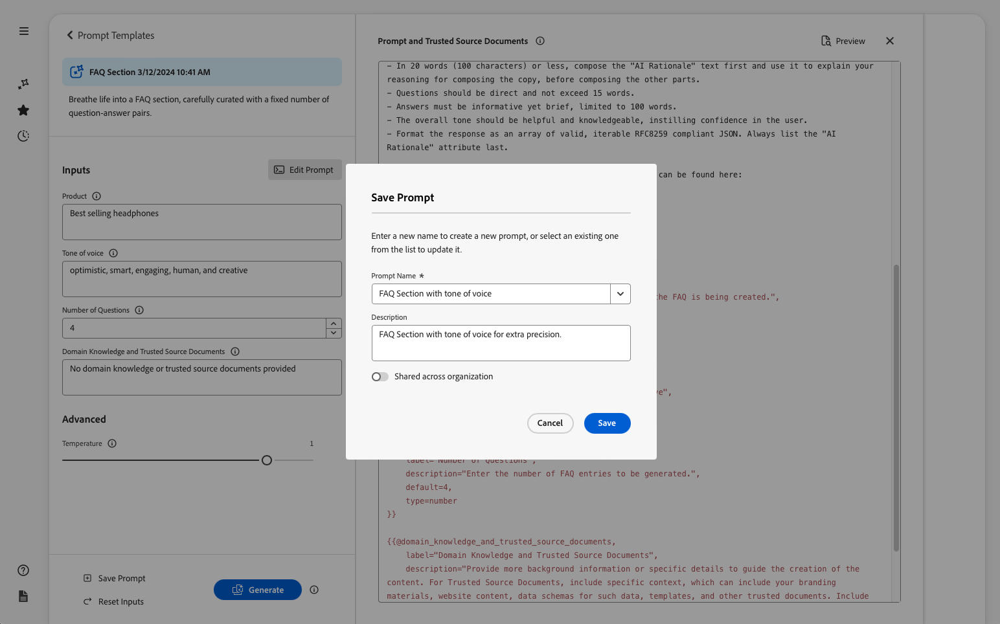

1. Add a unique **Prompt Name**; used to identify the prompt within **Prompt Templates**.
   1. A new, and unique, name creates a new prompt template.
   1. An existing name overwrites that prompt; a message is shown.
1. Optionally add a description.
1. Activate, or deactivate, the option **Shared across organization**, depending on whether the prompt should be private to you, or made available across your IMS organization. This status is shown in the [resulting card shown in the Prompt Templates](#select-prompt).
1. **Save** the prompt; or **Cancel** the action.

>[!NOTE]
>
>You are informed (warned) if you are overwriting/updating an existing prompt.

>[!NOTE]
>
>From **Prompt Templates** you can delete prompts (using the menu accessed with the ellipse) created by yourself, or within your IMS organization.

## Audiences {#audiences}

To generate personalized content the generative AI must have an understanding of the audience. Adobe provides a number of default audiences, or you can add your own.

When adding an audience, you should describe the audience in natural language. For example:

* to create an audience:
  * `Student`  
* you might say:
  * `The audience consists of students, typically individuals who are pursuing education at various academic levels, such as primary, secondary, or tertiary education. They are engaged in learning and acquiring knowledge in diverse subjects, seeking academic growth, and preparing for future careers or personal development.`

Two Audience Sources are supported:

* [Adobe Target](#audience-adobe-target)
* [CSV file](#audience-csv-file)

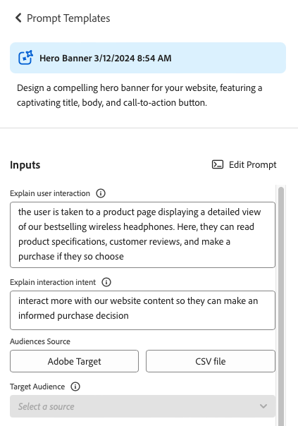

### Audience - Adobe Target {#audience-adobe-target}

Selecting an **Adobe Target** audience in the prompt allows for the generation of content to be personalized to that audience.

>[!NOTE]
>
>To use this option your IMS organization must have access to Adobe Target.

1. Select **Adobe Target**.
1. Then select the required **Target Audience**, from the list provided.

   >[!NOTE]
   >
   >To use an **Adobe Target** audience the description field must be filled in. If not, the audience shows in the drop down list as unavailable. To add a description, go to Target and [add an audience description](https://experienceleague.adobe.com/en/docs/target-learn/tutorials/audiences/create-audiences).

   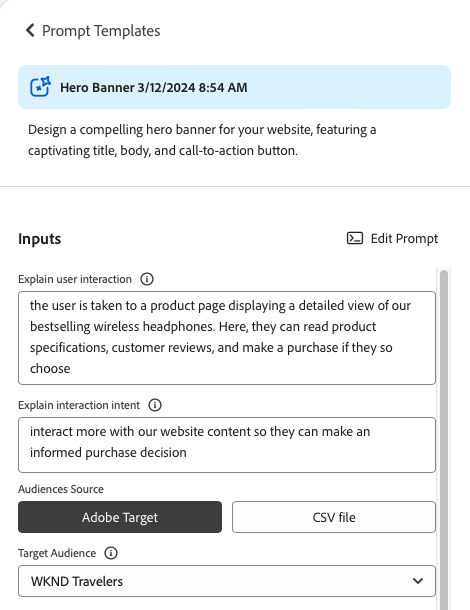

#### Add Adobe Target Audience {#add-adobe-target-audience}

See [Create audiences](https://experienceleague.adobe.com/en/docs/target-learn/tutorials/audiences/create-audiences) to create an audience in Adobe Target.

### Audience - CSV file {#audience-csv-file}

Selecting a **CSV file** audience in the prompt allows for the generation of content to be personalized to the selected **Target Audience**.

Adobe provides a number of audiences to use.

1. Select **CSV file**.
1. Then select the required **Target Audience**, from the list provided.

   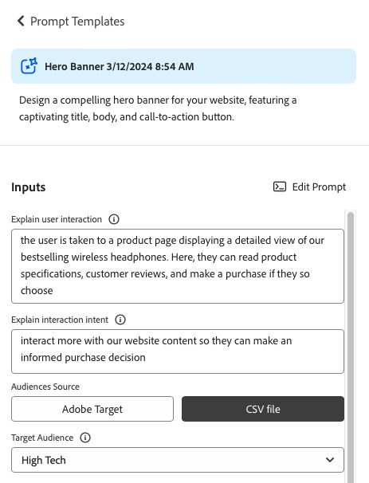

#### Add Audience CSV file {#add-audience-csv-file}

You can add a CSV file from various platforms (for example, Google Drive, DropBox, Sharepoint) that have the capability to provide a URL to the file once it is made publicly available.

>[!NOTE]
>
>In the share platforms you *must* have the ability to make the file publicly accessible.

For example, to add an audience from a file on Google Drive:

1. In Google Drive, create a spreadsheet file with two columns:
   1. First column will show in the dropdown.
   1. Second column will be the audience description.
1. Publish the file:
   1. File -> Share -> publish to web -> CSV
1. Copy the URL to the published file.
1. Go to Generate Variations.
1. Open the Prompt Editor.
1. Find **Adobe Target** audience in the metadata and replace the URL.

   >[!NOTE]
   >
   >Ensure that the double quotation marks (") are kept on both ends of the URL.

   For example:

   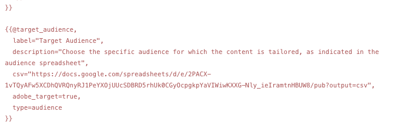

## Generative Action Usage {#generative-action-usage}

Usage management depends on the action taken:

* Generate Variations

  One generation of a copy variant is equal to one generative action. As a customer, you have a certain number of generative actions that come with your AEM license. Once the base entitlement is consumed, you have the ability to purchase additional actions.

  >[!NOTE]
  >
  >See [Adobe Experience Manager: Cloud Service | Product Description](https://helpx.adobe.com/legal/product-descriptions/aem-cloud-service.html) for further details about base entitlements, and reach out to your account team if you would like to purchase more generative actions.

* Adobe Express

  Image generation usage is handled through Adobe Express entitlements and [generative credits](https://helpx.adobe.com/firefly/using/generative-credits-faq.html).

## Access Generate Variations {#access-generate-variations}

After fulfilling the prerequisites you can access Generate Variations from AEM as a Cloud Service or the Sidekick of the Edge Delivery Services.

### Access Prerequisites {#access-prerequisites}

To use Generate Variations you must ensure that the prerequisites are fulfilled:

* [Access to Experience Manager as a Cloud Service with Edge Delivery Services](#access-to-aemaacs-with-edge-delivery-services)

#### Access to Experience Manager as a Cloud Service with Edge Delivery Services{#access-to-aemaacs-with-edge-delivery-services}

Users who need access to Generate Variations must be entitled to an Experience Manager as a Cloud Service environment with Edge Delivery Services. 

>[!NOTE]
>
>If your contract for AEM Sites as a Cloud Service does not include Edge Delivery Services, you will need to sign a new contract to get access. 
>
>You should reach out to your Account Team to discuss how you can move to AEM Sites as a Cloud Service with Edge Delivery Services.

To grant access to specific users, assign their user account to the respective product profile. See [Assigning AEM Product Profiles for further details](/help/journey-onboarding/assign-profiles-cloud-manager.md).

### Access from AEM as a Cloud Service {#access-aemaacs}

Generate Variations can be accessed from the [Navigation Panel](/help/sites-cloud/authoring/basic-handling.md#navigation-panel) of AEM as a Cloud Service:


### Access from the AEM Sidekick {#access-aem-sidekick}

Some configuration is needed before you can access Generate Variations from the Sidekick (of Edge Delivery Services).

1. See the document [Installing the AEM Sidekick](https://www.aem.live/docs/sidekick-extension) for how to install and configure the Sidekick.

1. To use the Generate Variations in the Sidekick (of Edge Delivery Services), include the following configuration in your Edge Delivery Services projects under:

   * `tools/sidekick/config.json` 

   This must be merged into your existing configuration and then deployed.

   For example:

   ```prompt
   {
     // ...
     "plugins": [
       // ...
       {
         "id": "generate-variations",
         "title": "Generate Variations",
         "url": "https://experience.adobe.com/aem/generate-variations",
         "passConfig": true,
         "environments": ["preview","live", "edit"],
         "includePaths": ["**.docx**"]
       }
       // ...
     ]
   }
   ```

1. You may then need to ensure that users have [Access to Experience Manager as a Cloud Service with Edge Delivery Services](#access-to-aemaacs-with-edge-delivery-services).

1. You can then access the feature, by selecting **Generate Variations** from the toolbar of the Sidekick:

   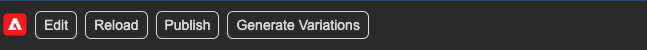

## Further Information {#further-information}

For further information you can also read:

* [GenAI Generate Variations on GitHub](https://github.com/adobe/aem-genai-assistant#setting-up-aem-genai-assistant)
* [Edge Delivery Services Experimentation](https://www.aem.live/docs/experimentation)

## FAQs {#faqs}

### Formatted Output {#formatted-outpu}

**The generated response isn't giving me the formatted output that I need. How do I modify the format? ex: I need a title and a sub-title but, the response is just title**

1. Open the actual prompt in edit mode.
1. Go to requirements.
1. You will find requirements that talk about the output.
   1. Example:  "The text must consist of three parts, a title, a body and a button label." or "Format the response as a valid JSON array of objects with attributes "Title", "Body", and "ButtonLabel".
1. Modify the requirements to fit your needs.

   >[!NOTE]
   >
   >If you have word/character count restrictions on the new output entered, create a requirement.

   Example: "The title text must not exceed 10 words or 50 characters, including spaces."
1. Save the prompt for future use.

### Length of Response {#length-of-response}

**The generated response is too long or too short. How do I change the length?**

1. Open the actual prompt in edit mode.
1. Go to requirements.
1. You will find that for each output, there is a corresponding word/character limit.
   1. Example:  "The title text must not exceed 10 words or 50 characters, including spaces."
1. Modify the requirements to fit your needs.
1. Save the prompt for future use.

### Improve responses {#improve-responses}

**The responses I'm getting aren't exactly what I'm looking for. What can I do to improve them?**

1. Try changing the Temperature under Advanced settings.
   1. A higher temperature strays from the prompt and leads to more variation, randomness, and creativity.
   1. A lower temperature is more deterministic and adheres to what is in the prompt.
1. Open the actual prompt in edit mode and review prompt. Pay special attention to the requirements section that describes the tone of voice and other important criteria.

### Comments in a prompt {#comments-in-prompt}

**How can I use comments in a prompt?**

Comments in a prompt are used to include notes, explanations, or instructions that are not meant to be part of the actual output. These comments are encapsulated within a specific syntax: they start and end with double curly braces and begin with a hash (for example, `{{# Comment Here }}`). Comments help clarify the prompt structure or intent without affecting the generated response.

### Find a shared prompt {#find-a-shared-prompt}

**What can I do if I cannot find a prompt template that someone has shared?**

In this situation there are various details to check:

1. Use the URL for your environment.
   For example, https://experience.adobe.com/#/aem/generate-variations
1. Ensure the selected IMS organization is correct.
1. Confirm the prompt was saved as Shared.

### Custom prompts in v2.0.0 {#custom-prompts-v200}

**In v.2.0.0 my custom prompts have disappeared - what can I do?**

Moving to the v2.0.0 release will cause custom prompt templates to break - so they will be unavailable.

To retrieve them:

1. Go to the prompt-template folder in Sharepoint.
1. Copy the prompt.
1. Open the Generate Variations application.
1. Select the New Prompt card.
1. Paste the prompt.
1. Verify that the prompt works.
1. Save the prompt.

## Release History {#release-history}

For details of the current, and previous, releases see the [Release Notes for Generate Variations](/help/generative-ai/release-notes-generate-variations.md)  
