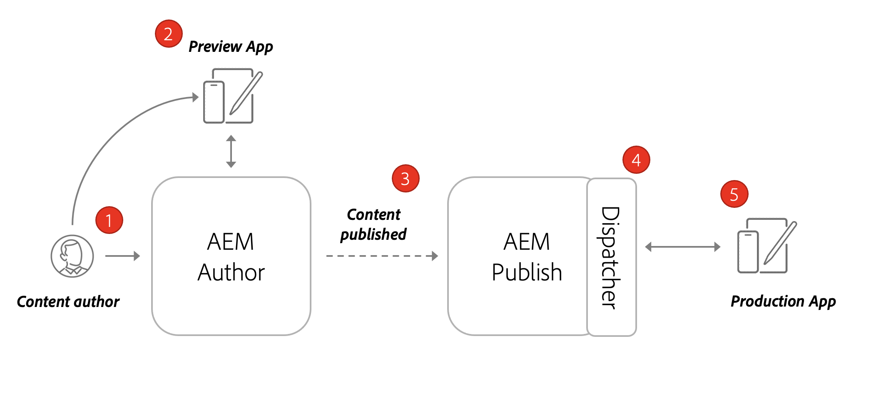
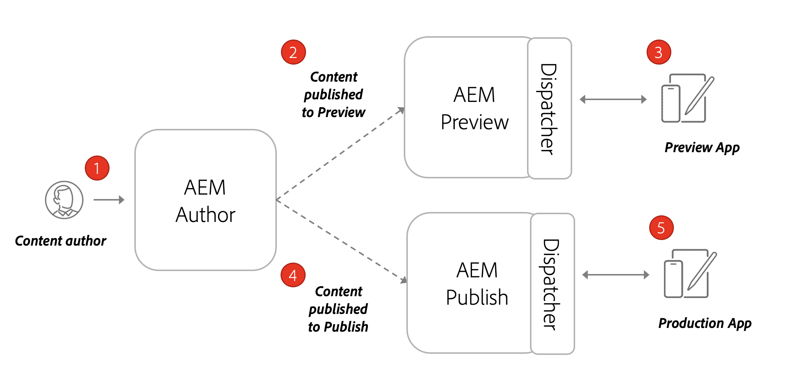

# Architecture of AEM Headless

A typical AEM environment is made up of an Author Service, Publish Service and an optional Preview Service.

* **The Author service** is where internal users create, manage, and preview content.

* **The Publish service** is considered the “Live” environment and is typically what end users interact with. Content, after being edited and approved on the Author service, is distributed to the Publish service. The most common deployment pattern with AEM headless applications is to have the production version of the application connect to an AEM Publish service.

* **The Preview service** is functionally the same as the **Publish Service**. However it is made available only to internal users. This makes it an ideal system for approvers to review upcoming content changes before being made live to end users.

* **The Dispatcher** is a static web server augmented with the AEM dispatcher module. It provides caching capabilities and another layer of security. The **Dispatcher** sits in front of the **Publish** and **Preview** services.

Within an AEM as a Cloud Service Program you can have multiple environments, Dev, Stage and Prod. Each environment would have its own unique **Author**, **Publish**, and **Preview** services. See [Managing Environments](/help/implementing/cloud-manager/manage-environments.md) to learn more.

## Author Publish Model

The most common deployment pattern with AEM headless applications is to have the production version of the application connect to an AEM Publish service.

The diagram above depicts this common deployment pattern.

1. A **Content author** uses the AEM Author service to create, edit, and manage content.
1. The **Content author** and other internal users can preview the content directly on the Author service. A Preview version of the application can be set up that connects to the Author service.
1. Once content has been approved, it can be published to the AEM Publish service.
1. The **Dispatcher** is a layer in front of the **Publish** service that can cache certain requests and provides a layer of security.
1. End users interact with the Production version of the application. The Production application connects to the Publish service via the Dispatcher and uses the GraphQL APIs to request and consume content.

## Author Preview Publish Deployment

Another option for headless deployments is to incorporate an **AEM Preview** service. With this approach content can be published first to the **Preview** service and a preview version of the headless application can connect to it. The advantage with this approach is that the **Preview** service can be set up with the same authentication requirements and permissions as the **Publish** service, making it easier to simulate the production experience.

1. A **Content author** uses the AEM Author service to create, edit, and manage content.
1. Content is first published to the AEM Preview service. 
1. A Preview version of the application can be set up that connects to the Preview service.
1. Once content has been reviewed and approved, it can be published to the AEM Publish service.
1. End users interact with the Production version of the application. The Production application connects to the Publish service via the Dispatcher and uses the GraphQL APIs to request and consume content.
