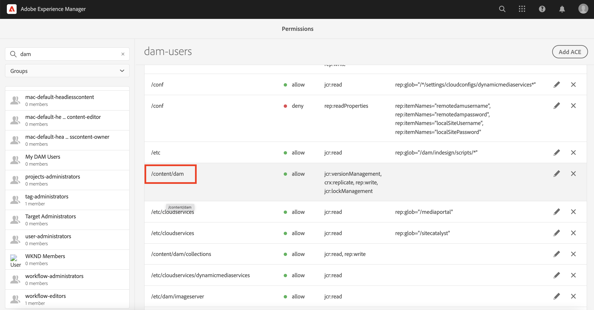
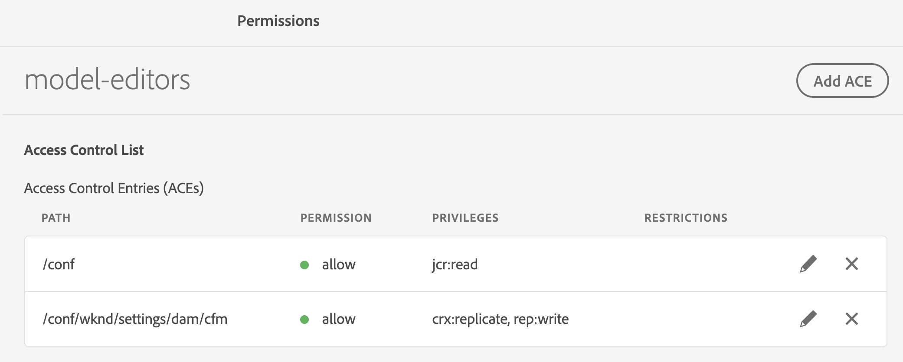
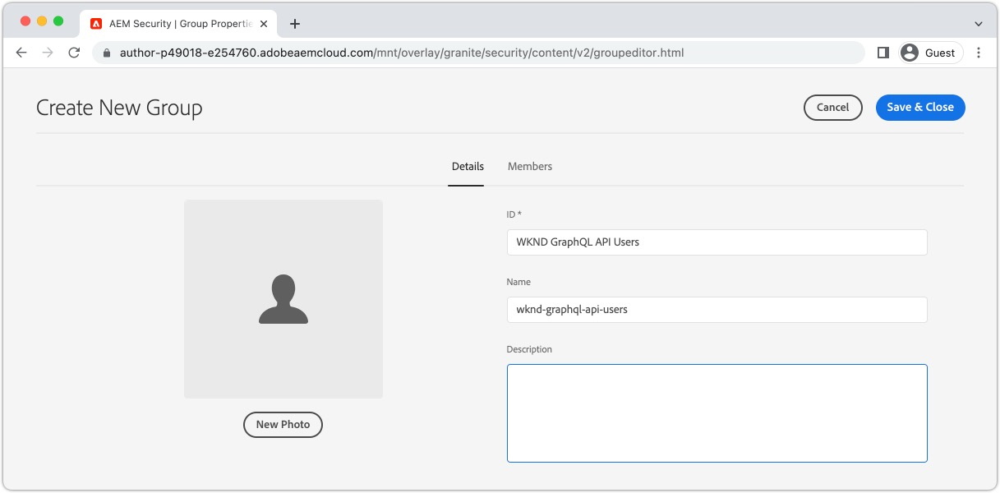
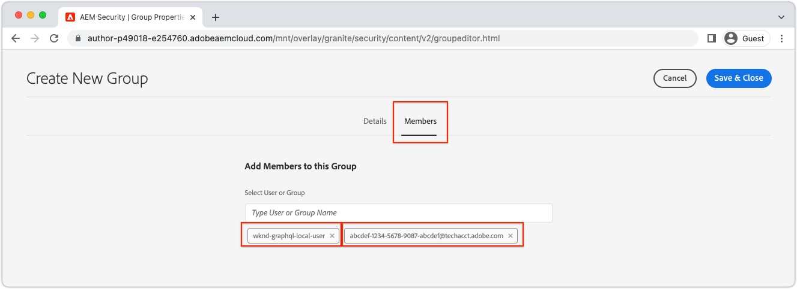
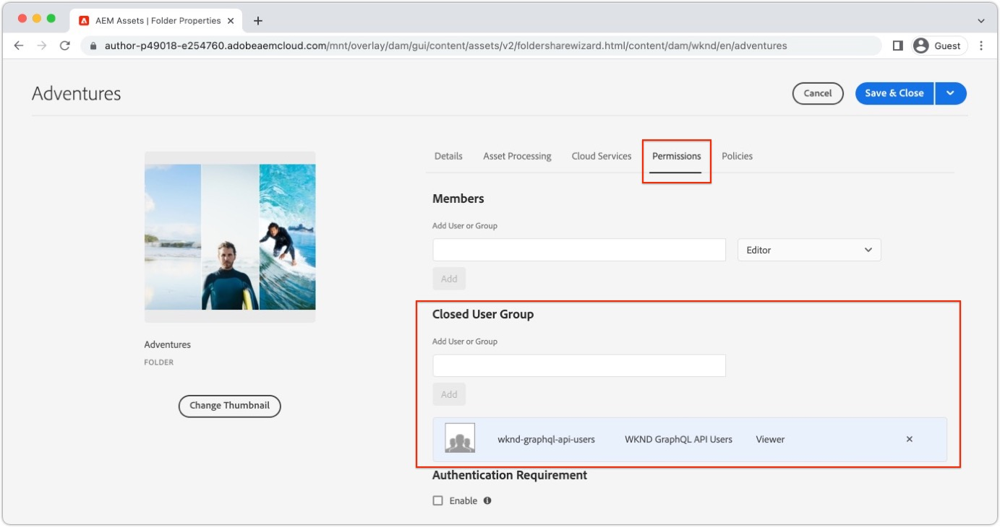

# Permission considerations for headless content

With a headless implementation, there are several areas of security and permissions that should be addressed. Permissions and personas can broadly be considered based on the AEM environment **Author** or **Publish**. Each environment contains different personas and with different needs.

## Author Service Considerations

The Author service is where internal users create, manage, and publish content. Permissions revolve around the different personas who manage content.

### Manage permissions at the Group level

As a best practice, permissions should be set on Groups in AEM. Also known as local groups, these groups can be managed within the AEM author environment. 

The easiest way to manage group membership is to use Adobe Identity Management System (IMS) groups and assign [IMS groups to local AEM groups](https://experienceleague.adobe.com/docs/experience-manager-cloud-service/content/security/ims-support.html?lang=en#managing-permissions-in-aem). 

At a high level, the process is:

1. Add IMS Users to a new or existing IMS User group using the [Admin Console](https://adminconsole.adobe.com/)
1. IMS Groups are synced with AEM when users login.
1. Assign IMS groups to AEM Groups.
1. Set permissions on AEM Groups. 
1. When users log in to AEM and are authenticated via IMS, they inherit the permissions of the AEM group.

>[!TIP]
>
> A detailed video walkthrough of managing IMS and AEM users and groups can be found [here](https://experienceleague.adobe.com/docs/experience-manager-learn/cloud-service/accessing/overview.html).

To manage **groups** in AEM, navigate to **Tools** > **Security** > **Groups**.

To manage permissions of groups in AEM, navigate to **Tools** > **Security** > **Permissions**.

### DAM Users

"DAM", in this context, stands for Digital Asset Management. The **DAM Users** is an out of the box group in AEM that can be used for "everyday" users that manage digital assets and Content Fragments. This group provides permissions to **view**, **add**, **update**, **delete**, and **publish** Content Fragments and all other files in AEM Assets.

If using IMS for group membership, add the appropriate IMS Groups as members of the **DAM Users** group. Members of the IMS group inherit the permissions of the DAM Users group when logging into the AEM environment.

#### Customizing DAM Users Group

It is best not to modify permissions of an out of the box group directly. Instead, you can also create your own group(s) modeled after the **DAM Users** group permissions and further restrict access to different **folders** within AEM Assets.

For more granular permissions use the **Permissions** console in AEM and update the path from `/content/dam` to a more specific path, i.e `/content/dam/mycontentfragments`.

It may be desirable to give this group of users permissions to create and edit content fragments but not **delete**.  To permissions for edit but not delete [follow this guide](/help/assets/content-fragments/content-fragments-delete.md).

### Model editors

The ability to modify **Content Fragment Models** should be left to administrators or a **small group** of users with elevated permissions. Modifying the Content Fragment Model has many downstream effects. 

>[!CAUTION]
>
>Modifications to Content Fragment Models alter the underlying GraphQL API that headless applications rely on.

If you wish you to create a group that manages Content Fragment Models but not full administrator access, you can create a group with the following access control entries:

| Path | Permission | Privileges|
|-----| -------------| ---------|
|`/conf`| **allow**    | `jcr:read` |
| `/conf/<config-name>/settings/dam/cfm` | **allow** | `rep:write`, `crx:replicate` |

For example below a group named **model-editors** is given permission to modify the WKND Content Fragment Models:

## Publish Service Permissions

The Publish service is considered the “live” environment and is typically what GraphQL API consumers interact with. Content, after being edited and approved on the Author service, is published to the Publish service. The headless application then consumes the approved content from the Publish service via GraphQL APIs.

By default content exposed via AEM Publish service's GraphQL endpoints are accessible to everyone, including unauthenticated users. 

### Content permissions

Content exposed via AEM's GraphQL APIs can be restricted using [Closed User Groups (CUGs)](https://experienceleague.adobe.com/docs/experience-manager-learn/assets/advanced/closed-user-groups.html) set on assets folders, which specify which AEM User Groups (and their members) can access the contents of the Assets folders.

Assets CUGs work by: 

+ First, denying all access to the folder and subfolders
+ Then, allowing read access to the folder and subfolders for all AEM User Groups that are listed in the CUGs' list

CUGs can be set up on asset folders containing content exposed via GraphQL APIs using the following steps:

#### Select the authentication scheme{#publish-permissions-users}

The [AEM Headless SDK](https://github.com/adobe/aem-headless-client-js#create-aemheadless-client) supports two types of authentication:

1. Service credentials bound to a single technical account AEM User that authenticate via access token.
    1. To obtain the AEM as a Cloud Service access token, [follow these instructions](https://experienceleague.adobe.com/docs/experience-manager-learn/getting-started-with-aem-headless/authentication/service-credentials.html?lang=en).
1. Local AEM users that authenticate via Basic Authentication
    1. Log into AEM Author as a __User Administrator__ (or __Administrator__)
    1. Navigate to __Tools > Security > Users__
    1. Create a AEM user that is used to access the GraphQL endpoints
       1. Store the __ID__ and __Password__ some place safe, as they authenticate the HTTP requests the GraphQL APIs via Basic Authentication.
    1. __Save__ the changes to create the user
    1. Select the new user, and then select __Activate__

#### Create an AEM User Group{#publish-permissions-groups}

Access to assets folders on AEM Publish should be controlled via User Groups, rather than user directly. Create (or reuse) an AEM User Group that grants access to assets folders containing content exposed by GraphQL APIs.

1. Log into AEM Author as a __User Administrator__ (or __Administrator__)
1. Navigate to __Tools > Security > User Groups__
1. Create (or edit) an AEM User Group whose members can access the content via GraphQL API
    
1. Add the AEM user (determined in [Select the authentication scheme to use with AEM GraphQL APIs](#publish-permissions-users) section above) to this AEM User Group's  __Members__ list
    
1. __Save__ the changes to create the AEM User Group
1. Select the new AEM User Group, and then select __Activate__

### Restrict content to User Groups using CUGs

1. Log into AEM Author as a __DAM user__ (or __Administrator__)
1. Navigate to __Assets > Files__ 
1. Locate the folder whose content must only be accessible to the [AEM user](#publish-permissions-user-type)
1. Select the folder and select __Properties__
1. Select the __Permissions__ tab
1. Add the [AEM User Group](#publish-permissions-groups) that should have access to the folder/sub-folders, to the __Closed User Groups__ list
    
    + When a Closed User Group is present, all other users' access to the folder is implicitly denied. Be careful when using CUGs if content is reused across channels, as CUGs may prevent other users from accessing the contents of these folders.
1. __Save__ the changes to the folder's properties.
1. Select the folder, and select __Quick Publish__ from the top action bar

#### Access the GraphQL API

HTTP requests providing the [appropriate authentication credentials](https://github.com/adobe/aem-headless-client-js#create-aemheadless-client) to the AEM Publish service's GraphQL API endpoints include content the credentials are authorized to read, and anonymously accessible content. Other consumers of the GraphQL API cannot read the content in the CUGs-protected folders.

