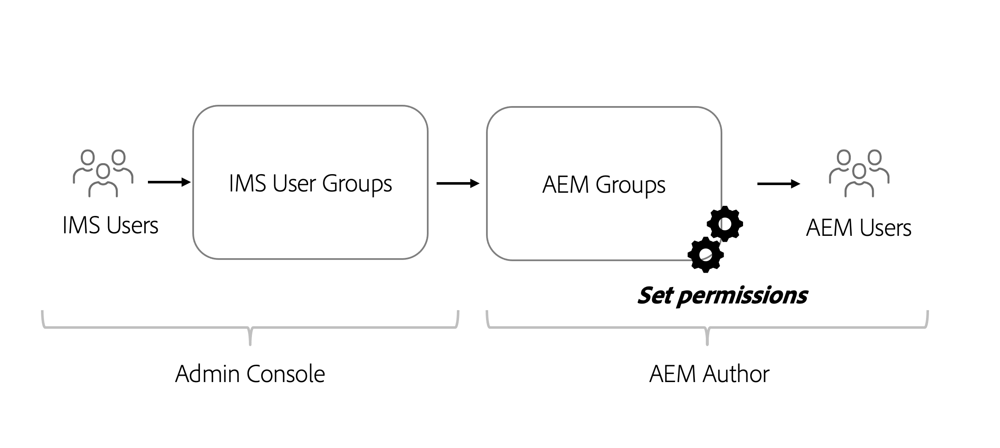

# Permission considerations for headless content

With a headless implementation, there are several areas of security and permissions that should be addressed. Permissions and personas can broadly be considered based on the AEM environment **Author** or **Publish**. Each environment contains different personas and with different needs.

## Author Service Considerations

The Author service is where internal users create, manage, and publish content. Permissions revolve around the different personas who manage content.

### Manage permissions at the Group level

As a best practice, permissions should be set on Groups in AEM. Also known as local groups, these groups can be managed within the AEM author environment. 

The easiest way to manage group membership is to use Adobe Identity Management System (IMS) groups and assign [IMS groups to local AEM groups](https://experienceleague.adobe.com/docs/experience-manager-cloud-service/content/security/ims-support.html#managing-permissions-in-aem). 

At a high level, the process is:

1. Add IMS Users to a new or existing IMS User group using the [Admin Console](https://adminconsole.adobe.com/)
1. IMS Groups are synced with AEM when users login.
1. Assign IMS groups to AEM Groups.
1. Set permissions on AEM Groups. 
1. When users log in to AEM and are authenticated via IMS, they inherit the permissions of the AEM group.

>[!TIP]
>
>For a detailed video walkthrough of managing IMS and AEM users and groups see [Configuring access to AEM as a Cloud Service ](https://experienceleague.adobe.com/docs/experience-manager-learn/cloud-service/accessing/overview.html).

To manage **groups** in AEM, navigate to **Tools** > **Security** > **Groups**.

To manage permissions of groups in AEM, navigate to **Tools** > **Security** > **Permissions**.

### DAM Users

"DAM", in this context, stands for Digital Asset Management. The **DAM Users** is an out of the box group in AEM that can be used for "everyday" users that manage digital assets and Content Fragments. This group provides permissions to **view**, **add**, **update**, **delete**, and **publish** Content Fragments and all other files in AEM Assets.

If using IMS for group membership, add the appropriate IMS Groups as members of the **DAM Users** group. Members of the IMS group inherit the permissions of the DAM Users group when logging into the AEM environment.

#### Customizing DAM Users Group

It is best not to modify permissions of an out of the box group directly. Instead, you can also create your own group(s) modeled after the **DAM Users** group permissions and further restrict access to different **folders** within AEM Assets.

For more granular permissions use the **Permissions** console in AEM and update the path from `/content/dam` to a more specific path, that is, `/content/dam/mycontentfragments`.

It may be desirable to give this group of users permissions to create and edit content fragments but not delete. To review and assign permissions for edit, but not delete see [Content Fragments - Delete Considerations](/help/sites-cloud/administering/content-fragments/delete-considerations.md).

### Model editors

The ability to modify **Content Fragment Models** should be left to administrators or a **small group** of users with elevated permissions. Modifying the Content Fragment Model has many downstream effects. 

>[!CAUTION]
>
>Modifications to Content Fragment Models alter the underlying GraphQL API that headless applications rely on.

If you want you to create a group that manages Content Fragment Models but not full administrator access, you can create a group with the following access control entries:

| Path | Permission | Privileges|
|-----| -------------| ---------|
|`/conf`| **allow**    | `jcr:read` |
| `/conf/<config-name>/settings/dam/cfm` | **allow** | `rep:write`, `crx:replicate` |

## Publish Service Permissions

The Publish service is considered the “live” environment and is typically what GraphQL API consumers interact with. Content, after being edited and approved on the Author service, is published to the Publish service. The headless application then consumes the approved content from the Publish service via GraphQL APIs.

By default content exposed via AEM Publish service's GraphQL endpoints are accessible to everyone, including unauthenticated users. 

### Content permissions

Content exposed via AEM's GraphQL APIs can be restricted using [Closed User Groups (CUGs)](https://experienceleague.adobe.com/docs/experience-manager-learn/assets/advanced/closed-user-groups.html) set on assets folders, which specify which AEM User Groups (and their members) can access the contents of the Assets folders.

Assets CUGs work by: 

* First, denying all access to the folder and subfolders
* Then, allowing read access to the folder and subfolders for all AEM User Groups that are listed in the CUGs' list

CUGs can be set up on asset folders containing content exposed via GraphQL APIs. Access to assets folders on AEM Publish should be controlled via User Groups, rather than user directly. Create (or reuse) an AEM User Group that grants access to assets folders containing content exposed by GraphQL APIs.

#### Select the authentication scheme{#publish-permissions-users}

The [AEM Headless SDK](https://github.com/adobe/aem-headless-client-js#create-aemheadless-client) supports two types of authentication:

* [Token based authentication](/help/implementing/developing/introduction/generating-access-tokens-for-server-side-apis.md) using service credentials bound to a single technical account.
* Basic Authentication using AEM users.

### Access the GraphQL API

HTTP requests providing the [appropriate authentication credentials](https://github.com/adobe/aem-headless-client-js#create-aemheadless-client) to the AEM Publish service's GraphQL API endpoints include content the credentials are authorized to read, and anonymously accessible content. Other consumers of the GraphQL API cannot read the content in the CUGs-protected folders.
