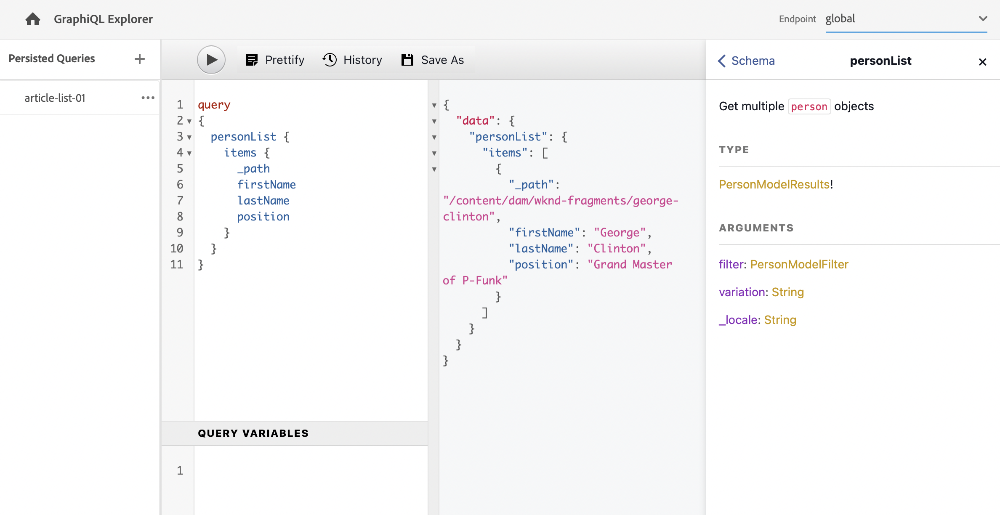

# Create an API Request - Headless Setup {#accessing-delivering-content-fragments}

Learn how to use the GraphQL API for headless delivery of Content Fragment content and AEM's Assets REST API to manage Content Fragments.

## What are GraphQL and Assets REST APIs? {#what-are-the-apis}

[Now that you have created some content fragments](create-content-fragment.md), you can use AEM's APIs to deliver them headlessly.

* [The GraphQL API](/help/headless/graphql-api/content-fragments.md) lets you create requests to access and deliver Content Fragments. This API offers the most robust set of capabilities for querying and consuming Content Fragment content.
   * To use the API, [define and enable endpoints in AEM](/help/headless/graphql-api/graphql-endpoint.md), and if necessary, the [GraphiQL interface installed](/help/headless/graphql-api/graphiql-ide.md).
* [The Assets REST API](/help/assets/content-fragments/assets-api-content-fragments.md) lets you create and modify Content Fragments (and other assets).

>[!NOTE]
>
>The [Content Fragment and Content Fragment Model OpenAPIs](/help/headless/content-fragment-openapis.md) are also available.

The remainder of this guide focuses on GraphQL access and Content Fragment delivery.

## Enable GraphQL Endpoint {#enable-graphql-endpoint}

Before the GraphQL APIs can be used, a GraphQL endpoint must be created.

1. Navigate to **Tools**, **General**, then select **GraphQL**.
1. Select **Create**.
1. The **Create new GraphQL Endpoint** dialog box opens. Here you can specify:
   * **Name**: name of the endpoint; you can enter any text.
   * **Use GraphQL schema provided by**: use the drop-down list to select the required configuration.
1. Confirm with **Create**.
1. In the console, a **Path** is displayed based on the configuration created earlier. This path is used to run GraphQL queries.

    ```
    /content/cq:graphql/<configuration-name>/endpoint
    ```

For more details about enabling GraphQL endpoints see [Manage GraphQL endpoints in AEM](/help/headless/graphql-api/graphql-endpoint.md).

## Query content using GraphQL with GraphiQL

Information architects design queries for their channel endpoints to deliver content. Consider these queries only once per endpoint, per model. For the purposes of this getting started guide, you only must create one.

GraphiQL is an IDE, included in your AEM environment; it is accessible/visible after you [configure your endpoints](#enable-graphql-endpoint). 

1. Log into AEM as a Cloud Service and access the GraphiQL interface:

   You can access the query editor from either: 

   * **Tools** > **General** > **GraphQL Query Editor**
   * directly; for example, `http://localhost:4502/aem/graphiql.html`

1. The GraphiQL IDE is an in-browser query editor for GraphQL. You can use it to build queries to retrieve Content Fragments to deliver them headlessly as JSON.
   * The drop-down top-right lets you select the endpoint.
   * A far-left panel lists the persisted queries (when available)
   * The middle-left panel lets you build your query.
   * The middle-right panel displays the results.
   * The query editor features code completion and hotkeys to easily execute the query.

   

1. Assuming that the model you created was called `person` with fields `firstName`, `lastName`, and `position`, you can build a simple query to retrieve the content of the Content Fragment.

   ```text
   query 
   {
     personList {
       items {
         _path
         firstName
         lastName
         position
       }
     }
   }
   ```

1. Enter the query into the left panel.
   

1. Click the **Execute Query** button or use the `Ctrl-Enter` hotkey and the results are displayed as JSON in the right panel.
   

1. In the upper-right corner of the page, click the **Docs** link to show in-context documentation so you can build your queries that adapt to your own models.
   

GraphQL enables structured queries that can target not only specific data sets or individual data objects, but can also deliver specific elements of the objects, nested results, offers support for query variables, and much more.

GraphQL can avoid iterative API requests and over-delivery, and instead allows for bulk delivery of exactly what is needed for rendering as a response to a single API query. The resulting JSON can be used to deliver data to other sites or apps.

## Next Steps {#next-steps}

That's it! You now have a basic understanding of headless content management in AEM. There are many more resources where you can dive deeper for a comprehensive understanding of the features available.

* **[Content Fragments](/help/sites-cloud/administering/content-fragments/managing.md)** - For details about creating and managing Content Fragments
* **[Content Fragments Support in AEM Assets HTTP API](/help/assets/content-fragments/assets-api-content-fragments.md)** - For details on accessing AEM content directly over the HTTP API, via CRUD operations (Create, Read, Update, Delete)
* **[GraphQL API](/help/headless/graphql-api/content-fragments.md)** - For details on how to deliver Content Fragments headlessly

>[!NOTE]
>
>The [Content Fragment and Content Fragment Model OpenAPIs](/help/headless/content-fragment-openapis.md) are also available.
