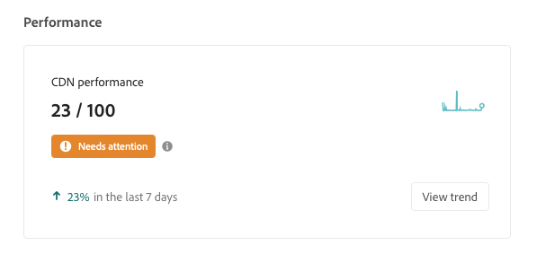
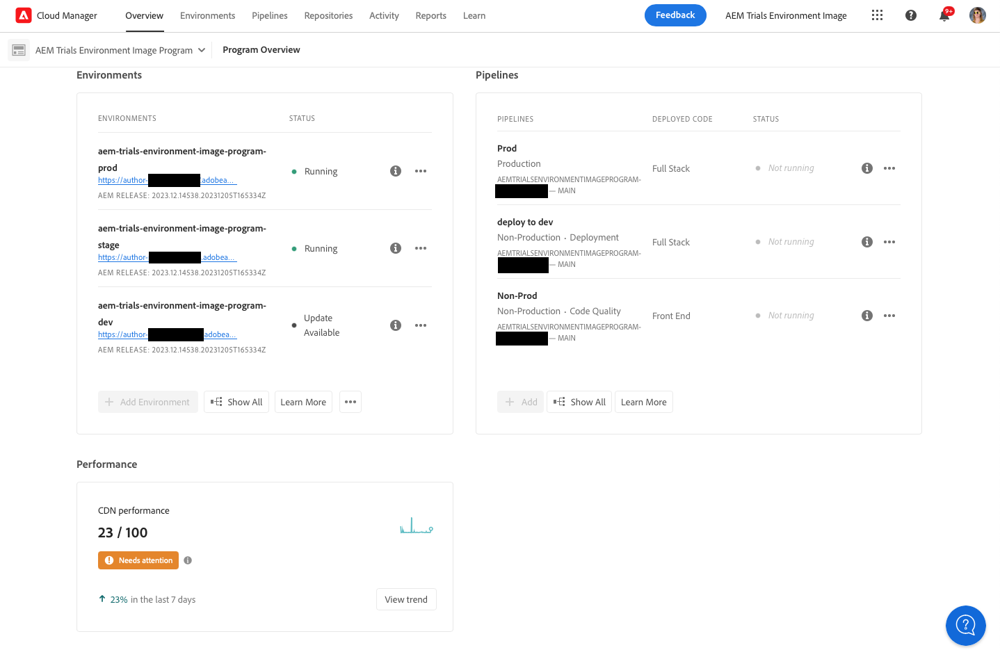
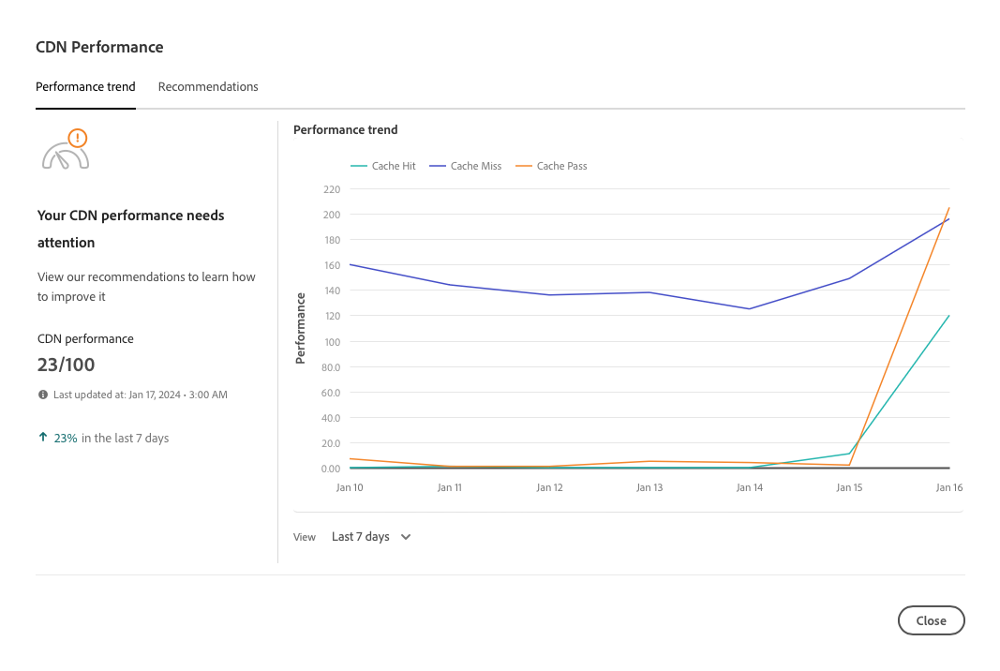
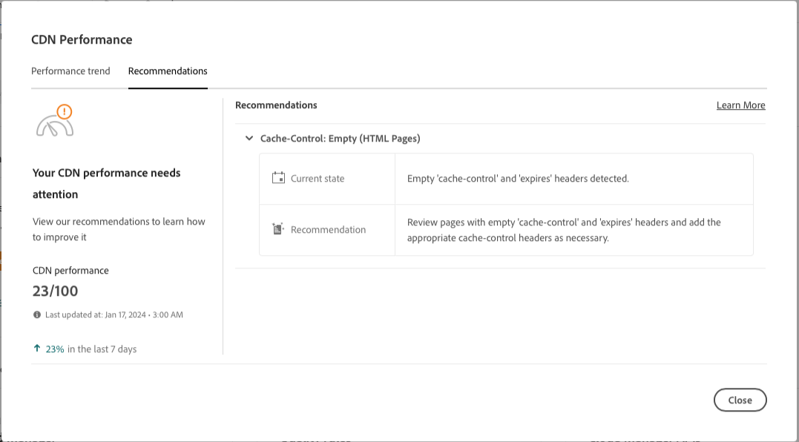

# CDN Performance dashboard {#cdn-performance}

Understand how Cloud Manager evaluates content delivery network (CDN) performance and what you can learn from the dashboard.

## Overview {#overview}

Every Cloud Manager program has a CDN performance dashboard. This dashboard presents an overall score for CDN performance along with trends, alerts, and suggestions for improvement as necessary.



## Access the dashboard {#accessing}

The CDN dashboard is available on the overview page of every program.

1. Log into Cloud Manager at [my.cloudmanager.adobe.com](https://my.cloudmanager.adobe.com/) and select the appropriate organization.

1. On the **[My Programs](/help/implementing/cloud-manager/navigation.md#my-programs)** console, click the program whose CDN dashboard you want to view.

   

1. On the **Program Overview** page of your program, scroll down below the **Environments** and **Pipelines** cards to see the **Performance** card.

   

## Use the dashboard {#using}

The dashboard presents an overall score for CDN performance along with trends, alerts, and suggestions for improvement as necessary.


For details on your CDN performance and for suggestions on how to improve it, click **View trend**.



Click **View** below the chart to change the time span of the chart.

For suggestions on how to improve your CDN performance, select the **Recommendations** tab.



Click the chevron next to any recommendation in the list to view details about what steps to take to improve and the cause of the issue.

## Cache hit definition {#cache-hit}

The cache hit ratio is a measurement of how many content requests a cache can fill successfully, compared to how many requests it receives. The higher a cache-hit ratio, the better performing a CDN is.

>[!TIP]
>
>Adobe recommends that users aim for a cache hit ratio of 99%. 

```text
Cache Hit Ratio = Cache Hits / (Hits + Misses + Passes + Other)
```

* **Hit** - Data is requested from the cache, and it is found.
* **Miss** - Data is requested from the cache, and it is not found.
* **Pass** - Data is requested from the cache, and it is set not to cache this data in any case.
* **Other** - All data requests from the cache that do not match any other case.

Cache metrics are updated every 24 hours.

>[!TIP]
>
>For more details on how Cloud Manager and the CDN interact with the Dispatcher, see [Caching in AEM as a Cloud Service](/help/implementing/dispatcher/caching.md).
