# Configuring your CI-CD Pipeline {#configure-ci-cd-pipeline} 

In Cloud Manager, there are two types of Pipeline:

* **Production Pipeline**:
  
  A Production Pipeline can only be added once a production and stage environment set is created. 
  
  Refer to [Setting up Production Pipeline](configure-pipeline.md#setting-up-the-pipeline) for more details.

* **Non-Production Pipeline**:

  A Non-Production Pipeline can be added from the **Overview** page from the Cloud Manager's user interface. 
  
  Refer to [Non-Production & Code Quality Only Pipelines](configure-pipeline.md#non-production-pipelines) for more details.

>[!NOTE]
>To configure your pipeline, you must:
> * define the trigger that will start the pipeline.
> * define the parameters controlling the production deployment.
> * configure the performance test parameters.

## Setting up Production Pipeline {#setting-up-production-pipeline}

The Deployment Manager is responsible for setting up the Production Pipeline.

>[!NOTE]
>A Production Pipeline cannot be setup until a program creation is complete, Git repository has at least one branch, and a Production and Stage environment set is created.

Before you start to deploy your code, you must configure your pipeline settings from the [!UICONTROL Cloud Manager].

>[!NOTE]
>
>You can change the pipeline settings after initial set up.

## Configuring the Pipeline Settings from [!UICONTROL Cloud Manager] {#configuring-the-pipeline-settings-from-cloud-manager}

Once you have setup your program and have at least one environment using [!UICONTROL Cloud Manager] UI, you are ready to setup your deployment pipeline.

Follow these steps to configure the behavior and preferences for your pipeline:

1. Click **Setup Pipeline** to setup and configure your pipeline.

   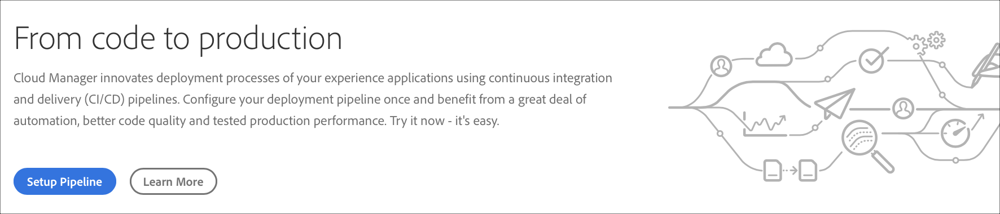

1. The **Setup Pipeline** screen displays. Select the branch and click **Next**.

    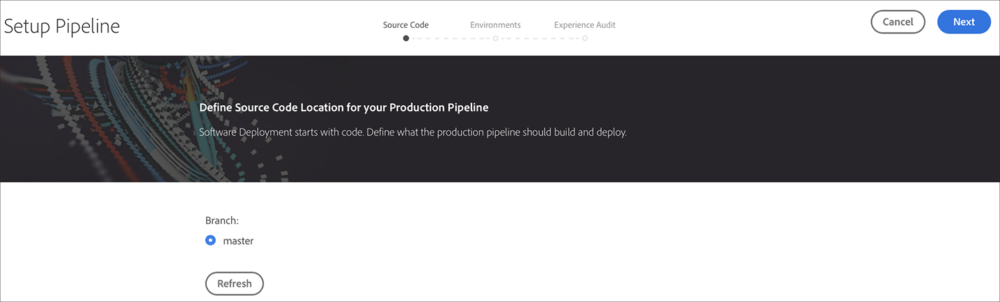

1. Configure your deployment options.

   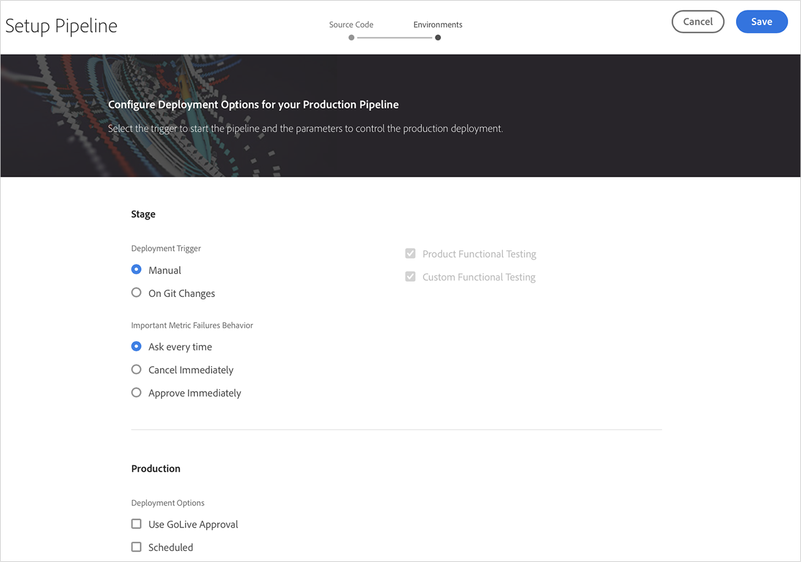

   You can define the trigger to start the pipeline:

    * **Manual** - using the UI manually start the pipeline.
    * **On Git Changes** - starts the CI/CD pipeline whenever there are commits added to the configured git branch. Even if you select this option, you can always start the pipeline manually.  

    During pipeline setup or edit, the Deployment Manager has the option of defining the behavior of the pipeline when an important failure is encountered in any of the quality gates.

   This is useful for customers who have the desire for more automated processes. The available options are:

   * **Ask every time** - This is the default setting and requires manual intervention on any Important failure.
   * **Cancel Immediately** - If selected, the pipeline will be cancelled whenever an Important failure occurs. This is essentially emulating a user manually rejecting each failure.
   * **Approve immediately** - If selected, the pipeline will proceed automatically whenever an Important failure occurs. This is essentially emulating a user manually approving each failure.
    
1. The production pipeline settings includes a third tab labeled as **Experience Audit**. This option provides a table for the URL paths that should always be included in the Experience Audit. 

   >[!NOTE]
   >You must click on **Add New Page** to define your own custom link.

    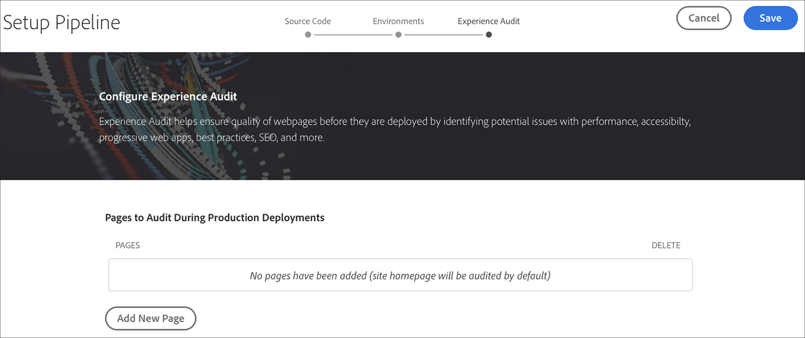 

   Click **Add New Page** to provide a URL path to be included in the Experience Audit.

   For instance, if you would like to include `https://wknd.site/us/en/about-us.html` in the Experience Audit, enter the path `us/en/about-us.html` in this field and click **Save**.

   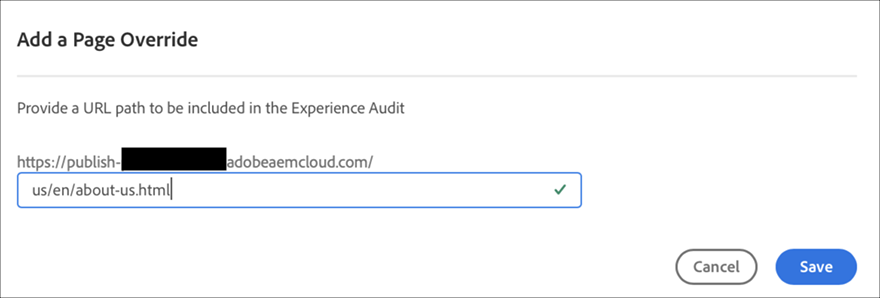

   The URL that appears in the table will be:
   
   `https://publish-p14253-e43686.adobeaemcloud.com/us/en/about-us.html`

   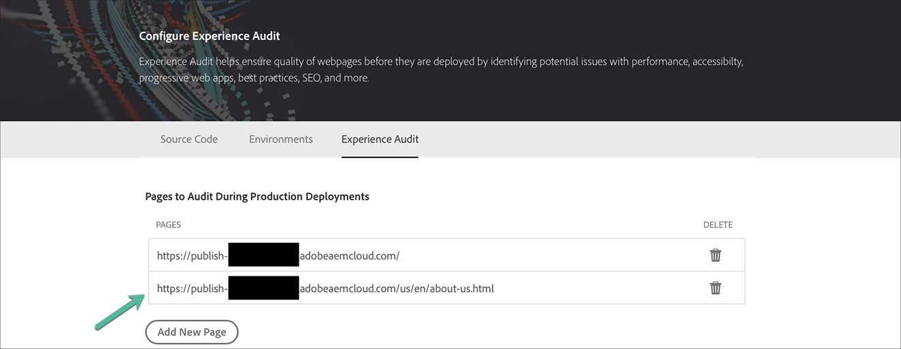

   A maximum of 25 rows can be included. If there are no pages submitted by the user in this section, the homepage of the site will be included in the Experience Audit by default.
 
   Refer to [Understanding Experience Audit Results](/help/implementing/cloud-manager/experience-audit-testing.md) for more details.

    >[!NOTE]
    > The pages that are configured will be submitted to the service and evaluated according to the performance, accessibility, SEO (Search Engine Optimization), best practice, and PWA (Progressive Web App) tests. 
    
1. Click **Save** from the **Edit Pipeline** screen. The **Overview** page now displays the **Deploy your Program** card. Click **Deploy** button to deploy your program.

   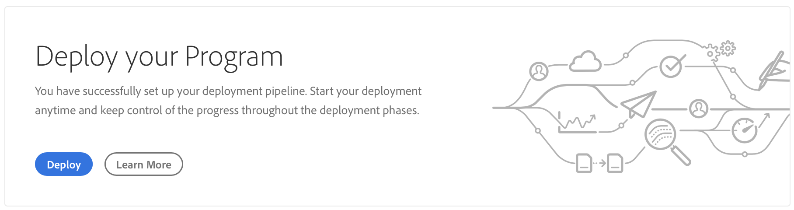
   
### Editing a Production Pipeline {#editing-prod-pipeline}

You can edit the pipeline configurations from the **Program Overview** page. 

Follow the steps below to edit the configured pipeline:

1. Navigate to **Pipelines** card from the **Program Overview** page.

1. Click on **Edit** from the **Pipelines** card.

   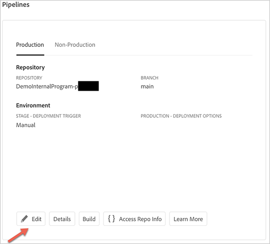

1. The **Source Code** tab allows you to update the repository. Click on **Access Repo Info** to update the repository.

   >[!NOTE]
   >See [Adding and Managing Repositories](/help/implementing/cloud-manager/managing-code/cloud-manager-repositories.md) to learn how to add and manage repositories in Cloud Manager.

   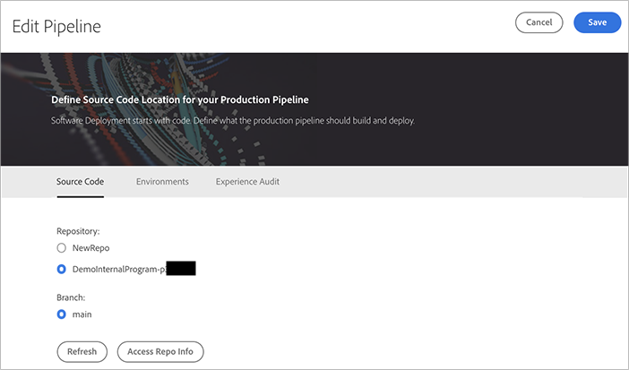

1. The **Environments** tab allows you to update the stage and production options.

   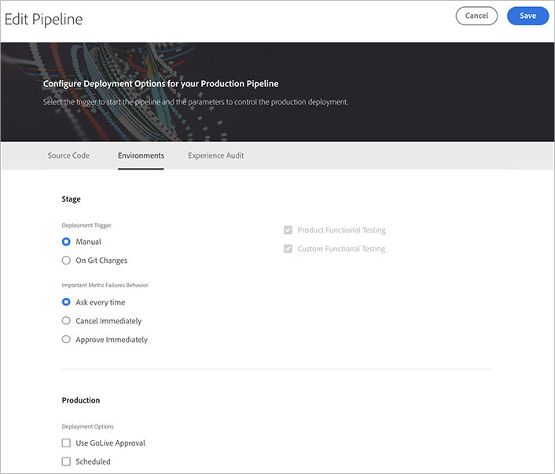

1. The **Experience Audit** option allows you to update or add new pages.

   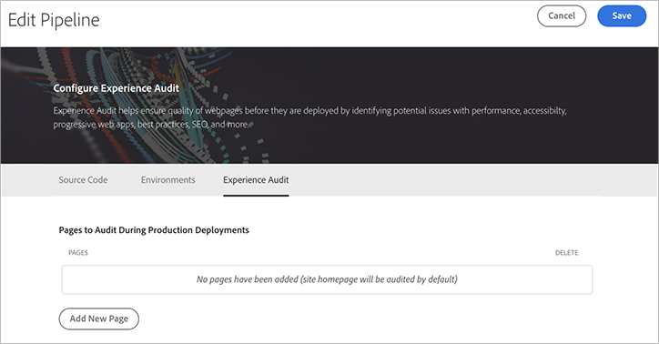

1. Click on **Save** once you are done editing the pipeline.

## Non-Production & Code Quality Only Pipelines {#non-production-pipelines}

In addition to the main pipeline which deploys to stage and production, customers are able to set up additional pipelines, referred to as **Non-Production Pipelines**. These pipelines always execute the build and code quality steps. They can optionally also deploy to AEM as a Cloud Service environment.

On the home screen, these pipelines are listed in a new card:

1. Access the **Non-Production Pipelines** tile from the Cloud Manager home screen.

   

1. Click on the **Add** button, to specify the Pipeline Name, Pipeline Type, and the Git Branch.

   Additionally, you can also set up Deployment Trigger and Important Failure Behavior from Pipeline Options.

   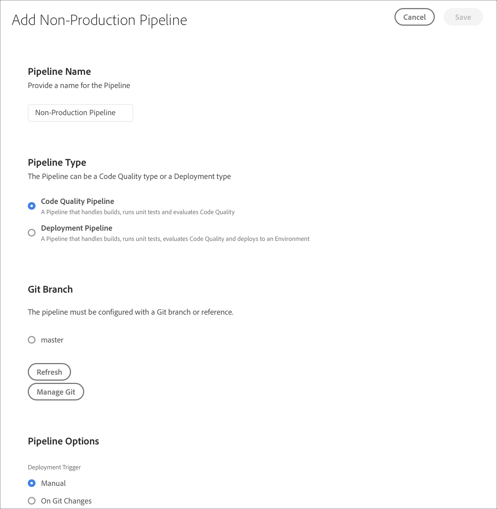

1. Click **Save** and the pipeline is shown on the card on the home screen with five actions, as shown below:

   
   
   * **Edit** - allows editing of the pipeline settings
   * **Details** - provides details of the pipeline execution
   * **Build** - navigates to the execution page, from which the pipeline can be executed
   * **Access Repo Info** - allows the user to get the information necessary to access Cloud Manager Git repository
   * **Learn More** - navigates to understanding the CI/CD pipeline documentation resource. 

### Editing a Non-Production Pipeline {#editing-nonprod-pipeline}

You can edit the pipeline configurations from the **Program Overview** page. 

Follow the steps below to edit the configured non-production pipeline:

1. Navigate to **Pipelines** card from the **Program Overview** page.

1. Select the **Non-Production** tab and click on **Edit** after selecting the desired pipelines.

   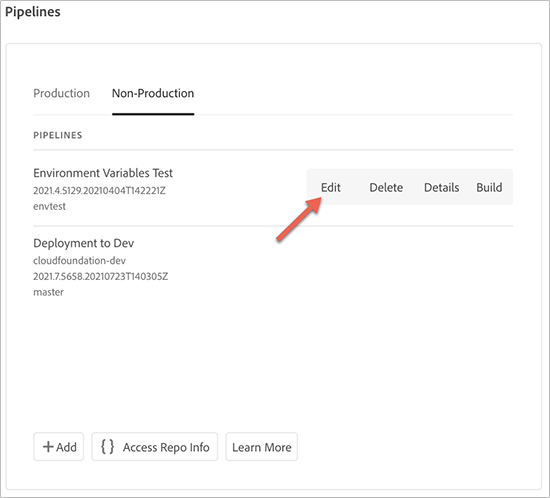

1. Select the desired repository and other required updates and click on **Save**.

   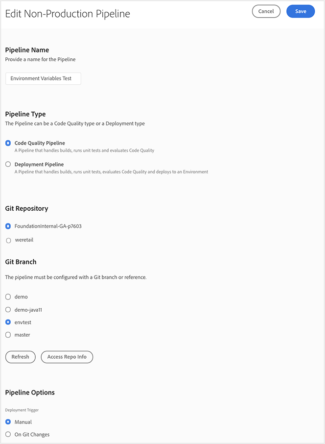

## The Next Steps {#the-next-steps}

Once you have configured the pipeline, you need to deploy your code.

Please see [Deploy your Code](deploy-code.md) for more details.
