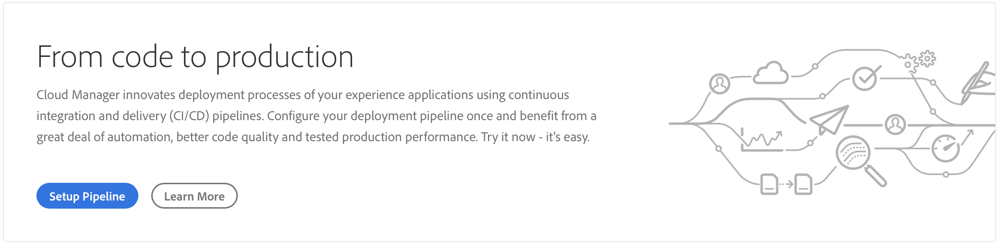
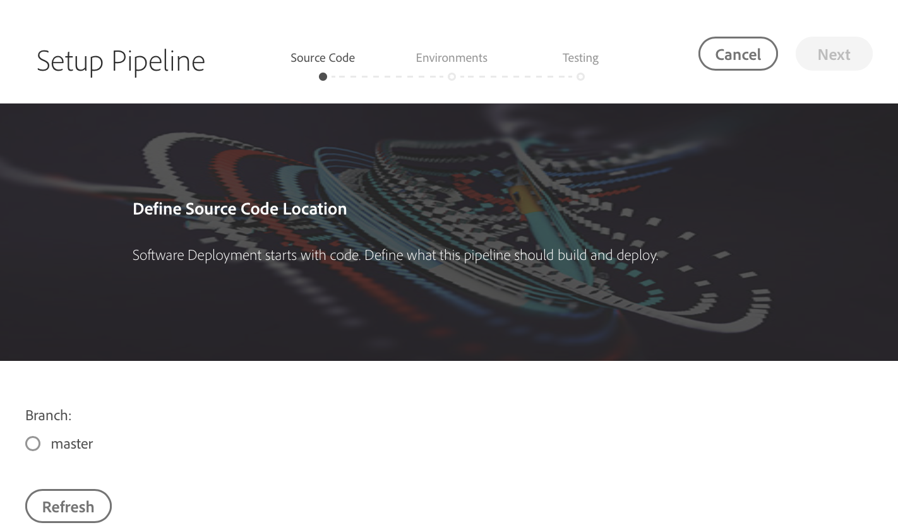
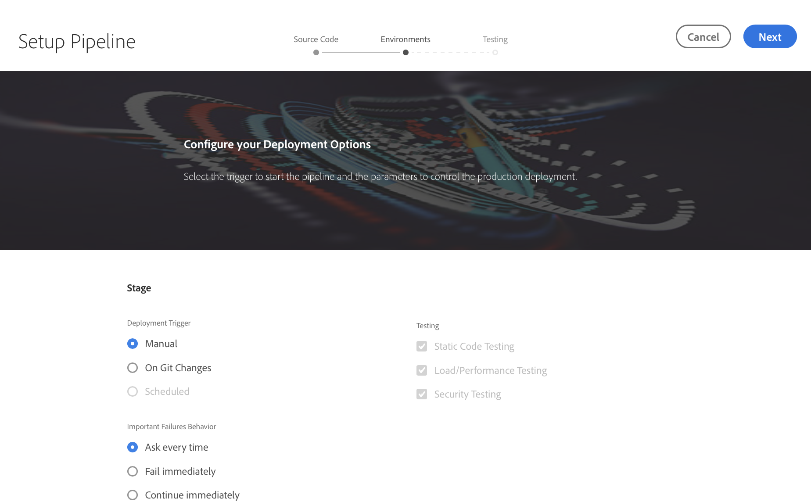
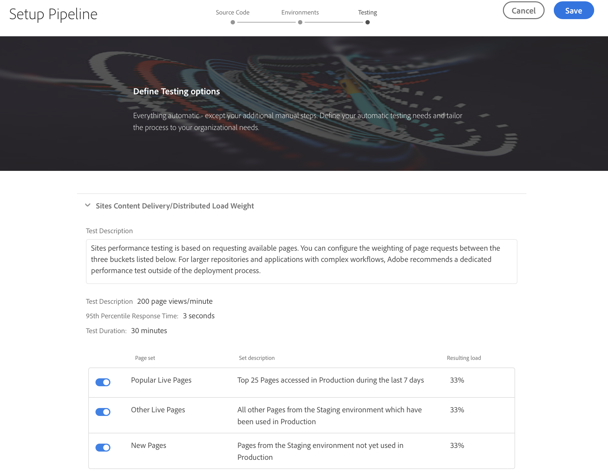
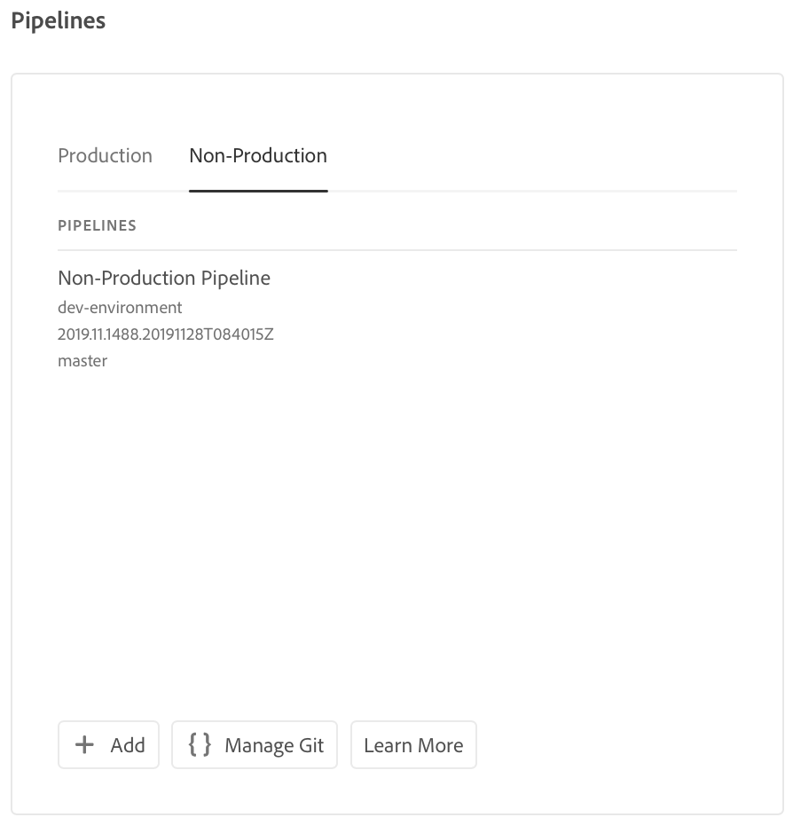
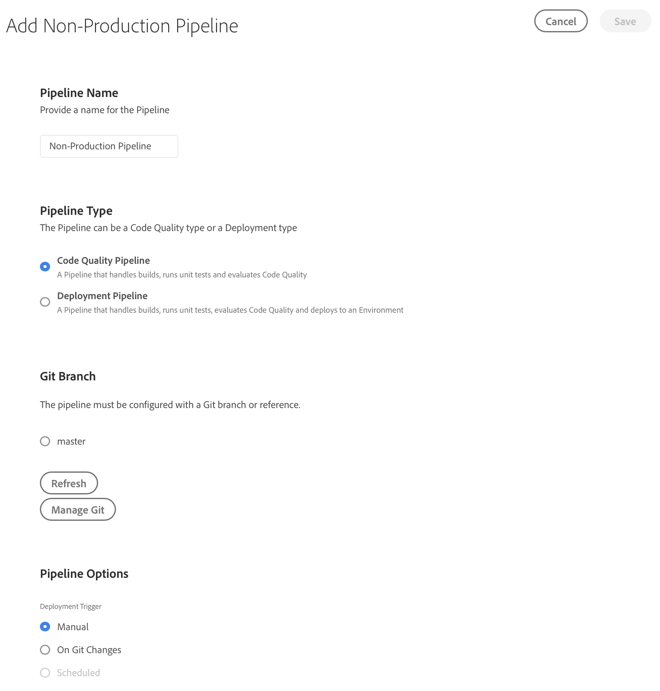
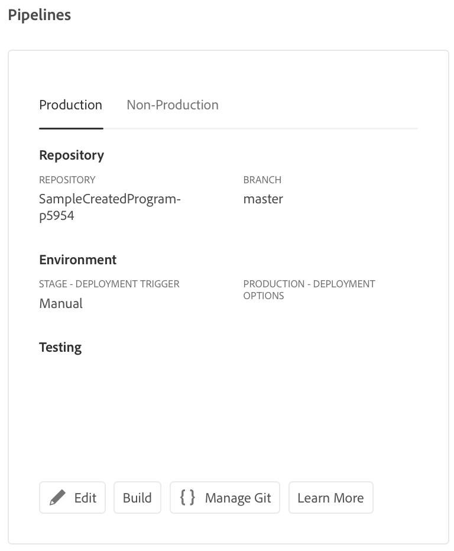

# Configure your CI-CD Pipeline {#configure-ci-cd-pipeline} 

## Understanding the Flow {#understanding-the-flow}

You can configure your pipeline from the **Pipeline Settings** tile in the [!UICONTROL Cloud Manager] UI.

The Deployment Manager is responsible for setting up the pipeline. When doing so, you first select a branch from the **Git Repository**. 

To configure your pipeline, the user must:

* define the trigger that will start the pipeline.
* define the parameters controlling the production deployment.
* configure the performance test parameters.

## Setting up the Pipeline {#setting-up-the-pipeline}

>[!CAUTION]
>
>The pipeline cannot be setup until one program creation is complete and the Git repository has at least one branch.

Before you start to deploy your code, you must configure your pipeline settings from the [!UICONTROL Cloud Manager].

>[!NOTE]
>
>You can change the pipeline settings after initial set up.

## Configuring the Pipeline Settings from [!UICONTROL Cloud Manager] {#configuring-the-pipeline-settings-from-cloud-manager}

Once you have setup your program and have at least one environment using [!UICONTROL Cloud Manager] UI, you are ready to setup your deployment pipeline.

Follow these steps to configure the behavior and preferences for your pipeline:

1. Click **Setup Pipeline** to setup and configure your pipeline.

   

1. The **Setup Pipeline** screen displays. Select the branch and click **Next**.

   

1. Configure your deployment options.

   

   You can define the trigger to start the pipeline:

    * **Manual** - using the UI manually start the pipeline.
    * **On Git Changes** - starts the CI/CD pipeline whenever there are commits added to the configured git branch. Even if you select this option, you can always start the pipeline manually.  

    During pipeline setup or edit, the Deployment Manager has the option of defining the behavior of the pipeline when an important failure is encountered in any of the quality gates.

   This is useful for customers who have the desire for more automated processes. The available options are:

   * **Ask every time** - This is the default setting and requires manual intervention on any Important failure.
   * **Fail immediately** - If selected, the pipeline will be cancelled whenever an Important failure occurs. This is essentially emulating a user manually rejecting each failure.
   * **Continue immediately** - If selected, the pipeline will proceed automatically whenever an Important failure occurs. This is essentially emulating a user manually approving each failure.
    
1. Click **Next** to access the **Testing** tab to define your testing criteria for your program.

   

1. Click **Save**. The *Overview* page now displays the **Deploy your Program** card. Click **Deploy** button to deploy your program.

   
   

## Non-Production & Code Quality Only Pipelines

In addition to the main pipeline which deploys to stage and production, customers are able to set up additional pipelines, referred to as **Non-Production Pipelines**. These pipelines always execute the build and code quality steps. They can optionally also deploy to Adobe Managed Services environment.

On the home screen, these pipelines are listed in a new card:

1. Access the **Non-Production Pipelines** tile from the Cloud Manager home screen.

   

1. Clicking on the **Add** button, to specify the Pipeline Name, Pipeline Type, and the Git Branch.

   Additionally, you can also set up Deployment Trigger and Important Failure Behavior from Pipeline Options.

   

1. Click **Save** and the pipeline is shown on the card on the home screen with three actions, as shown below:

   

   * **Edit** - allows editing of the pipeline settings
   * **Build** - navigates to the execution page, from which the pipeline can be executed
   * **Manage Git** - allows the user to get the information necessary to access Cloud Manager Git repository

## The Next Steps {#the-next-steps}

Once you have configured the pipeline, you need to deploy your code.

Please see [Deploy your Code](deploy-code.md) for more details.
