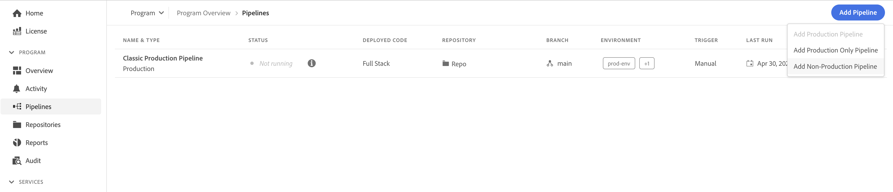
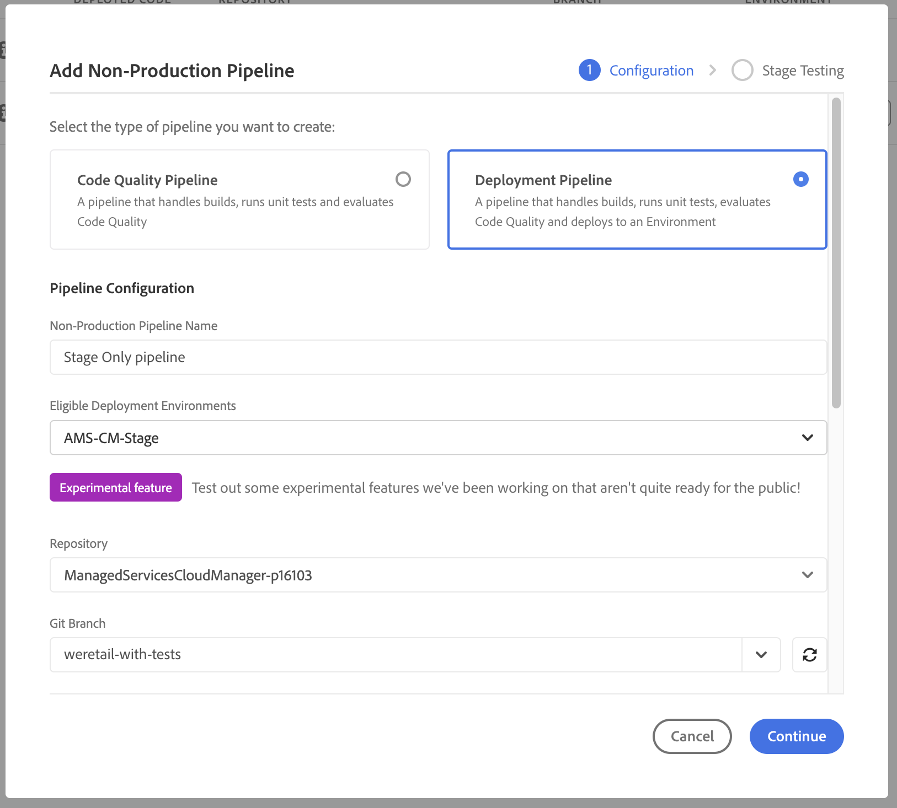
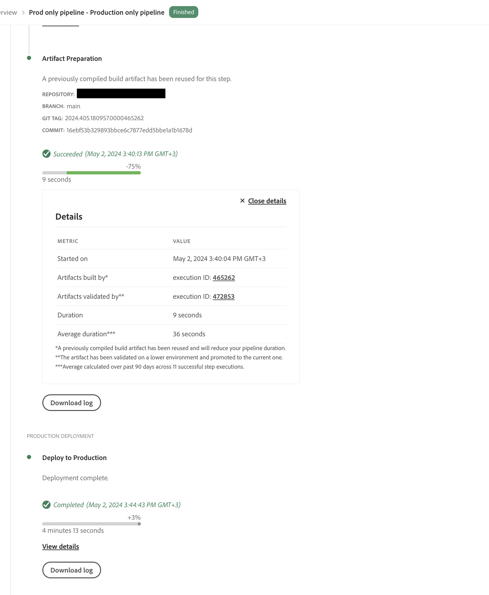

# Stage-Only and Production-Only Pipelines {#stage-prod-only}

Learn how you can split staging and production deployments using dedicated pipelines.

>[!NOTE]
>
>This feature is only available to [the early adopter program](/help/implementing/cloud-manager/release-notes/current.md#early-adoption).

## Overview {#overview}

Staging and production environments are tightly coupled. By default, deployments to them are linked to a singular pipeline. That is a deployment pipeline deploys to both the staging and production environments in that program. While this coupling is normally suitable, there are certain use cases where disadvantages are present:

* If you want to deploy to stage-only, you can only do this by rejecting the **Promote to Prod** step in the pipeline. However the execution will be marked as cancelled.
* If you want to deploy the latest code in a staging environment to production, you need to redeploy the entire pipeline including the staging deployment even though no code was changed there. 
* Since environments cannot be updated during deployments, if you want to pause and test in the staging environment for multiple days before promoting to production, the production environment can not be updated. This makes non-dependent tasks such as updating [environment variables](/help/implementing/cloud-manager/getting-access-to-aem-in-cloud/build-environment-details.md#environment-variables) impossible.

Stage-only and prod-only pipelines offer solutions to these use-cases by providing dedicated deployment options.

* **Stage-Only Deployment Pipelines** deploy only to a staging environment with the execution finishing once the deployment and tests are done.
  * A stage-only pipeline behaves identically to the standard coupled full stack prod pipeline but without the production deployment steps (approval, schedule, deploy).
* **Prod-Only Deployment Pipelines** deploy only to a production environment with the option to select an execution successfully finished and validated on stage and deploy its artifacts on prod.  
  * Prod-only pipelines will reuse the artifacts from the stage deployments, skipping the building phase.

Neither stage-only nor prod-only pipelines will be executed while a full-stack production pipeline is running and vice-versa. If both the stage-only and the full-stack production pipeline have the **On Git Changes** trigger configured and are pointing to the same branch and repository, only the stage-only pipeline is automatically started. Prod-only pipelines are not started **On Git Changes** since they are not directly linked to a repository.

These dedicated pipelines offer more flexibility, but please note the following details of operation and recommendations.

## Limitations {#limitations}

Prod-only pipelines will always use the artifacts from the stage-only pipeline, regardless of what may have been deployed on stage via the standard coupled production pipeline in the meantime.

* This could lead to unwanted code rollbacks.
* Adobe recommends to stop using the standard coupled production pipeline once you start using the prod-only and stage-only pipelines.
* If you still decide to run both the standard coupled pipelines and stage/prod-only pipelines, keep in mind the reuse of artifacts to avoid code rollbacks.

## Known Issues {#known-issues}

Please also note the following known issues before you begin testing this feature.

* Once you use production-only pipelines, you may not benefit from the latest AEM updates
  * In some cases, the AEM update process may revert your code back to the code that was last deployed via the full stack pipeline.
* You will not be able to request an [environment restore](/help/operations/restore.md#offsite-backup) if you use production-only or staging-only pipelines.

## Pipeline Creation {#pipeline-creation}

Prod-only and stage-only pipelines are created in a similar fashion to the standard coupled [production pipelines](/help/implementing/cloud-manager/configuring-pipelines/configuring-production-pipelines.md) and [non-production pipelines](/help/implementing/cloud-manager/configuring-pipelines/configuring-non-production-pipelines.md). See those documents for details.

1. In the **Pipelines** window, click **Add Pipeline**.

   * Select **Add Non-Production Pipeline** to create a stage-only pipeline.
   * Select **Add Production Only Pipeline** to create a prod-only pipeline.

   

>[!NOTE]
>
>Certain options may be grayed out if the corresponding pipelines already exist.
>
>* **Add Production Only Pipeline** will be unavailable if a stage-only pipeline does not yet exist.
>* **Add Production Pipeline** will be unavailable if a standard coupled pipeline already exists.
>* Only one prod-only and one stage-only pipelines are allowed per program.

### Stage-Only Pipelines {#stage-only}

1. Once you select the **Add Non-Production Pipeline** option, the **Add Non-Production Pipeline** dialog opens.
1. To create a stage-only pipeline, select the stage environment in the **Eligible Deployment Environments** field for your pipeline. Complete the remaining fields and click **Continue**.

   

1. On the **Stage Testing** tab, you can then define testing that should be performed on the staging environment. Tap or click **Save** to save your new pipeline.

### Prod-Only Pipelines {#prod-only}

1. When you select the **Add Production Only Pipeline** option, the **Add Production Only Pipeline** dialog box opens.
1. Provide a **Pipeline Name**. The remaining options and functionality of the dialog work the same as those in the standard coupled pipeline creation dialog. Click **Save** to save the pipeline.

## Running Prod-Only and Stage-Only Pipelines {#running}

Prod-only and stage-only pipelines are run in the same way as [all other pipelines are run](/help/implementing/cloud-manager/configuring-pipelines/managing-pipelines.md#running-pipelines). See that documentation for details.

In addition, a prod-only pipeline run can be triggered directly from the execution details of a stage-only pipeline.

### Stage-Only Pipelines {#stage-only-run}

A stage-only pipeline runs in nearly the same way as standard coupled pipelines. However at the end of the run, after the testing steps, a **Promote Build** button allows you to start a prod-only pipeline execution that uses the artifacts deployed on stage by this execution and deploys them on production.

The **Promote Build** button only appears if you are on the latest successful stage-only pipeline execution. When clicked, it asks you to confirm the run of the prod-only pipeline or to create a prod-only pipeline if one does not already exist.

### Prod-Only Pipelines {#prod-only-run}

For prod-only pipelines it is important to identify the source artifacts that are to be deployed to production. These details can be found in the **Artifact Preparation** step. You can navigate to those executions for further details and logs.

