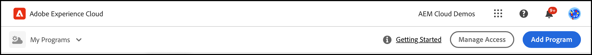
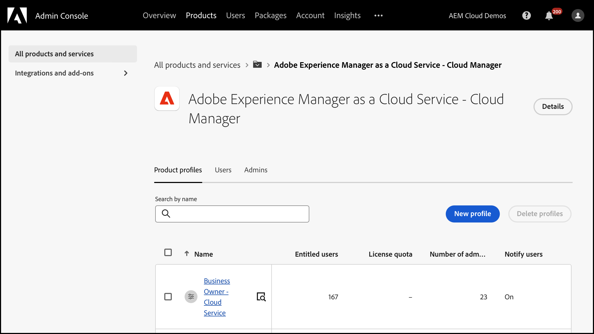

# Custom permissions {#custom-permissions}

Discover how to set up tailored permission profiles in Cloud Manager. You can configure specific access controls for programs, pipelines, and environments, giving you granular control over what each user can do.

## Introduction {#introduction}

Cloud Manager has a set of pre-defined roles that govern access to various Cloud Manager features:

* Business Owner
* Program Manager
* Deployment Manager
* Developer

Custom permissions let users create custom permission profiles with configurable permissions to restrict access for Cloud Manager users to programs, pipelines, and environments.

>[!TIP]
>For details on pre-defined roles, see [AEM as a Cloud Service Team and Product Profiles](/help/onboarding/aem-cs-team-product-profiles.md).

## Use custom permissions {#using}

Creating and using your own custom permissions requires the following three steps:

1. [Create a product profile](#create).
1. [Assign custom permissions to the product profile](#assign-permissions).
1. [Assign users to the product profile](#assign-users).

>[!TIP]
>You may find it helpful to review the [Terms](#terms) and [Configurable Permissions](#configurable-permissions) sections as you create your own custom permissions.

>[!IMPORTANT]
>You must have product administrator rights in the Admin Console for Adobe Experience Manager as a Cloud Service to create product profiles and manage permissions for Cloud Manager.

### Create a product profile {#create}

1. Log into Cloud Manager at [my.cloudmanager.adobe.com](https://my.cloudmanager.adobe.com/).

1. On the Cloud Manager landing page, click **Manage Access**. 

   

1. In the Admin Console, click **New profile**.

   

1. Provide the general details about the profile.

   * **Product profile name** - A descriptive name for the profile
   * **Display name** - An abbreviated name that is shown in the UI (options)
   * **Description** - An informative description of the profile explaining its purpose (optional)
   * **Notify users by email** - Users receive an email notification when they are added to or removed from this profile.

1. Click **Save**.

The new product profile is saved and is visible in the list of product profiles in the Admin Console.

### Assign custom permissions to the product profile {#assign-permissions}

1. In the Admin Console, click the name of the [new product profile you created](#create).

1. In the **Custom Profile** page, click the **Permissions** tab.

   

1. In the row of a permission name, click **Edit**.

1. In the **Edit permissions for Custom Profile** dialog box, do one of the following:

   * Near the top of the **Available permissions items** column, click  **Add all** to add all permissions.
   * To add a single permission to the **Included permission items** column, click its associated .

      

1. Click **Save**.

### Assign users to the product profile {#assign-users}

1. In the Admin Console, click the name of the [new product profile to which you assigned custom permissions](#assign-permissions).

1. In the window that opens, click the **Users** tab.

1. Click **Add Users** and assign users to the product profile with custom permissions.

In [Manage product profiles for enterprise users](https://helpx.adobe.com/enterprise/using/manage-product-profiles.html), see **Add users and user groups to a product profile** for more details on how to use the Admin Console.

## Configurable permissions {#configurable-permissions}

The following permissions are available when you create a custom product profile.

| Permission | Description |
| --- | --- |
| `Program Create` | Let users create a program. |
| `Program Access` | Let users access programs. |
| `Program Edit` | Let users edit programs. |
| `Environment Create` | Let users create an environment. |
| `Environment Edit` | Let users update and edit environments. |
| `Environment Logs Read` | Let users read environment logs. |
| `Environment Variables Manage` | Let users create/edit/delete environment configurations. |
| `Environment Restore Create` | Let users create an environment restore. |
| `Rapid Development Environment Reset` | Let users reset the Rapid Development Environment (RDE). |
| `Content Copy Manage` | Let users manage content copy operations. |
| `Pipeline Create` | Let users create pipelines. |
| `Pipeline Delete` | Let users delete pipelines. |
| `Pipeline Edit` | Let users edit pipelines. |
| `Production Deployments Approve/Reject` | Let users approve or reject a production deployment step. |
| `Pipeline Executions Cancel` | Let users cancel pipeline executions. |
| `Pipeline Executions Start` | Let users start a new execution pipeline. |
| `Override/Reject Important Metric Failures` | Let users override/reject important metric failures. |
| `Production Deployments Schedule` | Let users schedule a production deployment step. |
| `Repository Info Access` | Let users access repository info and generate an access password. |
| `Repository Create` | Let users create Git repositories. |
| `Repository Delete` | Let users delete Git repositories. |
| `Repository Edit` | Let users edit Git repositories. |
| `Repository Code Generate` | Let users generate a project from archetype. |
| `Domain Name Manage` | Let users create/edit/delete domain names. |
| `IP Allowlist Manage` | Let users create/edit/delete IP allowlist and IP allowlist binding. |
| `Network Infrastructure Manage` | Let users create/delete/edit/test network infrastructure. |
| `SSL Certificate Manage` | Let users create/edit/delete SSL certificate. |
| `New Relic Sub Account User Manage` | Let users read/edit New Relic subaccount users. |

### Organization-level permissions {#organization-level}

Organization-level permissions refer to permissions which are always given across all programs in an organization.

The following permissions are organization-level permissions:

* **`Program Create`** - This permission lets users create a program in the organization.
* **Repository Info Access** - This tenant/organization level permission allows users to generate a username, password, and repository URL for accessing and contributing to a customer project.
  * The username and password for repository access are common across all the repositories in the organization. However, the repository URL is unique to each program.
  * See [Accessing Repositories](/help/implementing/cloud-manager/managing-code/accessing-repos.md) for more information.

## Terms {#terms}

The following terms are used in creating and managing custom permissions and pre-defined roles.

| Term | Description |
| --- | --- |
| Predefined Permissions | Predefined roles like **Business Owner** and **Deployment Manager** to govern various features of Cloud Manager. For details on pre-defined roles, see [AEM as a Cloud Service Team and Product Profiles](/help/onboarding/aem-cs-team-product-profiles.md). |
| Custom Permissions | Cloud Manager features let users create permission profiles to define roles to govern the supported features of Cloud Manager. |
| Product Profile | Created in the Admin Console to manage configurable permissions that are applicable to users who are part of the permission profile. |
| Configurable Permission | Cloud Manager permissions that you can configure in the permission profile. |
| Permission Item | A program, environment, or pipeline resource on which a permission can be applied. |

Permission items refer to the scope where permissions are applied. Typically, it is one of the following.

| Permission Item Type | Example | Description |
| --- | --- | --- |
| Organization|organization:companyA | All applicable resources of an organization. A resource could be a program, environment, or pipeline. If the user adds an organization for any permission, then all new resources in that organization also have that permission. |
| Program | Program A | All applicable resources of a program. |
| Environment | Program A : environment | Applicable to a specific environment. |
| Pipeline | Program A : Pipeline | Applicable to a specific pipeline. |

## Usage notes {#usage-notes}

* A custom permissions profile also lists AMS programs, environments, and pipelines while configuring permissions.
* Resources like program, environment, and pipeline that were created in Cloud Manager may take several minutes to display in Admin Console for permission configuration.
* In rare scenarios where a custom permissions service fails to respond, predefined profiles are still available and users in predefined profiles still have appropriate access.

## Frequently asked questions {#faq}

### Which permission profiles are predefined permission profiles?

* Business Owner
* Program Manager
* Deployment Manager
* Developer

For details on pre-defined roles, see [AEM as a Cloud Service Team and Product Profiles](/help/onboarding/aem-cs-team-product-profiles.md).

### What happens to predefined permission profiles with the introduction of custom profiles?

Default product profiles and Cloud Manager roles continue to work the same as before.

### Can I edit predefined permission profiles?

No. Default profiles are non-editable. You cannot add or remove permissions from the default permission profile. You can only add or remove users from predefined profiles.

### Should I delete predefined permission profiles since custom profiles are now available?

Do not delete predefined permission profiles from the Admin Console. 

### Can I add users to multiple permission profiles?

Yes. A user can be part of multiple profiles including predefined and custom permission profiles. When a user is assigned to multiple profiles, the combined permissions from all the assigned permission profiles are available to that user.

### What happens if a user has permission to edit an environment/pipeline but doesn't have access to a program which contains the environment/pipeline?

The user is unable to access the environment or pipeline if they do not have the **Program Access** permissions containing the environment or pipeline.
