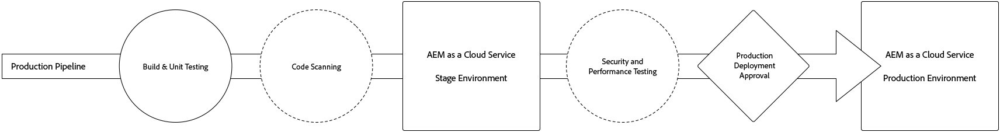
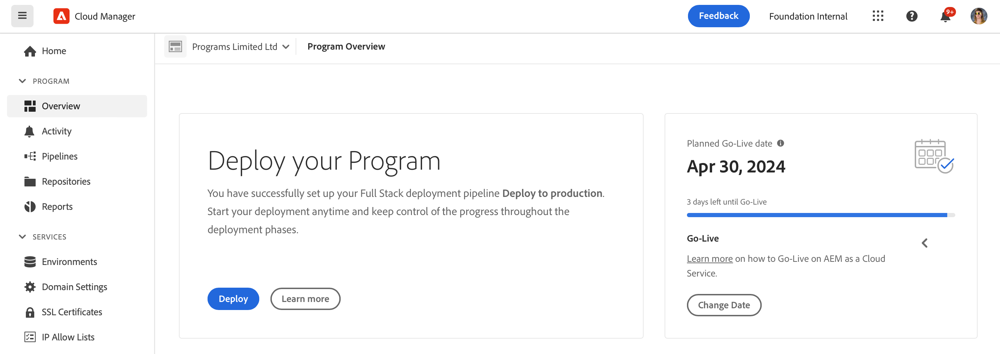
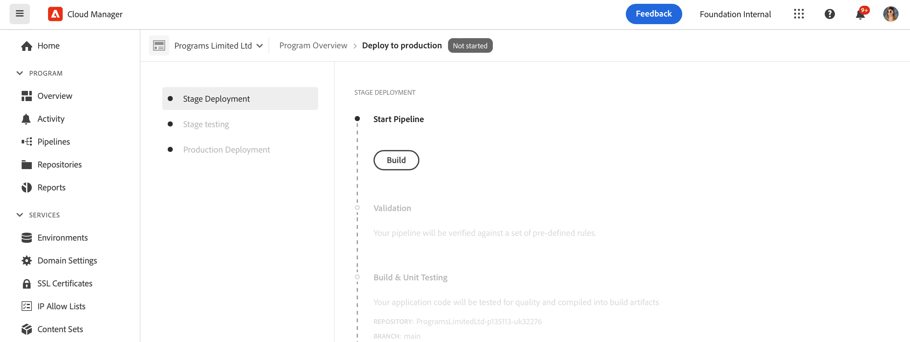
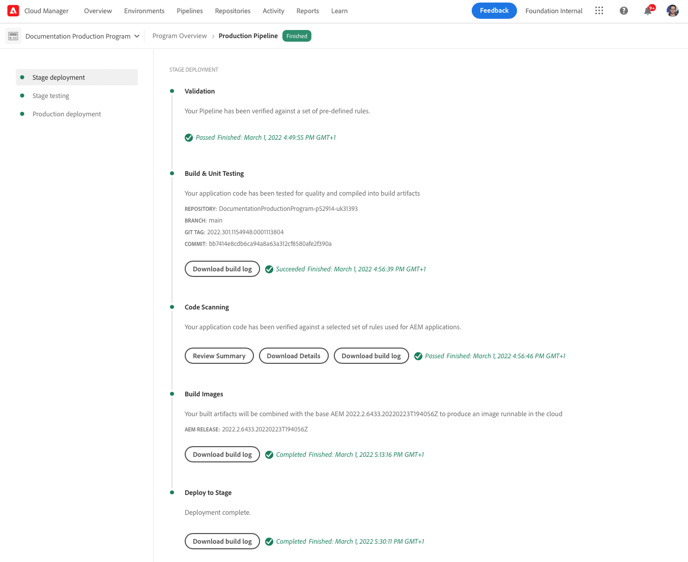
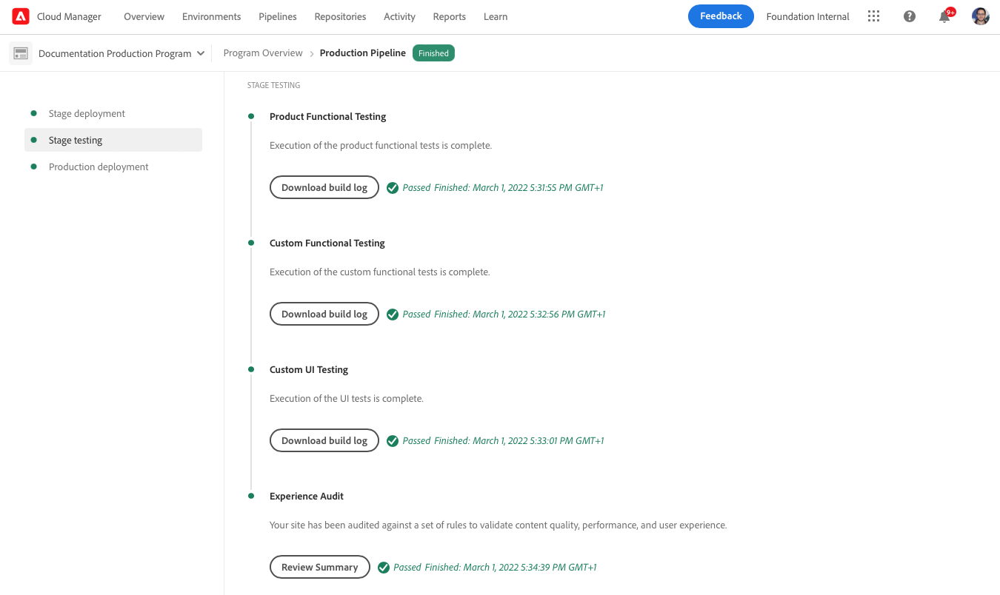
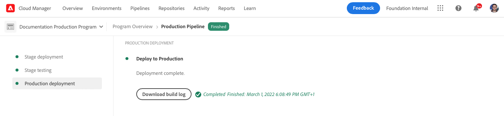
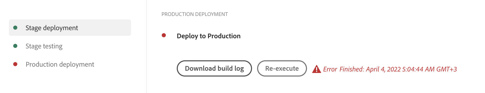

# Deploy your code {#deploy-your-code} 

Learn how to deploy your code to Production using Cloud Manager pipelines in AEM as a Cloud Service.



Deploying code seamlessly to Stage and then through to Production is done through a Production pipeline. The Production pipeline execution is broken into the two following logical phases:

1. **Deployment to Stage environment** - The code is built and deployed to the Stage environment for automated functional testing, UI testing, experience audit, and User Acceptance Testing (UAT).
1. **Deployment to Production environment** - Once the build is validated on Stage, and approved for promotion to Production, the same build artifact is deployed to the Production environment.

_Only the Full Stack Code pipeline type supports code scanning, function testing, UI testing, and experience audit._

## Deployment process {#deployment-process}

All Cloud Service deployments follow a rolling process to ensure zero downtime. See [How Rolling Deployments Work](/help/implementing/deploying/overview.md#how-rolling-deployments-work) to learn more.

>[!NOTE]
>
>The Dispatcher cache is wiped out on each deployment. It is subsequently "warmed up" before the new publish nodes accept traffic.

## Deploy your code with Cloud Manager in AEM as a Cloud Service {#deploying-code-with-cloud-manager}

Once you have [configured your production Pipeline](/help/implementing/cloud-manager/configuring-pipelines/configuring-production-pipelines.md) including repository, environment, and testing environment, you are ready to deploy your code.

1. Log into Cloud Manager at [my.cloudmanager.adobe.com](https://my.cloudmanager.adobe.com/) and select the appropriate organization.

1. On the **[My Programs](/help/implementing/cloud-manager/navigation.md#my-programs)** console, click the program for which you want to deploy code.

1. On the **Overview** page, in the call-to-action area, click **Deploy**.

   

1. On the **Deploy to production** page, click **Build**.

   

The build process deploys your code through the following three ordered phases:

1. [Stage deployment phase](#stage-deployment)
1. [Stage testing phase](#stage-testing)
1. [Production deployment phase](#production-deployment)

>[!TIP]
>
>You can review the steps from various deployment processes by viewing logs, or reviewing results for the testing criteria.

### Stage deployment phase {#stage-deployment}

The **Stage Deployment** phase involves the following steps:

| Stage deployment step | Description |
| --- | --- |
| Validation  | Ensures that the pipeline is configured to use the currently available resources. for example, testing that the configured branch exists and that the environments are available.  |
| Build &amp; Unit Testing  | Runs a containerized build process.<br>See [Build Environment Details](/help/implementing/cloud-manager/getting-access-to-aem-in-cloud/build-environment-details.md) for details on the build environment. |
| Code Scanning | Evaluates the quality of your application code.<br>See [Code Quality Testing](/help/implementing/cloud-manager/code-quality-testing.md) for details on the testing process.  |
| Build Images | This process converts content and Dispatcher packages from the Build step into Docker images. It also generates Kubernetes configurations based on those packages. |
| Deploy to Stage | The image is deployed to the staging environment in preparation for the [Stage testing stage](#stage-testing). |



### Stage testing phase {#stage-testing}

The **Stage testing** phase involves the following steps:

| Stage testing step | Description |
| --- | --- |
| Product Functional Testing | Cloud Manager pipeline executes tests that run against the stage environment.<br>See also [Product Functional Testing](/help/implementing/cloud-manager/functional-testing.md#product-functional-testing). |
| Custom Functional Testing | This step in the pipeline is always executed and cannot be skipped. If the build does not produce a test JAR, the test automatically passes.<br>See also [Custom Functional Testing](/help/implementing/cloud-manager/functional-testing.md#custom-functional-testing).  |
| Custom UI Testing | An optional feature that automatically runs UI tests created for custom applications.<br>UI tests are Selenium-based and packaged in a Docker image to offer flexibility in language and frameworks. This approach lets you use Java and Maven, Node and WebDriver.io, or any Selenium-based framework or technology.<br>See also [Custom UI Testing](/help/implementing/cloud-manager/functional-testing.md#custom-ui-testing).  |
| Experience Audit | This step in the pipeline is always executed and cannot be skipped. As a production pipeline is executed, an experience audit step is included after custom functional testing that runs the checks.<ul><li>The pages that are configured are submitted to the service and evaluated.</li><li>The results are informational and show the scores and the change between the current and previous scores.</li><li>This insight is valuable to determine if there is a regression that is introduced with the current deployment.</li></ul>See [Understanding Experience Audit results](/help/implementing/cloud-manager/experience-audit-dashboard.md).</li></ul> |



### Production deployment phase {#production-deployment}

The process for deploying to production topologies differs slightly to minimize the impact on visitors to an AEM site.

Production deployments generally follow the same steps as previously described, but in a rolling manner. These steps include the following:

1. Deploy AEM packages to author.
1. Detach `dispatcher1` from the load balancer.
1. Deploy AEM packages to `publish1` and the Dispatcher package to `dispatcher1`, flush Dispatcher cache.
1. Put `dispatcher1` back into the load balancer.
1. When `dispatcher1` is back in service, detach `dispatcher2` from the load balancer.
1. Deploy AEM packages to `publish2` and the Dispatcher package to `dispatcher2`, flush Dispatcher cache.
1. Put `dispatcher2` back into the load balancer.

This process continues until the deployment has reached all publishers and Dispatchers in the topology.



## Timeouts during a deployment {#timeouts}

The following steps time out if they are left waiting for user feedback during a deployment:

|Step|Timeout|
|--- |--- |
|Code Quality Testing|14 days|
|Security Testing|14 days|
|Performance Testing|14 days|
|Application for Approval|14 days|
|Schedule Production Deployment|14 days|
|CSE Support|14 days|

## Re-execute a production deployment {#reexecute-deployment}

In rare cases, production deployment steps may fail for transient reasons. In such cases, re-execution of the production deployment step is supported so long as the production deployment step has been completed, regardless of the type of completion (for example, canceled or unsuccessful). Re-execution creates a new execution using the same pipeline consisting of the following three steps:

1. **Validation** - The same validation that occurs during a normal pipeline execution.
1. **Build** - In the context of a re-execution, the build step copies artifacts and does not actually execute a new build process.
1. **Production deployment** - Uses the same configuration and options as the production deployment step in a normal pipeline execution.

In such circumstances where a re-execution is possible, the production pipeline status page provides the **Re-execute** option next to the usual **Download build log** option.



>[!NOTE]
>
>In a re-execution, the build step is labeled in the UI to reflect that it is copying artifacts, not re-building.

### Limitations {#limitations}

* Re-executing the production deployment step is only available for the last execution.
* Re-execution is not available for push update executions. If the last execution is a push update execution, re-execution is not possible.
* If the last execution failed at any point prior to the production deployment step, re-execution is not possible.

### Re-execute API {#reexecute-API}

In addition to being available in the UI, you can use [the Cloud Manager API](https://developer.adobe.com/experience-cloud/cloud-manager/reference/api/#tag/Pipeline-Execution) to trigger re-executions and identify executions that were triggered as re-executions.

#### Trigger a re-execution {#reexecute-deployment-api}

To trigger a re-execution, make a PUT request to the HAL Link `https://ns.adobe.com/adobecloud/rel/pipeline/reExecute` on the production deploy step state.

* If this link is present, the execution can be restarted from that step.
* If it is absent, the execution cannot be restarted from that step.

This link is only available for the production deploy step.

```JavaScript
 {
  "_links": {
    "https://ns.adobe.com/adobecloud/rel/pipeline/logs": {
      "href": "/api/program/4/pipeline/1/execution/953671/phase/1575676/step/2983530/logs",
      "templated": false
    },
    "https://ns.adobe.com/adobecloud/rel/pipeline/reExecute": {
      "href": "/api/program/4/pipeline/1/execution?stepId=2983530",
      "templated": false
    },
    "https://ns.adobe.com/adobecloud/rel/pipeline/metrics": {
      "href": "/api/program/4/pipeline/1/execution/953671/phase/1575676/step/2983530/metrics",
      "templated": false
    },
    "self": {
      "href": "/api/program/4/pipeline/1/execution/953671/phase/1575676/step/2983530",
      "templated": false
    }
  },
  "id": "6187842",
  "stepId": "2983530",
  "phaseId": "1575676",
  "action": "deploy",
  "environment": "weretail-global-b75-prod",
  "environmentType": "prod",
  "environmentId": "59254",
  "startedAt": "2022-01-20T14:47:41.247+0000",
  "finishedAt": "2022-01-20T15:06:19.885+0000",
  "updatedAt": "2022-01-20T15:06:20.803+0000",
  "details": {
  },
  "status": "FINISHED"
```

The syntax of the HAL link's href value is only an example. The actual value should always be read from the HAL link and not generated.

Submitting a PUT request to this endpoint results in a 201 response if successful, and the response body is the representation of the new execution. This workflow is similar to starting a regular execution through the API.

#### Identify a re-execute execution {#identify-reexecution}

The system identifies re-executions by setting the `trigger` field to the value `RE_EXECUTE`.
