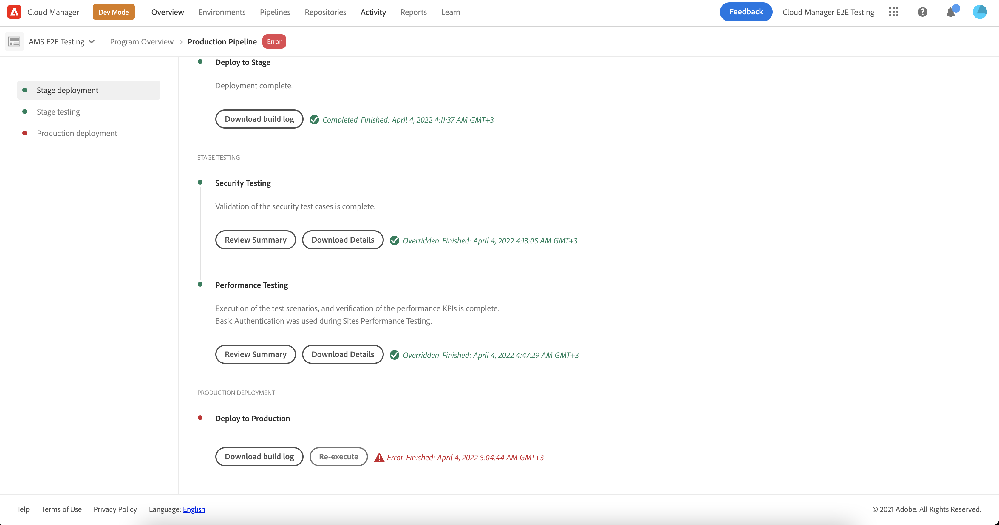

# Deploying Your Code {#deploy-your-code} 

Learn how to deploy your code to Production using Cloud Manager pipelines in AEM as a Cloud Service.


Deploying code seamlessly to Stage and then through to Production is done via a Production pipeline. The Production pipeline execution is broken into two logical phases.

1. Deployment to Stage environment
    * The code is built and deployed to the Stage environment for automated functional testing, UI testing, experience audit, and user acceptance testing (UAT).
1. Deployment to Production environment
    * Once the build is validated on Stage, and approved for promotion to Production, the same build artifact is deployed to the Production environment.

_Only the Full Stack Code pipeline type supports code scanning, function testing, UI testing, and experience audit._

## Deploying Your Code with Cloud Manager in AEM as a Cloud Service {#deploying-code-with-cloud-manager}

Once you have [configured your production Pipeline](/help/implementing/cloud-manager/configuring-pipelines/configuring-production-pipelines.md) including repository, environment, and testing environment, you are ready to deploy your code.

1. Log into Cloud Manager at [my.cloudmanager.adobe.com](https://my.cloudmanager.adobe.com/) and select the appropriate organization.

1. Click on the program for which you want to deploy code.

1. Click **Deploy** from the call-to-action on the **Overview** screen to start the deployment process.

   

1. The **Pipeline Execution** screen displays. Click **Build** to start the process.

   

The build process deploys your code through three phases.

1. [Stage Deployment](#stage-deployment)
1. [Stage Testing](#stage-testing)
1. [Production Deployment](#production-deployment)

>[!TIP]
>
>You can review the steps from various deployment processes by viewing logs, or reviewing results, for the testing criteria.

## Stage Deployment Phase {#stage-deployment}

The **Stage Deployment** phase. involves these steps.

* **Validation**  - This step ensures that the pipeline is configured to use the currently available resources. E.g. testing that the configured branch exists and that the environments are available.
* **Build &amp; Unit Testing** - This step runs a containerized build process.
  * Please see the document [Build Environment Details](/help/implementing/cloud-manager/getting-access-to-aem-in-cloud/build-environment-details.md) for details on the build environment.
* **Code Scanning** - This step evaluates the quality of your application code.
  * Please see the document [Code Quality Testing](/help/implementing/cloud-manager/code-quality-testing.md) for details on the testing process.
* **Build Images** - This process is responsible for transforming the content and dispatcher packages produced by the build step into Docker images and Kubernetes configurations.
* **Deploy to Stage** - The image is deployed to the staging environment in preparation for the [Stage testing stage.](#stage-testing)


## Stage Testing Phase {#stage-testing}

The **Stage testing** phase involves these steps.

* **Product Functional Testing** - Cloud Manager pipeline executes tests that run against the stage environment.
   * Please refer to the document [Product Functional Testing](/help/implementing/cloud-manager/functional-testing.md#product-functional-testing) for more details.

* **Custom Functional Testing** - This step in the pipeline is always executed and cannot be skipped. If no test JAR is produced by the build, the test passes by default.  
   * Please refer to the document [Custom Functional Testing](/help/implementing/cloud-manager/functional-testing.md#custom-functional-testing) for more details.

* **Custom UI Testing** - This step is an optional feature that automatically run UI tests created for custom applications.
   * UI tests are Selenium-based tests packaged in a Docker image to allow a wide choice in language and frameworks (such as Java and Maven, Node and WebDriver.io, or any other framework and technology built upon Selenium).
   * Please refer to the document [Custom UI Testing](/help/implementing/cloud-manager/functional-testing.md#custom-ui-testing) for more details.

* **Experience Audit** - This step in the pipeline is always executed and cannot be skipped. As a production pipeline is executed, an experience audit step is included after custom functional testing that will run the checks.
   * The pages that are configured are submitted to the service and evaluated. 
   * The results are informational and show the scores and the change between the current and previous scores.
   * This insight is valuable to determine if there is a regression that will be introduced with the current deployment.
   * Please refer to the document [Understanding Experience Audit results](/help/implementing/cloud-manager/experience-audit-testing.md) for more details.


## Production Deployment Phase {#deployment-production}

The process for deploying to production topologies differs slightly in order to minimize impact visitors to an AEM site.

Production deployments generally follow the same steps as previously described, but in a rolling manner.

1. Deploy AEM packages to author.
1. Detach dispatcher1 from the load balancer.
1. Deploy AEM packages to publish1 and the dispatcher package to dispatcher1, flush dispatcher cache.
1. Put dispatcher1 back into the load balancer.
1. Once dispatcher1 is back in service, detach dispatcher2 from the load balancer.
1. Deploy AEM packages to publish2 and the dispatcher package to dispatcher2, flush dispatcher cache.
1. Put dispatcher2 back into the load balancer.

This process continues until the deployment has reached all publishers and dispatchers in the topology.


## Timeouts {#timeouts}

The following steps will timeout if left waiting for user feedback:

|Step|Timeout|
|--- |--- |
|Code Quality Testing|14 days|
|Security Testing|14 days|
|Performance Testing|14 days|
|Application for Approval|14 days|
|Schedule Production Deployment|14 days|
|CSE Support|14 days|

## Deployment Process {#deployment-process}

All Cloud Service deployments follow a rolling process to ensure zero downtime. Please refer to the document [How Rolling Deployments Work](/help/implementing/deploying/overview.md#how-rolling-deployments-work) to learn more.

## Re-Execute a Production Deployment {#Reexecute-Deployment}

Re-execution of the production deployment step is supported for executions where the production deploy step has completed. The type  of completion is not important – the deployment could be cancelled, or unsuccessful. That said, the primary use case is expected to be cases where the production deployment step failed for transient reasons. Re-execution creates a new execution using the same pipeline. This new execution consists of three steps:

1. The validate step – this is essentially the same validation that occurs during a normal pipeline execution.
1. The build step – in the context of a re-execution, the build step is copying artifacts, not actually executing a new build process.
1. The production deployment step – this uses the same configuration and options as the production deployment step in a normal pipeline execution.

The build step may be slightly differently labeled in the UI to reflect that it is copying artifacts, not re-building.



Limitations:

* Re-executing the production deployment step will only be available on the last  execution.
* Re-execution is not  available for push update executions. If the last execution is a push update execution, re-execution is not possible.
* If the last execution is a push update execution, re-execution is not possible.
* If the last execution failed at any point prior to the production deployment step, re-execution is not possible.

### Re-Execute API {#Reexecute-API}

### Identifying a re-execute execution

To identify if an execution is a re-execute execution, the trigger  field can be examined. Its value will be *RE_EXECUTE*.

### Triggering a new execution

To trigger a re-execution, a PUT request needs to be made to the HAL Link <(<http://ns.adobe.com/adobecloud/rel/pipeline/reExecute>)> on the production deploy step state. If this link is present, the execution can be restarted from that step. If it is absent, the execution cannot be restarted from that step. In the initial release, this link will only ever be present on the production deploy step but future releases may support starting the pipeline from other steps. Example:

``` Javascript
 {
  "_links": {
    "http://ns.adobe.com/adobecloud/rel/pipeline/logs": {
      "href": "/api/program/4/pipeline/1/execution/953671/phase/1575676/step/2983530/logs",
      "templated": false
    },
    "http://ns.adobe.com/adobecloud/rel/pipeline/reExecute": {
      "href": "/api/program/4/pipeline/1/execution?stepId=2983530",
      "templated": false
    },
    "http://ns.adobe.com/adobecloud/rel/pipeline/metrics": {
      "href": "/api/program/4/pipeline/1/execution/953671/phase/1575676/step/2983530/metrics",
      "templated": false
    },
    "self": {
      "href": "/api/program/4/pipeline/1/execution/953671/phase/1575676/step/2983530",
      "templated": false
    }
  },
  "id": "6187842",
  "stepId": "2983530",
  "phaseId": "1575676",
  "action": "deploy",
  "environment": "weretail-global-b75-prod",
  "environmentType": "prod",
  "environmentId": "59254",
  "startedAt": "2022-01-20T14:47:41.247+0000",
  "finishedAt": "2022-01-20T15:06:19.885+0000",
  "updatedAt": "2022-01-20T15:06:20.803+0000",
  "details": {
  },
  "status": "FINISHED"
```


The syntax of the HAL link's _href_  value above is not intended to be used as a point of reference. The actual value should always be read from the HAL link and not generated.

Submitting a *PUT* request to this endpoint will result in a *201* response if successful and the response body will be the representation of the new  execution. This is similar to starting a regular execution through the API.
