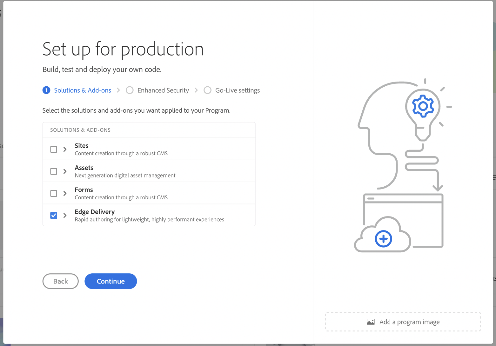

# Edge Delivery Services Support in Cloud Manager {#edge-delivery-services}

Learn how to deliver your Cloud Manager projects using Edge Delivery Services.

>[!NOTE]
>
>This feature is only available to [the early adopter program](/help/implementing/cloud-manager/release-notes/current.md#early-adoption).

## Edge Delivery Services in Brief {#edge-overview}

Edge Delivery Services is a composable set of services that allows for a high degree of flexibility in how you author content on your website. This ability lets you do the following:

* Create fast sites with a perfect Lighthouse Score.
* Continuously monitor performance through RUM (Real Use Monitoring).
* Increase authoring efficiency by decoupling content sources.

You can use both AEM content management and WYSIWYG authoring using the Universal Editor and document-based authoring.

Cloud Manager in AEM as a Cloud Service lets you enable Edge Delivery Service for your project.

>[!TIP]
>
>For details about Edge Delivery Services and how it can be used with AEM, please see the document [Edge Delivery Services Overview](/help/edge/overview.md).

## Edge Delivery Services in Cloud Manager {#edge-in-cloud-manager}

If you have licensed Edge Delivery Services as part of Adobe Experience Manager Sites, you can onboard your site with Edge Delivery Services directly in Cloud Manager and go live [using a guided, self-service experience](/help/implementing/cloud-manager/managing-code/private-repositories.md).

This functionality delivers a unified experience for managing all your AEM properties. It ensures consistency across key workflows. These include domain name management, SSL certificate management, and CDN mappings.

## Add Edge Delivery Services to a production program or a sandbox program

You must be a member of the **Business Owner** role to add or edit programs.

Depending on your use case, do one of the following:

| Use case | Description |
| --- | --- |
| I want to add Edge Delivery Services to a new production program. | See [Create production programs](/help/implementing/cloud-manager/getting-access-to-aem-in-cloud/creating-production-programs.md). In the wizard, under the **Solutions & Add-ons** tab, select **Edge Delivery Services**. |
| I want to add Edge Delivery Services to an existing production program. | See [Edit programs](/help/implementing/cloud-manager/getting-access-to-aem-in-cloud/editing-programs.md). In the **Edit Program** dialog box, under the **Solutions & Add-ons** tab, select **Edge Delivery Services**. |
| I want to add Edge Delivery Services to a new sandbox program. | See [Create sandbox programs](/help/implementing/cloud-manager/getting-access-to-aem-in-cloud/creating-sandbox-programs.md). When you create a sandbox program, Edge Delivery Service is added to the program by default. You do not need to select it. |
| I want to add Edge Delivery Services to an existing sandbox program. | See [Edit programs](/help/implementing/cloud-manager/getting-access-to-aem-in-cloud/editing-programs.md). In the **Edit Program** dialog box, under the **Solutions & Add-ons** tab, select **Edge Delivery Services**. If you are unable to select Edge Delivery Services, you may not have  |

## Enable Edge Delivery Services {#enabling}

GO THROUGH EDS TO-DO LIST STEPS.

Edge Delivery Services can be enabled when adding a new program.

For more information about adding programs, see the following:

* [Create Production programs](/help/implementing/cloud-manager/getting-access-to-aem-in-cloud/creating-production-programs.md)
* [Create Sandbox programs](/help/implementing/cloud-manager/getting-access-to-aem-in-cloud/creating-sandbox-programs.md)
