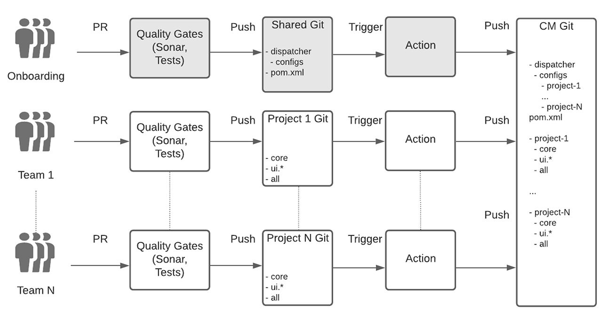
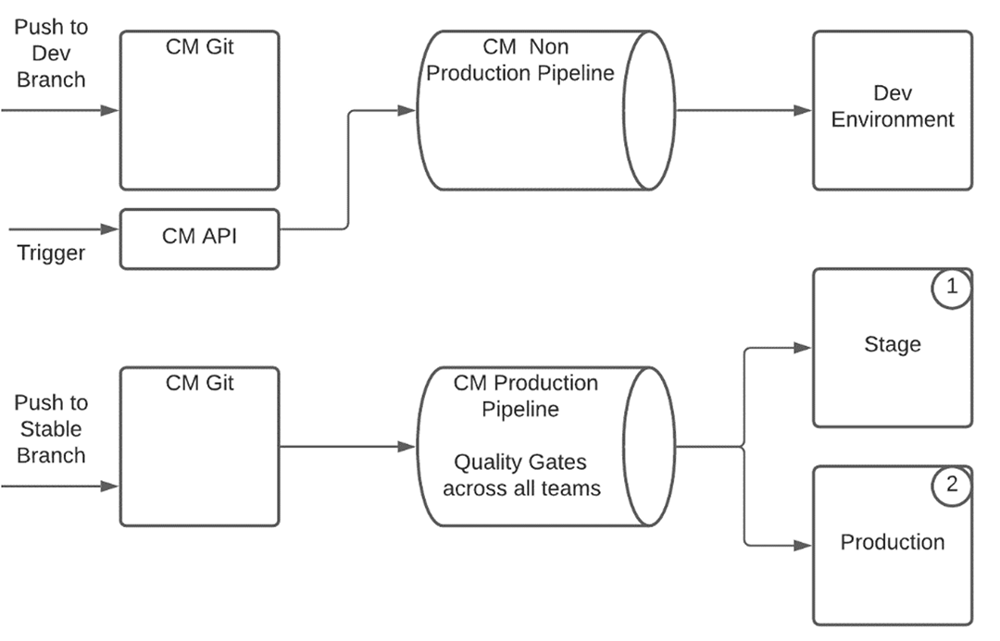
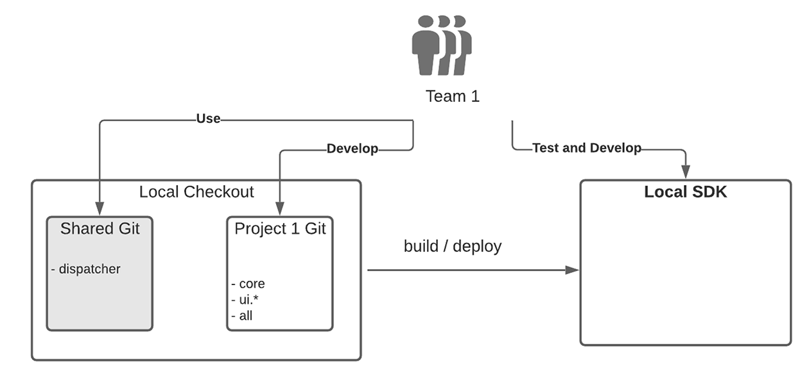

# Enterprise Team Development Setup for AEM as a Cloud Service {#enterprise-setup}

## Introduction {#introduction}

AEM as Cloud Service, a cloud-native offering that delivers AEM as a service is designed to benefit from 10+ years of delivering enterprise software to enterprise teams with their specific requirements. While it catapults AEM into the cloud native world, with new values like always on, always current, always secure, and always at scale, it retains the main value proposition that AEM provides as a customizable platform to our customers and allows enterprise grade teams to integrate in their development and delivery procedures.

To support our customers with enterprise development setups, AEM as a Cloud Service fully integrates with Cloud Manager and its purpose-built opinionated CI/CD pipelines, which are equipped with best practices and learnings from multiple years experience with enterprise-grade development and deployments – ensuring thorough testing and highest code quality to deliver exceptional experiences.

## Cloud Manager's Support in Enterprise Team Development Setup {#cloud-manager}

To ensure quick onboarding for customers, Cloud Manager provides everything required to get started with developing experiences right away, including a git repository to store customizations which then get built, verified, and deployed by Cloud Manager.
Using Cloud Manager, development teams can work towards committing changes frequently without being dependent on Adobe personnel. 

Three environment types are available in Cloud Manager: 

* Development
* Stage
* Production 

Code can be deployed to development environments using a non-production pipeline. For Stage and Production, which always go together and thus ensure validation before production deployment as best practice, a production pipeline uses quality gates to validate the application code and the configuration changes. 

The Production pipeline deploys the code and the configuration to the staging environment first, tests the application, and finally deploys to production.
A Cloud Service SDK that is always updated with latest Cloud Service improvements allows for local development directly utilizing the developer’s local hardware. This enables rapid development with very low turnaround times. Thus, developers can stay in their familiar local environment and choose from a wide variety of development tools, and push to development environments or production when they see fit. 

Cloud Manager supports flexible multi-team setups which can be adjusted to fit the needs of an enterprise. This applies to Cloud Service as well as AMS. To ensure stable deployments with multiple teams and avoiding one team impacting production for all teams, Cloud Managers opinionated pipeline always validates and tests the code from all teams together.

## Real World Example {#real-world-example}

Each enterprise has different requirements including different team setup, processes, and development workflows. The setup described below is used by Adobe for several projects that deliver experiences on top of AEM as a Cloud Service.

For instance, the Adobe Creative Cloud applications, such as Adobe Photoshop or Adobe Illustrator, include content resources such as tutorials, samples, and guides available to their end users. This content is consumed by the client applications using AEM as a Cloud Service in a *headless* way, by making API calls to the AEM Cloud publish tier to retrieve the structured content as JSON streams, and by leveraging the [Content Delivery Network (CDN) in AEM as a Cloud Service](https://experienceleague.adobe.com/docs/experience-manager-cloud-service/implementing/content-delivery/cdn.html?lang=en#content-delivery) to serve both structured and unstructured content with optimal performance.

The teams contributing to this project follow the process described hereafter.

>[!NOTE]
>Refer to [Working with Multiple Source Git Repositories](https://experienceleague.adobe.com/docs/experience-manager-cloud-manager/using/managing-code/working-with-multiple-source-git-repos.html#managing-code) to learn more about the setup. 

Each team is using its own development workflow and has a separate git repository. An additional shared git repository is used for onboarding of projects. This git repository contains the root structure of Cloud Manager’s git repository including the shared dispatcher configuration. Onboarding a new project requires listing in the reactor Maven project file at the root of the shared git repository. For dispatcher configuration a new configuration file is created inside the dispatcher project. This file is then included by the main dispatcher configuration. Each team is responsible for its own dispatcher configuration file. Changes to the shared git repository are rare and are usually only required when a new project is onboarded. The main work is done by each project team within their own git repository.
 

The git repository for each team has been setup using the AEM Maven archetype and thus follows the best practices for setting up AEM projects. The only exception is handling of the dispatcher configuration which is done in the shared git repository as outlined above.
Each team uses a simplified git workflow with two + N branches, following the Git flow model:

* A stable release branch contains the production code

* A development branch contains the latest development

* For each feature a new branch is created

Development is done in a feature branch, when the feature matures it is merged into the development branch. Completed and validated features are picked from the development branch and merged into the stable branch. All changes are done through Pull Requests (PR). Each PR is automatically validated by quality gates. Sonar is used for quality checking the code and a set of test suites is run to ensure that the new code is not introducing any regression.

The setup in the Cloud Manager's git repository has two branches:

* A *stable release branch*, containing the production code from all teams
* A *development branch*, containing the development code from all teams

Every push to a team’s git repository in either the development or the stable branch is triggering a [github action](https://experienceleague.adobe.com/docs/experience-manager-cloud-manager/using/managing-code/working-with-multiple-source-git-repos.html?lang=en#managing-code). All projects follow the same setup for the stable branch. A push to the stable branch of a project is automatically pushed to the stable branch in Cloud Manager's git repository. The production pipeline in Cloud Manager is configured to get triggered by a push to the stable branch. The production pipeline is therefore executed by each push of any team into a stable branch and the production deployment is updated if all quality gates pass.

 
Pushes to the development branch are handled differently. While a push to a developer branch in a team’s git repository is triggering a github action as well and the code is automatically pushed into the development branch in Cloud Manager’s git repository, the non-production pipeline is not automatically triggered by the code push. It is triggered by a call to Cloud Manager’s api.
Running the production pipeline includes checking the code of all teams via the provided quality gates. Once the code is deployed to stage, the tests and audits are executed to ensure everything is working as expected. Once all gates are passed, the changes are rolled out to production without any interruption or downtime.
For local development, the [SDK for AEM as a Cloud Service](https://experienceleague.adobe.com/docs/experience-manager-cloud-service/implementing/developing/aem-as-a-cloud-service-sdk.html?lang=en#developing) is used. The SDK allows a local author, publish, and dispatcher to be setup. This enables offline development and quick turnaround times. Sometimes only author is used for development, but quickly setting up dispatcher and publish allows to test everything locally before pushing into the git repository. Members of each team usually checkout the code from the shared git for as well as their own project code. There is no need to checkout other projects as the projects are independent.

 
This real-world setup can be used as a blueprint and then customized to the needs of an enterprise. The flexible branching and merging concept of git allows for variations of the above workflows, customized to every team’s needs. AEM as a Cloud Service supports all these variations without sacrificing the core value of the opinionated Cloud Manager pipeline.

### Considerations for a Multi Team Setup {#considerations}

>[!NOTE]
>For any multi team setup it is crucial to define a governance model and a set of standards all teams have to follow. The above outlined blueprint for a multi-team setup allows scaling across a larger number of teams and you can use this blueprint as a starting point.

With Cloud Manager’s git repository and the production pipeline, always the full production code is run through all quality gates, treating it as one deployment unit. This way the production system is kept *always on* without interruption or downtime.
In contrast, without such a system in place, because each team can deploy separately there is a risk that an update from a single team can lead to production stability issues. In addition, it requires coordination and planned downtime to roll out updates. With an increasing number of teams, the coordination effort will become much more complex and quickly unmanageable.

If a problem is detected in the quality gates, production is not affected, and the problem can be detected and fixed without Adobe personnel required to step in. Without Cloud Service and without always testing the whole deployment, partial deployments can cause outages requiring a request to rollback or even a full restore from a backup. The partial testing might also lead to other problems which then need to be fixed after the fact again requiring coordination and support from Adobe personnel.