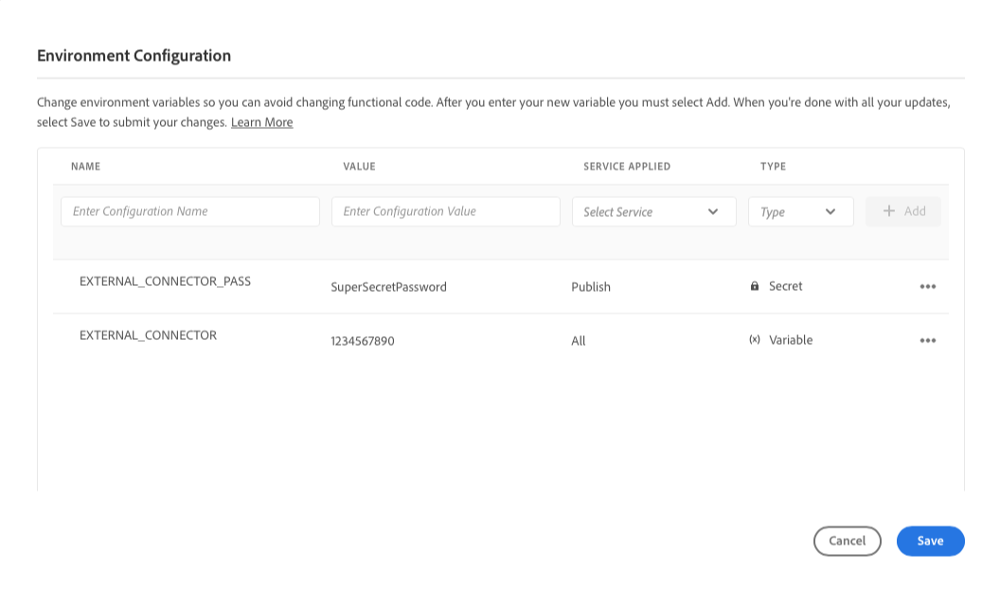
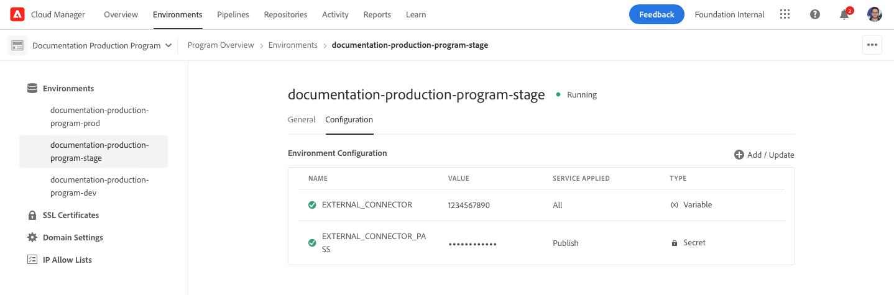

# Cloud Manager Environment Variables {#environment-variables}

Standard environment variables can be configured and managed via Cloud Manager. They are provided to the run time environment and can be used in OSGi configurations. Environment variables can be either environment-specific values or environment secrets, based on what is being changed.

## Overview {#overview}

Environment variables offer a host of benefits to users of AEM as a Cloud Service:

* They allow the behavior of your code and application to vary based on context and environment. For example, they can used to enable different configurations on the development environment compared to the production or stage environments to avoid costly mistakes.
* They only need to be configured and setup once and can be updated and deleted when necessary.
* Their values can be updated at any point in time and take effect immediately without the need for any code changes or deployments.
* They can separate code from configuration and remove the need to include sensitive information in version control.
* They improve the security of the AEM as a Cloud Service application since they live outside of the code.

Typical use cases for using environment variables include:

* Connecting your AEM application with different external endpoints
* Using a reference when storing passwords instead of directly in the code base
* When multiple development environments exist in a program and some configuration differs from one environment to the next

## Adding Environment Variables {#add-variables}

1. Log into Adobe Cloud Manager at [my.cloudmanager.adobe.com](https://my.cloudmanager.adobe.com/).
1. Cloud Manager lists the various programs available. Select the one you wish to manage.
1. Select the **Environments** tab for the chosen program then select the environment for which you want to create an environment variable in the left navigation panel.
1. Within the detail of the environment, select the **Configuration** tab then select **Add** to open the **Environment Configuration** dialog. 
   * If you're adding an environment variable for the first time, you will see an **Add Configuration** button in the center of the page. You can use this button or **Add** to open the **Environment Configuration** dialog.

   

1. Enter the variable details.
   * **Name**
   * **Value**
   * **Service Appplied** - Defines for which service (Author/Publish/Preview) the variable applies or if it applies to all services
   * **Type** - Defines if the variable is normal variable or a secret

   

1. After you enter your new variable, you must select **Add** in the last column of the row containing the new variable.
   * You can enter multiple variables at once by entering a new line and selecting **Add**.

   

1. Select **Save** to persist your variables.

An indicator with the status **Updating** is shown at the top of the table and next to the newly added variable to indicate that the environment is being updated with the configuration. Once complete, the new environment variable will be visible in the table.

>[!TIP]
>
>If you wish to add multiple variables, it is recommended to add the first variable, then use the **Add** button in the **Environment Configuration** dialog to add the additional variables. This way you can add them with one update to the environment.

## Updating Environment Variables {#update-variables}

After you have created environment variables, you can update them using the **Add/Update** button to launch the **Environment Configuration** dialog.

1. Log into Adobe Cloud Manager at [my.cloudmanager.adobe.com](https://my.cloudmanager.adobe.com/).
1. Cloud Manager lists the various programs available. Select the one you wish to manage.
1. Select the **Environments** tab for the chosen program then select the environment for which you want to create an environment variable in the left navigation panel.
1. Within the detail of the environment, select the **Configuration** tab then select **Add/update** in the top right to open the **Environment Configuration** dialog.

   

1. Using the ellipsis button in the last column of the row of the variable you wish to modify, select **Edit** or **Delete**. 

   

1. Edit the environment variable as necessary.
   * When editing, the ellipsis button will change to options to revert back to the original value or confirm your change.
   * When editing secrets, the values can only be updated, not viewed.

   

1. Once you've made all of the required configuration changes, select **Save**.

[As when adding variables,](#add-variables) an indicator with the status **Updating** is shown at the top of the table and next to the newly updated variable(s) to indicate that the environment is being updated with the configuration. Once complete, the updated environment variable(s) will be visible in the table.

>[!TIP]
>
>If you wish to update multiple variables, it is recommended to use the **Environment Configuration** dialog to update all of the necessary variables at once before tapping or clicking **Save**. This way you can add them with one update to the environment.

## Using Environment Variables {#using}

Environment variables can make your `pom.xml` configurations more secure and flexible. For example, passwords needn't be hard coded and your configuration can adapt based on the values in environment variables.

You can access environment variables and secrets via XML as follows.

* `${env.VARIABLE_NAME}`
* `${env.SECRET_NAME}`

See the document [Setting Up Project](/help/implementing/cloud-manager/getting-access-to-aem-in-cloud/setting-up-project.md#password-protected-maven-repository-support-password-protected-maven-repositories) for an example of how to use both types of variables in a `pom.xml` file.
