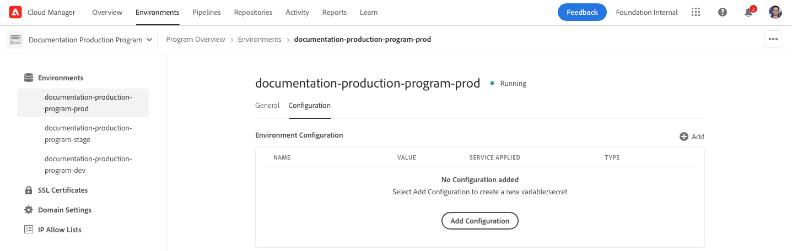
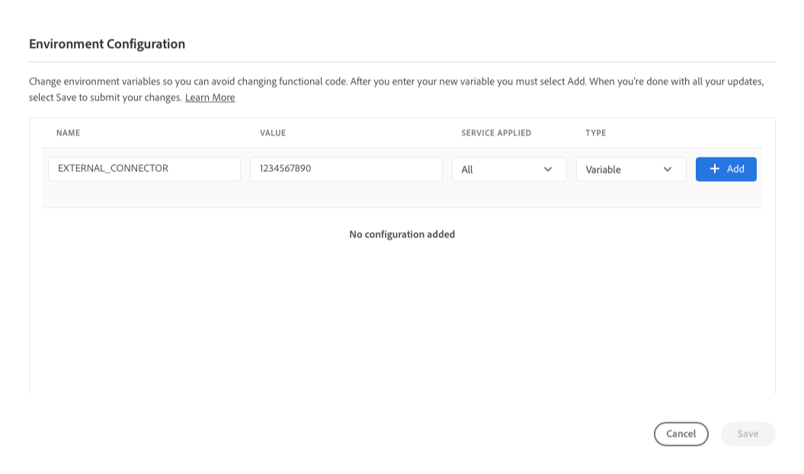
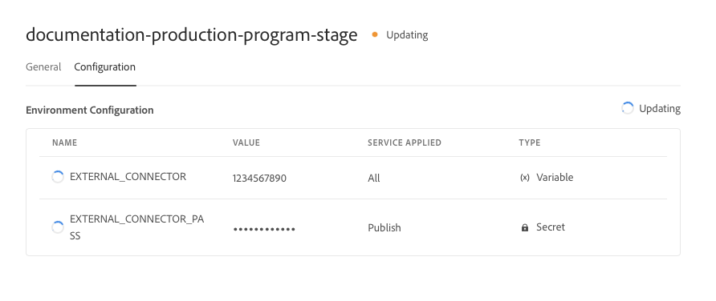
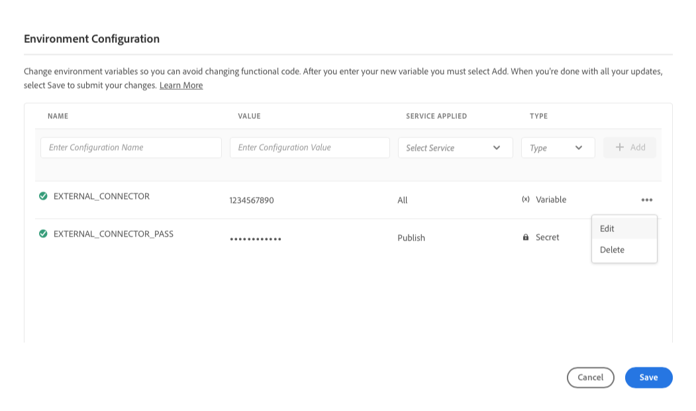
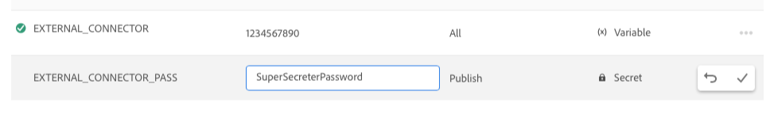

# Environment variables in Cloud Manager {#environment-variables}

Standard environment variables can be configured and managed via Cloud Manager. They are provided to the run time environment and can be used in OSGi configurations. 

Environment variables can be either environment-specific values or environment secrets, based on what is being changed.

## About environment variables {#overview}

Environment variables offer a host of benefits to users of AEM as a Cloud Service such as the following:

* They allow the behavior of your code and application to vary based on context and environment. For example, they can be used to enable different configurations in the development environment compared to the production or stage environments to avoid costly mistakes.
* They only need to be configured and setup once and can be updated and deleted when necessary.
* Their values can be updated at any point in time and take effect immediately without the need for any code changes or deployments.
* They can separate code from configuration and remove the need to include sensitive information in version control.
* They improve the security of the AEM as a Cloud Service application since they live outside of the code.

Typical use cases for using environment variables include the following:

* Connecting your AEM application with different external endpoints
* Using a reference when storing passwords instead of directly in the code base
* When multiple development environments exist in a program and some configuration differs from one environment to the next

## Add an environment variable {#add-variables}

If you want to add multiple variables, Adobe recommends that you add the first variable, then use  **Add** in the **Environment Configuration** dialog to add the additional variables. This method means you can add them with one update to the environment.

To add, update, or delete environment variables, you must be a member of the [**Deployment Manager** role](/help/onboarding/cloud-manager-introduction.md#role-based-premissions).

**To add an environment variable:**

1. Log into Cloud Manager at [my.cloudmanager.adobe.com](https://my.cloudmanager.adobe.com/) and select the appropriate organization.
1. On the **[My Programs](/help/implementing/cloud-manager/navigation.md#my-programs)** console, select the one you want to manage.
1. From the side menu, click **Environments**.
1. On the **Environments** page, select a row in the table that has the environment for which you want to add an environment variable.
1. On the environment's detail page, click the **Configuration** tab.
1. Click  **Add / Update**.
   If you are adding an environment variable for the first time, click **Add Configuration** in the center of the page.

      

1. In the **Environment Configuration** dialog box, enter the details in the first row of the table.

   | Field | Description |
   | --- | --- |
   | Name | A unique name of the configuration variable. It identifies the specific variable that is used in the environment. It must adhere to the following naming conventions:<ul><li>Variables can only contain alphanumeric characters and the underscore (`_`).</li><li>There is a limit of 200 variables per environment.</li><li>Each name must be 100 characters or less.</li></ul> |
   | Value | The value that the variable holds. |
   | Step Applied | Select which service to which the variable applies. Select **All** to have the variable applied to all services.<ul><li>**All**</li><li>**Author**</li><li>**Publish**</li><li>**Preview**</li></ul> |
   | Type | Select if the variable is normal or a secret. |

   

1. Click **Add**.

   Add additional variables as needed.

1. Click **Save**.

   A spinner with the status **Updating** is shown in the upper-right corner of the table. A spinner also appears to the left of any newly added variables. These statuses indicate that the environment is being updated with the configuration. After completion, the new environment variable is visible in the table.

## Update an environment variable {#update-variables}

After you have created environment variables, you can update them using  **Add / Update** to open the **Environment Configuration** dialog box.

If you want to update multiple variables, Adobe recommends that you use the **Environment Configuration** dialog box to update all necessary variables at once before clicking **Save**. This way you can add them with one update to the environment.

**To update an environment variable:**

1. Log into Cloud Manager at [my.cloudmanager.adobe.com](https://my.cloudmanager.adobe.com/) and select the appropriate organization.
1. On the **[My Programs](/help/implementing/cloud-manager/navigation.md#my-programs)** console, select the one you want to manage.
1. From the side menu, click **Environments**.
1. On the **Environments** page, select a row in the table that has the environment for which you want to update a variable.
1. On the environment's detail page, click the **Configuration** tab.
1. Click  **Add / Update**.
1. In the **Environment Configuration** dialog box, click  in the last column of the row of the variable you want to change.
1. In the drop-down menu, click **Edit**. 

   

1. Update the value of the environment variable as necessary.
   When editing a secret, the value can only be updated, not viewed.

   

1. Do one of the following:

   * Click  to apply the change.
   * Click  to undo the change.

1. Click **Save**.

   A spinner with the status **Updating** is shown in the upper-right corner of the table. A spinner also appears to the left of any updated variables. These statuses indicate that the environment is being updated with the configuration. After completion, the updated environment variable is visible in the table.

## Delete an environment variable {#delete-env-variable}

1. Log into Cloud Manager at [my.cloudmanager.adobe.com](https://my.cloudmanager.adobe.com/) and select the appropriate organization.
1. On the **[My Programs](/help/implementing/cloud-manager/navigation.md#my-programs)** console, select the one you want to manage.
1. From the side menu, click **Environments**.
1. On the **Environments** page, select a row in the table that has the environment for which you want to update a variable.
1. On the environment's detail page, click the **Configuration** tab.
1. Click  **Add / Update**.
1. In the **Environment Configuration** dialog box, click  in the last column of the row of the variable you want to change.
1. In the drop-down menu, click **Delete** to remove the variable immediately. 
1. Click **Save**.

## Use of environment variables {#using}

Environment variables can make your `pom.xml` configurations more secure and flexible. For example, passwords needn't be hard coded and your configuration can adapt based on the values in environment variables.

You can access environment variables and secrets by way of XML as follows:

`${env.VARIABLE_NAME}`

See [Setting Up Project](/help/implementing/cloud-manager/getting-access-to-aem-in-cloud/setting-up-project.md#password-protected-maven-repository-support-password-protected-maven-repositories) for an example of how to use both types of variables in a `pom.xml` file.

See also the [official Maven documentation](https://maven.apache.org/settings.html#quick-overview) for more details.

## Availability of environment variables {#availability}

Environment variables can be used in several places as follows:

| Where environment variables can be used | Description | 
| --- | --- |
| Author, Preview, and Publish  | Both regular environment variables and secrets can be used in the authoring, preview, and publishing environments. |
| Dispatcher | Only regular environment variables can be used with [the Dispatcher](https://experienceleague.adobe.com/en/docs/experience-manager-dispatcher/using/dispatcher).<ul><li>Secrets cannot be used.</li><li>Environment variables cannot be used in `IfDefine` directives.</li><li>Validate your use of environment variables with the [Dispatcher locally](https://experienceleague.adobe.com/en/docs/experience-manager-learn/cloud-service/local-development-environment-set-up/dispatcher-tools) before deploying.</li></ul> |
| OSGi configurations | Both regular environment variables and secrets can be used in [OSGi Configurations](/help/implementing/deploying/configuring-osgi.md). |
| Pipeline Variables | In addition to environment variables, there are also pipeline variables, which are exposed during the build phase. Learn more about pipeline variables in [Build Environment](/help/implementing/cloud-manager/getting-access-to-aem-in-cloud/build-environment-details.md#pipeline-variables). |

