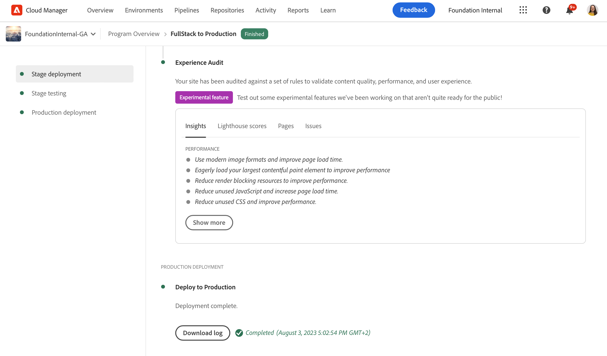
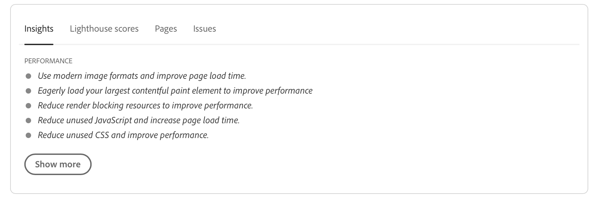
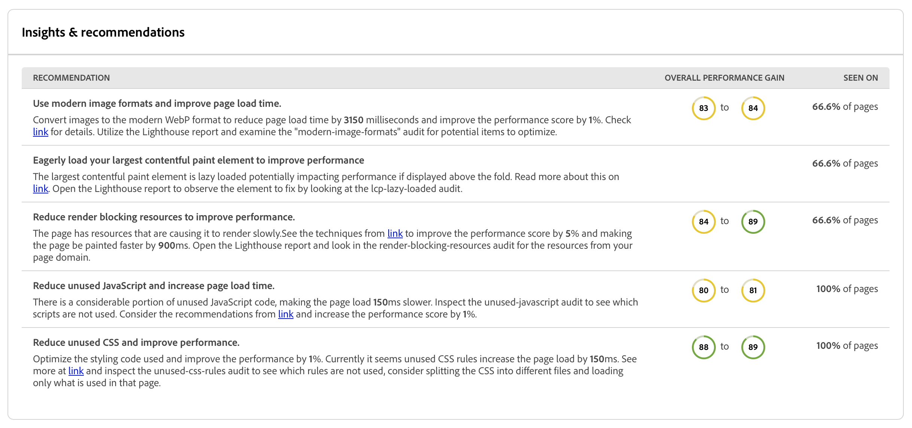
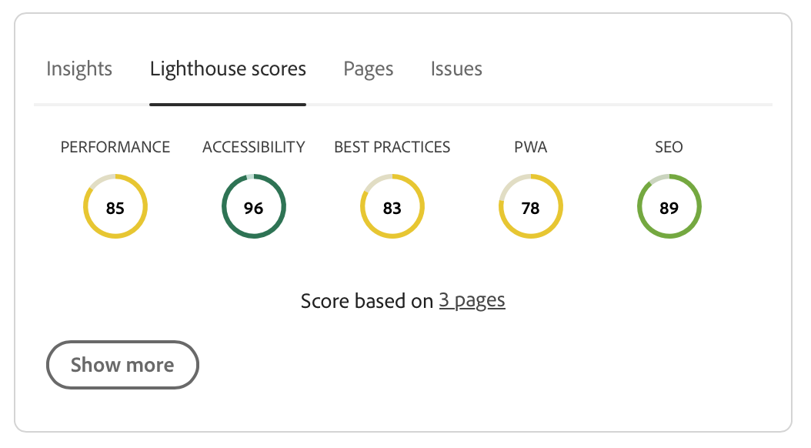
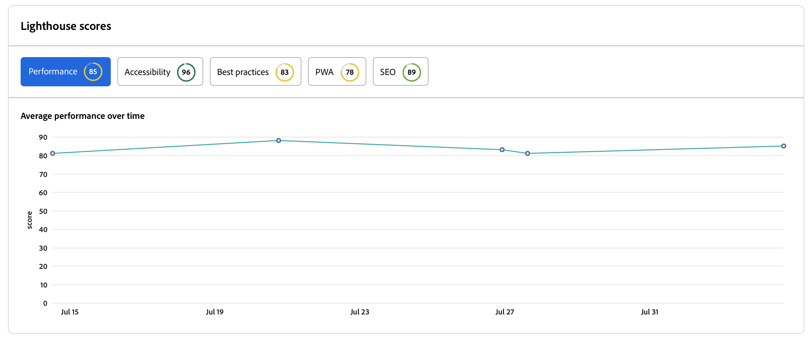
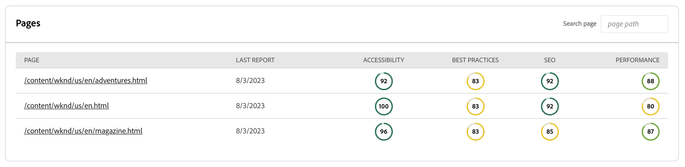
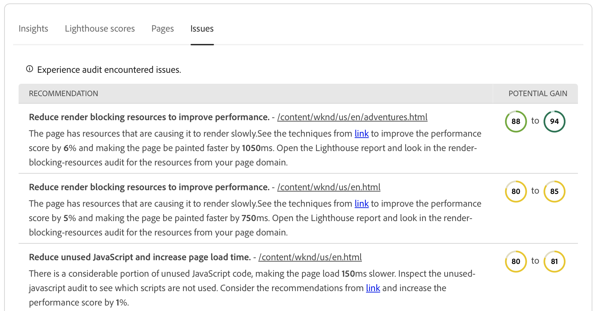
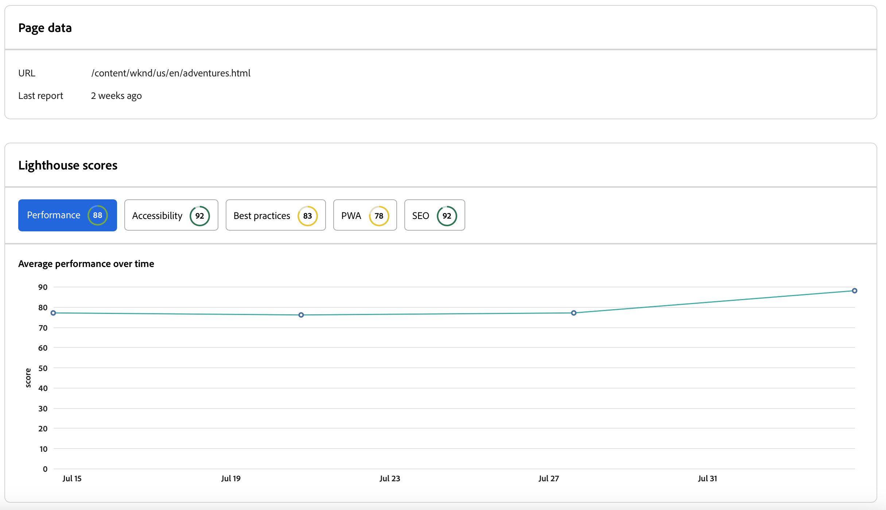

# Experience Audit Dashboard {#experience-audit-dashboard}

Learn how Experience Audit validates your deployment process and helps ensure that changes deployed meet baseline standards for performance, accessibility, best practices, and SEO through a clear, informative dashboard interface.

>[!NOTE]
>
>This feature is only available to [the early adopter program.](/help/implementing/cloud-manager/release-notes/current.md#early-adoption)
>
>For details on the existing Experience Audit feature for AEM as a Cloud Service, see [Experience Audit Testing](/help/implementing/cloud-manager/experience-audit-testing.md).

## Overview {#overview}

Experience Audit is a feature available in Cloud Manager Sites Production pipelines that validates the deployment process and helps ensure that changes deployed:

1. Meet baseline standards for performance, accessibility, best practices, SEO (Search Engine Optimization), and PWA (Progressive Web App).

1. Do not introduce regressions.

Experience Audit in Cloud Manager ensures that the user's experience on the site are of the highest standards.

The audit results are informational and allow the deployment manager to see the scores and the change between the current and previous scores. This insight is valuable to determine if there is a regression that was introduced with the current deployment.

Experience Audit is powered by [Google Lighthouse](https://developer.chrome.com/docs/lighthouse/overview/), an open source tool from Google and is enabled in all Cloud Manager production pipelines.

>[!TIP]
>
>You configure what pages are included in the Experience Audit when you [set up your pipeline](/help/implementing/cloud-manager/configuring-pipelines/configuring-production-pipelines.md#full-stack-code).

## The Experience Audit Dashboard {#dashboard}

The results of the Experience Audit are presented in the **Stage testing** phase of the production pipeline via the [production pipeline execution page](/help/implementing/cloud-manager/deploy-code.md).

Experience Audit provides aggregate and detailed page-level test results summarized on four tabs:

* **[Insights](#insights)** provide a brief description of actionable recommendations to improve the performance of your site.
* **[Lighthouse scores](#lighthouse)** are a summary of the Lighthouse scores for the code deployed in this pipeline execution.
* **[Pages](#pages)** is a summary of the performance of pages configured specifically to be analyzed.
* **[Issues](#issues)** summarizes any performance problems detected in the code of this pipeline execution.

### Insights {#insights}

The **Insights** tab provides a brief description of actionable recommendations to improve the performance of your site.

Select the **Show More** button to open the full dashboard.

In the **Insights &amp; recommendations** section, you find a detailed listing of actionable recommendations with a clear value indicator tied to gains that can be expected in performance, along with the impacted percentage of pages. This lets you easily prioritize these recommendations for your teams.

To navigate back to the production pipeline execution page, simply select the back arrow on your browser.

### Lighthouse Scores {#lighthouse}

The **Lighthouse scores** tab is a summary of the Lighthouse scores for the code deployed in this pipeline execution.

Select the **Show More** button to open the full dashboard.

In the **Lighthouse scores** section, you find a trended view of the various scores. Select **Performance**, **Accessibility**, **PWA**, or **SEO** to see the monthly trended view for those values.

Note that each point on the graph is the average across all deployments in the month of interest.

To navigate back to the production pipeline execution page, simply select the back arrow on your browser.

### Pages {#pages}

The **Pages** tab is a summary of the performance of pages specifically configured to be analyzed.

Select the **Show More** button to open the full dashboard.

The **Pages** section provides a list of pages that were tested and their most current Lighthouse performance scores and the breakdown.

You configure what pages are included in the Experience Audit when you [set up your pipeline](/help/implementing/cloud-manager/configuring-pipelines/configuring-production-pipelines.md#full-stack-code).

To navigate back to the production pipeline execution page, simply select the back arrow on your browser.

### Issues {#issues}

The **Issues** tab summarizes any performance problems detected in the code of this pipeline execution.

Select the **Show More** button to open the full dashboard.

In the **Insights &amp; recommendations** section, you find a more detail listing of actionable recommendations with a clear value indicator tied to gains that can be expected in performance, along with the impacted percentage of pages. This lets you easily prioritize these recommendations for your teams.

To navigate back to the production pipeline execution page, simply select the back arrow on your browser.

### Page Detail {#page-detail}

If you select the link of a page on either a tab of the **Experience Audit** section of the pipeline execution page tab or in the **Pages** section of the full Experience Audit dashboard, you can view the detail of a particular page.

You can see how the individual pages scored for the specific test along with the change from the previous test run.

Clicking into the details of any individual page provides information on the elements of the page that were evaluated and guidance to fix issues if opportunities for improvement are detected.

To navigate back to the production pipeline execution page, simply select the back arrow on your browser.
