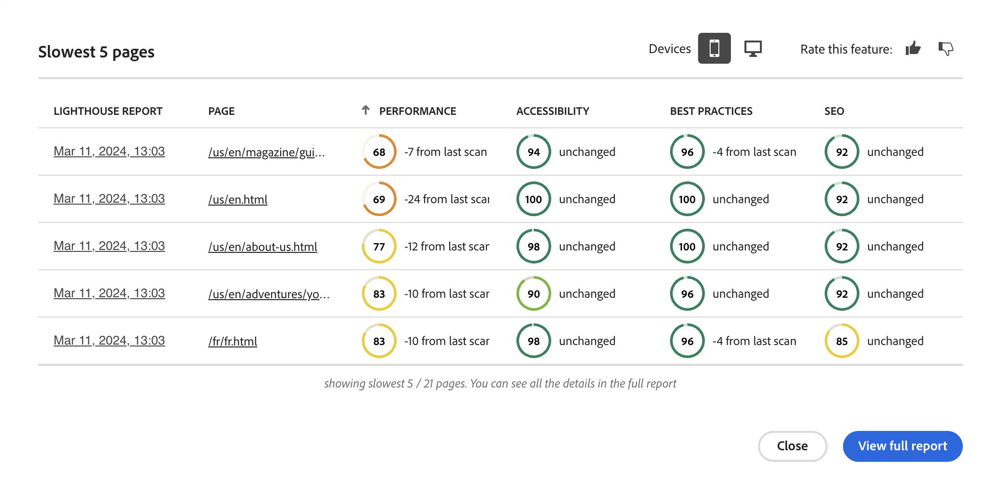
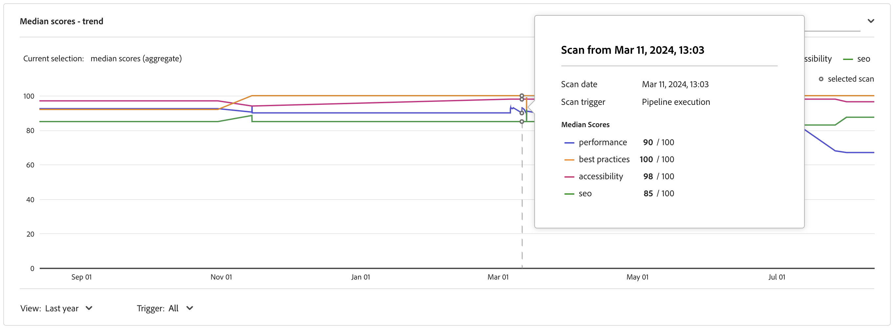
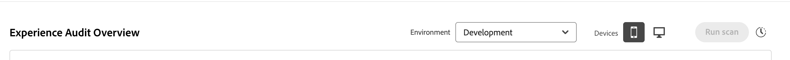
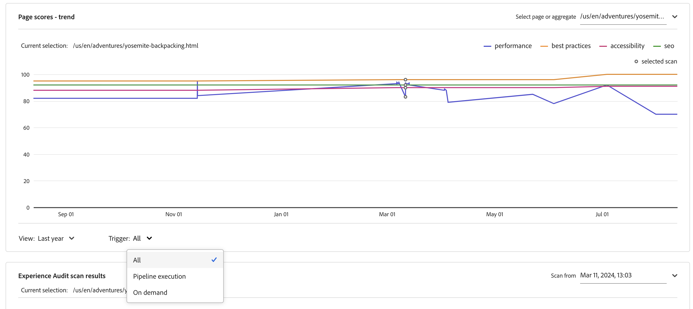
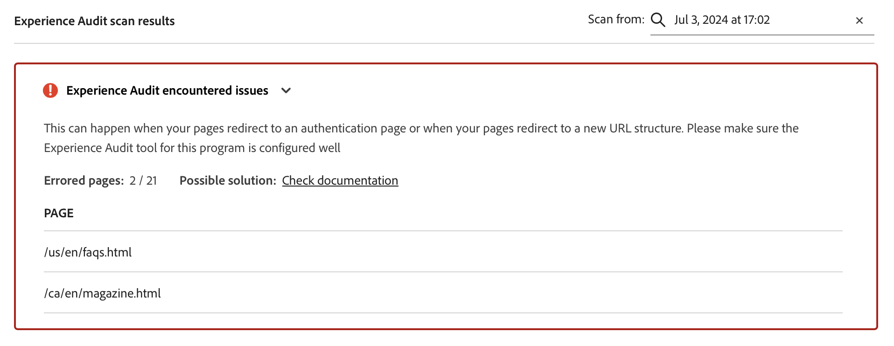

# Experience Audit dashboard {#experience-audit-dashboard}

Discover how Experience Audit validates your deployment process, ensuring that changes meet baseline standards for performance, accessibility, best practices, and SEO. It provides a clear and informative dashboard interface to track these metrics.

>[!NOTE]
>
>This feature is only available to [the early adopter program](/help/implementing/cloud-manager/release-notes/current.md#early-adoption).
>
>For details on the existing Experience Audit feature for AEM as a Cloud Service, see [Experience Audit Testing](/help/implementing/cloud-manager/experience-audit-testing.md).

## Overview {#overview}

Experience Audit validates the deployment process and helps ensure that the changes are deployed:

1. Meet baseline standards for performance, accessibility, best practices, SEO (Search Engine Optimization), and PWA (Progressive Web App).

1. Do not introduce regressions.

Experience Audit in Cloud Manager ensures that the user's experience on the site are of the highest standards.

The audit results are informational and allow the deployment manager to see the scores and the change between the current and previous scores. This insight is valuable to determine if there is a regression that was introduced with the current deployment.

Experience Audit is powered by [Google Lighthouse](https://developer.chrome.com/docs/lighthouse/overview/), an open source tool from Google, and is enabled in all Cloud Manager production pipelines.

## Availability {#availability}

Experience Audit is available for Cloud Manager:

* (Default) Sites production pipelines
* (Optional) Development of full-stack pipelines
* (Optional) Development of front-end pipelines

See the [Configuration section](#configuration) for more information on how to configure the audit for the optional environments.

Audits are run as part of the pipeline. Audits can also be [run on-demand](#on-demand) outside of pipelines.

## Configuration {#configuration}

Experience Audit is available by default for production pipelines. It can be optionally enabled for development of full-stack and front-end pipelines. In all cases, you need to define which content paths are evaluated during pipeline execution.

1. Depending on the type of pipeline you wish to configure, follow the directions to:

   * Add a new [production pipeline](/help/implementing/cloud-manager/configuring-pipelines/configuring-production-pipelines.md) to define the paths you want the audit to evaluate.
   * Add a new [non-production pipeline,](/help/implementing/cloud-manager/configuring-pipelines/configuring-non-production-pipelines.md) if you wish to enable the audit on a front-end or development full-stack pipeline.
   * Or you can [edit an existing pipeline,](/help/implementing/cloud-manager/configuring-pipelines/managing-pipelines.md) and update the existing options.

1. To use Experience Audit when adding or editing a non-production pipeline, select the **Experience Audit** checkbox. You can find this option on the **Source Code** tab.

   

   * Necessary only for non-production pipelines.
   * The **Experience Audit** tab appears when the checkbox is selected.

1. For both production and non-production pipelines, you define the paths that should be included in the Experience Audit on the **Experience Audit** tab.

   * Page paths must start with `/` and are relative to your site.
   * For example, if your site is `wknd.site` and would like to include `https://wknd.site/us/en/about-us.html` in the Experience Audit, enter the path `/us/en/about-us.html`.

   

1. Click **Add Page** and the path is auto-completed with the address of your environment and added to the table of paths.

   

1. Continue to add paths as necessary by repeating the previous two steps.

   * You can add a maximum of 25 paths.
   * If you do not define any paths, the homepage of the site is included in the Experience Audit by default.

1. Click **Save**.

## Experience Audit results {#results}

The results of the Experience Audit are presented in the **Stage testing** phase of the production pipeline via the [production pipeline execution page](/help/implementing/cloud-manager/deploy-code.md).

Experience Audit provides the median Google Lighthouse scores for the [configured pages](#configuration) and the difference in score to the previous scan.

From this summary view in the **Stage Testing** phase of the pipeline, you have two options:

* **[View the slowest pages](#view-slowest-pages)**
* **[View the full report](#view-full-report)**

You can access the full audit results by clicking the **Reports** tab in the Cloud Manager dashboard. In addition to the summary shown in the pipeline run details, you can view [the full report](#view-full-report) directly.

>[!TIP]
>
>The following sections describe how to view the results of the Experience Audit.
>
>* To learn more details on how the audit works, see [Experience Audit Evaluation Details](#details).
>* To know how to run an Experience Audit on demand, see [On-Demand Audit Reports](#on-demand).
>* If you experience issues with the audit, see [Experience Audit Encounters Issues](#issues).
>* For general performance tips, see [General Performance Tips](#performance-tips).

### View the slowest pages {#view-slowest-pages}

Click **View slowest pages** to open the **Slowest 5 pages** dialog box. The five lowest-performing pages that you [configured to audit](#configuration) are shown.

Cloud Manager breaks down the scores by **Performance**, **Accessibility**, **Best Practices**, and **SEO**, showing the deviation of each metric from the previous audit.

By default, the dialog box opens with the scores for mobile devices. You can see desktop scores using the **Devices** toggle near the top of the dialog box.

The dialog box is intended to give you a quick overview. For full details, click **View full report**.

### View the full report {#view-full-report}

You can view the full Experience Audit report by doing the following:

* Click **`View full report`** in the **[Slowest 5 pages](#view-slowest-pages)** dialog.
* Click **`View full report`** when viewing the [execution of a pipeline](#results).
* Click the **Reports** tab in Cloud Manager.

The **Reports** tab of Cloud Manager is opened, showing the **Experience Audit**.

The report is split into two areas:

* **[Page scores &mdash; trend](#trend)** 
* **[Experience Audit scan results](#results)**

#### Page scores &mdash; trend {#trend}

By default, the selected view for **Page scores &mdash; trend** is **median scores** for the **Last 6 months**.

Use the **Select** and **View** drop-downs at the top and bottom of the chart button to select page-specific details and different time frames, respectively. Click **update trend** at the top of the chart to apply the selections and refresh the chart.

When moving the mouse over the chart, a tooltip displays the values for the Google Lighthouse categories at specific points in time.

If you click on the chart at a point in time, a popover opens with detail of that scan. Click the **open experience audit scan** to load that scan results into the **[Experience Audit scan results](#scan-results)** section.

#### Experience Audit scan results {#scan-results}

The **Experience Audit scan results** section gives recommendations on how to improve your score and details of all the pages scanned. It is divided into two sections:

* **[Recommendations](#recommendations)**
* **[Scanned pages](#scanned-pages)**

##### Recommendations {#recommendations}

The **Recommendations** section shows an aggregate set of insights. By default, recommendations for **performance** are displayed. Use the drop-down next to the **Recommendations** heading to change to another category. 

Click the chevron for any recommendation to reveal details about it.

When available, the expanded recommendation details also contain the percentage of the recommendations impact, to help focus on the most impactful changes.

Click the **view pages** link in the details view to see the pages to which the recommendation applies.

##### Scanned Pages {#scanned-pages}

The **Scanned pages** section gives details of scores on all scanned pages. Use the **Prev** and **Next** buttons to page through the results and choose on how many the display should paginate.

Click the link of a particular page updates the **Select** filter of the [**Page scores &mdash; trend** section](#trend) and shows the **Scores &amp; recommendations** tab for the selected page.

The **Raw reports** tab gives you scores for every audit of the page. Click the report date in the **Lighthouse Report** column to retrieve a JSON file of the raw data.

A new tab opens in your browser, directing you to `https://googlechrome.github.io/lighthouse/viewer/`. It automatically loads a signed URL containing the Lighthouse raw JSON report for the selected page, allowing for detailed inspection.

## On-demand scan audit reports {#on-demand}

Besides being run during pipeline execution, Experience Audit reports can also be generated on-demand. This option is a good solution to scan your pages quickly, without having to run a pipeline.

To run an on-demand scan, navigate to the **Reports** tab to see the complete audit report and then click the **Run scan** button. 

The **Run scan** button becomes unavailable and is badged with a clock icon when an on-demand scan is already running.

On-demand scans trigger an Experience Audit for the latest 25 [configured pages](#configuration) and typically finish in a few minutes.

Upon completion, the scores chart is automatically updated, and you can inspect the results exactly as for a pipeline execution scan.

You can filter the scores chart based on the trigger type by using the **Trigger** selector. 

>[!NOTE]
>
>An on-demand scan can be started only if the environment is not deleted and there are no other pending scans on the same environment.

## Experience Audit Encounters Issues {#issues}

If [pages you configured](#configuration) to be audited were not available or there were other errors in the audit, Experience Audit reflects this fact.

The pipeline shows an expandable error section to view the relative URL paths it could not access.

If viewing the full report, details are shown in the **[Experience Audit scan results](#results)** section, which is also expandable.

Some reasons that the pages might not be available are that:

* The configuration blocks access.
* The page does not exist.
* The page redirects requiring authentication other than basic.
* An internal issue occurred.
* Etc.

>[!TIP]
>
>[Accessing the raw reports](#scanned-pages) for a page can provide details on why the page could not be audited.

## General Performance Tips {#performance-tips}

Two of the most common impactful issues that are easy to fix relate to Cumulative Layout Shifts (CLS) and Largest Contentful Paint (LCP).

You can improve these areas by doing the following:

* Not lazy loading the images above the fold &mdash; the content that is visible in the browser without needing to scroll down.
* Properly prioritizing how resources are loaded (for example, by asynchronously loading the images below the fold after the document has loaded).
* Prefetching JavaScript and CSS files that are used to render content above the fold (if they are necessary).
* Reserving the vertical space by assigning an aspect ratio to containers that either load slowly or are rendered later.
* Converting images to WebP format to reduce their size.
* Using `<picture>` and image `srcset` with varying image sizes for different viewport sizes (and ensuring that the resizing works).

## Experience Audit Evaluation Details {#details}

The following details provide additional information on how the Experience Audit evaluates your site. They are not necessary for general usage of the feature and are provided here for completeness.

* The audit scans the origin (`.com`) domain from the [configured Experience Audit page paths](#configuration) of the publisher to simulate real user experiences, helping you make better decisions about managing and optimizing your websites.
* In production full-stack pipelines, the staging environment is scanned. To ensure that the audit provides relevant details during auditing, the staging environment's content should be as close as possible to the production environment.
* The pages displayed in the **Select** drop-down in the [**Page scores &mdash; trend** section](#trend) are all known pages that the Experience Audit scanned in the past.
* [A recommendation](#recommendations) can have a potential gain and a difference from the previous scan.
* Experience Audit estimates potential improvements by processing the raw report for each page. It correlates wasted bytes or milliseconds with insights, assigning a weighted impact on the performance score. The audit provides this information, and the affected pages, to help decide which recommendation to pursue.
See the [General Performance Tips section](#performance-tips) for more details.
* A front end pipeline may deploy to an existing environment, and multiple front end pipelines can target the same environment. Because scan results are aggregated at the environment level, the scores, trends, and recommendations are consistent. These results are displayed in the selected environment, regardless of which pipeline triggered the scan.
