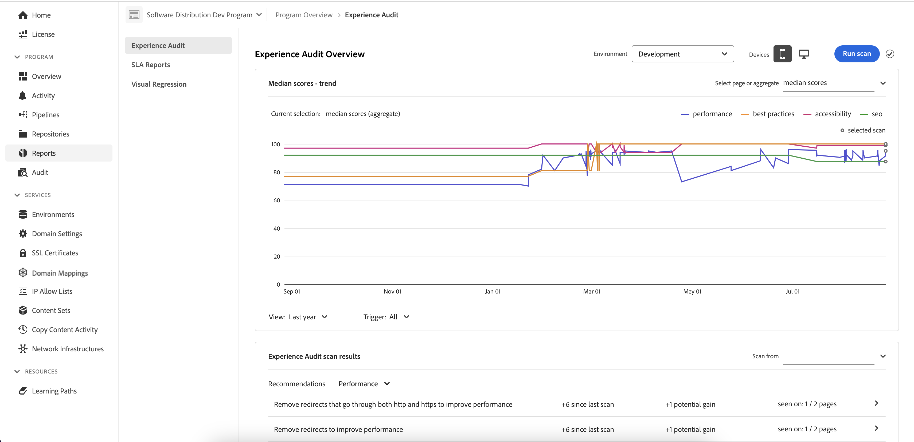
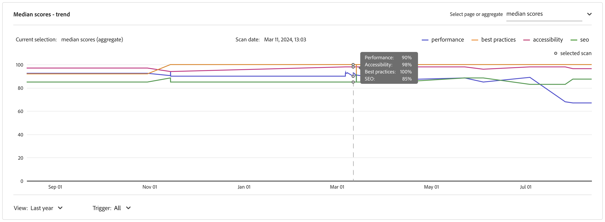
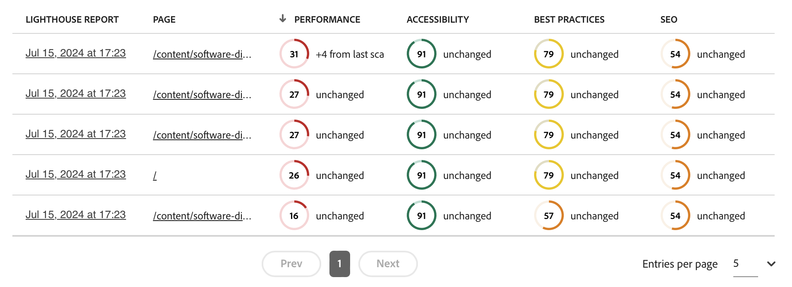
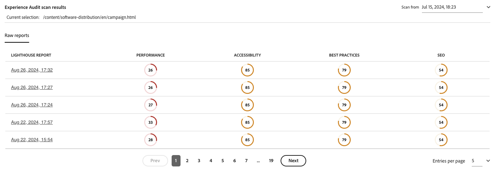

# Experience Audit Dashboard {#experience-audit-dashboard}

Learn how Experience Audit validates your deployment process and helps ensure that changes deployed meet baseline standards for performance, accessibility, best practices, and SEO through a clear, informative dashboard interface.

>[!NOTE]
>
>This feature is only available to [the early adopter program.](/help/implementing/cloud-manager/release-notes/current.md#early-adoption)
>
>For details on the existing Experience Audit feature for AEM as a Cloud Service, see [Experience Audit Testing](/help/implementing/cloud-manager/experience-audit-testing.md).

## Overview {#overview}

Experience Audit validates the deployment process and helps ensure that changes deployed:

1. Meet baseline standards for performance, accessibility, best practices, SEO (Search Engine Optimization), and PWA (Progressive Web App).

1. Do not introduce regressions.

Experience Audit in Cloud Manager ensures that the user's experience on the site are of the highest standards.

The audit results are informational and allow the deployment manager to see the scores and the change between the current and previous scores. This insight is valuable to determine if there is a regression that was introduced with the current deployment.

Experience Audit is powered by [Google Lighthouse](https://developer.chrome.com/docs/lighthouse/overview/), an open source tool from Google and is enabled in all Cloud Manager production pipelines.

>[!TIP]
>
>You configure what pages are included in the Experience Audit when you [set up your pipeline](/help/implementing/cloud-manager/configuring-pipelines/configuring-production-pipelines.md#full-stack-code).

## Availability {#availability}

Experience Audit is available for Cloud Manager:

* Sites production pipelines, by default
* Development full-stack pipelines, optionally

See the section [Configuration section](#configuration) for more information.

## Configuration {#configuration}

Experience Audit is available by default for production pipelines and can be enabled for development pipelines. In both cases, you need to define which content paths are evaluated during pipeline execution.

1. Follow the directions to add a new [production pipeline](/help/implementing/cloud-manager/configuring-pipelines/configuring-production-pipelines.md) or a new [non-production pipeline.](/help/implementing/cloud-manager/configuring-pipelines/configuring-non-production-pipelines.md) Or you can [edit an existing pipeline.](/help/implementing/cloud-manager/configuring-pipelines/managing-pipelines.md)

1. If you are adding or editing a non-production pipeline for which you want to use Experience Audit, you must select the **Experience Audit** checkbox on the **Source Code** tab.

   

   * This is only necessary for non-production pipelines.
   * The **Experience Audit** tab appears when the checkbox is selected.

1. For both production and non-production pipelines, you define the paths that should be included in the Experience Audit on the **Experience Audit** tab.

   * Page paths must start with `/` and are relative to your site.
   * For example, if your site is `wknd.site` and would like to include `https://wknd.site/us/en/about-us.html` in the Experience Audit, enter the path `/us/en/about-us.html`.

   

1. Tap or click **Add Page** and the path is auto-completed with the address of your environment and added to the table of paths.

   

1. Continue to add paths as necessary by repeating the previous two steps.

   * You can add a maximum of 25 paths.
   * If you do not define any paths, the homepage of the site is included in the Experience Audit by default.

1. Click **Save** to save your pipeline.

## Experience Audit Results {#results}

The results of the Experience Audit are presented in the **Stage testing** phase of the production pipeline via the [production pipeline execution page](/help/implementing/cloud-manager/deploy-code.md).

Experience Audit provides the median Google Lighthouse scores for the [configured pages](#configuration) and the difference in score to the previous scan.

From this summary view in the **Stage Testing** phase of the pipeline, you have two options:

* **[View slowest pages](#view-slowest-pages)**
* **[View full report](#view-full-report)**

### View Slowest Pages {#view-slowest-pages}

Tapping or clicking **View slowest pages** opens the **Slowest 5 pages** dialog, showing the five lowest-performing pages that you [configured to audit.](#configuration)

The scores are broken down by **Performance**, **Accessibility**, **Best Practices**, and **SEO** along with the deviation of each metric from the last audit.

By default, the dialog opens with the scores for mobile devices. You can change this to desktop scores using the **Devices** toggle at the top of the dialog.

The dialog is intended for a quick overview. For full details, tap or click **View full report**.

### View Full Report {#view-full-report}

You can view the full Experience Audit report by:

* Tapping or clicking **View full report** in the **[Slowest 5 pages](#view-slowest-pages)** dialog.
* Tapping or clicking **View full report** when viewing the [execution of a pipeline.](#results)
* Tapping or clicking the **Reports** tab in Cloud Manager.

The **Reports** tab of Cloud Manager is opened, showing the **Experience audit**.

The report is split into two areas:

* **[Page scores - trend](#trend)** 
* **[Experience audit scan results](#results)**

#### Page scores - trend {#trend}

By default, the selected view for **Page scores - trend** is **median scores** for the **Last 6 months**.

Use the **Select** and **View** drop-downs at the top and bottom of the chart and the **update trend** button to view page-specific details and different time frames, respectively.

When moving the mouse over the chart, a tooltip displays the values for the Google Lighthouse categories at specific points in time.

If you tap or click on the chart at a point in time, a popover opens with detail of that scan. Tap or click the **open experience audit scan** to load that scan results into the **[Experience audit scan results](#results)** section.

#### Experience Audit Scan Results {#results}

The **Experience audit scan results** section gives recommendations on how to improve your score and details of all the pages scanned. It is divided into two sections:

* **[Recommendations](#recommendations)**
* **[Scanned pages](#scanned-pages)**

##### Recommendations {#recommendations}

The **Recommendations** section shows an aggregate set of insights. By default, recommendations for **performance** are displayed. Use the drop-down next to the **Recommendations** heading to change to another category of recommendations. 

Tap or click the chevron for any recommendation to reveal details about it.

When available, the expanded recommendation details also contains the percentage of the recommendations impact, to help focus on the most impactful changes.

Tap or click the **view pages** link in the details view to see the pages to which the recommendation applies.

##### Scanned Pages {#scanned-pages}

The **Scanned pages** section gives details scores on all scanned pages. You can use the **Prev** and **Next** buttons page through the results and choose on how many the display should paginate.

Tapping or clicking the link of a particular page updates the **Select** filter of the [**Page scores - trend** section](#trend) and shows the **Scores &amp; recommendations** tab for the selected page.

The **Raw reports** tab gives you scores for every audit of the page. Tap or click the **Download** icon to retrieve a JSON file of the raw data.

>[!TIP]
>
>The site [`https://googlechrome.github.io/lighthouse/viewer/`](https://googlechrome.github.io/lighthouse/viewer/) can be used to render the downloaded raw JSON report for the selected page.

## Experience Audit Encounters Issues {#issues}

If [pages you configured](#configuration) to be audited were not available, Experience Audit reflects this.

The pipeline shows an expandable error section to view the relative URL paths could not access.

If viewing the full report, details are shown in the **[Experience audit scan results](#results)** section.

Reasons for the pages not being available may be:

* Configuration blocks access
* The page does not exist
* The page redirects requiring authentication other than basic
* An internal issue
* Etc.

>[!TIP]
>
>Accessing the raw reports for a page can provide details on why the page could not be audited.

## General Performance Tips {#performance-tips}

Two of the most common impactful issues that are easy to fix are related to Cumulative Layout Shifts (CLS) and Largest Contentful Paint (LCP).

These could be improved by:

* Not lazy loading the images above the fold (the content visible in the browser without needing to scroll down).
* Properly prioritizing how resources are loaded (e.g. by asynchronously loading the images below the fold after the document has loaded).
* Prefetching JavaScript and CSS files that are used to render content above the fold (if they are necessary).
* Reserving the vertical space by assigning an aspect ratio to containers that either load slowly or are rendered later.
* Converting images to WebP format to reduce their size
* Using `<picture>` and image `srcset` with varying image sizes for different viewport sizes (and ensuring that the resizing works).

## Details {#details}

* Although the [configured Experience Audit page paths](#configuration) show the `.com` domain of the publisher, the audit scans the origin (`.net` equivalent domain), to ensure issues introduced during development are detected.
  * The `.com` domain uses a CDN and could yield better scores or contain cached results.
* In production full-stack pipelines, the staging environment is scanned.
  * To ensure the audit provides relevant details during auditing, the staging environment's content should be as close as possible to the production environment.
* The pages displayed in the **Select** dropdown in the [**Page scores - trend** section](#trend) are all known pages that were scanned in the past by the Experience Audit.
* A recommendation can have a potential gain and a difference from the previous scan.
  * Experience Audit estimates the potential gain by processing the raw report for each page and correlating the wasted bytes or milliseconds with an insight that has a weighted impact on the performance score.
  * The audit provides this information (as well as the affected pages) to help decide which recommendation to pursue.
  * For more details, please see the [General Performance Tips section](#performance-tips)

<!-- Begin old content -->

### Insights {#insights}

The **Insights** tab provides a brief description of actionable recommendations to improve the performance of your site.

Select the **Show More** button to open the full dashboard.

In the **Insights &amp; recommendations** section, you find a detailed listing of actionable recommendations with a clear value indicator tied to gains that can be expected in performance, along with the impacted percentage of pages. This lets you easily prioritize these recommendations for your teams.

To navigate back to the production pipeline execution page, simply select the back arrow on your browser.

### Lighthouse Scores {#lighthouse}

The **Lighthouse scores** tab is a summary of the Lighthouse scores for the code deployed in this pipeline execution.

Select the **Show More** button to open the full dashboard.

In the **Lighthouse scores** section, you find a trended view of the various scores. Select **Performance**, **Accessibility**, **PWA**, or **SEO** to see the monthly trended view for those values.

Each point on the graph is the average across all deployments in the month of interest.

To navigate back to the production pipeline execution page, simply select the back arrow on your browser.

### Pages {#pages}

The **Pages** tab is a summary of the performance of pages specifically configured to be analyzed.

Select the **Show More** button to open the full dashboard.

The **Pages** section provides a list of pages that were tested and their most current Lighthouse performance scores and the breakdown.

You configure what pages are included in the Experience Audit when you [set up your pipeline](/help/implementing/cloud-manager/configuring-pipelines/configuring-production-pipelines.md#full-stack-code).

To navigate back to the production pipeline execution page, simply select the back arrow on your browser.

### Issues {#issues}

The **Issues** tab summarizes any performance problems detected in the code of this pipeline execution.

Select the **Show More** button to open the full dashboard.

In the **Insights &amp; recommendations** section, you find a more detail listing of actionable recommendations with a clear value indicator tied to gains that can be expected in performance, along with the impacted percentage of pages. This lets you easily prioritize these recommendations for your teams.

To navigate back to the production pipeline execution page, simply select the back arrow on your browser.

### Page Detail {#page-detail}

If you select the link of a page on either a tab of the **Experience Audit** section of the pipeline execution page tab or in the **Pages** section of the full Experience Audit dashboard, you can view the detail of a particular page.

You can see how the individual pages scored for the specific test along with the change from the previous test run.

Clicking into the details of any individual page provides information on the elements of the page that were evaluated and guidance to fix issues if opportunities for improvement are detected.

To navigate back to the production pipeline execution page, simply select the back arrow on your browser.

## Enabling for Development Pipelines {#enabling}

Experience Audit Dashboard is available for Cloud Manager Sites production pipelines by default. You can enable it for development full-stack pipelines as well through a configuration on the pipeline.

1. [Edit the pipeline.](/help/implementing/cloud-manager/configuring-pipelines/managing-pipelines.md#editing-pipelines)

1. In the **Edit Non-Production Pipeline** window,

1. The **Experience Audit** tab appears in the edit pipeline window and you can [configure the pages](#configuration) you wish to include in the audit.
