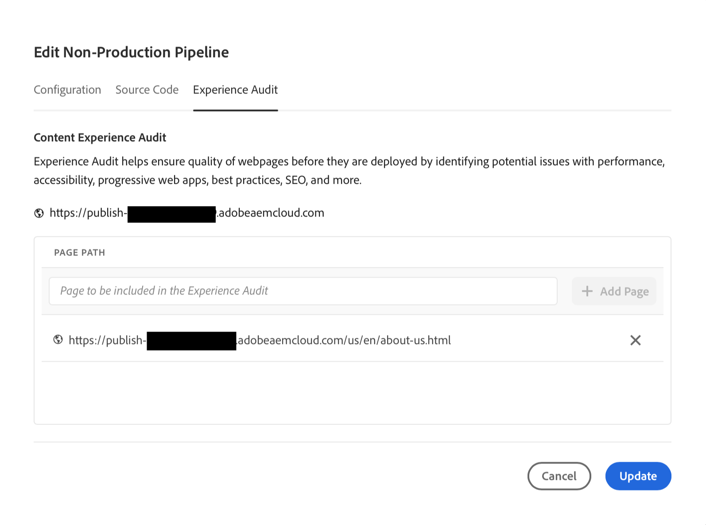

# Experience Audit Testing {#experience-audit-testing}

>[!CONTEXTUALHELP]
>id="aemcloud_nonbpa_expaudittesting"
>title="Experience Audit Testing"
>abstract="Learn how Experience Audit validates your deployment process and helps ensure that changes deployed meet baseline standards for performance, accessibility, best practices, and SEO."

Learn how Experience Audit validates your deployment process and helps ensure that changes deployed meet baseline standards for performance, accessibility, best practices, and SEO.

## Overview {#overview}

Experience Audit is a feature available in Cloud Manager Sites Production pipelines that validates the deployment process and helps ensure that changes deployed:

1. Meet baseline standards for performance, accessibility, best practices, SEO (Search Engine Optimization), and PWA (Progressive Web App).

1. Do not introduce regressions.

Experience Audit in Cloud Manager ensures that the user's experience on the site are of the highest standards.

The audit results are informational and allow the deployment manager to see the scores and the change between the current and previous scores. This insight is valuable to determine if there is a regression that was introduced with the current deployment.

Experience Audit is powered by Google Lighthouse, an open source tool from Google.

>[!INFO]
>
>Effective August 31st, 2023, Experience Audit will transition to showcasing results specific to the mobile platform. Mobile performance metrics typically register lower than those of desktop, so you should anticipate a shift in the reported performance following this change.

## Availability {#availability}

Experience Audit is available for Cloud Manager:

* Sites production pipelines, by default.
* Front-end development pipelines, optionally.

See the [Configuration section](#configuration) for more information on how to configure the audit for the optional environments.

## Configuration {#configuration}

Experience Audit is available by default for production pipelines. It can be be optionally enabled for front-end development pipelines. In all cases, you need to define which content paths are evaluated during pipeline execution.

You configure what pages are included in the Experience Audit when you set up your pipeline.

1. Depending on the type of pipeline you wish to configure, follow the directions to:

   * Add a new [production pipeline,](/help/implementing/cloud-manager/configuring-pipelines/configuring-production-pipelines.md) if you wish to define the paths to be evaluated by the audit.
   * Add a new [non-production pipeline,](/help/implementing/cloud-manager/configuring-pipelines/configuring-non-production-pipelines.md) if you wish to enable the audit on a front-end or development full-stack pipeline.
   * Or you can [edit an existing pipeline,](/help/implementing/cloud-manager/configuring-pipelines/managing-pipelines.md) and update the existing options.

1. If you are adding or editing a non-production pipeline for which you want to use Experience Audit, you must select the **Experience Audit** checkbox on the **Source Code** tab.

   

   * This is only necessary for non-production pipelines.
   * The **Experience Audit** tab appears when the checkbox is selected.

1. For both production and non-production pipelines, you define the paths that should be included in the Experience Audit on the **Experience Audit** tab.

   * Page paths must start with `/` and are relative to your site.
   * For example, if your site is `wknd.site` and would like to include `https://wknd.site/us/en/about-us.html` in the Experience Audit, enter the path `/us/en/about-us.html`.

   

1. Tap or click **Add Page** and the path is auto-completed with the address of your environment and added to the table of paths.

   

1. Continue to add paths as necessary by repeating the previous two steps.

   * You can add a maximum of 25 paths.
   * If you do not define any paths, the homepage of the site is included in the Experience Audit by default.

1. Click **Save** to save your pipeline.

## Understanding Experience Audit Results {#understanding-experience-audit-results}

Experience Audit provides aggregate and detailed page-level test results via the [production pipeline execution page](/help/implementing/cloud-manager/deploy-code.md).

* Aggregate metrics measure the average scores across the pages that were audited for performance, accessibility, best practices, SEO (Search Engine Optimization). 
* Individual page level scores are also available via drill down.
* Details of the scores are available to view the results of the individual tests along with guidance on how to remediate any issues that were identified.
* A history of the test results is persisted within Cloud Manager to determine if changes that are being introduced in the pipeline include any regressions from the previous run.

### Aggregate Scores {#aggregate-scores}

The aggregate level score takes the average score of the pages that are included in the run. The change at the aggregate level represents the average score of the pages in the current run compared to the average of the scores from the previous run, even if the collection of pages configured to be included has been changed between runs.

There is an aggregate level score for each test types such as performance, accessibility, SEO, and best practices.

The change metric can have one of the following values.

* **Positive value** - The pages have improved on the selected test since the last production pipeline run.

* **Negative value** - the pages have regressed on the selected test since the last production pipeline run.

* **No Change** - The pages have scored the same since the last production pipeline run.

* **N/A** - There was no previous score available to compare.

### Page-Level Scores {#page-level-scores}

By drilling into any of the tests, more detailed page level scoring is available. You can see how the individual pages scored for the specific test along with the change from the previous test run.

Clicking into the details of any individual page provides information on the elements of the page that were evaluated and guidance to fix issues if opportunities for improvement are detected.

