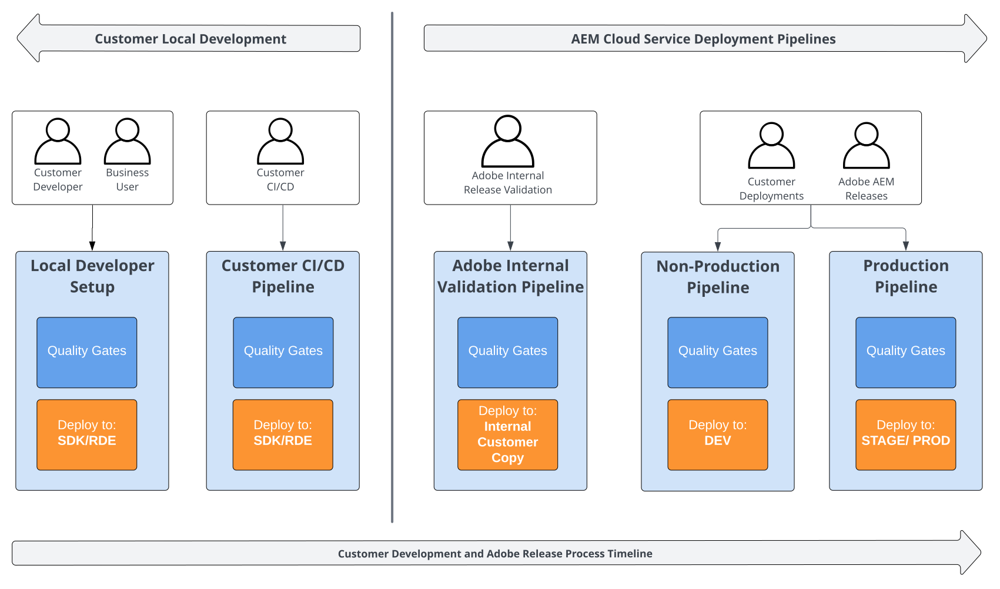
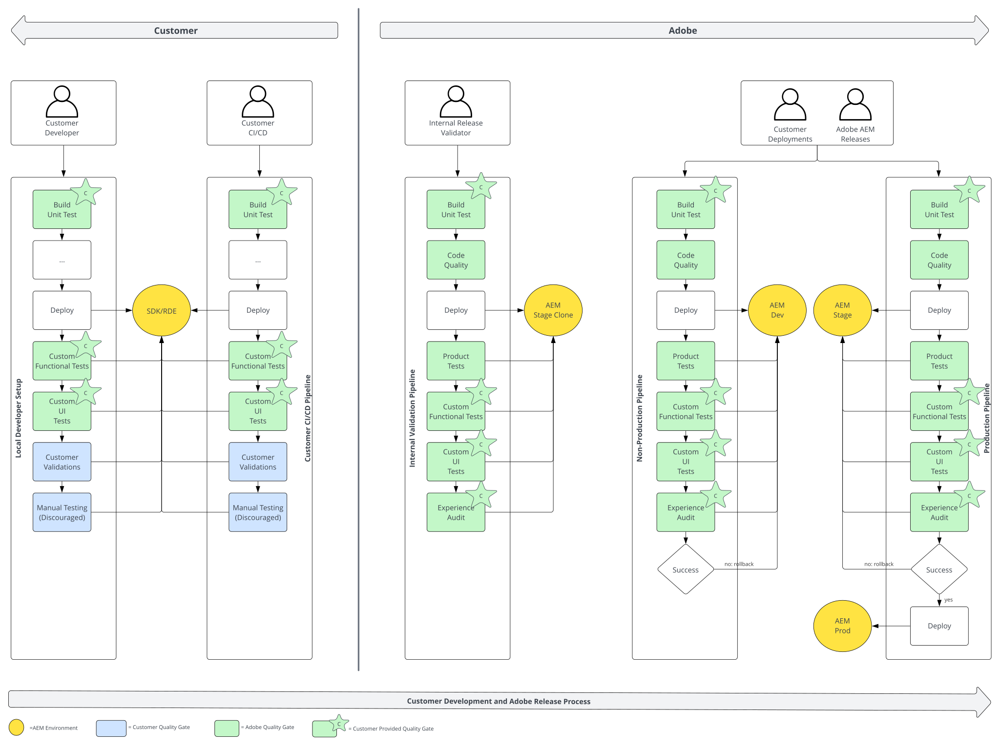

# Introduction {#functional-testing-introduction}

>[!CONTEXTUALHELP]
>id="aemcloud_nonbpa_functionaltesting"
>title="Functional Testing"
>abstract="Learn about the three different types of functional testing built into the AEM as a Cloud Service deployment process to ensure the quality and reliability of your code."

Discover the quality gates available in the [AEM as a Cloud Service deployment process](/help/implementing/cloud-manager/deploy-code.md) and the various types of built-in functional testing. Learn how you can contribute and optimize their use within the framework of a comprehensive testing strategy.

## About functional testing

The following diagram provides a high-level overview of the available pipelines in the context of an overall testing strategy and the [AEM as a Cloud Service deployment process](/help/implementing/cloud-manager/deploy-code.md).

## Purpose of functional testing

The purpose of the AEM Cloud Service deployment pipelines is to facilitate robust and secure deployments at various stages of your development and AEM product release lifecycle. These pipelines incorporate multiple quality gates at different levels to ensure the integrity and safety of deployments for both your AEM application changes and AEM product updates.

Adobe provides several built-in quality gates, while others require your intervention for implementation and configuration. These quality gates are versatile, applying at various lifecycle stages and integrating directly into your development setup and CI/CD processes.

The built-in quality gates primarily validate the functionality of the AEM product within the context of your AEM application. In contrast, the custom quality gates you set up are designed to verify that your application's critical features and user interactions perform as intended. Collectively, these two sets of quality gates work together to ensure robust and secure automated deployments for both your code modifications and AEM product updates.

It is important to note that these quality gates are not intended to be a comprehensive testing framework for your entire testing strategy. The AEM product is subjected to extensive testing before entering the AEM cloud service deployment process. Similarly, your application should already be of high quality before it reaches the deployment phase. This approach ensures that the quality gates focus on their primary objective of safeguarding the deployment process, rather than being a substitute for a full testing regimen.

## Quality gates in testing

The following diagram provides a detailed view of available quality gates and their use in the overall testing strategy and the [AEM as a Cloud Service deployment process](/help/implementing/cloud-manager/deploy-code.md).

### Summary customer provided quality gates

|                               |      Unit Tests       |    Custom  Functional Tests     |        Custom  UI Tests         | Customer  Validations | Manual  Testing |
|:------------------------------|:---------------------:|:-----------------------------------:|:-----------------------------------:|:-------------------------:|:-------------------:|
| **Production Pipeline**       | Yes Blocking  |  Yes Blocking 60m Timeout   |  Yes Blocking 30m Timeout   |            No             |         No          |
| **Non-Production Pipeline**   | Yes Blocking  | Opt-In Blocking 60m Timeout | Opt-In Blocking 30m Timeout |            No             |         No          |
| **Adobe Internal Validation** | Yes Blocking  |  Yes Blocking 60m Timeout   |  Yes Blocking 30m Timeout   |            No             |         No          |
| **Customer CI/CD**            |          Yes          |                 Yes                 |                 Yes                 |            Yes            |         Yes         |
| **Customer Local Developer**  |          Yes          |                 Yes                 |                 Yes                 |            Yes            |         Yes         |

### Unit test

You are encouraged to provide the unit tests for your AEM application, which are the foundation of every testing strategy. They are intended to run fast and often and give early and fast feedback. They are tightly integrated into the developer workflows, your own CI/CD and the AEM cloud service deployment pipelines.

They are implemented using JUnit and are executed with Maven. See the [core module of the AEM Project Archetype](https://experienceleague.adobe.com/en/docs/experience-manager-core-components/using/developing/archetype/using#unit-tests) for an example unit test for AEM and getting started.

### Code quality

This quality gate is configured out-of-the-box and runs static code analysis on your AEM application code.

See [Code Quality Testing](/help/implementing/cloud-manager/code-quality-testing.md) and [Custom code quality rules](/help/implementing/cloud-manager/custom-code-quality-rules.md) for more information.

### Product tests

Product functional tests are stable HTTP integration tests (ITs) for core AEM functionality, including authoring and replication tasks. Adobe provides and maintains them out-of-the-box. They are intended to prevent changes to custom application code from being deployed if it breaks core functionality in the AEM product.

They use JUnit for implementation, run with Maven, and rely on the official [AEM Testing Clients](https://github.com/adobe/aem-testing-clients). The product test suite is maintained as
an [open-source project](https://github.com/adobe/aem-test-samples/tree/aem-cloud/smoke), follows best-practices and can be considered a good starting point for the implementation of your tests.

### Custom functional tests

Similar to the product tests, customer functional tests are HTTP integration tests (ITs) implemented with JUnit, run using Maven, and built on top of the official [AEM Testing Clients](https://github.com/adobe/aem-testing-clients).

>[!NOTE]
>
>Custom functional tests run in both production and non-production (opt-in) pipelines used for AEM application change deployments and AEM product push updates. They play a crucial role in ensuring your application functions properly and enhancing release safety. The customer functional tests are also executed in internal pre-release validation pipelines for each customer, which helps provide early feedback.

To maintain efficient pipeline runs, Adobe advises focusing on key features and primary user interaction flows, aiming for a functional test runtime of around 15 minutes or less. Full functional test suites that exceed this time should be executed as part of the general customer validation pipelines during the development process.

See [open-sourced product tests](https://github.com/adobe/aem-test-samples/tree/aem-cloud/smoke) or the [it.tests module of the AEM Projects Archetype](https://github.com/adobe/aem-project-archetype/tree/develop/src/main/archetype/it.tests) for examples.

See [Java Functional Tests](/help/implementing/cloud-manager/java-functional-testing.md) for more information.

### Custom UI tests

To maximize risk control for your customer-specific development, Adobe encourages you to capture critical UI tests into AEM as a Cloud Service. Keep them limited but focused on maximizing their impact on the customer experience.

The tests are packaged in a Docker image - designed to be as volatile as possible (with support for Cypress, Playwright, Selenium, Java, and JavaScript). They follow the same characteristics and purposes like the custom functional tests.

>[!NOTE]
>
>Custom UI tests are executed in both production and non-production (opt-in) pipelines used for AEM application change deployments and AEM product push updates. They are essential in ensuring your application's proper functioning and enhancing release safety. The customer UI tests are also executed in internal pre-release validation pipelines for each customer, which helps provide early feedback.
>
>Non-Selenium containers should execute tests using an HTTP proxy based on the environment variables in the [UI Testing Section](/help/implementing/cloud-manager/ui-testing.md#custom-ui-testing).

To keep pipeline executions efficient, Adobe recommends focusing on key features and main user interaction flows. Full UI test suites that exceed this quality gate should be executed as part of the general customer validation pipelines. Incorporate them into the customer's development process.

See [open-sourced example tests](https://github.com/adobe/aem-test-samples/tree/aem-cloud/) or the [ui.tests module of the AEM Projects Archetype](/help/implementing/cloud-manager/ui-testing.md) for examples.

See [Custom UI Testing](/help/implementing/cloud-manager/ui-testing.md#custom-ui-testing) for more information.

### Experience audit

The experience audit quality gate is performing [Google Lighthouse](https://developer.chrome.com/docs/lighthouse/overview/) audits against the customer's webpage.

This quality gate is provided by AEM out-of-the-box, but is not blocking the deployment pipelines. By default, an audit against the root page (`/`) of the publish instance is performed. You can contribute by configuring up to 25 custom paths that are considered for audits.

See [Experience Audit Testing](/help/implementing/cloud-manager/experience-audit-dashboard.md) for more information.

### Customer validations

The customer validations quality gate is a placeholder for the customer's own testing strategy and effort, executed before the customer's application changes reach the AEM cloud deployment pipelines.

Here you can choose the tools and frameworks you prefer. In contrast to customer function tests and custom UI tests, there is no AEM as a Cloud Service-related limits. As such, Adobe recommends that you perform long-running functional and UI testing here.

While you can choose any tool and framework, Adobe suggests aligning HTTP-based integration and UI tests with the tools and frameworks used in the custom functional and UI test quality gates. Additionally, Adobe recommends incorporating [Rapid Development Environments (RDE)](/help/implementing/developing/introduction/rapid-development-environments.md) into your local testing strategy to mirror AEM cloud environments closely.

### Manual testing

The Manual testing quality gate is a placeholder for customers who do manual testing. Because AEM cloud pipelines do not support manual testing, it must be included in your local testing strategy.

For manual testing, it can be useful to integrate with an additional AEM Cloud Service development environment. 
