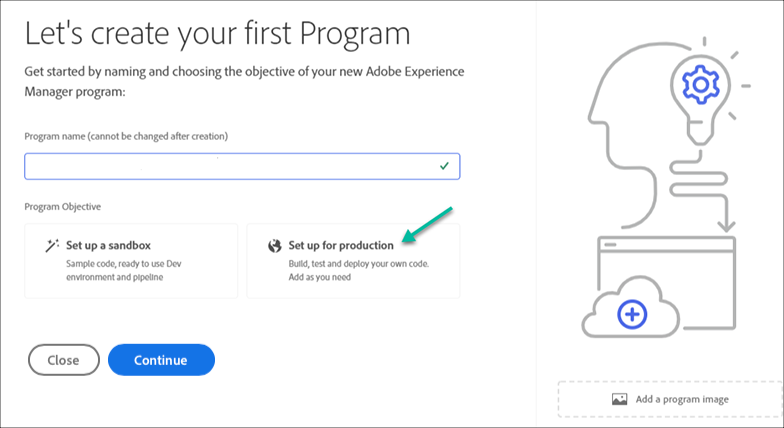

# Creating a Production Program {#create-production-program}

A production program is intended for a user who is familiar with AEM and Cloud Manager and is ready to start writing, building, and testing code with the objective of deploying it to host live traffic.

Learn more about program types in the document [Understanding Program and Program Types.](program-types.md)

## Video Tutorials {#video-tutorials}

You can watch these two tutorial videos to learn how to create a program in Cloud Manager or [follow our documented instructions.](#create)

>[!VIDEO](https://video.tv.adobe.com/v/334953)

>[!VIDEO](https://video.tv.adobe.com/v/334954)

## Create a Production Program {#create}

Follow these steps to create a production program.

1. Log into Cloud Manager at [my.cloudmanager.adobe.com](https://my.cloudmanager.adobe.com/) and select the appropriate organization.

1. Click on **Add Program** from the top-right corner of the screen.

    

1. Select **Set up for Production** in the Create Program wizard to create a production program. You can accept the default program name or edit it before selecting **Create**.

   

1. In the next tab, select the solutions to include in the program.

   

1. Click on the chevron before the solution names to reveal optional add-ons such as selecting the **Commerce** add-on option under **Sites**.

   

1. With your solutions and add-ons selected, click **Create**.

Your program is created by Cloud Manager and is displayed and selectable on the landing page.

## Access Your Program {#acessing}

1. Once you see your program card on the landing page, select the ellipsis button to view the menu options available to you.

   

1. Select **Program Overview** to navigate to the Cloud Manager's **Overview** page.  

1. The main call-to-action card on the overview page will guide you through creating an environment, a non-production pipeline, and finally a production pipeline.

   

If at any time you need to switch to another program or return to the overview page to create another program, click on your program name in the top-left of the screen to reveal the **Navigate to** option.

