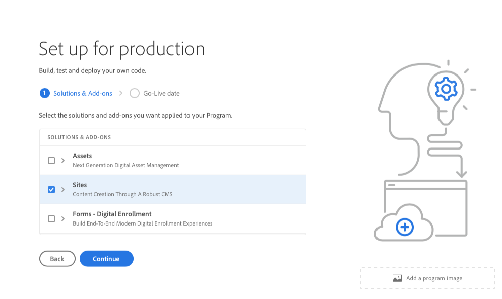
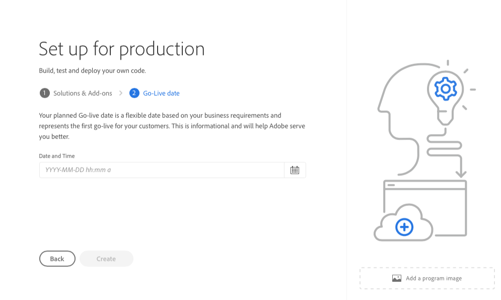

# Creating Production Programs {#create-production-program}

A production program is intended for a user who is familiar with AEM and Cloud Manager and is ready to start writing, building, and testing code with the objective of deploying it to host live traffic.

Learn more about program types in the document [Understanding Program and Program Types.](program-types.md)

## Create a Production Program {#create}

Follow these steps to create a production program. Note that depending on your organization's entitlements, you may see [additional options](#options) when adding your program.

1. Log into Cloud Manager at [my.cloudmanager.adobe.com](https://my.cloudmanager.adobe.com/) and select the appropriate organization.

1. On the **[My Programs](/help/implementing/cloud-manager/navigation.md#my-programs)** console, tap or click **Add Program** in the top-right corner of the screen.

    

1. Select **Set up for Production** in the Create Program wizard to create a production program and provide a program name.

   

1. Optionally, you can add an image to the program by dragging and dropping an image file to the **Add a program image** target or clicking it to select an image from a file browser. Select **Continue**.

1. On the **Solutions &amp; Add-ons** tab, select the solutions to include in the program.

   * If you are not sure if you need one or more programs for the various solutions you have available, select the one most of interest to you. You can activate additional solutions by [editing the program](/help/implementing/cloud-manager/getting-access-to-aem-in-cloud/editing-programs.md) later. See the [Introduction to Production Programs document](/help/implementing/cloud-manager/getting-access-to-aem-in-cloud/introduction-production-programs.md) for more program setup recommendations.
   * At least one solution is required for program creation.
   * If you selected the **[Enable Enhanced Security](#security)** option, you are allowed to select only as many solutions for which HIPAA entitlements are available.

   

1. Click the chevron before the solution names to reveal optional add-ons such as selecting the **Commerce** add-on option under **Sites**.

   

1. With your solutions and add-ons selected, click **Continue**.

1. On the **Go-Live Date** tab, enter the date you plan your production program to go live.

   

   * This date can be edited at any time.
   * This date is for informational use only and triggers the Go Live widget on the [**Program Overview** page](/help/implementing/cloud-manager/getting-access-to-aem-in-cloud/editing-programs.md#program-overview) to provide in-product links to AEM as a Cloud Service best practice documentation in a timely manner to align with your journey culminating in a successful and smooth Go Live experience.

1. Click **Create**.

Your program is created by Cloud Manager and is displayed and selectable on the landing page.

## Additional Production Program Options {#options}

Depending on what entitlements are available to your organization, you may have additional options available to you when you create a production program.

### Security {#security}

If you have the necessary entitlements, the **Security** tab will be shown as the first tab in the **Set up for Production** dialog.

The **Security** tab provides the options to activate **HIPAA** and/or **WAF-DDOS Protection** for your production program.

Adobe HIPAA Compliant and Web Application Firewall (WAF) facilitates cloud-based security as part of a multi-layered approach for protecting against vulnerabilities.

   * **HIPAA** - This option enables Adobe's HIPPA-ready solution implementation.
     * [Learn more](https://www.adobe.com/go/hipaa-ready) about Adobe's HIPAA ready solution implementation.
     * HIPAA cannot be enabled or disabled after program creation.
   * **WAF-DDOS Protection** - This option enables the web application firewall via rules to protect your application.
     * Once activated, WAF-DDOS protection can then be configured by setting up a [non-production pipeline.](/help/implementing/cloud-manager/configuring-pipelines/configuring-non-production-pipelines.md)
     * See the document [Traffic Filter Rules including WAF Rules](/help/security/traffic-filter-rules-including-waf.md) to learn how to manage traffic filter rules in your repository so they are deployed properly.
   

### SLA {#sla}

If you have the necessary entitlements, the **SLA** tab will be shown as the second or third tab in the **Set up for Production** dialog.

AEM Sites offers a standard 99.9% service level agreement (SLA). The **99.99% Service Level Agreement** option enables a 99.99% minimum uptime percentage for your production environments.

99.99% SLA offers benefits including higher availability and lower latency, and requires an [additional publish region](/help/implementing/cloud-manager/manage-environments.md#multiple-regions) to be applied to the production environment in the program.

Once the [requirements](#sla-requirements) for enabling 99.99% SLA are met, you must run a [full stack pipeline](/help/implementing/cloud-manager/configuring-pipelines/configuring-production-pipelines.md) in order to activate it.

#### Requirements for 99.99% SLA {#sla-requirements}

Beyond the required entitlements, 99.99% SLA has additional requirements for use.

* Both 99.99% SLA and additional publish region entitlements must be available to the organization at the time of applying 99.99% SLA to the program.
* In order to apply 99.99% SLA to the program, Cloud Manager will check to ensure that an unconsumed [additional publish region](/help/implementing/cloud-manager/manage-environments.md#multiple-regions) entitlement is also available and can be applied to the program.
* When editing a program, if it already contains a production environment with at least one additional publish region, then Cloud Manager checks only for the availability of a 99.99% SLA entitlement.
* In order for the 99.99% SLA and reporting to be activated, the [production/stage environment](/help/implementing/cloud-manager/manage-environments.md#adding-environments) must have been created and at least one additional publish region must have been applied on the production/stage environment.
  * If using [advanced networking,](/help/security/configuring-advanced-networking.md) make sure to check the [Adding Multiple Publish Regions to a New Environment](/help/implementing/cloud-manager/manage-environments.md#adding-regions) document for recommendations so that connectivity is maintained in the event of regional failure.
* At least one additional publish region must remain in your 99.99% SLA program. Users are disallowed from deleting the last additional publish region from your 99.99% SLA program.
* 99.99% SLA is supported for production programs that have the Sites solution enabled.
* You must run a [full stack pipeline](/help/implementing/cloud-manager/configuring-pipelines/configuring-production-pipelines.md) in order to activate (or, when editing a program, deactive) the 99.99% SLA.

## Access Your Program {#accessing}

1. When you see your program card on the landing page, select the ellipsis button to view the menu options available to you.

   

1. Select **Program Overview** to navigate to the Cloud Manager's **Overview** page.  

1. The main call-to-action card on the overview page will guide you through creating an environment, a non-production pipeline, and finally a production pipeline.

   

>[!TIP]
>
>Please see the document [Navigating the Cloud Manager UI](/help/implementing/cloud-manager/navigation.md) for details on how to navigate Cloud Manager and understanding the **My Programs** console.

>[!NOTE]
>
>Unlike a [sandbox program,](introduction-sandbox-programs.md#auto-creation) a production program will require the user in the appropriate Cloud Manager role to create the project and add an environment through the self-service UI.
