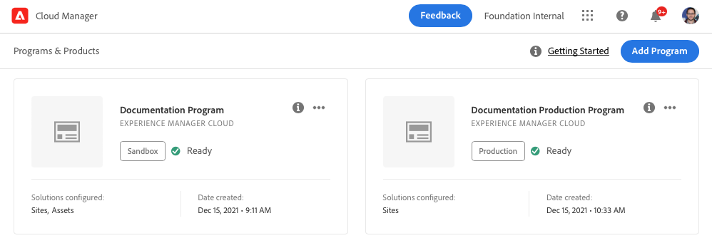

# Create production programs {#create-production-program}

A production program is for users familiar with AEM and Cloud Manager, ready to write, build, and test code, with the goal of deploying it to handle live traffic.

Learn more about program types in the document [Understanding Program and Program Types](program-types.md).

## Create a production program {#create}

Depending on your organization's entitlements, you may see [additional options](#options) when adding your program.

**To create a production program:**

1. Log into Cloud Manager at [my.cloudmanager.adobe.com](https://my.cloudmanager.adobe.com/) and select the appropriate organization.

1. On the **[My Programs](/help/implementing/cloud-manager/navigation.md#my-programs)** console, near the upper-right corner, click **Add Program**.

    

1. In the *Let's create your program* wizard, in the **Program name** text field, type the name you want for the program.

1. Under **Program Objective**, select **Set up for production**.

   

1. (Optional) In the lower-right corner of the wizard dialog box, do either one of the following:

   * Drag and drop an image file onto the  **Add a program image** target.
   * Click  **Add a program image**, then select an image from a file browser.
   * Click  to remove an image that you added.
   
1. Click **Continue**.

1. In the **Solutions &amp; Add-ons** list box, select one or more solutions to include in the program.

   * If you are not sure if you need one or more programs for the various solutions you have available, select the one most of interest to you. You can activate additional solutions by [editing the program](/help/implementing/cloud-manager/getting-access-to-aem-in-cloud/editing-programs.md) later. See the [Introduction to Production Programs document](/help/implementing/cloud-manager/getting-access-to-aem-in-cloud/introduction-production-programs.md) for more program setup recommendations.
   * At least one solution is required for program creation.
   * Select **Edge Deliver Services** for a fully managed CDN solution that optimizes digital experiences. See [About using Edge Delivery Services to deliver your Cloud Manager project](#edge-overview)
   * If you selected the **[Enable Enhanced Security](#security)** option, you can select only as many solutions for which HIPAA entitlements are available.

      

   * Click  to the left of a solution name to reveal any optional add-ons, such as the **Commerce** add-on option under **Sites**.

   

1. When you are done selecting your solutions and add-ons, click **Continue**.

1. On the **Go-Live Date** tab, enter the date that you plan to have your production program Go Live.

   

   * You can edit this date at any time.
   * The date serves informational purposes and triggers the Go Live widget on the [**Program Overview** page](/help/implementing/cloud-manager/getting-access-to-aem-in-cloud/editing-programs.md#program-overview). This functionality provides timely in-product links to AEM as a Cloud Service best practices to support a smooth Go Live experience.

1. Click **Create**. Cloud Manager creates your program and displays it on the landing page for selection.

   

## Additional production program options {#options}

Depending on what entitlements are available to your organization, you may have additional options available to you when you create a production program.

### Security {#security}

If you have the necessary entitlements, the **Security** tab is shown as the first tab in the **`Set up for production`** dialog box.

The **Security** tab provides the options to activate **HIPAA**, or **WAF-DDOS Protection**, or both, for your production program.

Adobe HIPAA Compliant and WAF-DDOS (Web Application Firewall - Distributed Denial of Service) facilitates cloud-based security as part of a multi-layered approach for protecting against vulnerabilities.

   * **HIPAA** - This option enables Adobe's HIPPA-ready solution implementation.
     * [Learn more](https://www.adobe.com/trust/compliance/hipaa-ready.html) about Adobe's HIPAA ready solution implementation.
     * HIPAA cannot be enabled or disabled after program creation.
   * **WAF-DDOS Protection** - This option enables the Web Application Firewall by way of rules to protect your application.
     * Once activated, WAF-DDOS protection can then be configured by setting up a [non-production pipeline](/help/implementing/cloud-manager/configuring-pipelines/configuring-non-production-pipelines.md).
     * See [Traffic Filter Rules including WAF Rules](/help/security/traffic-filter-rules-including-waf.md) to learn how to manage traffic filter rules in your repository so they are deployed properly.

### SLA {#sla}

If you have the necessary entitlements, the **SLA** tab is shown as the second or third tab in the **`Set up for production`** dialog box.

AEM Sites and Forms offer a standard 99.9% service level agreement (SLA). The **99.99% Service Level Agreement** option enables a 99.99% minimum uptime percentage for your production environments for Sites and/or Forms.

99.99% SLA offers benefits including higher availability and lower latency, and requires an [additional publish region](/help/implementing/cloud-manager/manage-environments.md#multiple-regions) to be applied to the production environment in the program.

When the [requirements](#sla-requirements) for enabling 99.99% SLA are met, you must run a [full stack pipeline](/help/implementing/cloud-manager/configuring-pipelines/configuring-production-pipelines.md) to activate it.

#### Requirements for 99.99% SLA {#sla-requirements}

Beyond the required entitlements, 99.99% SLA has additional requirements for use.

* The organization must have 99.99% SLA and additional publish region entitlements available when applying 99.99% SLA to the program.
* Cloud Manager verifies that an unused [additional publish region](/help/implementing/cloud-manager/manage-environments.md#multiple-regions) entitlement is available before applying 99.99% SLA to the program.
* When editing a program, if it already contains a production environment with at least one additional publish region, then Cloud Manager checks only for the availability of a 99.99% SLA entitlement.
* For activation of 99.99% SLA and reporting, the [production/stage environment](/help/implementing/cloud-manager/manage-environments.md#adding-environments) must have been created and at least one additional publish region must have been applied on the production/stage environment.
  * If using [advanced networking](/help/security/configuring-advanced-networking.md), make sure to check the [Adding Multiple Publish Regions to a New Environment](/help/implementing/cloud-manager/manage-environments.md#adding-regions) document for recommendations so that connectivity is maintained if there is regional failure.
* At least one additional publish region must remain in your 99.99% SLA program. Users are disallowed from deleting the last additional publish region from your 99.99% SLA program.
* 99.99% SLA is supported for production programs that have the Sites or Forms solution enabled.
* Run a [full stack pipeline](/help/implementing/cloud-manager/configuring-pipelines/configuring-production-pipelines.md) to activate or &mdash; when editing a program &mdash; deactivate the 99.99% SLA.

## Access your program {#accessing}

1. When you see your program card on the landing page, click  to view the menu options available to you.

   

1. Select **Program Overview** to navigate to the Cloud Manager's **Overview** page.  

1. The main call-to-action card on the overview page guides you through creating an environment, a non-production pipeline, and finally a production pipeline.

   

>[!TIP]
>
>See [Navigate the Cloud Manager UI](/help/implementing/cloud-manager/navigation.md) for details on how to navigate Cloud Manager and understanding the **My Programs** console.

>[!NOTE]
>
>Unlike a [sandbox program](introduction-sandbox-programs.md#auto-creation), a production program requires the user in the appropriate Cloud Manager role to create the project and add an environment through the self-service UI.

