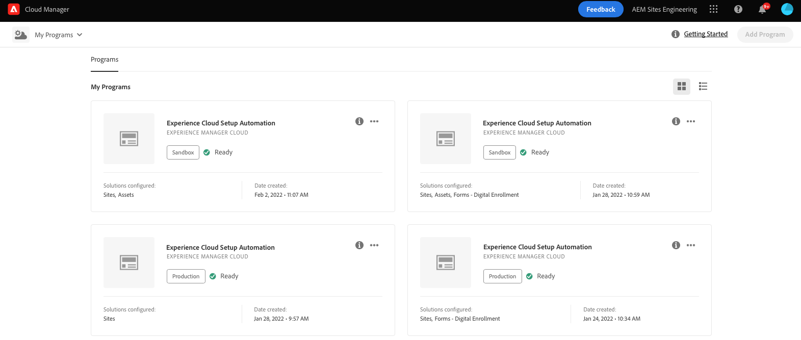
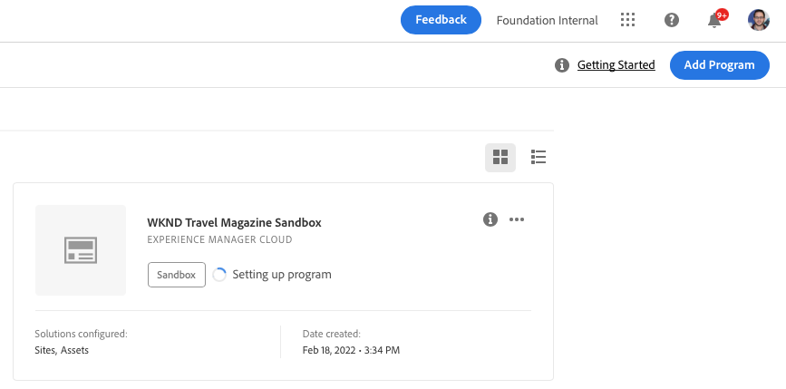
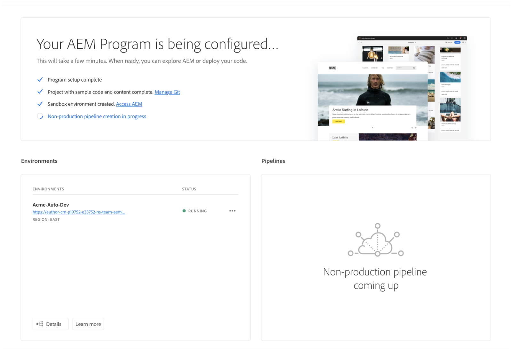
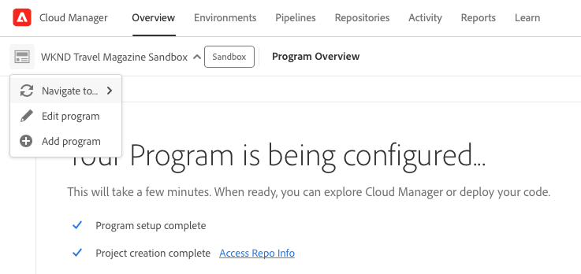

# Creating Sandbox Programs {#create-sandbox-program}

A sandbox program is typically created to serve the purposes of training, running demos, enablement, POCs, or documentation and is not meant to carry live traffic.

Learn more about program types in the document [Understanding Program and Program Types.](program-types.md)

## Create a Sandbox Program {#create}

Follow these steps to create a sandbox program.

1. Log into Cloud Manager at [my.cloudmanager.adobe.com](https://my.cloudmanager.adobe.com/) and select the appropriate organization.
 
1. From Cloud Manager's landing page click on **Add Program** in the top-right corner of the screen.

    

1. From the create program wizard, select **Set up a sandbox**, provide a program name, and then click **Create**.

   

You will see a new sandbox program card on the landing page with a status indicator as the setup process progresses.

## Access Your Sandbox {#access}

You can view the detail of your sandbox setup as well as access the environment (once available) by viewing the program overview page.

1. From the Cloud Manager landing page, click the ellipsis button on your newly-created program.

   

1. Once the project creation step completes, you can access the **Access Repo Info** link in order to be able to use your git repo.

   
   
   >[!TIP]
   >
   >To learn more about accessing and managing your git repository, refer to the document [Accessing Git.](/help/implementing/cloud-manager/managing-code/accessing-repos.md)

1. Once the development environment is created, you can use the **Access AEM** link to sign into AEM.

   

1. Once the Non-production pipeline deploying to development is complete, the wizard guides you to either access the AEM development environment or to deploy code to development environment.

   

If at any time you need to switch to another program or return to the overview page to create another program, click on your program name in the top-left of the screen to reveal the **Navigate to** option.

