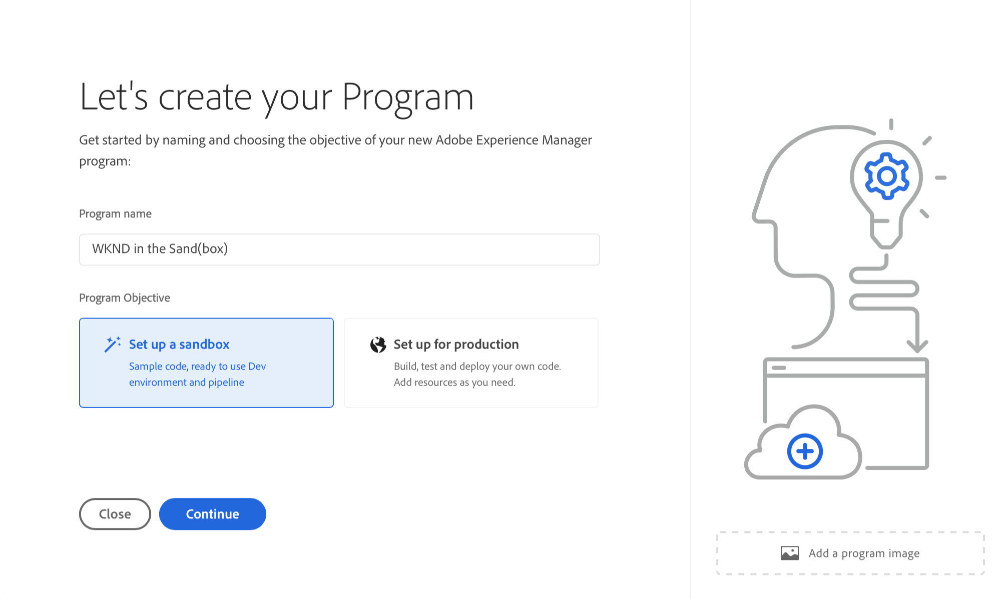
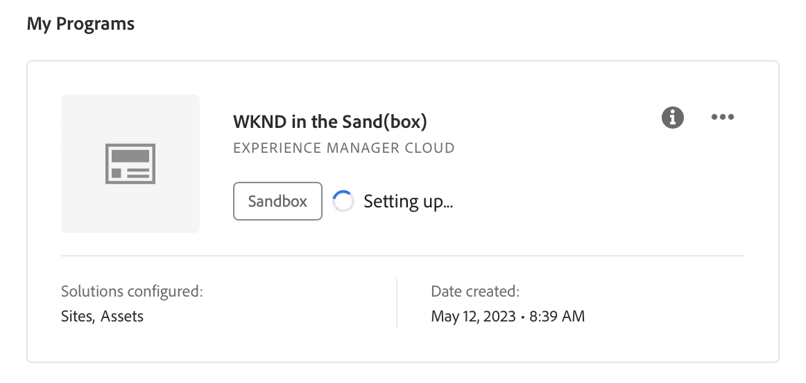
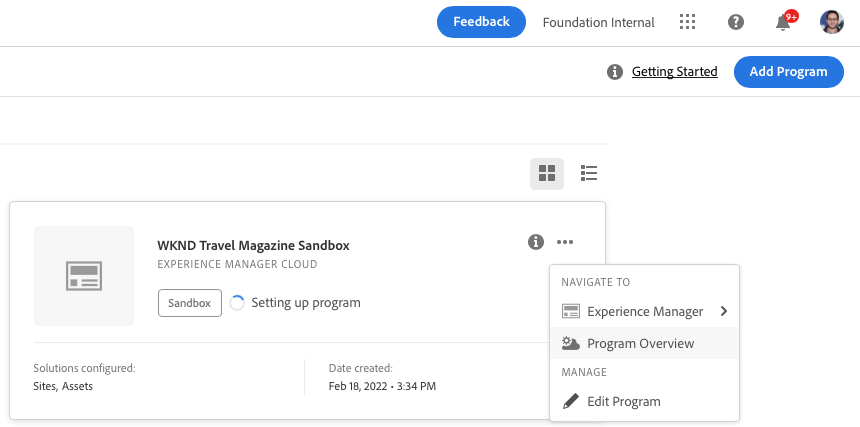
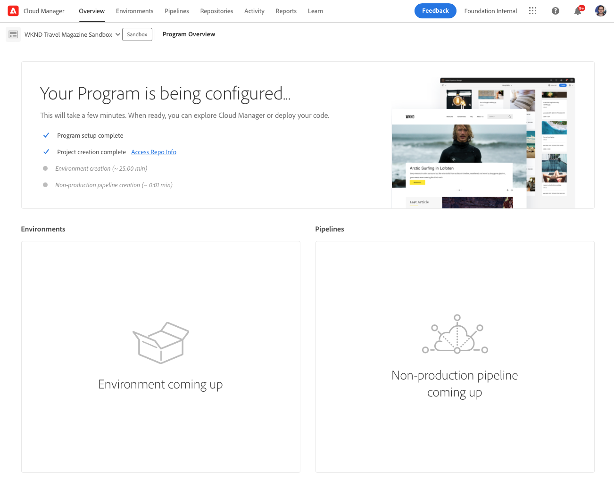
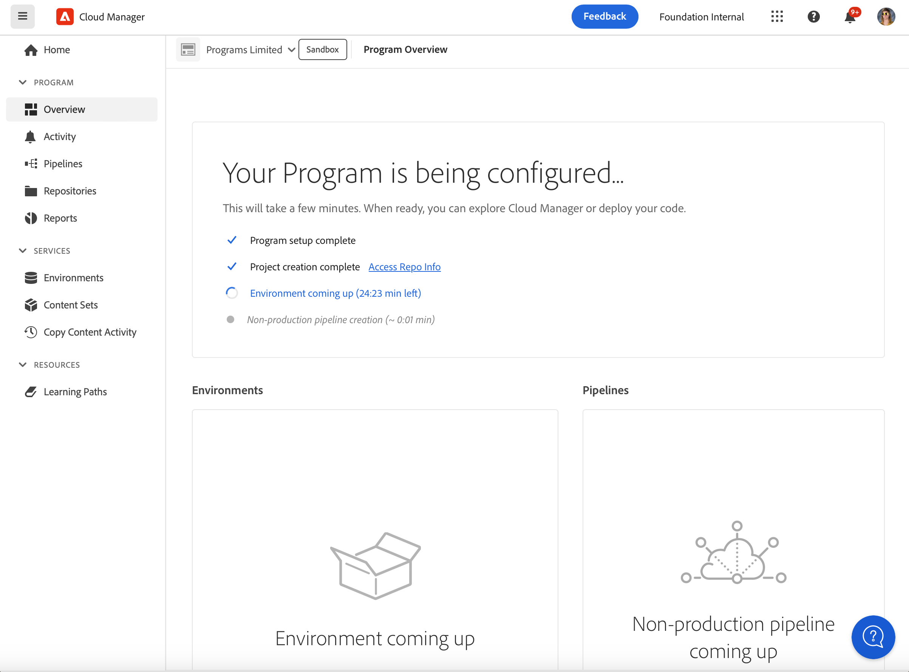
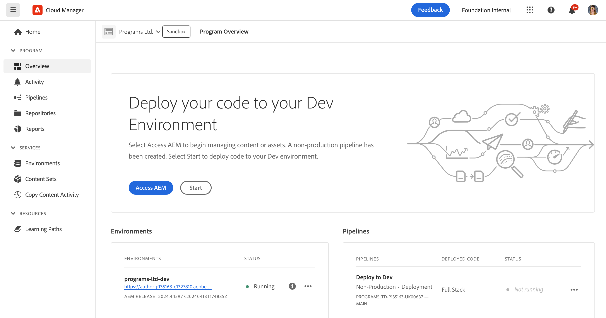

# Create sandbox programs {#create-sandbox-program}

A sandbox program is typically created to serve the purposes of training, running demos, enablement, POCs, or documentation, and is not meant to carry live traffic. See [Introduction to sandbox programs](/help/implementing/cloud-manager/getting-access-to-aem-in-cloud/introduction-sandbox-programs.md).

Learn more about program types in the document [Understanding Program and Program Types](program-types.md).

## Create a sandbox program {#create}

1. Log on to Cloud Manager at [my.cloudmanager.adobe.com](https://my.cloudmanager.adobe.com/) and select the appropriate organization.
 
1. On the **[My Programs](/help/implementing/cloud-manager/navigation.md#my-programs)** console, near the upper-right corner, click **Add Program**.

    

1. In the *Let's create your Program* wizard, in the **Program name** text field, type the name you want for the program.

1. Under **Program Objective**, select  **Set up a sandbox**.

   

1. (Optional) In the lower-right corner of the wizard dialog box, do any one of the following:

   * Drag and drop an image file onto the  **Add a program image** target.
   * Click  **Add a program image**, then select an image from a file browser.
   * Click  to remove an image that you added.
   
1. Click **Continue**.

1. In the **Solutions &amp; Add-ons** list box, select one or more solutions to include in the program.
   
   * Click the chevron to the left of a solution name to reveal any available optional add-ons that you want to include with a selected solution.
   * The **Sites**, **Assets**, and **Edge Deliver Services** solutions are always selected by default when you create a sandbox program. You cannot de-select them.

   

1. Click **Create**. Cloud Manager creates your sandbox program and displays it on the landing page for selection.

## Sandbox access {#access}

After a new sandbox program is finished being created, you can view the detail of your sandbox setup and access the environment by viewing the program overview page.

1. From the Cloud Manager landing page, in the Sandbox program, click  on your created sandbox program.

   

1. When the project creation step completes, you can click the **Access Repo Info** link to be able to use your git repo.

   
   
   >[!TIP]
   >
   >To learn more about accessing and managing your Git repository, see [Accessing Git](/help/implementing/cloud-manager/managing-code/accessing-repos.md).

1. After the development environment is created, you can click **Access AEM** and sign into AEM.

   

1. When the non-production pipeline deploying to development is complete, the wizard in the call-to-action guides you to either access the AEM development environment or to deploy code to the development environment.

   

>[!TIP]
>
>See [Navigating the Cloud Manager UI](/help/implementing/cloud-manager/navigation.md) for details on how to navigate Cloud Manager and understanding the **My Programs** console.
