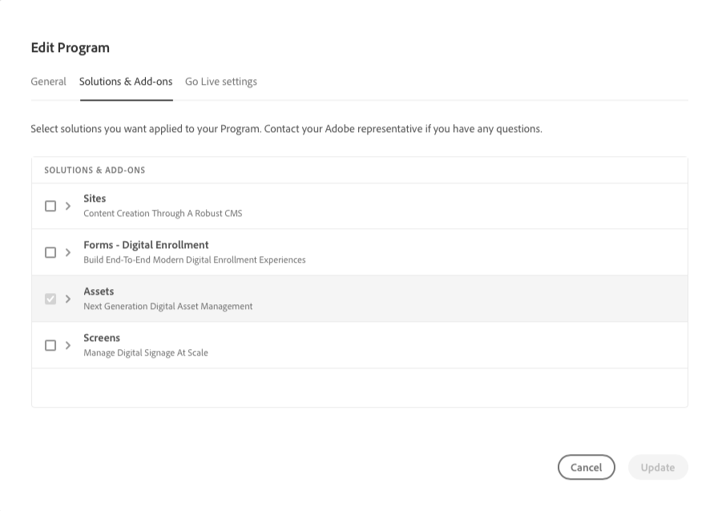
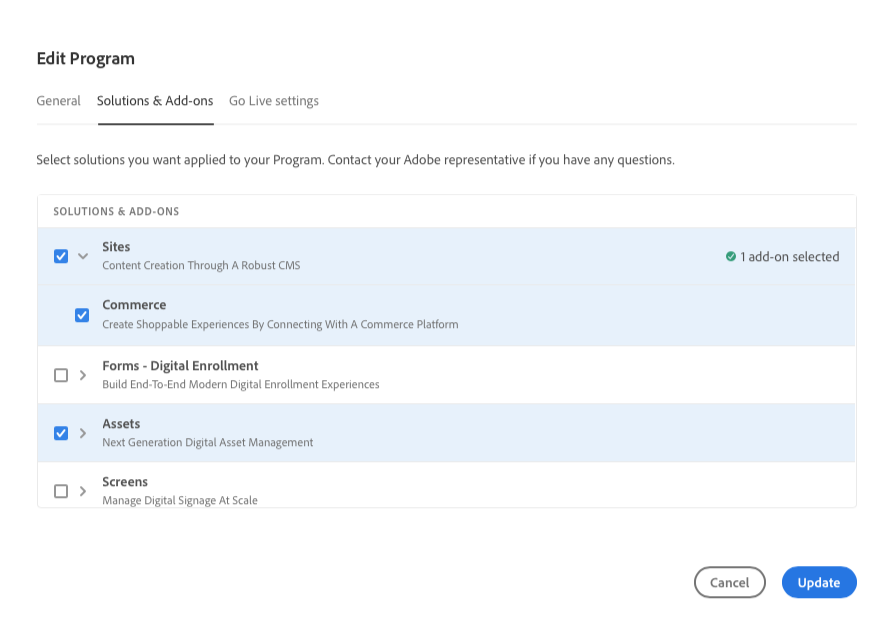
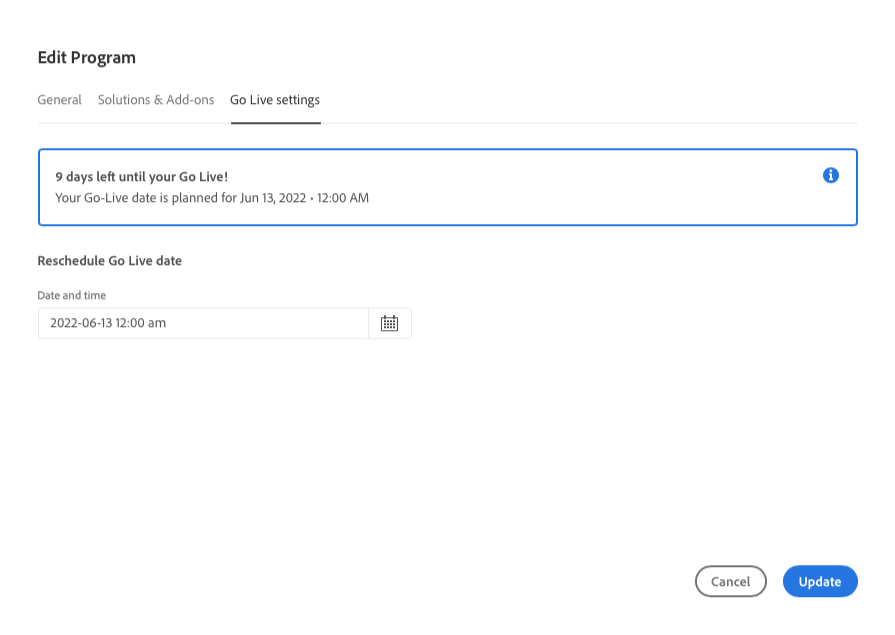

# Editing Programs {#editing-programs}

Users with requisite permissions can edit [production programs created in your organization](creating-production-programs.md) as well as [sandbox programs created in your organization.](creating-sandbox-programs.md) By editing a program you can:

* Add Sites solution to an existing program with Assets and vice versa.
* Remove Sites or Assets from an existing program with both Sites and Assets.
* Add a second, unused solution entitlement to either an existing program or as a new Program.
* Delete sandbox programs.

>[!NOTE]
>
>You must be a member of the **Business Owner** role to edit programs or delete sandbox programs.

Follow these steps to edit a program.

1. Log into Cloud Manager at [my.cloudmanager.adobe.com](https://my.cloudmanager.adobe.com/) and select the appropriate organization.

1. Click on the program you wish to edit to show its details.

1. Click on your program's name at the top-left of the page and select **Edit program**.

   

1. The **Edit Program** page opens. On the **General** tab, edit the program name and description.

   * At least one solution must be selected for a program.

   

1. On the **Solutions &amp; Add-ons** tab, modify the solutions for the program.

   

1. Click on the chevron before the solution names to reveal optional add-ons such as selecting the **Commerce** add-on option under **Sites**.

   

1. On the **Go live settings** tab, modify the planned go-live date for the program.

   

   * This date is for informational use only and triggers the Go Live widget on the program overview page to provide in-product links to AEM as a Cloud Service best practice documentation in a timely manner to align with your journey culminating in a successful and smooth Go Live experience.

1. Click on **Update** to save your changes to the program.

Any time a program is edited, including adding or removing a solution or add-on, those changes will take effect following the next deployment.

## Deleting Sandbox Programs {#delete-sandbox-program}

Deleting a sandbox program will remove all environments and pipelines associated with it.

>[!TIP]
>
>Users with the **Business Owner** or **Deployment Manager** roles can alternatively delete their production and stage environments instead of the entire sandbox program. 

Follow these steps to delete a sandbox program.

1. Log into Cloud Manager at [my.cloudmanager.adobe.com](https://my.cloudmanager.adobe.com/) and select the appropriate organization.

1. Click on the program you wish to edit to show its details.

1. Click on your program's name at the top-left of the page and select **Delete Program**.

   

Alternatively you can click the ellipsis button on your program's card from the Cloud Manager overview page and select **Delete Program**.

>[!NOTE]
>
>Only sandbox programs can be deleted. Production programs can not be deleted.
