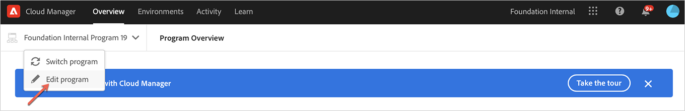
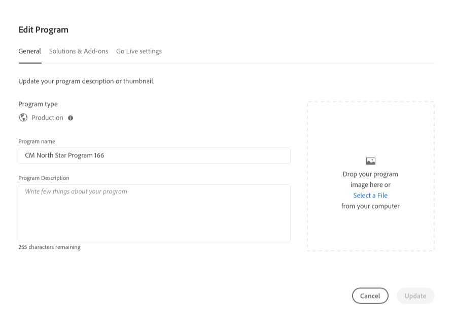
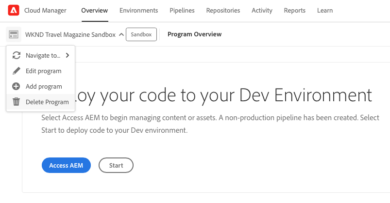
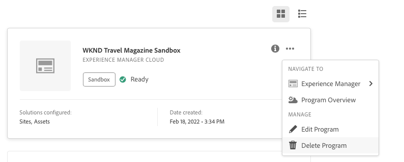

# Edit programs {#editing-programs}

To manage and edit programs, start at the [**My Programs** console](/help/implementing/cloud-manager/navigation.md). The **My Programs** page provides an overview of all programs to which you have access. When selecting an individual program, the **Program Overview** page provides details of the program at a glance. 

From the **Program Overview**, users with the requisite permissions can edit [production programs created in your organization](creating-production-programs.md) and [sandbox programs created in your organization](creating-sandbox-programs.md). By editing a program, you can:

* Add Sites solution to an existing program with Assets and conversely.
* Remove Sites or Assets from an existing program with both Sites and Assets.
* Add a second, unused solution entitlement, to either an existing program or as a new Program.
* Delete sandbox programs.

## Permissions {#permissions}

You must be a member of the **Business Owner** role to edit programs or delete sandbox programs and to access the License Dashboard.

## Edit a program {#editing}

Anytime a program is edited, including adding or removing a solution or add-on, those changes take effect following the next deployment.

**To edit a program:**

1. Log into Cloud Manager at [my.cloudmanager.adobe.com](https://my.cloudmanager.adobe.com/) and select the appropriate organization.

1. On the **[My Programs](#my-programs)** page, click the program that you want to edit to show its details.

1. Click your program's name in the upper-left of the page and select **Edit program**.

   

1. The **Edit Program** page opens to the **General** tab.

   

1. The options available for editing the program are the same as those when creating the program.
   * See [Create Production Programs](/help/implementing/cloud-manager/getting-access-to-aem-in-cloud/creating-production-programs.md) and [Create Sandbox Programs](/help/implementing/cloud-manager/getting-access-to-aem-in-cloud/creating-sandbox-programs.md) for details on the individual options. 
   * [Additional options](/help/implementing/cloud-manager/getting-access-to-aem-in-cloud/creating-production-programs.md#options) may be available for your production program depending on the entitlements of your organization.

1. Click **Update** to save your changes to the program.

## Delete a sandbox program {#delete-sandbox-program}

Deleting a sandbox program removes all environments and pipelines associated with it.

>[!TIP]
>
>Users with the **Business Owner** or **Deployment Manager** roles can alternatively delete their production and stage environments instead of the entire sandbox program. 

**To delete a sandbox program:**

1. Log into Cloud Manager at [my.cloudmanager.adobe.com](https://my.cloudmanager.adobe.com/) and select the appropriate organization.

1. On the **[My Programs](#my-programs)** page, click the program that you want to edit to show its details.

1. Click your program's name in the upper-left of the page and select **Delete Program**.

   

Alternatively, you can click  on your program's card from the Cloud Manager overview page and select **Delete Program**.

>[!NOTE]
>
>Only sandbox programs can be deleted. Production programs cannot be deleted.
