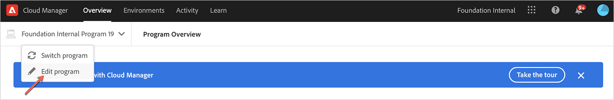
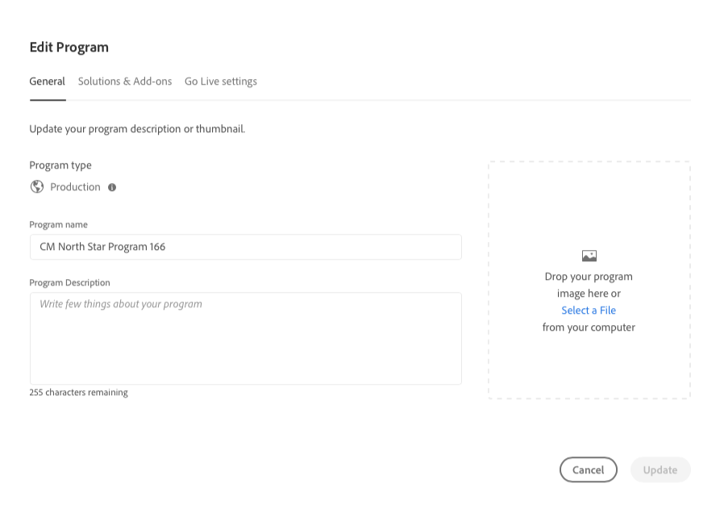

# Edit programs {#editing-programs}

To manage and edit programs, start at the [**My Programs** console](/help/implementing/cloud-manager/navigation.md). The **My Programs** page provides an overview of all programs to which you have access. When selecting an individual program, the **Program Overview** page provides details of the program at a glance. 

From the **Program Overview**, users with the requisite permissions can edit [production programs created in your organization](creating-production-programs.md) and [sandbox programs created in your organization](creating-sandbox-programs.md). By editing a program, you can:

* Add Sites solution to an existing program with Assets and conversely.
* Remove Sites or Assets from an existing program with both Sites and Assets.
* Add an unused solution entitlement to an existing program or create a new program.
* Mark production programs for deletion.
* Delete sandbox programs.

## Permissions {#permissions}

You must have the **Business Owner** role to edit programs, delete sandbox programs, mark production programs for deletion, and access the License Dashboard.

## Edit a program {#editing}

Anytime a program is edited, including adding or removing a solution or add-on, those changes take effect following the next deployment.

**To edit a program:**

1. Sign into Cloud Manager at [experience.adobe.com](https://experience.adobe.com).
1. In the **Quick access** section, click **Experience Manager**.
1. In the left side panel, click **Cloud Manager**.
1. Select the appropriate organization.
1. On the **[My Programs](#my-programs)** page, click the program that you want to edit to show its details.

1. Click your program's name in the upper-left of the page and select **Edit program**.

   

1. The **Edit Program** page opens to the **General** tab.

   

1. The options available for editing the program are the same options for program creation.
   * You can configure whether a publish tier is provisioned for new environments (Beta). See [Flexible Publish Tier (Beta)](/help/implementing/cloud-manager/getting-access-to-aem-in-cloud/creating-production-programs.md#flexible-publish-tier).
   * See [Create Production Programs](/help/implementing/cloud-manager/getting-access-to-aem-in-cloud/creating-production-programs.md) and [Create Sandbox Programs](/help/implementing/cloud-manager/getting-access-to-aem-in-cloud/creating-sandbox-programs.md) for details on the individual options. 
   * [Additional options](/help/implementing/cloud-manager/getting-access-to-aem-in-cloud/creating-production-programs.md#options) may be available for your production program depending on the entitlements of your organization.

1. Click **Update** to save your changes to the program.

## Mark a production program for deletion {#delete-production-program}

Deleting a production program is a two-phase process. A Business Owner marks the program for deletion, which triggers a validation and takedown period. The program is then permanently removed after approximately 30 days.

When a production program is marked for deletion, the following occurs:

* The credit associated with the production program is returned to the customer.
* All environments belonging to the production program are taken down.

Before marking for deletion is initiated, the system validates whether the production program is eligible for deletion. If the marking fails, the production program moves to a `Failed to mark for deletion` state instead.

>[!NOTE]
>
>Sandbox programs are unaffected by this process. To delete a sandbox program, see [Delete a sandbox program](#delete-sandbox-program).

**To mark a production program for deletion:**

1. Sign into Cloud Manager at [experience.adobe.com](https://experience.adobe.com).
1. In the **Quick access** section, click **Experience Manager**.
1. In the left side panel, click **Cloud Manager**.
1. Select the appropriate organization.
1. On the **My Programs** page, for the production program that you want to mark for deletion, click , then click **Delete program**.

   *Example production program seen above is for illustration purposes only.*

1. In the **Mark production program for deletion** dialog box, review the warning that lists the resources connected to your program, including production, stage, and development environments.

   

   >[!NOTE]
   >
   >If the production program has blocking resources, such as environments that are currently updating, the **Mark for deletion** button is disabled. You must wait until all program resources are unlocked before you can mark the program for deletion.
   >
   >

1. To confirm, type the program name as displayed in the dialog box, then click **Mark for deletion**.

   After confirmation, the production program shows a **Marking for deletion** status while the process runs.

   

   When complete, the production program card updates to **Marked for deletion** with an associated Alert badge.

     

1. Click the Alert badge on the production program card to display the scheduled permanent removal date.

   

   After approximately 30 days, the program is permanently removed and cannot be restored.

### Unmark a production program from deletion {#unmark-from-deletion}

You can restore a production program that has been *marked* for deletion as long as the permanent removal has not yet occurred. 

>[!IMPORTANT]
>
>Restoring a production program that was marked for deletion requires that the customer has available credits.

**To unmark a production program from deletion:**

1. On the **My Programs** page, locate the production program card that shows **Marked for deletion**.

1. On the production program card, click , then click **Unmark for deletion**.

    

   The production program will move to unmarking from deletion.

## Delete a sandbox program {#delete-sandbox-program}

Deleting a sandbox program removes all environments and pipelines associated with it.

>[!TIP]
>
>Users with the **Business Owner** or **Deployment Manager** roles can alternatively delete their production and stage environments instead of the entire sandbox program. 

**To delete a sandbox program:**

1. Sign into Cloud Manager at [experience.adobe.com](https://experience.adobe.com).
1. In the **Quick access** section, click **Experience Manager**.
1. In the left side panel, click **Cloud Manager**.
1. Select the appropriate organization.

1. On the **[My Programs](#my-programs)** page, click the sandbox program that you want to edit to show its details.

1. Click your sandbox program's name in the upper-left of the page and select **Delete Program**.

   

Alternatively, you can click  on your sandbox program's card from the Cloud Manager overview page and select **Delete Program**.

   
