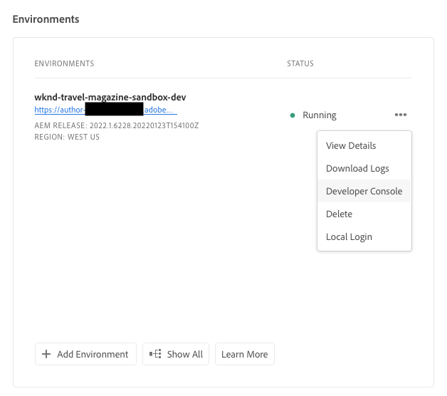

# Hibernating and De-Hibernating Sandbox Environments {#hibernating-introduction}

Environments of a sandbox program enter a hibernation mode if no activity is detected for eight hours.Hibernation is unique to sandbox program environments. Production program environments do not hibernate.

## Hibernation {#hibernation-introduction}

Hibernation can occur either automatically or manually. 

* **Automatic** - Sandbox program environments are automatically hibernated after eight hours of inactivity. Inactivity is defined as neither the author service nor preview or publish services receive requests.
* **Manual** - As a user you may manually hibernate a sandbox program environment. There is no requirement to do so since hibernation will occur automatically as previously described.

It may take up to a few minutes for sandbox program environments to enter hibernation mode. Data is preserved during hibernation.

### Using Manual Hibernation {#using-manual-hibernation}

You can manually hibernate your sandbox program from the Developer Console. Access to Developer Console for a sandbox program is available to any user of Cloud Manager.

Follow these steps to manually hibernate your sandbox program environments.

1. Log into Cloud Manager at [my.cloudmanager.adobe.com](https://my.cloudmanager.adobe.com/) and select the appropriate organization.

1. Click on the program you wish to hibernate to show its details.

1. On the **Environments** card, click the ellipsis button and select **Developer Console**. 

   * Refer to the document [Accessing Developer Console](/help/implementing/cloud-manager/manage-environments.md#accessing-developer-console) for additional details about the Developer Console.

   

1. In the Developer Console, click **Hibernate**.

   

1. Click **Hibernate** to confirm the step.

   

When the hibernation is successful, you will see the hibernation process complete notification for your environment in the **Developer Console** screen.

In the Developer Console you can also click the **Environments** link in the breadcrumbs above the **Pod** dropdown for a list of environments to hibernate.

## De-Hibernation {#de-hibernation-introduction}

You can manually hibernate your Sandbox Program from the Developer Console. 

>[!IMPORTANT]
>
>A user with a **Developer** role can de-hibernate a sandbox program environment.

1. Log into Cloud Manager at [my.cloudmanager.adobe.com](https://my.cloudmanager.adobe.com/) and select the appropriate organization.

1. Click on the program you wish to hibernate to show its details.

1. On the **Environments** card, click the ellipsis button and select **Developer Console**. 

   * Refer to the document [Accessing Developer Console](/help/implementing/cloud-manager/manage-environments.md#accessing-developer-console) for additional details about the Developer Console.

1. Click on **De-hibernate**.

    
    
1. Click **De-Hibernate** to confirm the step.

   

1. You receive notification that the de-hibernation process has started and are updated with the progress.
   
   
   
1. Once the process completes, the sandbox program environment is active again.
 
   

In the Developer Console you can also click the **Environments** link in the breadcrumbs above the **Pod** dropdown for a list of environments to de-hibernate.
 

### Permissions to De-Hibernate {#permissions-de-hibernate}

Any user with a product profile giving them access to AEM as a Cloud Service should be able to access the **Developer Console**, allowing them to de-hibernate the environment. 

## Accessing a Hibernated Environment {#accessing-hibernated-environment}

When making any browser requests against the author, preview, or publish service of a hibernated environment, the user will encounter a landing page describing the hibernated status of the environment along with a link to the Developer Console where the service can be de-hibernated.

## Deployments and AEM Updates {#deployments-updates}

Hibernated environments still allow for deployments and manual AEM upgrades.

* A user may use a pipeline to deploy custom code to hibernated environments. The environment will remain hibernated and the new code will appear in the environment once de-hibernated.

* AEM upgrades can be applied to hibernated environments and can be manually triggered from Cloud Manager. The environment will remain hibernated and the new release will appear in the environment once de-hibernated.

## Hibernation and Deletion {#hibernation-deletion}

* Environments in a sandbox program are automatically hibernated after eight hours of inactivity. 
  * Inactivity is defined as neither the author service nor preview or publish services receive requests.
  * Once hibernated, they can be manually de-hibernated.
* Sandbox programs are deleted after six months of being in continuous hibernation mode, after which time, they can be recreated.
