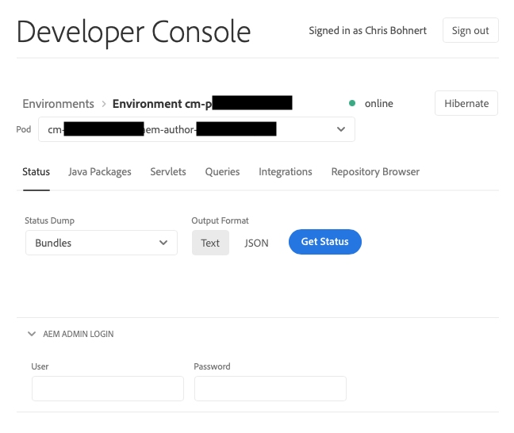
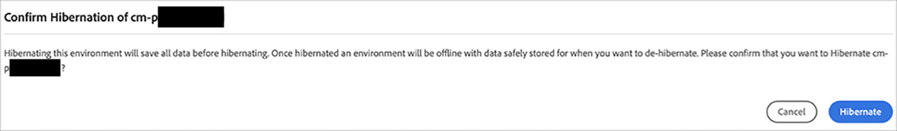
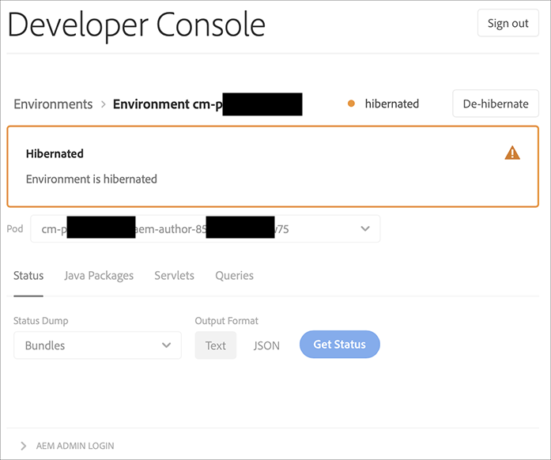
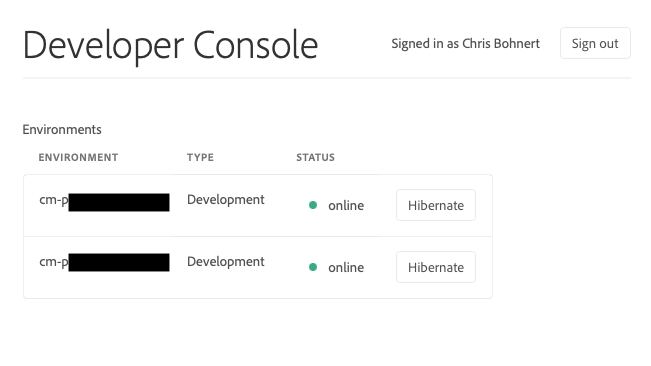
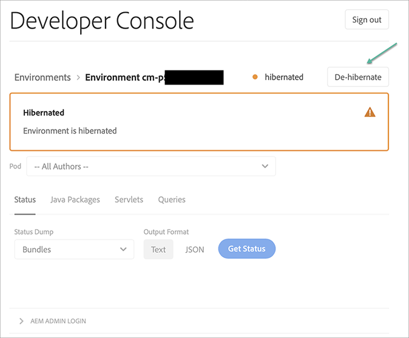
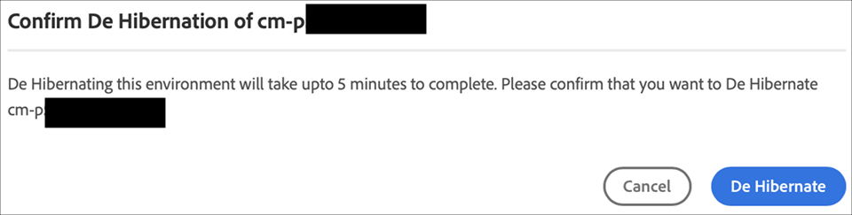
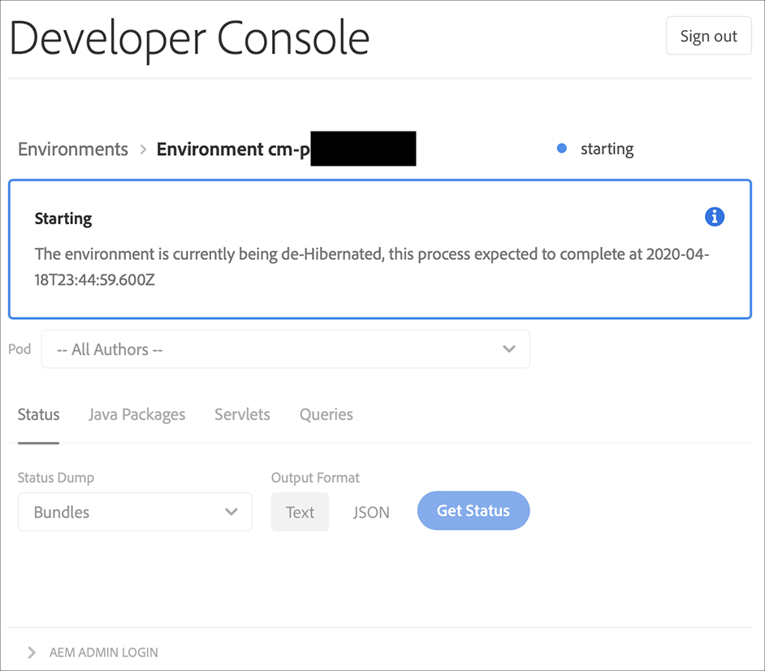
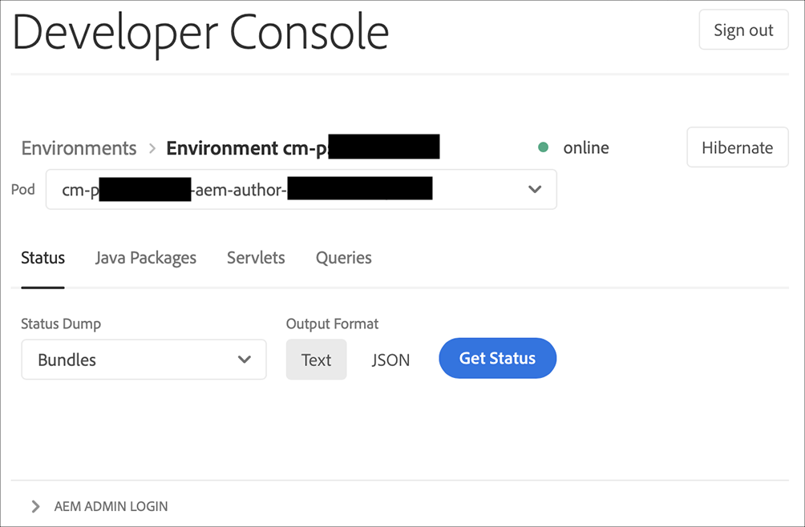
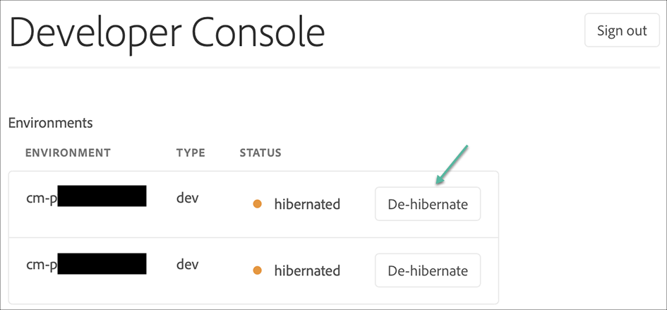
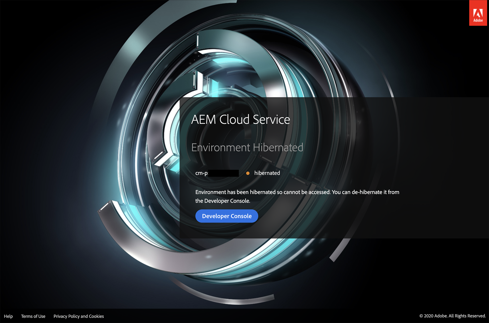

# Hibernate and De-Hibernate Sandbox Environments {#hibernating-introduction}

Environments of a sandbox program enter a hibernation mode if no activity is detected for eight hours. Hibernation is unique to sandbox program environments. Production program environments cannot be hibernated.

## Hibernation {#hibernation-introduction}

Hibernation can occur either automatically or manually. 

* **Automatic** - Sandbox program environments are automatically hibernated after eight hours of inactivity. Inactivity is defined as the absence of requests to the author, preview, and publish services.
* **Manual** - As a user you may manually hibernate a sandbox program environment. There is no requirement to do so because hibernation occurs automatically as previously described.

It may take up to a few minutes for sandbox program environments to enter hibernation mode. Data is preserved during hibernation.

### Manually hibernate a sandbox program environment {#using-manual-hibernation}

You can manually hibernate your sandbox program from the Developer Console. Access to the Developer Console for a sandbox program is available to any user of Cloud Manager.

**To manually hibernate a sandbox program environment:**

1. Log into Cloud Manager at [my.cloudmanager.adobe.com](https://my.cloudmanager.adobe.com/) and select the appropriate organization.

1. On the **[My Programs](/help/implementing/cloud-manager/navigation.md#my-programs)** console, click a *sandbox program* that you want to hibernate to show its details.

1. On the **Environments** card, click  and click **Developer Console**. 

   * See [Accessing Developer Console](/help/implementing/cloud-manager/manage-environments.md#accessing-developer-console) for additional details about the Developer Console.

   

1. On the **Developer Console** page, click **Hibernate**.

<!-- UPDATE THESE SCREENSHOTS WHEN NEW AEM DEVELOPER CONSOLE UI IS RELEASED. AS OF OCTOBER 14, 2024, NEW UI IS STILL IN BETA -->

   

1. Click **Hibernate** to confirm the step.

   

When the hibernation is successful, you see the hibernation process complete notification for your environment in the **Developer Console** screen.

In the Developer Console, click the **Environments** link in the breadcrumbs above the **Pod** drop-down list to view environments available for hibernation.

## Manually de-hibernate a sandbox program from the Developer Console {#de-hibernation-introduction}

You can manually hibernate your sandbox program from the Developer Console. 

>[!IMPORTANT]
>
>A user with a **Developer** role can de-hibernate a sandbox program environment.

**To manually de-hibernate a sandbox program from the Developer Console:**

1. Log into Cloud Manager at [my.cloudmanager.adobe.com](https://my.cloudmanager.adobe.com/) and select the appropriate organization.

1. On the **[My Programs](/help/implementing/cloud-manager/navigation.md#my-programs)** console, click the program you want to de-hibernate to show its details.

1. On the **Environments** card, click https://spectrum.adobe.com/static/icons/workflow_18/Smock_More_18_N.svg and click **Developer Console**. 

   * See [Accessing Developer Console](/help/implementing/cloud-manager/manage-environments.md#accessing-developer-console) for additional details about the Developer Console.

1. Click **De-hibernate**.

    
    
1. Click **De-Hibernate** to confirm the step.

   

1. You receive notification that the de-hibernation process has started and are updated with the progress.
   
   
   
1. Once the process completes, the sandbox program environment is active again.
 
   

In the Developer Console, click the **Environments** link in the breadcrumbs above the **Pod** drop-down list to access environments available for de-hibernation.
 

### Permissions to de-hibernate {#permissions-de-hibernate}

Any user with a product profile giving them access to AEM as a Cloud Service should be able to access the **Developer Console**, allowing them to de-hibernate the environment. 

## Access a hibernated environment {#accessing-hibernated-environment}

When a user makes a browser request to the author, preview, or publish service of a hibernated environment, they encounter a landing page. This page explains the environment's hibernated status and provides a link to the Developer Console for de-hibernation.

## Deployments and AEM updates {#deployments-updates}

Hibernated environments still allow for deployments and manual AEM upgrades.

* A user may use a pipeline to deploy custom code to hibernated environments. The environment remains hibernated and the new code appears in the environment once de-hibernated.

* AEM upgrades can be applied to hibernated environments and can be manually triggered from Cloud Manager. The environment remains hibernated and the new release appears in the environment once de-hibernated.

## Hibernation and deletion {#hibernation-deletion}

* Environments in a sandbox program are automatically hibernated after eight hours of inactivity. 
  * Inactivity is defined as the absence of requests to the author, preview, and publish services.
  * Once hibernated, they can be [manually de-hibernated](#de-hibernation-introduction).
* Sandbox programs are deleted after six months of being in continuous hibernation mode, after which time they can be recreated.

>[!NOTE]
>
>Only sandbox environments are automatically deleted after six months of continuous hibernation. The sandbox program with its repository and code is retained.
