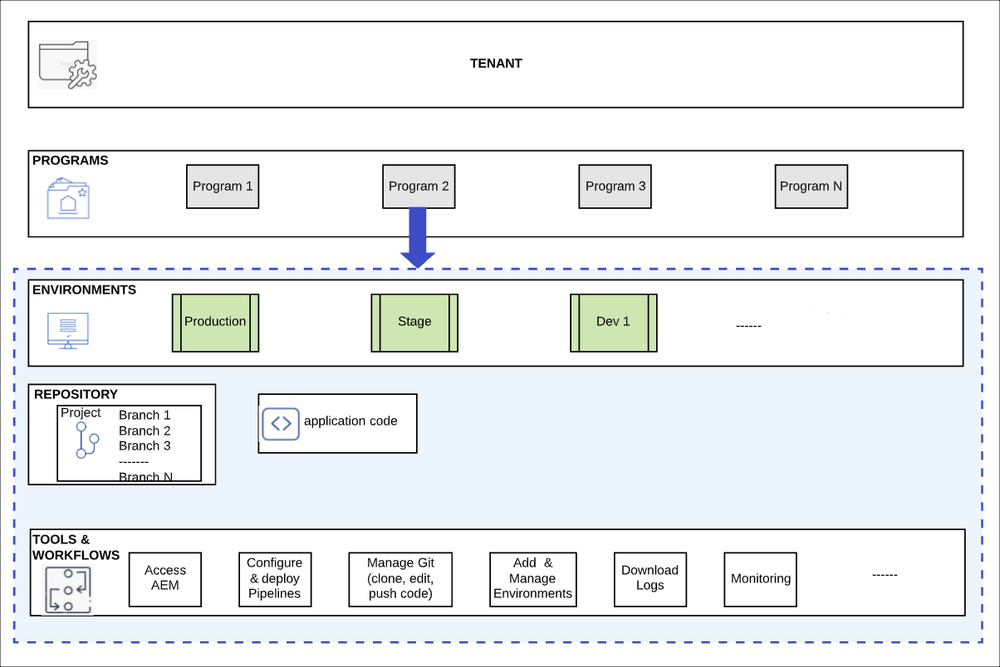

# Programs and program types {#understanding-programs} 

Cloud Manager is built around a hierarchy of entities. The details are not critical to your everyday work in Cloud Manager, but an overview of it can help you as you understand programs and set up your own.



* **TENANT** - The top of the hierarchy. Every customer is provisioned with a tenant.
* **PROGRAMS** - Each tenant has one or more programs, [which often reflect the customer's licensed solutions](introduction-production-programs.md).
* **ENVIRONMENTS** - Each program has multiple environments such as production for live content, one for staging, and one for development purposes.
  * Each program can have only one production environment, but multiple non-production environments.
* **REPOSITORY** - Programs have Git repositories where application and front-end code is maintained for the environments.
* **TOOLS &amp; WORKFLOWS** - Pipelines manage the deployment of code from the repositories to the environments while other tools allow for access to logs, monitoring, and environment management.

An example is often helpful in contextualizing this hierarchy.

* WKND Travel and Adventure Enterprises might be a **tenant** that focuses on travel-related media.
* The WKND Travel and Adventure Enterprises tenant might have two **programs**: one Sites program for WKND Magazine and one Assets program for WKND Media.
* The WKND Magazine and WKND Media programs would both have dev, stage, and production **environments**.

## Source code repository {#source-code-repository}

A Cloud Manager program comes auto-provisioned with its own Git repository.

Users can access the Cloud Manager Git repository using a Git client with a command-line tool or a standalone visual Git client. Alternatively, they can use their preferred Integrated Development Environment (IDE), such as Eclipse, IntelliJ, or NetBeans.

Once a Git client is set up, you can manage your Git repository from the Cloud Manager user interface. To learn about how to manage Git using the Cloud Manager user interface, see [Access Git](/help/implementing/cloud-manager/managing-code/accessing-repos.md).

To start developing the AEM Cloud application, check out the application code from the Cloud Manager repository to your local computer.

```java
$ git clone {URL}
```

The workflow follows a standard Git process:

1. A user clones the remote Git repository locally.
1. The user makes changes in their local repository.
1. When ready, the user commits the changes back into the remote Git repository.

The only difference is that the remote Git repository is part of Cloud Manager, which is transparent to the developer.

## Program types {#program-types}

A user can create a **production** program or a **sandbox** program.

* A **production program** is created to enable live traffic for your site.
  * See [Introduction to Production Programs](/help/implementing/cloud-manager/getting-access-to-aem-in-cloud/introduction-production-programs.md) for more details.
* A **sandbox program** is typically created to serve the purposes of training, running demos, enablement, POCs, or documentation.
  * A sandbox environment is not meant to carry live traffic and has restrictions that a production program does not.
  * It includes Sites, Assets, and Edge Delivery Services, and comes pre-populated with a Git branch containing sample code, a development environment, and a non-production pipeline.
  * See [Introduction to Sandbox Programs](/help/implementing/cloud-manager/getting-access-to-aem-in-cloud/introduction-sandbox-programs.md) for more details.
