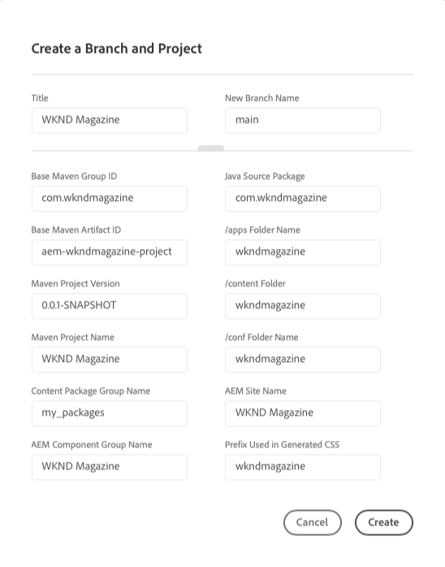

# Project Creation Wizard {#project-creation-wizard}

After you create your production program, Cloud Manger offers a wizard to create a minimal AEM project based on the [AEM Project Archetype](https://experienceleague.adobe.com/docs/experience-manager-core-components/using/developing/archetype/overview.html) to get your started quickly.

Follow these steps to create an AEM application project in Cloud Manager using the wizard.

1. Create a production program by following the steps in the document [Creating Production Programs](creating-production-programs.md)

1. Once program setup is complete, access the **Overview** screen of your program and see the **Create Branch &amp; Project** call-to-action card at the top.

   

1. Click **Create** to start the wizard and confirm your project's **Title** and **New Branch Name** in the **Create a  Branch and Project** window.

   

1. Optionally, click on the divider to reveal the additional parameters of your project. The default values are provided by the AEM Project Archetype and generally do not need to be changed.

   

1. Click **Create** to start the project creation process.

A **Project Creation in Progress** card now replaces the **Create Branch &amp; Project** call-to-action card as the top of the **Program Overview** screen.

Once program creation is complete, an **Add Environment** card replaces the **Project Creation in Progress** card at the top of the **Program Overview** screen. 

You now have an AEM project based on the AEM archetype added to your git repository to serve as a basis for development for your own project. Next you can create your environments where you can deploy the project code.

Please refer to the document [Managing your Environments](/help/implementing/cloud-manager/manage-environments.md) to learn how to add or manage environments.

>[!NOTE]
>
>The wizard is only available for production programs. Because [sandbox programs](introduction-sandbox-programs.md#auto-creation) include automatic project creation, the wizard is not necessary.