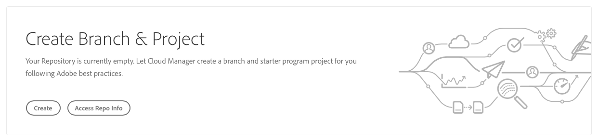
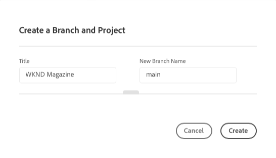
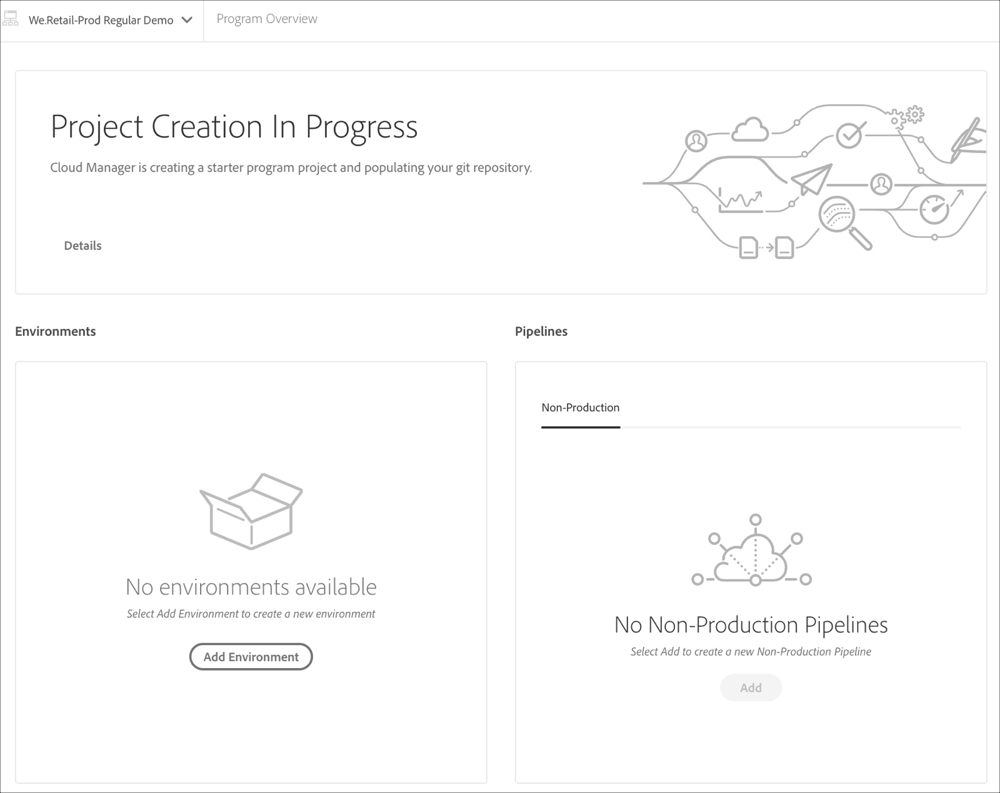
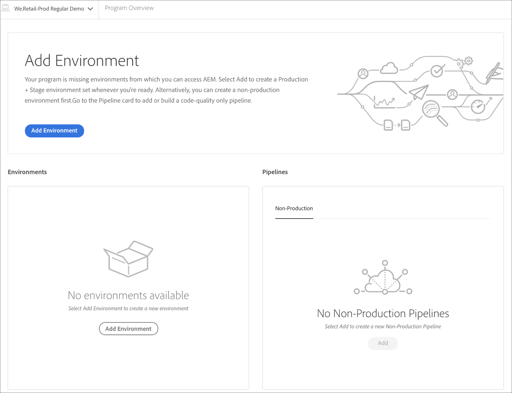

# Using the Wizard {#using-wizard-to-create-an-aem-application-project}

To help get new customers started, Cloud Manger is now able to create a minimal AEM project as a starting point. This process is based on the [**AEM Project Archetype**](https://github.com/Adobe-Marketing-Cloud/aem-project-archetype).

Follow the steps below to create an AEM application project in Cloud Manager using the wizard:

1. Once you log in to Cloud Manager and the basic program setup is complete, a special call to action card will be shown on the **Overview** screen, if the repository is empty.

   

1. Click **Create** to navigate to the **Create a  Branch and Project** screen.

   

1. The **Project Creation in Progress** tile displays on the *Program Overview* screen.

   

1. Once the program creation is complete, the **Add Environment** tile appears on the *Program Overview* page. 
   

   Refer to [Managing your Environments](/help/implementing/cloud-manager/manage-environments.md) to learn how to add or manage environments.
