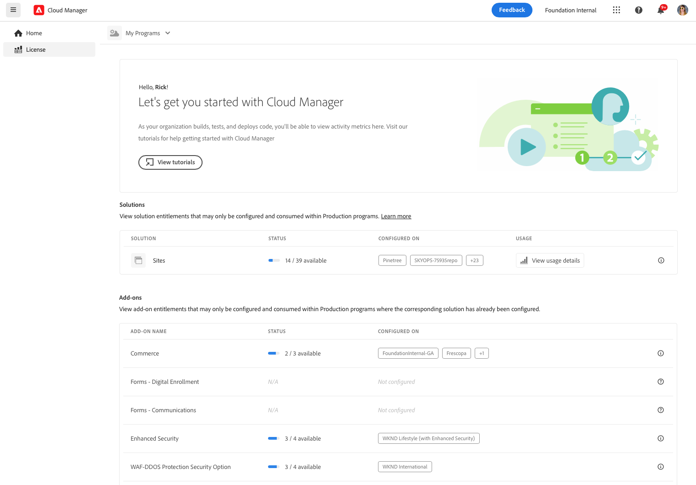

# License dashboard {#license-dashboard}

Cloud Manager provides a dashboard for easy viewing of AEMaaCS product entitlements available to your organization or tenant.

>[!IMPORTANT]
>
>The License dashboard only applies to the AEM as a Cloud Service programs. [AMS programs](https://experienceleague.adobe.com/en/docs/experience-manager-cloud-manager/content/introduction) are not included in the License dashboard.
>
>To determine the type of service your program has (AMS or AEMaaCS), see [Navigating the Cloud Manager UI](/help/implementing/cloud-manager/navigation.md#program-cards).

## Overview {#overview}

The Cloud Manager License dashboard provides easy access to solution entitlements that are available to you across all of your programs, including what is used and what is available. And, content request consumption metrics trended by month for the Sites solution.

## Access the License dashboard {#using-dashboard}

>[!NOTE]
>
>A user in the **Business Owner** role must be logged in to view the License dashboard.

1. Log into Cloud Manager at [my.cloudmanager.adobe.com](https://my.cloudmanager.adobe.com/) and select the appropriate organization.
1. On the **[My Programs](/help/implementing/cloud-manager/navigation.md#my-programs)** console, click  on the [Cloud Manager Header](/help/implementing/cloud-manager/navigation.md#cloud-manager-header). This action reveals the tabs.
1. Click the **License** option in the tab.

The dashboard is divided into three sections showing you:

* **Solutions** - Which solutions that you have licensed.
* **Add-ons** - Which add-ons to your licensed solutions that you have available.
* **Other Entitlements** - What sandbox and dev environment and other entitlements that can be consumed within your tenant.

Each section summarizes what is available and how it is used, if at all. Currently only Sites and Assets solutions are displayed even if other solutions exist in the tenant.

* The **Status** column displays the number of entitlements unused versus the total available for the tenant.
* The **Configured on** column indicates the programs on which the solution entitlement has been applied.
  * An entitlement is considered used only when a production environment is created. Or, if one exists, if an update pipeline has been run on it.
  * Only a limited number of programs are listed individually in the column with the remainder represented by a `+x` entry.
  * Hover over the `+x` entry to see a pop-up with details of all programs.
* The **Usage** column displays a **[View usage details](#view-usage-details)** button to show usage statistics for the solution.

>[!TIP]
>
>To learn how to manage your Adobe entitlements across your entire organization from Admin Console, see the [Admin Console overview](https://helpx.adobe.com/enterprise/using/admin-console.html).

## View usage details {#view-usage-details}

<!--
The **View usage details** button gives access to the chosen solution's **Usage Details** window. This window gives a detailed breakdown including charts to show your solution's usage. How that usage is measured depends on the chosen solution. -->

The **View usage details** button in the License area of Cloud Manager provides a detailed breakdown of your current resource usage. When clicked, it opens a report or dashboard that shows important metrics related to your license. <!-- ADD THIS SENTENCE IF ASSETS USAGE DETAILS GETS REINSTATED ", such as the number of users, storage consumption, or bandwidth usage, depending on the type of services you're using." --> This functionality helps you monitor and ensure that you are staying within the limits of your contract while offering insights for better resource planning and optimization. 

### Sites usage details {#sites-usage-details}

The **Sites usage details** window presents graphs giving an overview of the usage of your Sites licenses based on [content requests](#what-is-a-content-request).

The left side of the window presents a pie chart showing the contract breakdown for the contract year selected in the **View contract year** dropdown.

The right side of the window presents an area chart showing the usage broken down by program over time for the selected contract year. A hover reveals a popup with details per program for the selected point in time.

<!-- REMOVED AS PER CQDOC-21983
### Assets usage details {#assets-usage-details}

The **Assets usage details** window, presents graphs giving an overview of the usage of your Assets licenses based on [storage](#storage) and [standard users](#standard-users). Select the appropriate tab to toggle between the views.

For both storage and standard users views, you can use the **Environment Type** dropdown to toggle the view between production, stage, and development environments.

#### Storage {#storage}

The left side of the window presents a pie chart showing the contract breakdown for the contract year selected in the **View contract year** dropdown.

The right side of the window presents an area chart showing the usage broken down by program over time for the selected contract year. A hover reveals a popup with details per program for the selected point in time.

#### Standard Users {#standard-users}

The left side of the window presents a pie chart showing the contract breakdown for the contract year selected in the **View contract year** dropdown.

The right side of the window presents an area chart showing the usage broken down by program over time for the selected contract year. A hover reveals a popup with details per program for the selected point in time. -->

## Frequently asked questions {#faq}

+++**What is a content request?** {#what-is-a-content-request}

A content request is any request directed to AEM Sites or a customer-provided caching system, like a content delivery network. It retrieves content or data in HTML format for page views. Or, in JSON format for API calls.

One content request is counted for each page view or for every five API calls, measured at the ingress of the first caching system to receive a content request. Content requests are counted against production environments only.

Content Requests exclude requests or activities initiated by or on behalf of Adobe for the sole purpose of providing products and services. Adobe-identified user agent traffic from bots, crawlers, and spiders related to common search engines and social media services are also excluded.

See also [Understand Cloud Service content requests](/help/implementing/cloud-manager/content-requests.md).
+++

+++**How does Adobe Experience Manager measure content requests?** {#how-are-content-requests-measured}

Content requests are tracked on AEM as a Cloud Service's edge servers. Origin traffic does not count towards content requests. The CDN built into AEM as a Cloud Service tracks valid HTML and JSON requests.

AEM also has rules in place to exclude well-known bots, including well-known services visiting the site regularly to refresh their search index or service.

See also [Understanding Cloud Service Content Requests](/help/implementing/cloud-manager/content-requests.md).
+++

+++**Why does my Analytics report show different results than the AEM Content Requests?** {#why-are-reports-different}

Content Requests can have variances with an organization's Analytics reporting tools. For more information, see [Understanding Cloud Service Content Requests](/help/implementing/cloud-manager/content-requests.md).
+++

+++**What if I would like to learn more about my content request volume?** {#current-request-volumes}

If you would like additional insights into the content request volume shown in the License dashboard, your Adobe team can provide a report that shows the top volume drivers of content requests. Reach out to your Adobe team or to Adobe Customer Support to request a top usage report.
+++

+++**What if I am using my own CDN?** {#using-own-cdn}

The License dashboard only shows data tracked by the Cloud Service CDN. If you choose to bring your own CDN (BYOCDN), you report your content request volume back to Adobe on an annual basis, as stated in your contract. 
+++

