# Manage Environments {#managing-environments} 

Learn about the types of environments that you can create and how to create them for your Cloud Manager project.

## Environment types {#environment-types}

A user with the requisite permissions can create the following environment types (within the bounds of what is available to the specific tenant).

| Environment type | Description |
| --- | --- |
| **Production + Stage** | The production and staging environments are available as a pair and are used for production and testing purposes, respectively. Conduct performance and security tests on stage environment. It has the same sizing as production. |
| **Development** | A development environment can be created for development and testing purposes and can be associated with non-production pipelines only. Development environments do not have the same sizing as stage and production, and should not be used to conduct performance and security tests. |
| **Rapid Development** | A Rapid Development Environment (RDE) lets developers quickly deploy and review changes. This ability reduces the time needed to test features that have already been validated in a local development environment. See [the rapid development environment documentation](/help/implementing/developing/introduction/rapid-development-environments.md) for details about how to use an RDE. |

The capabilities of individual environments depend on the solutions that were enabled in the [program](/help/implementing/cloud-manager/getting-access-to-aem-in-cloud/program-types.md) of the environment.

* [Sites](/help/overview/introduction.md)
* [Assets](/help/assets/overview.md)
* [Forms](/help/forms/home.md)
* [Screens](/help/screens-cloud/introduction/introduction.md)

>[!NOTE]
>
>Production and staging environments are only created as a pair. You cannot create a production-only or a staging-only environment.

## Add an environment {#adding-environments}

To add or edit an environment, a user must be a member of the **Business Owner** role.

**To add an environment:**

1. Log into Cloud Manager at [my.cloudmanager.adobe.com](https://my.cloudmanager.adobe.com/) and select the appropriate organization.

1. On the **[My Programs](/help/implementing/cloud-manager/navigation.md#my-programs)** console, click the program for which you want to add an environment.

1. Do one of the following: 

   If the **Add Environment** option is dimmed (disabled), it may be due to a lack of permissions or dependent on the licensed resources. 

   * On the **[My Programs](/help/implementing/cloud-manager/navigation.md#my-programs)** console, on the **Environments** card, click **Add Environment**.

   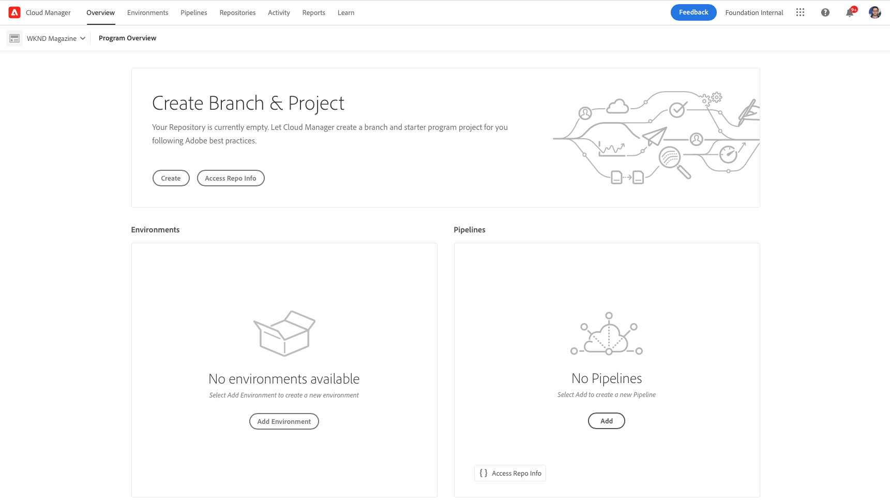

   * On the left side panel, click  **Environments**, then on the Environments page, near the upper-right corner, click **Add Environment**.

     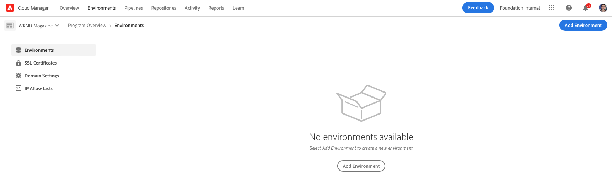
   
1. In the **Add environment** dialog box, do the following:
   
   * Select an [**environment type**](#environment-types). The number of available/used environments is displayed in parentheses behind the environment type name.
   * Provide an environment **Name**. The environment name cannot be changed after the environment is created.
   * Provide an optional **Description** for the environment.
   * If you are adding a **Production + Stage** environment, you must provide an environment name and description for both your production and staging environments.
   * Select a **Primary region** from the drop-down. The primary region cannot be changed after creation. Also, depending on your available entitlements, you may be able to configure [multiple regions](#multiple-regions).
  
   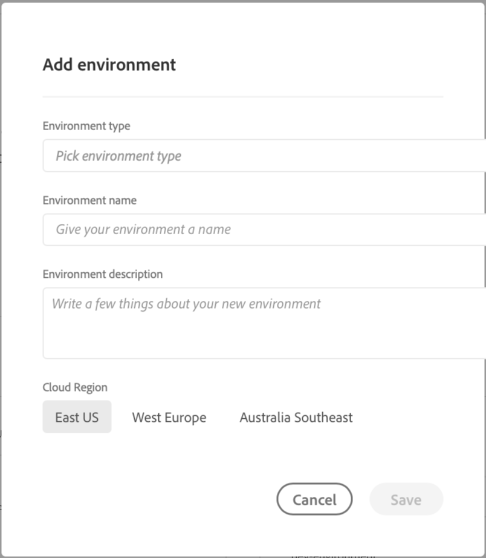

1. Click **Save**.

The **Overview** page now displays your new environment in the **Environments** card. You can now set up pipelines for your new environment.

## Multiple publish regions {#multiple-regions}

A user with the **Business Owner** role can configure production and staging environments to include up to three additional publish regions in addition to the primary region. Additional publish regions can improve availability. See the [Additional Publish Regions documentation](/help/operations/additional-publish-regions.md) for more details.

>[!TIP]
>
>You can use the [Cloud Manager API](https://developer.adobe.com/experience-cloud/cloud-manager/guides/api-usage/creating-programs-and-environments/#creating-aem-cloud-service-environments) to query a current list of available regions.

### Add multiple publish regions to a new environment {#add-regions}

When you add an environment, you can elect to configure additional regions in addition to the primary region.

1. Select the **Primary region**.
   * The primary region cannot be changed after environment creation.
1. Select the option **Add additional publish regions** and a new **Additional publish regions** option drop-down appears.
1. In the **Additional publish regions** drop-down, select an extra region.
1. The region selected is added below the drop-down to indicate its selection.
   * Select the `X` next to the selected region so you can de-select it.
1. Select another region from the **Additional publish regions** drop-down to add another region.
1. Select **Save** when you are ready to create your environment.

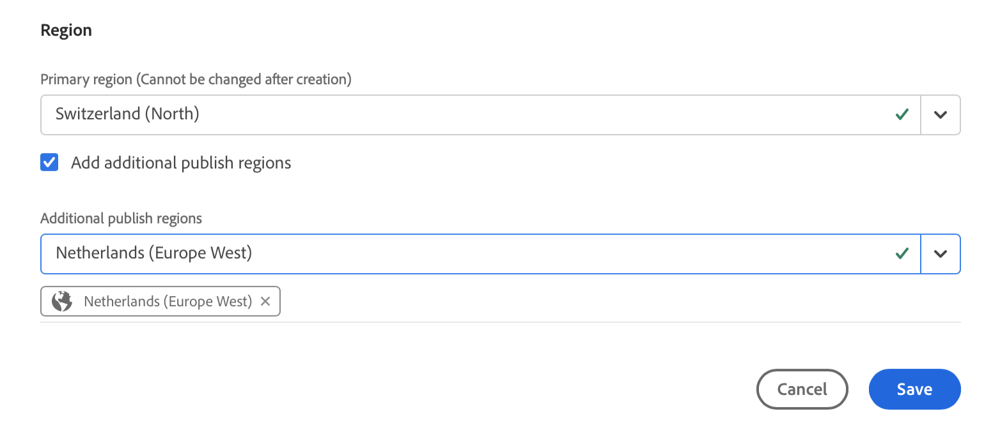

The selected regions apply to both production and staging environments.

If you do not specify any additional regions, [you can do so later after the environments are created](#edit-regions).

If you want to provision [advanced networking](/help/security/configuring-advanced-networking.md) for the program, it is recommended that this provisioning is done before adding additional publish regions to the environments by using the Cloud Manager API. Otherwise, the additional publish regions' traffic goes through the primary region's proxy.

### Edit multiple publish regions {#edit-regions}

If you did not specify any additional regions initially, you can do so after the environments are created if you have the necessary entitlements.

You can also remove additional publish regions. However, you can only add or only remove regions in one transaction. If you must add one region and remove one region, first add, save your change, and then remove (or conversely).

1. From the Program Overview console of your program, click  for your production environment and select **Edit** from the menu.

   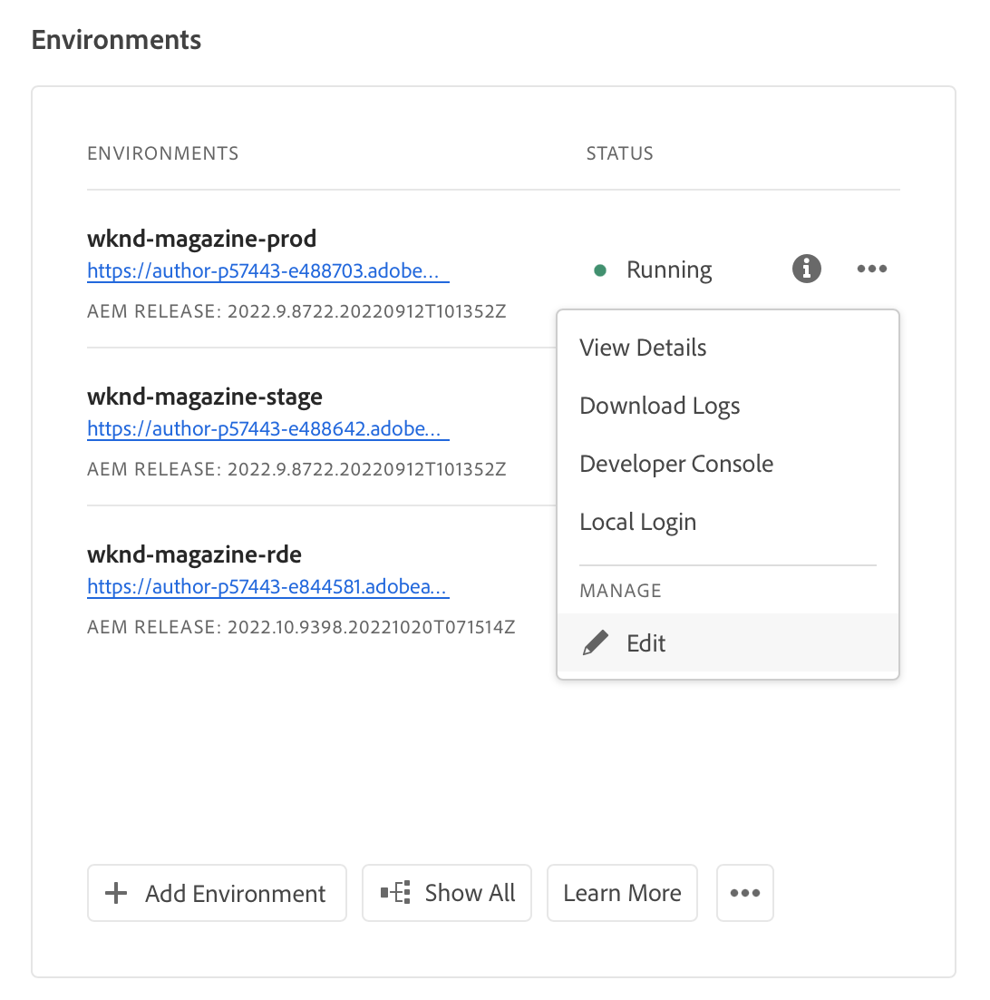

1. In the **Edit Production Environment** dialog, make the necessary changes to the additional publish regions.
   * Use the **Additional publish regions** drop-down to select additional regions.
   * Click the X next to selected additional publish regions to de-select them.

   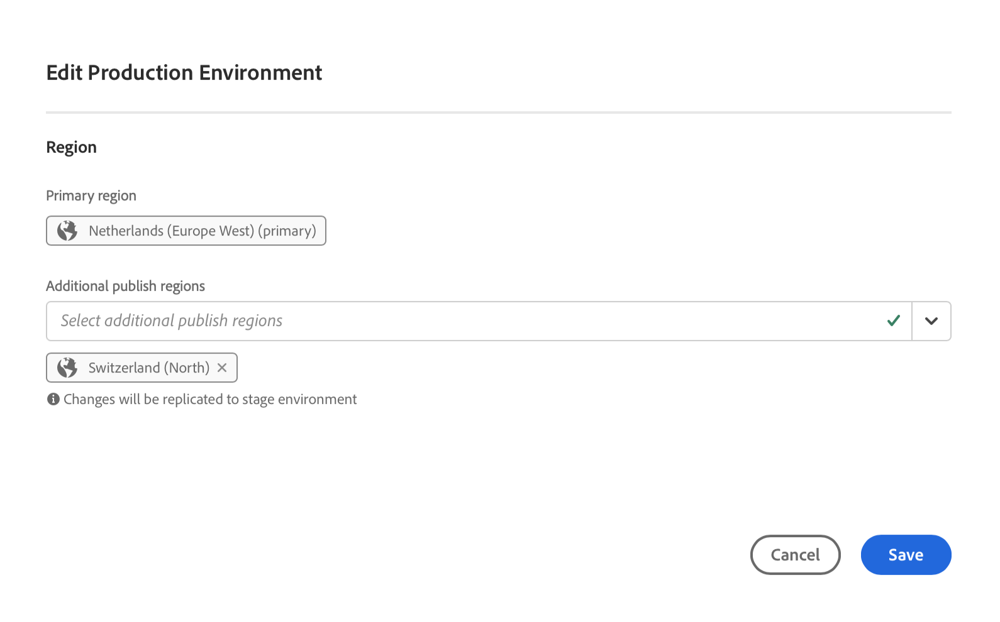

1. Select **Save** to save the changes.

Changes made to the production environment apply to both production and staging environments. Changes to multiple publish regions can only be edited in the production environment.

If you want to provision [advanced networking](/help/security/configuring-advanced-networking.md) for the program, it is recommended that this provisioning is done before adding additional publish regions to the environments. Otherwise, the additional publish regions' traffic goes through the primary region's proxy.

## Access Environment details {#viewing-environment}

1. To access Environment details, do one of the following:

   * From the **Overview** page, in the left side menu, click  **Environments**.

   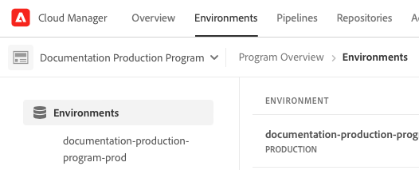

   * From the **Environments** card, click  **Show All**.

     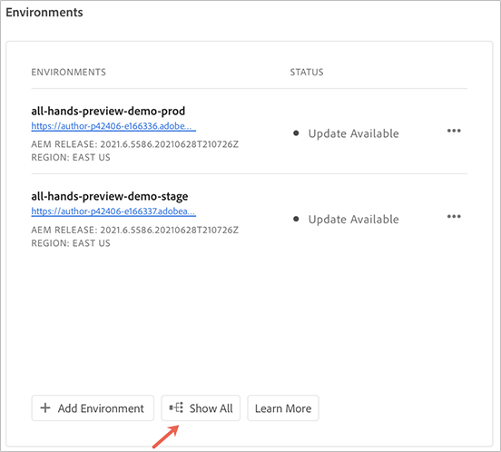

   The **Environments** page opens and lists all environments for the program.

   

1. On the Environments page, do one of the following:

   * Click an environment in the list to reveal its details.

   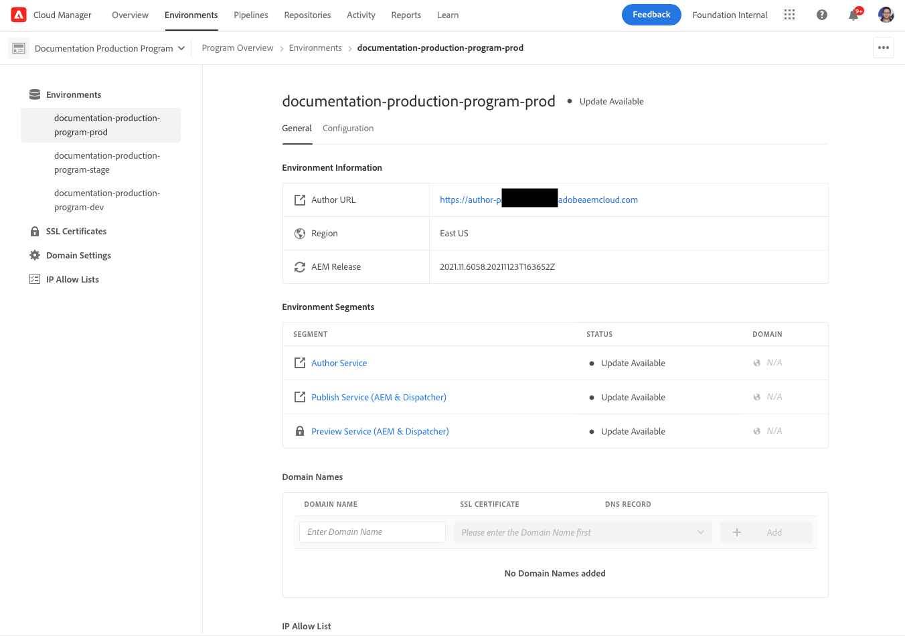

   * Click  of the environment that you want, then click **View Details**.

   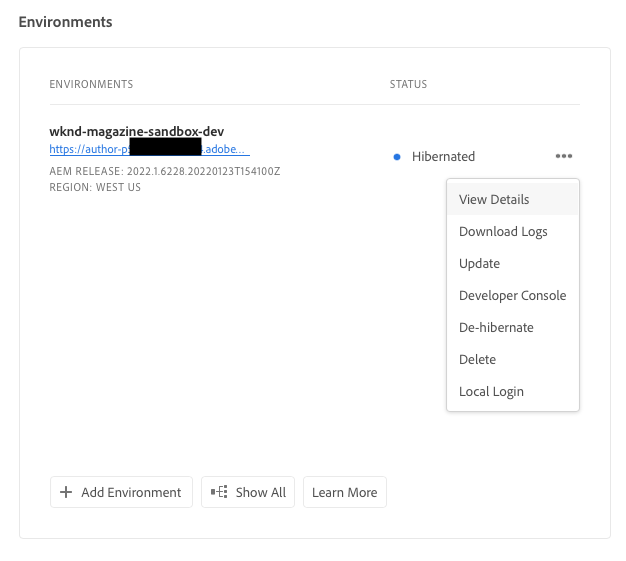

>[!NOTE]
>
>The **Environments** card only lists three environments. Click **Show All** in the card to see all environments of the program.

### Access the preview service {#access-preview-service}

Cloud Manager provides a preview service (delivered as an extra publish service) to each AEM as a Cloud Service environment.

Using the service you can preview a website's final experience before it reaches the actual publish environment and is available publicly.

On creation, the preview service has a default IP allowlist applied to it, labeled `Preview Default [<envId>]`, which blocks all traffic to the preview service. Unapply the default IP allowlist from the preview service so you can enable access.

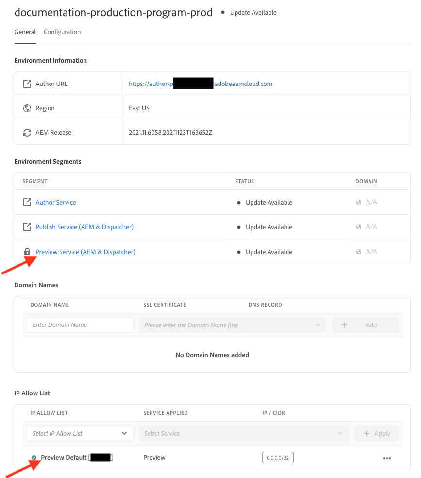

A user with the requisite permissions must complete the following steps before sharing the preview service URL to ensure access to it.

1. Create an appropriate IP Allow List, apply it to the preview service, and immediately unapply the `Preview Default [<envId>]` allowlist.

   See [Apply and unapply IP Allow Lists](/help/implementing/cloud-manager/ip-allow-lists/apply-allow-list.md) for more details.
  
1. Use the **IP Allow List** update workflow to remove the default IP and add the necessary IPs. See [Manage IP Allow Lists](/help/implementing/cloud-manager/ip-allow-lists/managing-ip-allow-lists.md) to learn more. 

After access to the preview service is unlocked, the lock icon in front of the preview service name is no longer displayed.

Once activated, you can publish content to the preview service by using the **`Manage Publication`** user interface inside AEM. See [Preview content](/help/sites-cloud/authoring/sites-console/previewing-content.md) for more details.

>[!NOTE]
>
>Your environment must be on AEM version `2021.05.5368.20210529T101701Z` or newer to use the preview service. Make sure that an update pipeline has successfully run on your environment so you can use the preview service.

### Status of additional publish regions {#additional-region-status}

If you have activated additional publish regions, you can check the status of these regions from the **Environments** card.

1. On the **Overview** page, locate the **Environments** card.

1. On the **Environments** card, the **Status** column reflects if there are any issues with the configured additional publish regions. Click the **Info** icon for details of the regions.

   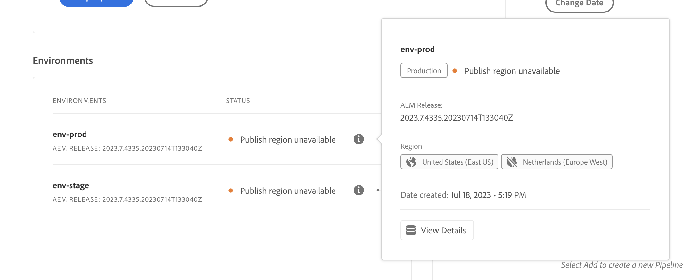

Alternatively you can access the same information from the **Environments** tab.

1. On the **Overview** page, click  **Environments**.

1. On the **Environments** page, select the environment you want to query in the left side menu.

1. After an environment is selected:
   
   * The **Environment Information** table shows which regions are configured for the selected environment.
   * The **Status** column of the **Environment Segments** table reflects if there are any issues with the configured additional publish regions. Hover over the status for details of any issue.

   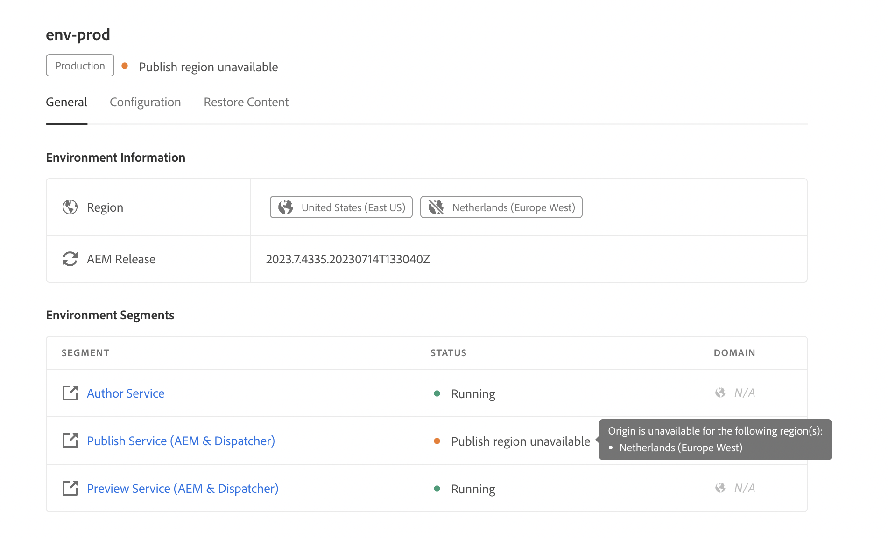
 
If there are any issues reported with additional publish regions, be patient. Cloud Manager continuously tries to recover the region and it may become available at any time. If the problem persists after several hours, you can remove the additional publish region and re-add it (either the same region or another region) to trigger a complete deployment.

How long you wait for the system to recover on its own before taking additional action depends on the impact the failure of that region has to your systems.

Regardless, [traffic is always routed to the closest region that is online](/help/operations/additional-publish-regions.md). If you continue to see issues, contact Adobe Customer Care.

## Update environments {#updating-dev-environment}

As a cloud-native service, Adobe automatically manages updates for your development, staging, and production environments within production programs.

However, updates to environments in sandbox programs are managed within the programs. When such an environment is not running the latest publicly available AEM version, the status on the **Environments** card on the **Overview** screen of the program shows **Update Available**.

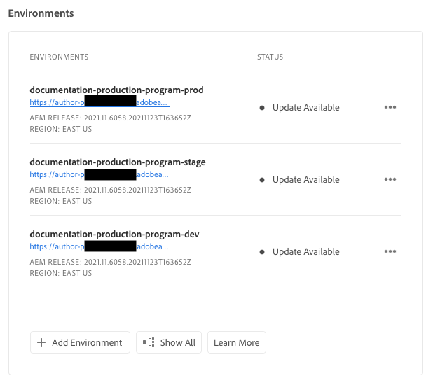

### Updates and pipelines {#updates-pipelines}

Pipelines are the only way to [deploy code to the environments of AEM as a Cloud Service](deploy-code.md). For this reason, each pipeline is associated with a particular AEM version.

When Cloud Manager detects a newer version of AEM than the one last deployed with the pipeline, it displays the **Update Available** status for the environment.

The process of updating is therefore a two-step process:

1. Updating the pipeline with the latest AEM version
1. Running the pipeline to deploy the new version of AEM to an environment

### Update your environments {#updating-your-environments}

>[!NOTE]
> As of 2024, development instances and some sandbox programs are already automatically updated so there is no need to manage updates for them manually. As a result of this transition, the option to Update environment manually for development instances might not be available to _some_ of your programs.

The **Update** option is available on the **Environments** card for specific development and sandbox environments. Click  next to the environment to access **Update**.

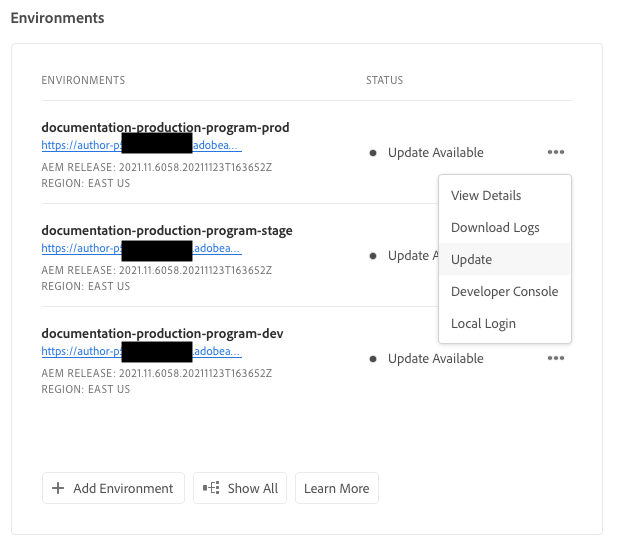

This option is also available by clicking the **Environments** tab of the program and then clicking  of the environment.

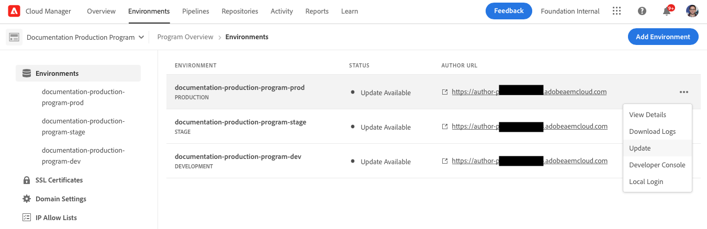

A user with the **Deployment Manager** or **Business Owner** role can use this option to update the pipeline associated with this environment to the latest AEM version.

Once the pipeline version is updated to the latest publicly available AEM version, the user is prompted to run the associated pipeline to deploy the latest version to the environment.

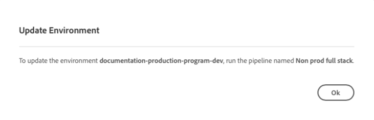

The **Update** option's behavior varies depending on the configuration and current state of the program.

| State | The Update option... |
| --- | --- |
| The pipeline has already been updated | prompts the user to execute the pipeline. |
| The pipeline is already being updated | informs the user that an update is already running. |
| The pipeline does not exist | prompts the user to create one. |

## Delete development environments {#deleting-environment}

A user with the **Deployment Manager** or **Business Owner** role is able to delete a development environment. 

From the **Overview** screen of the program on the **Environments** card, click  of the development environment you want to delete.

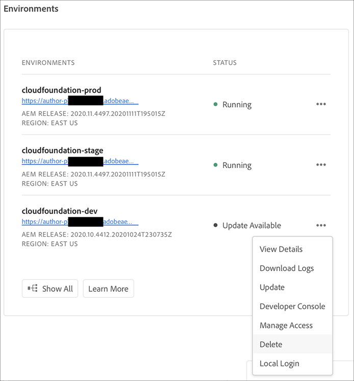

The **Delete** option is also available from the **Environments** tab of the **Overview** window of the program. Click  of the environment and select **Delete**.

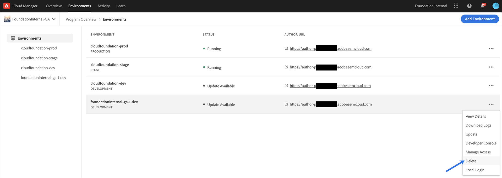

>[!NOTE]
>
>* Production and staging environments created in a production program cannot be deleted.
>* Production and staging environments in a sandbox program can be deleted.

## Manage access {#managing-access}

Select **Manage Access** from the ellipsis menu of the environment on the **Environments** card. You can navigate to the author instance directly and manage access for your environment.

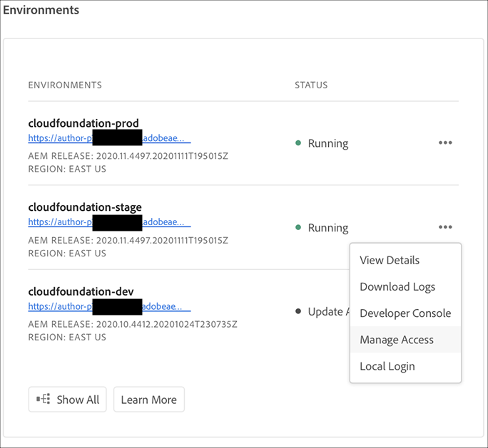

>[!TIP]
>
>See [AEM as a Cloud Service Team and Product Profiles](/help/onboarding/aem-cs-team-product-profiles.md) to learn how AEM as a Cloud Service team and product profiles can grant and limit access to your licensed Adobe solutions.

## Access the Developer console {#accessing-developer-console}

1. From the **Environment** card, click , then click **Developer Console**. 

A new tab is opened in your browser with the logon page to the **Developer Console**. 

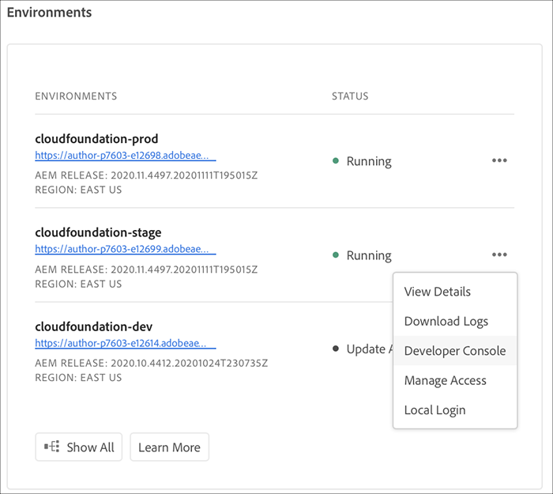

Only a user with the **Developer** role has access to the **Developer Console**. However, for sandbox programs, any user with access to the sandbox program has access to the **Developer Console**.

See [Hibernating and De-hibernating Sandbox Environments](https://experienceleague.adobe.com/en/docs/experience-manager-cloud-service/content/implementing/using-cloud-manager/programs/introduction-sandbox-programs#hibernation) for more details.

This option is also available from the **Environment** tab of the **Overview** window when clicking  of an individual environment.

## Login locally {#login-locally}

1. Do one of the following: 

   * From the **Environment** card, click , then click **Local Login**. 

      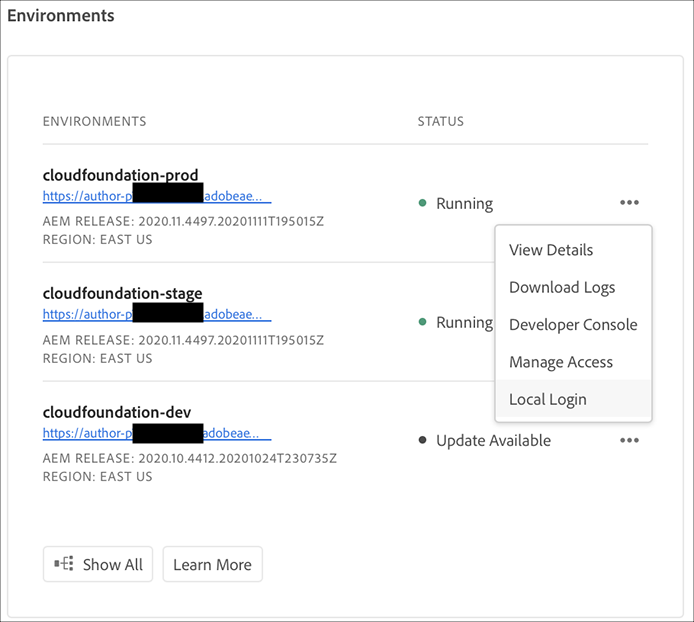

   * From the left side panel, click  **Environments**. On the **Environments** page, click , then click **Local Login**.

      

## Manage custom domain names {#manage-cdn}

Custom domain names are supported in Cloud Manager for Sites programs for both publish and preview services.

>[!TIP]
>
>For more information, see [Introduction to custom domain names](/help/implementing/cloud-manager/custom-domain-names/introduction.md).

## Manage IP Allow Lists {#manage-ip-allow-lists} 

An IP Allow List is supported in Cloud Manager for author, publish, and preview services for Sites programs.

To manage IP Allow Lists, navigate to the  **Environments** page of the **Overview** page of your program. Click an individual environment so you can manage its details.

### Apply an IP Allow List {#apply-ip-allow-list}

Applying an IP Allow List links all defined IP ranges to an author or publish service in the environment.

>[!TIP]
>
>For more information, see [Introduction to IP Allow Lists](/help/implementing/cloud-manager/ip-allow-lists/introduction.md).
