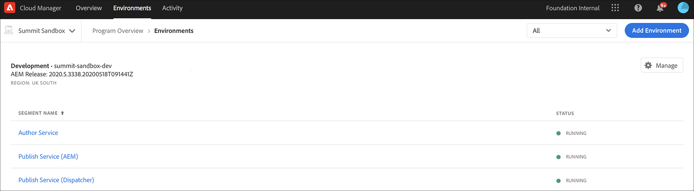
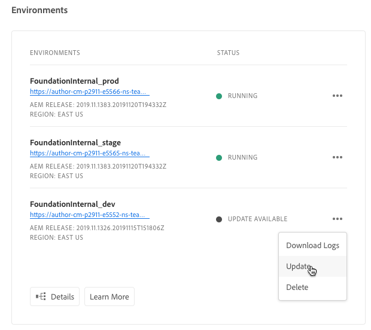
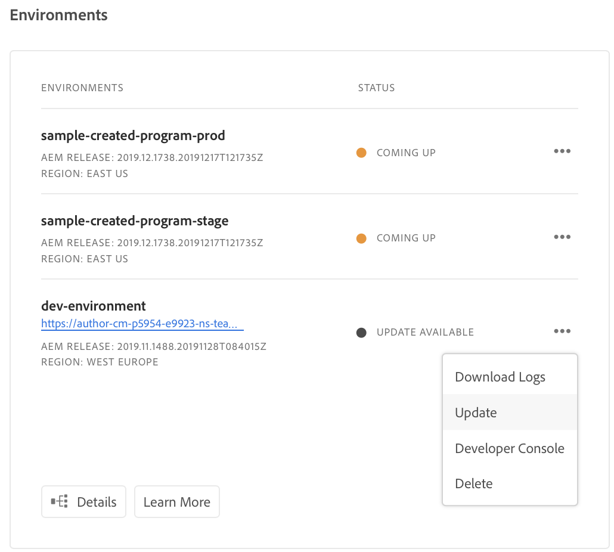
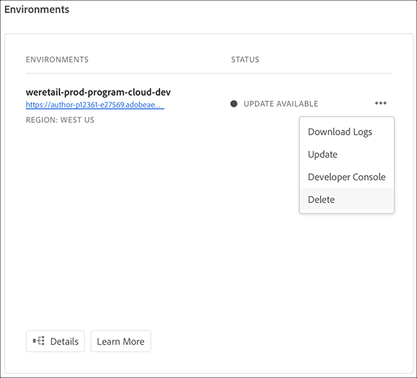

# Managing Environments {#manage-environments} 

The following section describes the types of environment a  user can create and how the user can create an environment.

## Environment Types {#environment-types}

A user with the requisite permissions can create the following environment types (within the bounds of what is available to the specific tenant). 

* **Production and Stage Environment**: 
The Production and Stage is available as a duo and is used for testing and production purposes.  

* **Development**: A Development environment can be created for development and testing purposes and will be associated with non-production pipelines only.

  >[!NOTE]
  >A Development environment that is auto-created in a Sandbox program will be configured to include Sites and Assets solutions.
   
  The following table summarizes Environment types and their attributes:

   |Name|Author Tier|Publish Tier|User Can create| User can delete|Pipeline which can be associated with environment|
   |--- |--- |--- |--- |---|---|
   |Production |Yes |Yes if Sites included |Yes |No|Production pipeline|
   |Stage |Yes |Yes if Sites included |Yes |No|Production pipeline|
   |Development |Yes |Yes if Sites included |Yes |Yes|Non-production pipeline|

   >[!NOTE]
   >The Production and Stage is available as a duo and is used for testing and production purposes.  User will not be able to create only Stage or only Production environment.

## Adding an Environment {#adding-environments}

1. Click on **Add Environment** to add an environment. This button will be accessible from the **Environments** screen. 
   

    The **Add Environment** option will also be available on the **Environments** card when there are zero environments in the program.

    

   >[!NOTE)
   >The **Add Environment** option will be disabled based on lack of permissions or what may be contracted.
   
1. The **Add environment** dialog box appears.The user needs to submit details such as **Environment type** and **Environment name** and **Environment description** (depending upon the user’s objective in creating the environment within the bounds of what is available to the specific tenant).

   

   >[!NOTE]
   >When creating an environment, one or more *integrations* are created in Adobe I/O. These are visible to customer users who have access to the Adobe I/O Console and must not be deleted. This is disclaimed in the description in the Adobe I/O Console.

   

1. Click **Save** to add an environment with the populated criteria.  Now the *Overview* screen  displays the card from where you can set up  your pipeline.

   >[!NOTE]
   >In case, you have not yet set up your non-production pipeline, the *Overview* screen  displays the card from where you can create your non-production pipeline.

## Updating Environment {#updating-dev-environment}

Updates of Stage and Production environments are automatically managed by Adobe. 

Updates to Development environments are managed by users of the program. When an environment is not running the latest publicly available AEM release, the status on Environments Card on the Home Screen will show **UPDATE AVAILABLE**.

)

When this status is displayed, **Update** option will be available from the dropdown menu, both on the Environments Card and the **Manage** menu if you  click on **Details** from the **ENVIRONMENTS** card.

Selecting this from the dropdown menu will allow a Deployment Manager to update the pipeline associated with this environment to the latest release and then execute the pipeline. 

If the pipeline has already been updated, the user is prompted to execute the pipeline.

## Deleting Environment {#deleting-environment}

User with the requisite permissions will be able to delete a Development environment. 

Delete option will be available from the dropdown menu, both on the **Environments** Card and the **Manage** menu if you click on Details from the **ENVIRONMENTS** card.

>[!NOTE]
This feature is not available for Production/Stage environment set in a regular program set up for production purposes. The feature is, however, available for Production/Stage environments in a Sandbox program.

