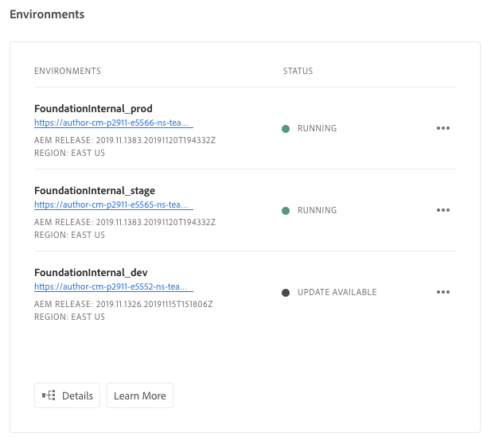

# Manage Environments - Cloud Services {#manage-environments} 

The following section describes the types of environment a  user can create and how the user can create an environment.

## Environment Types {#environment-types}

A user with the requisite permissions can create the following environment types (within the bounds of what is available to the specific tenant). 

* **Production and Stage Environment**: 
The Production and Stage is available as a duo and is used for testing and production purposes.  

* **Development**: A Development environment can be created for development and testing purposes and will be associated with non-production pipelines only.

  > NOTE
  > A Dev environment that is auto-created in a Sandbox program will be configured to include Sites and Assets solutions.
   
  The following table summarizes Environment types and their attributes:

   |Name|Author Tier|Publish Tier|User Can create| User can delete|Pipeline which can be associated with environment|
   |--- |--- |--- |--- |---|---|
   |Production |Yes |Yes if Sites included |Yes |No|Production pipeline|
   |Stage |Yes |Yes if Sites included |Yes |No|Production pipeline|
   |Development |Yes |Yes if Sites included |Yes |Yes|Non-production pipeline|

   >Note:
   >The Production and Stage is available as a duo and is used for testing and production purposes.  User will not be able to create only Stage or only Production environment. 

## Updating Development Environment {#updating-dev-environment}

Updates of Stage and Production environments are automatically managed by Adobe. 

Updates to Dev environments are managed by users of the program. When an environment is not running the latest publicly available AEM release, the status on Environments Card on the Home Screen will show **Update Available**.

When this status is displayed, an Update item will be available in the dropdown menu, both on the Environment Card and the Manage menu on the Environments Screen.

Selecting this from the dropdown menu will allow a Deployment Manager to update the pipeline associated with this environment to the latest release and then execute the pipeline. If the pipeline has already been updated, the user is prompted to execute the pipeline.
