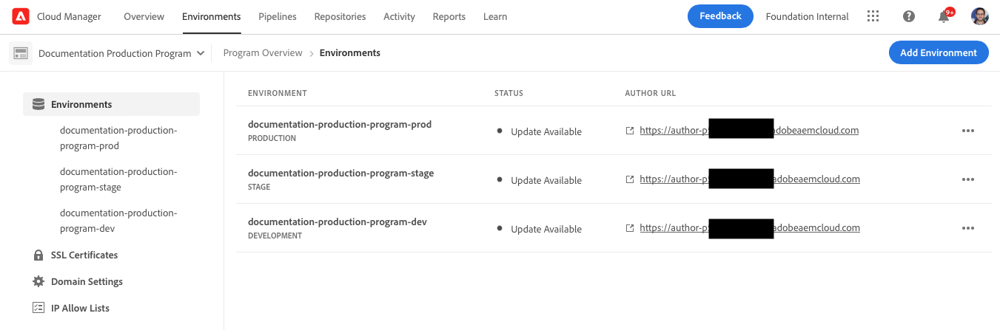
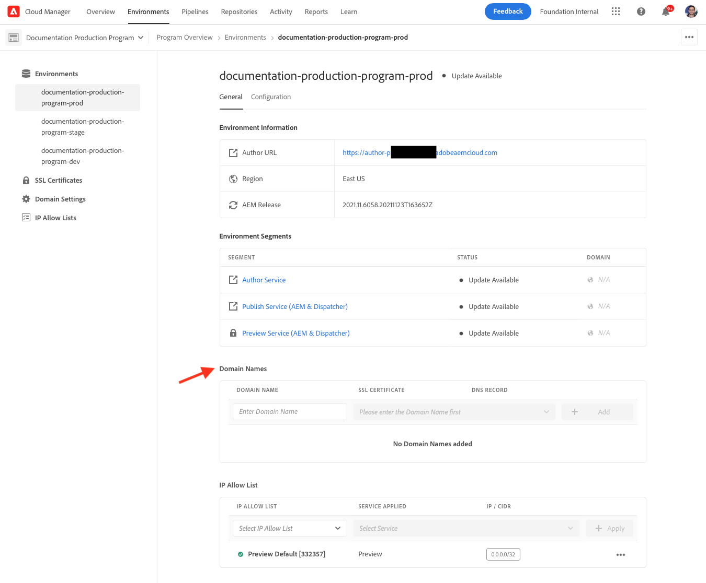

# Managing Environments {#managing-environments} 

Learn about the types of environments you can create and how to create them for your Cloud Manager project.

## Environment Types {#environment-types}

A user with the requisite permissions can create the following environment types (within the bounds of what is available to the specific tenant).

* **Production and Stage** - The production and staging environments are available as a pair and are used for production and testing purposes, respectively.

* **Development** - A development environment can be created for development as well as testing purposes and can be associated with non-production pipelines only.

The capabilities of individual environments depend upon the solutions enabled in the containing [program.](/help/implementing/cloud-manager/getting-access-to-aem-in-cloud/program-types.md)

* [Sites](/help/sites-cloud/home.md)
* [Assets](/help/assets/home.md)
* [Forms](/help/forms/home.md)
* [Screens](/help/screens-cloud/home.md)

>[!NOTE]
>
>Production and staging environments are only created as a pair. You can not create only a staging or only a production environment.

## Adding an Environment {#adding-environments}

1. Log into Cloud Manager at [my.cloudmanager.adobe.com](https://my.cloudmanager.adobe.com/) and select the appropriate organization.

1. Click on the program for which you want to add an environment.

1. From the **Program Overview** page, click on **Add Environment** on the **Environments** card to add an environment.

   

   * The **Add Environment** option is also available on the **Environments** tab.

     

   * The **Add Environment** option may be disabled due to lack of permissions or depending on the licensed resources.
   
1. In the **Add environment** dialog that appears:
   
   * Select an **Environment type**.
     * The number of available/used environments is displayed in parentheses behind the Development environment type.
   * Provide an **Environment name**.
   * Provide an **Environment description**.
   * Select a **Cloud Region**.

   

1. Click **Save** to add the specified environment.

The **Overview** screen now displays your new environment in the **Environments** card. You can now set up pipelines for your new environment.

## Environment Details {#viewing-environment}

You can use the **Environments** card on the overview page to access an environments details in two ways.

1. From the **Overview** page, click on the **Environments** tab at the top of the screen.

   

   * Alternatively, click on the **Show All** button on the **Environments** card to jump directly to the **Environments** tab.

     

1. The **Environments** opens and lists all environments for the program.

   

1. Click an environment in the list to reveal its details.

   

Alternatively, click the ellipsis button of the environment you want and then select **View Details**.

   

>[!NOTE]
>
>The **Environments** card only lists three environments. Click on the **Show All** button as described previously to see all environments of the program.

### Accessing the Preview Service {#access-preview-service}

Cloud Manager provides a preview service (delivered as an additional publish service) to each AEM as a Cloud Service environment.

Using the service you can preview a website's final experience before it reaches the actual publish environment and is available publicly.

Upon creation, the preview service will have a default IP allow list applied to it, labeled `Preview Default [<envId>]`, which blocks all traffic to the preview service. You must actively un-apply the default IP allow list from the preview service in order to enable access.

A user with requisite permissions must complete the steps of the following options in advance of sharing the preview service URL with any of your teams in order to ensure access to the preview URL.

1. Create an appropriate IP allow list, apply it to the preview service, and immediately un-apply the `Preview Default [<envId>]` allow list.

   * Please refer to the document [Applying and Un-Applying IP Allow Lists](/help/implementing/cloud-manager/ip-allow-lists/apply-allow-list.md) for more details.
  
1. Use the update **IP Allow List** workflow to remove the default IP and add IPs as appropriate. Refer to [Managing IP Allow Lists](/help/implementing/cloud-manager/ip-allow-lists/managing-ip-allow-lists.md) to learn more. 

Once access to preview service is unlocked, the lock icon ahead of the preview service name will no longer be displayed.

Once activated, you can publish content to the preview service by using the Manage Publication UI inside AEM. Please refer to the document [Previewing Content](/help/sites-cloud/authoring/fundamentals/previewing-content.md) for more details.

>[!NOTE]
>
>Your environment must be on AEM version `2021.05.5368.20210529T101701Z` or newer. Make sure an update pipeline has successfully run on your environment to do this.

## Updating Environments {#updating-dev-environment}

As a cloud-native service, updates of your staging and production environments within production programs are automatically managed by Adobe. 

However updates to development environments as well as to environments in sandbox programs are managed within the programs. When such an environment is not running the latest publicly available AEM version, the status on the **Environments** card on the **Overview** screen of the program will show **Update Available**.

### Updates and Pipelines {#updates-pipelines}

Pipelines are the only way to [deploy code to the environments of AEM as a Cloud Service.](deploy-code.md) For this reason, each pipeline is associated with a particular AEM version.

If Cloud Manager detects that there is a newer version of AEM available than that which was last deployed with the pipeline, it shows the **Update Available** status for the environment.

The process of updating is therefore a two-step process:

1. Updating the pipeline with the latest AEM version
1. Running the pipeline to deploy the new version of AEM to an environment

### Updating Your Environments {#updating-your-environments}

The **Update** option is available from the **Environments** card for development environments and environments in sandbox programs by clicking on the ellipsis button of the environment.

This option is also available by clicking on the **Environments** tab of the program and then selecting the ellipsis button of the environment.

A user with the **Deployment Manager** role can use this option to update the pipeline associated with this environment to the latest AEM version.

Once the pipeline version is updated to the latest publicly available AEM version, the user is prompted to run the associated pipeline to deploy the latest version to the environment.

The **Update** option's behavior varies depending on the configuration and current state of the program.

* If the pipeline has already been updated, the **Update** option prompts the user to execute the pipeline.
* If the pipeline is already being updated, the **Update** option informs the user that an update is already running.
* If an appropriate pipeline does not exits, the **Update** option prompts the user to create one.

## Deleting Development Environments {#deleting-environment}

User with the requisite permissions will be able to delete a development environment. 

From the **Overview** screen of the program on the **Environments** card, click on the ellipsis button of the development environment you want to delete.

The delete option is also available from the **Environments** tab of the **Overview** window of the program. Click on the ellipsis button of the environment and select **Delete**.

>[!NOTE]
>
>* Production and staging environments created in a production program can not be deleted.
>* Production and staging environments in a sandbox program can be deleted.

## Managing Access {#managing-access}

Select **Manage Access** from the ellipsis menu of the environment on the **Environments** card. You can navigate to the author instance directly and manage access for your environment.

## Accessing the Developer Console {#accessing-developer-console}

Select **Developer Console** from the ellipsis menu of the environment on the **Environments** card. This will open a new tab in your browser with the login page to the **Developer Console**. 

Only a user with the **Developer** role will have access to the **Developer Console**. However for sandbox programs, any user with access to the sandbox program will have access to **Developer Console**.

Please refer to the document [Hibernating and De-hibernating Sandbox Environments](https://experienceleague.adobe.com/docs/experience-manager-cloud-service/onboarding/getting-access/cloud-service-programs/sandbox-programs.html#hibernating-introduction) for more details.

This option is also available from the **Environment** tab of the **Overview** window when clicking the ellipsis menu of an individual environment.

## Login Locally {#login-locally}

Select **Local Login** from the ellipsis menu of the environment in the **Environments** card to login locally to Adobe Experience Manager. 

Additionally, you can login locally from the **Environments** tab of the **Overview** page.

## Managing Custom Domain Names {#manage-cdn}

Custom domain names are supported in Cloud Manager for Sites programs for both publish and preview services. Each Cloud Manager environment can host up to a maximum of 250 custom domains.

To configure custom domain names, navigate to the **Environments** tab and click on an environment to view environment details.

The following actions can be performed on the publish service for your environment. 

* [Adding a Custom Domain Name](/help/implementing/cloud-manager/custom-domain-names/add-custom-domain-name.md)

* [Managing Custom Domain Names](/help/implementing/cloud-manager/custom-domain-names/managing-custom-domain-names.md)

* [Checking Status of Custom Domain Name](/help/implementing/cloud-manager/custom-domain-names/check-domain-name-status.md#pre-existing-cdn) or an [SSL Certificate](/help/implementing/cloud-manager/managing-ssl-certifications/managing-certificates.md#pre-existing-cdn).

* [Managing IP Allow Lists](/help/implementing/cloud-manager/ip-allow-lists/managing-ip-allow-lists.md#pre-existing-cdn)

## Managing IP Allow Lists {#manage-ip-allow-lists} 

IP allow lists are supported in Cloud Manager for author, publish, and preview services for Sites programs.

To manage IP allow lists, navigate to the **Environments** tab of the **Overview** page of your program. Click on an individual environment to manage its details.

### Applying an IP Allow List {#apply-ip-allow-list}

Applying an IP allow list associates all IP ranges included in the definition of the allow list with an author or publish service in an environment. A user in the **Business Owner** or **Deployment Manager** role must be logged in in order to be able to apply an IP allow list.

The IP allow list must exist in Cloud Manager in order to apply it to an environment. To learn more about IP allow lists in Cloud Manager please refer to the document[Introduction to IP Allow Lists in Cloud Manager.](/help/implementing/cloud-manager/ip-allow-lists/introduction.md)

Follow these steps to apply an IP allow list.

   1. Navigate to the specific environment from the **Environments** tab of the program **Overview** screen and navigate to the **IP Allow Lists** table.
   1. Use the input fields at the top of the IP allow list table to select the IP allow list and the author or publish service you wish to apply it to. 
   1. Click on **Apply** and confirm your submission.

### Un-Applying an IP Allow List {#unapply-ip-allow-list}

Un-applying an IP allow list disassociates all IP ranges included in the definition of the allow  list from an author or publisher service in an environment. A user in the **Business Owner** or **Deployment Manager** role must be logged in in order to be able to un-apply an IP allow list.

Follow these steps to un-apply an IP allow list.

1. Navigate to the specific environment from the **Environments** tab of the program **Overview** screen and navigate to the **IP Allow Lists** table.
1. Identify the row where the IP allow list rule you wish to un-apply is listed.
1. Select the ellipsis button from end of the row.
1. Select **Unapply** and confirm your submission.
