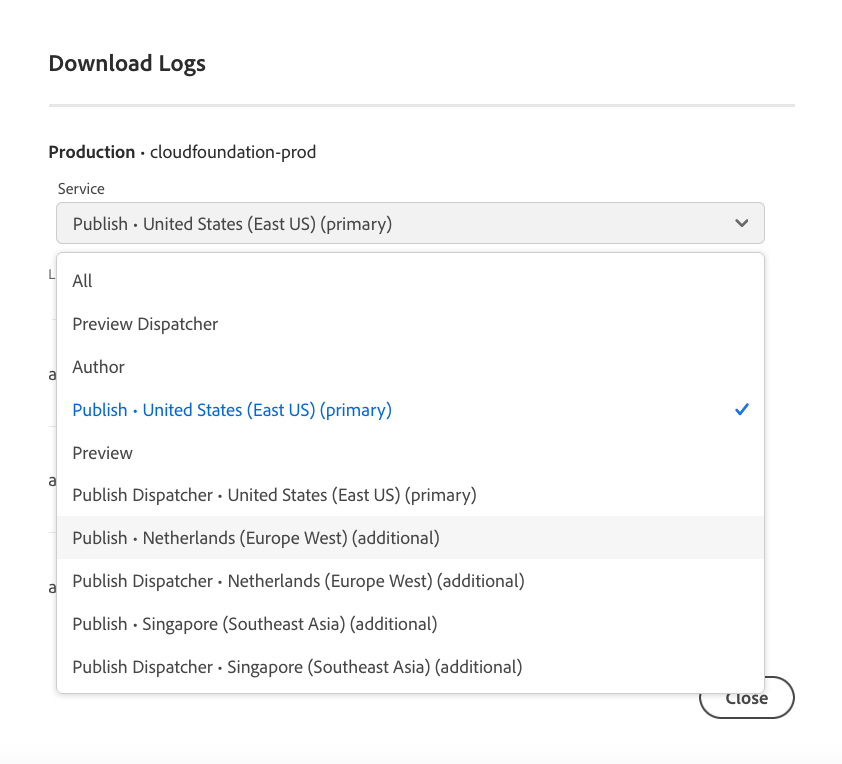

# Accessing and Managing Logs {#manage-logs} 

Learn how to access and manage logs to aid your development process in AEM as a Cloud Service.

You can access a list of available log files for the selected environment using the **Environments** card from the **Overview** page or Environment Details page.

Logs are retained for seven days.

## Downloading Logs {#download-logs}

To download logs, do the following:

1. Log into Cloud Manager at [my.cloudmanager.adobe.com](https://my.cloudmanager.adobe.com/) and select the appropriate organization.

1. On the **[My Programs](/help/implementing/cloud-manager/navigation.md#my-programs)** console, select the program.

1. Navigate to the **Environments** card from the **Overview** page.

1. Select **Download Logs** from the ellipsis menu.

   

1. In the **Download Logs** dialog, select the appropriate **Service** from the drop-down menu

   

   In case [Additional Publish Regions](/help/operations/additional-publish-regions.md) are enabled for your environment, you will be able to select each region and download its logs separately, as shown below:

   

1. Once you select your service, click the download icon next to the log you want to retrieve.

You can also access your logs from the **Environments** page.


## Logs Via API {#logs-through-api}

In addition to downloading logs through the UI, logs are available through the API and the command-line interface. 

To download the log files for a specific environment, the command would be similar to the following.

```shell
$ aio cloudmanager:download-logs --programId 5 1884 author aemerror
```

Also, you can tail logs by way of the command-line interface.

```shell
$ aio cloudmanager:tail-log --programId 5 1884 author aemerror
```

To obtain the environment Id (1884 in this example) and the available service or log name options, you can use the following commands.

```shell
$ aio cloudmanager:list-environments
Environment Id Name                     Type  Description                          
1884           FoundationInternal_dev   dev   Foundation Internal Dev environment  
1884           FoundationInternal_stage stage Foundation Internal STAGE environment
1884           FoundationInternal_prod  prod  Foundation Internal Prod environment
 
 
$ aio cloudmanager:list-available-log-options 1884
Environment Id Service    Name         
1884           author     aemerror     
1884           author     aemrequest   
1884           author     aemaccess    
1884           publish    aemerror     
1884           publish    aemrequest   
1884           publish    aemaccess    
1884           dispatcher httpderror   
1884           dispatcher aemdispatcher
1884           dispatcher httpdaccess
```

### Additional Resources {#resources}

>[!TIP]
>
>Check out [this video resource](https://app.frame.io/reviews/28cdf463-b7fc-443b-a54a-93cb7da6567e/dbf158f1-568b-4efc-8fbc-3b241561cbab) to learn more about debugging AEM as a Cloud Service.

See the following additional resources to learn more about the Cloud Manager API and Adobe I/O CLI:

* [Cloud Manager API Documentation](https://developer.adobe.com/experience-cloud/cloud-manager/)
* [Adobe I/O CLI](https://github.com/adobe/aio-cli-plugin-cloudmanager)

See the following additional resources to learn more about log files in AEM as a Cloud Service:

* [Cloud 5 AEM Log Files](https://experienceleague.adobe.com/docs/experience-manager-learn/cloud-service/expert-resources/cloud-5/cloud5-aem-log-files.html)
* [Debugging AEM as a Cloud Service using logs](https://experienceleague.adobe.com/docs/experience-manager-learn/cloud-service/debugging/debugging-aem-as-a-cloud-service/logs.html)
