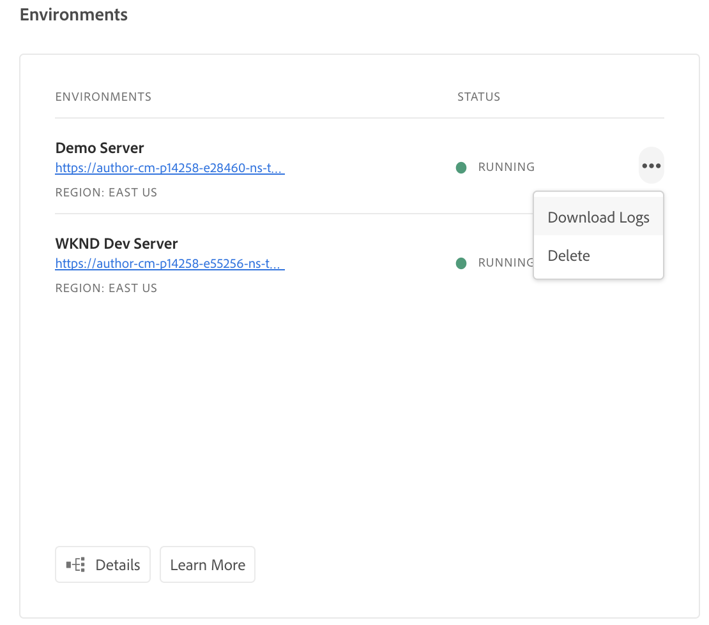
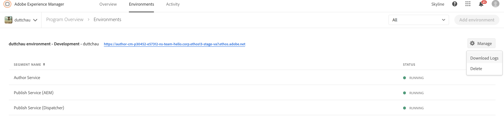

# Manage Logs - Cloud Services {#manage-logs} 

Users can access a list of available log files for the selected environment using the Environment Card.  Users can access a list of available log files for the selected environment. 

These files can be downloaded through the UI, either from the **Overview**  page.



Or, the **Environments** page:



>Note:
Regardless of where it is opened, the same dialog appears and allows for an individual log file to be downloaded.

  


## Logs through API {#logs-thorugh-api}

In addition to downloading logs through the UI, logs will be available through the API and the Command Line Interface. 

For example, to download the log files for a specific environment, the command would be something alone the lines of

```java
$ aio cloudmanager:download-logs --programId 5 1884 author aemerror
```

The following command allows the tailing of logs:

```java
$ aio cloudmanager:tail-log --programId 5 1884 author aemerror
```

In order to obtain the environment Id (1884 in this case) and the available service or log name options you can use:

```java
$ aio cloudmanager:list-environments
Environment Id Name                     Type  Description                          
5552           FoundationInternal_dev   dev   Foundation Internal Dev environment  
5565           FoundationInternal_stage stage Foundation Internal STAGE environment
5566           FoundationInternal_prod  prod  Foundation Internal Prod environment
 
 
$ aio cloudmanager:list-available-log-options 5552
Environment Id Service    Name         
5552           author     aemerror     
5552           author     aemrequest   
5552           author     aemaccess    
5552           publish    aemerror     
5552           publish    aemrequest   
5552           publish    aemaccess    
5552           dispatcher httpderror   
5552           dispatcher aemdispatcher
5552           dispatcher httpdaccess
```

> Note:
> While **Log Downloads** will be available through both the UI and API, **Log Tailing** is API/CLI-only.
