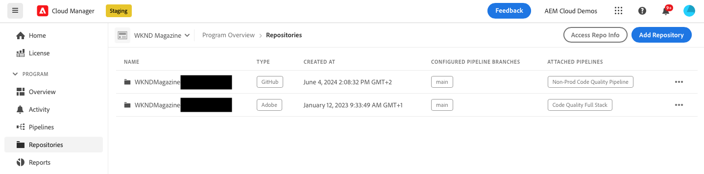

# Add an Adobe repository in Cloud Manager {#adobe-repositories}

Learn how to add an Adobe-managed repository in Cloud Manager.

The **Repositories** page makes it easy to add additional Adobe-managed repositories to a selected program.

**To add an Adobe repository in Cloud Manager:**

1. Log into Cloud Manager at [my.cloudmanager.adobe.com](https://my.cloudmanager.adobe.com/) and select the appropriate organization and the program to which you want to add an Adobe-managed repository.

1. From the **Program Overview** page, in the side menu, click  **Repositories** tab.

1. On the **Repositories** page, near the upper-right, click **Add Repository**.

   
  
1. In the **Add Repository** dialog box, make sure that **Adobe Repository** is selected as the repository type.

1. In the respective text fields, enter the following:

   * **Repository name** - An expressive name for your new repository.
   * **Repository URL preview** - You do not need to enter a URL path or edit the existing path because the repository infrastructure is already in place and fully integrated and managed by Adobe.
   * **Description (optional)** - A detailed description of the repository.

   

1. Click **Save**.
   Your new repository is displayed in the table on the **Repositories** page. 

You can now associate a [CI/CD pipeline](/help/implementing/cloud-manager/configuring-pipelines/introduction-ci-cd-pipelines.md) with it or manage it within the [**Repositories** page](managing-repositories.md).

>[!TIP]
>
>You can also add GitHub repositories that you manage yourself as [private repositories](private-repositories.md).
