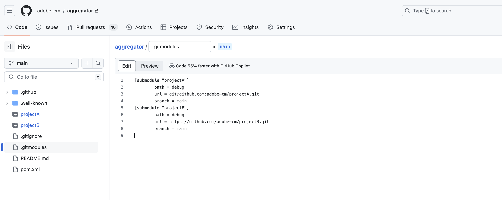
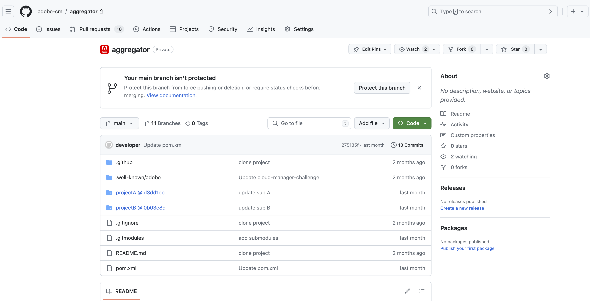

# Git submodule support for Cloud Manager {#git-submodule-support}

Git submodules can be used to merge the content of multiple branches across Git repositories at build time.

When Cloud Manager's build process runs, it clones the pipeline's repository and checks out the branch. If a `.gitmodules` file exists in the branch's root directory, the corresponding command is executed.

The following command checks out each submodule into the appropriate directory. 

```
$ git submodule update --init
```

This technique offers an alternative to the solution described in [Working with Multiple Source Git Repositories](/help/implementing/cloud-manager/managing-code/working-with-multiple-source-git-repositories.md). It is suitable for organizations comfortable with Git submodules and preferring not to manage an external merging process.

For example, suppose that there are three repositories. Each repository contains a single branch named `main`. In the primary repository—that is, the one configured in the pipelines—the `main` branch has a `pom.xml` file declaring the projects contained in the other two repositories:

```xml
<?xml version="1.0" encoding="UTF-8"?>
<project xmlns="https://maven.apache.org/POM/4.0.0" xmlns:xsi="https://www.w3.org/2001/XMLSchema-instance"
    xsi:schemaLocation="https://maven.apache.org/POM/4.0.0 https://maven.apache.org/maven-v4_0_0.xsd">
    <modelVersion>4.0.0</modelVersion>
   
    <groupId>customer.group.id</groupId>
    <artifactId>customer-reactor</artifactId>
    <version>0.0.1-SNAPSHOT</version>
    <packaging>pom</packaging>
   
    <modules>
        <module>project-a</module>
        <module>project-b</module>
    </modules>
   
</project>
```

Add submodules for the other two repositories:

```shell
$ git submodule add -b main https://git.cloudmanager.adobe.com/ProgramName/projectA/ project-a
$ git submodule add -b main https://git.cloudmanager.adobe.com/ProgramName/projectB/ project-b
```

The result is a `.gitmodules` file similar to the following:

```text
[submodule "project-a"]
    path = project-a
    url = https://git.cloudmanager.adobe.com/ProgramName/projectA/
    branch = main
[submodule "project-b"]
    path = project-b
    url = https://git.cloudmanager.adobe.com/ProgramName/projectB/
    branch = main
```

See also the [Git Reference Manual](https://git-scm.com/book/en/v2/Git-Tools-Submodules) for more information on Git submodules.

## Usage notes for Adobe repositories {#usage-notes-recommendations-adobe-repos}

* The Git URL must follow the syntax described in the previous section.
* Only submodules at the root of the branch are supported.
* For security reasons, do not embed credentials in Git URLs.
* Unless otherwise necessary, Adobe recommends that you use shallow submodules by running the following:
  `git config -f .gitmodules submodule.<submodule path>.shallow true` for each submodule.
* Git submodule references are stored to specific Git commits. When changes to the submodule repository are made, the referenced commit must be updated.
  For example, by using the following: 
  
  `git submodule update --remote`

## Git submodule support for private repositories {#private-repositories}

Support for Git submodules in [private repositories](private-repositories.md) is similar to their use with Adobe repositories.

However, for Cloud Manager to recognize the submodule configuration, add a `.gitmodules` file to the root directory of the aggregator repository after configuring your `pom.xml` file and executing the `git submodule` commands.





## Git submodule support for external repositories {#external-repositories}

Support for Git submodules in external repositories (Bring Your Own Git) works much like their use with Adobe repositories and private repositories. Cloud Manager authenticates submodule fetches during the build, so submodules hosted on your external Git provider resolve without additional pipeline configuration.

As with the other repository types, add a `.gitmodules` file to the root directory of the aggregator repository after you configure your `pom.xml` file and run the `git submodule` commands.

For Cloud Manager to authenticate a submodule fetch, the submodule repository must belong to the same organization as an external repository that is already registered in Cloud Manager. Cloud Manager uses the access token of a registered repository in that organization to authenticate the fetch. The token is applied server-side and is never exposed to the build environment.


### Usage notes {#usage-notes-recommendations-private-repos}

* These notes apply to submodules that point to a GitHub.com repository. For submodules hosted on an external Git provider, see [Git submodule support for external repositories](#external-repositories).
* Both relative and absolute submodule URLs in the `.gitmodules` file are supported.
* The submodule repository must be hosted on a supported external Git provider: GitHub Enterprise, GitLab, Bitbucket, or Azure DevOps.
* At least one repository from the same organization must be registered in Cloud Manager so that a valid access token is available.
* For security reasons, do not embed credentials in Git URLs.
* [The limitations of using Git submodules with Adobe-managed repositories](#usage-notes-recommendations-adobe-repos) also apply.


